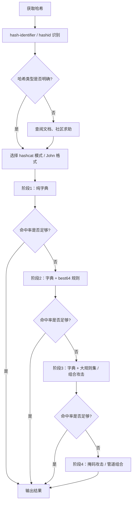

## 前言

密码哈希破解是渗透测试和红队行动中的核心技能之一。从获取哈希到成功还原明文，中间涉及哈希类型识别、攻击策略选择、工具调参与硬件优化等一系列决策。本文系统性梳理哈希破解工作流的全貌：先用 `hash-identifier` 与 `hashid` 确认哈希类型，再分别用 John the Ripper 和 hashcat 实施基于规则、掩码和组合的爆破，最后从 GPU/CPU 架构层面分析破解效率差异。

> **免责声明**：本文所述技术与工具仅用于合法的安全测试、授权评估及学术研究。未经系统所有者书面授权对任何系统进行哈希破解属于违法行为，作者不对滥用行为承担任何责任。

---

## 一、认识哈希与破解模型

### 1.1 什么情况下需要破解哈希

渗透测试中常见的哈希获取途径：

| 场景 | 哈希来源 | 典型值 |
|------|----------|--------|
| 数据库泄露 | 用户密码字段 | `$2a$10$...`（bcrypt）、`md5($pass.$salt)` |
| Windows 域渗透 | SAM / NTDS.dit | NTLM：`aad3b435b51404eeaad3b435b51404ee` |
| Linux 提权 | `/etc/shadow` | `$6$salt$hash`（SHA-512 crypt） |
| Web 应用 | Cookie / Token | JWT HS256 弱密钥、Laravel `$2y$` |
| 网络嗅探 | Net-NTLMv2、Kerberos TGT | `john --format=netntlmv2 hash.txt` |

### 1.2 可逆与不可逆

哈希函数的设计目标是**单向不可逆**——攻击者能做的是穷举可能的输入，计算其哈希并与目标值比对，而非从数学上反解。因此，破解的本质是**猜测**，而工具与策略决定了猜测的速度与覆盖面。

---

## 二、哈希类型识别

拿到一串哈希后，第一步是确定它属于哪种算法。错误的格式参数会使破解完全无效。

### 2.1 hash-identifier

Kali 内置的 Python 脚本，通过长度与字符集进行启发式判断：

```bash
# 安装（Kali 已自带）
sudo apt install hash-identifier -y

# 运行
hash-identifier
   HASH: aad3b435b51404eeaad3b435b51404ee:8846f7eaee8fb117ad06bdd830b7586c
   Possible Hashs:
   [+] MD5
   [+] Domain Cached Credentials - MD4(MD4(($pass)).(strtolower($username)))
```

对于标准算法（MD5、SHA1、NTLM）识别率很高，但对加盐变体或自定义算法效果一般。

### 2.2 hashid

`hashid` 提供更丰富的特征库，支持 `--mode` 直接输出 hashcat/JTR 的模式编号：

```bash
# 基础识别
hashid '$2a$10$N9qo8uLOickgxdRtmjMRt.TC5AuMg5f6C4xO8M7F0NcZDs0wzmYyG'

# 输出 hashcat 模式
hashid -m '$6$rounds=5000$useSaltsAreMix$...'

# 输出 John 格式名
hashid -j '$P$BzqRP2fQ0x9lhnk1nTGqKCQ5m'
```

**识别结果示例**：
```
[+] SHA-512 Crypt
[+] hashcat mode: 1800
[+] John format: sha512crypt
```

### 2.3 手工特征归纳

| 哈希特征 | 算法 | hashcat 模式 |
|----------|------|-------------|
| `$2a$` / `$2b$` / `$2y$` + 60 字符 | bcrypt | 3200 |
| `$6$` + 86 字符 | SHA-512 Crypt | 1800 |
| `$P$` / `$H$` | phpBB / WordPress | 400 |
| 32 位十六进制 | MD5 / NTLM | 0 / 1000 |
| 40 位十六进制 | SHA1 | 100 |
| 64 位十六进制 | SHA-256 | 1400 |
| 128 位十六进制 | SHA-512 | 1700 |
| `$krb5tgs$23$*` | Kerberos TGS-REP | 13100 |

---

## 三、John the Ripper

John 是历史最悠久的密码破解器，以 CPU 优化见长，规则系统灵活强大。

### 3.1 基本用法：wordlist 模式

```bash
# 最简单：用字典爆破
john --wordlist=/usr/share/wordlists/rockyou.txt hashes.txt

# 指定格式（不指定时 John 自动检测，但生产环境务必显式指定）
john --wordlist=rockyou.txt --format=Raw-SHA256 hashes.txt

# 查看已破解
john --show --format=Raw-SHA256 hashes.txt

# 恢复中断的会话
john --restore
```

### 3.2 规则模式（--rules）

规则引擎对字典中的每个单词进行**变形**：首字母大写、尾部追加数字、字符替换（`a→@`、`e→3`）等。

```bash
# 使用内置规则集
john --wordlist=rockyou.txt --rules=KoreLogic hashes.txt
john --wordlist=rockyou.txt --rules=Jumbo hashes.txt

# 查看可用规则
john --list=rules | head -30
```

**常用内置规则说明**：

| 规则名 | 特点 | 适用场景 |
|--------|------|----------|
| `Single` | 基于用户名/GECOS 字段派生 | `/etc/shadow` 初筛 |
| `Wordlist` | 仅字典匹配（无变形） | 弱密码初步筛查 |
| `Jumbo` | 大量大小写与替换变体 | 中等强度密码 |
| `KoreLogic` | 极激进，数十亿候选 | 最后手段 |
| `best64` | 效率最高的 64 条规则 | 快速命中常见变形 |

### 3.3 自定义规则语法

John 规则语法简明但功能强大：

```bash
# 编辑 john.conf（或 john-local.conf）
[List.Rules:MyCustom]
# 首字母大写后追加 2024!
c Az"2024!"

# 每个单词做 1000 次数字追加
$[0-9]$[0-9]$[0-9]

# 字符替换后追加特殊字符
sa@ se3 si1 so0 sas$ Az"!"

# 双写单词
d

# 单词反转后追加 123
r Az"123"
```

常用规则命令速查：

| 命令 | 含义 | 示例输入 `password` |
|------|------|---------------------|
| `c` | 首字母大写 | `Password` |
| `l` | 全部小写 | `password` |
| `u` | 全部大写 | `PASSWORD` |
| `r` | 反转 | `drowssap` |
| `d` | 双写 | `passwordpassword` |
| `f` | 双写并反转 | `drowssapdrowssap` |
| `Az"123"` | 尾部追加 `123` | `password123` |
| `A0"2024"` | 头部追加 `2024` | `2024password` |
| `sa@` | 替换 a→@ | `p@ssword` |
| `$[0-9]` | 追加 0-9（产生 10 个变体） | `password0` ~ `password9` |

---

## 四、hashcat：GPU 加速破解

hashcat 是当前工业级的 GPU 破解工具，支持 450+ 哈希算法，性能远超 CPU。

### 4.1 基本攻击模式

| 模式编号 | 模式名 | 说明 |
|----------|--------|------|
| 0 | Straight | 字典直击 |
| 1 | Combination | 两个字典的笛卡尔积 |
| 3 | Brute-force / Mask | 掩码（穷举字符集） |
| 6 | Hybrid: dict + mask | 字典单词 + 掩码后缀 |
| 7 | Hybrid: mask + dict | 掩码前缀 + 字典单词 |
| 9 | Association | 用户名:密码 对攻击 |

### 4.2 常用 hashcat 模式对照表

```bash
# 获取完整列表
hashcat --help | grep -A5 "Hash modes"
hashcat --example-hashes
```

常用模式速查：

| hashcat 模式 | 算法 | 命令示例 |
|-------------|------|---------|
| 0 | MD5 | `-m 0` |
| 100 | SHA1 | `-m 100` |
| 1000 | NTLM | `-m 1000` |
| 1400 | SHA-256 | `-m 1400` |
| 1700 | SHA-512 | `-m 1700` |
| 1800 | SHA-512 Crypt (`$6$`) | `-m 1800` |
| 3200 | bcrypt (`$2a$`) | `-m 3200` |
| 5500 | NetNTLMv1 | `-m 5500` |
| 5600 | NetNTLMv2 | `-m 5600` |
| 13100 | Kerberos TGS-REP | `-m 13100` |
| 18200 | Kerberos AS-REP | `-m 18200` |
| 22000 | WPA-PBKDF2-PMKID+EAPOL | `-m 22000` |
| 13400 | Keepass 1/2 | `-m 13400` |
| 11600 | 7-Zip | `-m 11600` |
| 13600 | ZIP (WinZip) | `-m 13600` |
| 11300 | Bitcoin 钱包 | `-m 11300` |

### 4.3 字典攻击（模式 0）

```bash
# 基础字典攻击
hashcat -m 1000 -a 0 hashes.txt /usr/share/wordlists/rockyou.txt

# 启用规则（见第五节）
hashcat -m 1000 -a 0 hashes.txt rockyou.txt -r rules/best64.rule

# 多字典并行
hashcat -m 1000 -a 0 hashes.txt rockyou.txt wordlist2.txt \
  --stdout | hashcat -m 1000 -a 0 hashes.txt

# 状态监控（实时查看进度）
hashcat -m 1000 -a 0 --status --status-timer=5 hashes.txt rockyou.txt
```

### 4.4 输出与恢复

```bash
# 指定输出文件
hashcat -m 1000 -a 0 hashes.txt rockyou.txt -o cracked.txt

# 显示已破解（不重新破解）
hashcat -m 1000 --show hashes.txt

# 保存/恢复会话
hashcat --session=ntlm_crack -m 1000 -a 0 hashes.txt rockyou.txt
hashcat --session=ntlm_crack --restore

# 移除已破解行
hashcat --remove -m 1000 -a 0 hashes.txt rockyou.txt
```

---

## 五、规则攻击（Rule-Based Attack）

规则攻击在字典基础上逐词应用变形规则，命中率远高于纯字典。

### 5.1 hashcat 内置规则

```bash
# 列出所有随 hashcat 分发的规则文件
ls -la /usr/share/hashcat/rules/

# 使用 best64（最快 64 条高效规则）
hashcat -m 1000 -a 0 hashes.txt rockyou.txt -r rules/best64.rule

# 使用 dive.rule（极大量变形，112 万条规则）
hashcat -m 1000 -a 0 hashes.txt rockyou.txt -r rules/dive.rule
```

### 5.2 自定义规则写法

hashcat 规则文件每行一条规则，函数用空格分隔：

```bash
# my_rules.rule 示例
# 首字母大写 + 追加 2024!
c $2 $0 $2 $4 $!

# 全部小写 + 追加两个数字
l $?d $?d

# 字符替换链 + 追加 !
sa@ se3 si1 so0 $!

# 反转后追加 #
r $#

# 双写并追加年份（支持 2020-2024）
d $2 $0 $?d $?d
```

hashcat 规则函数速查（与 John 语法不同）：

| 函数 | 含义 |
|------|------|
| `l` | 全小写 |
| `u` | 全大写 |
| `c` | 首字母大写 |
| `C` | 首字母小写 |
| `t` | 大小写切换（ToggleCase） |
| `r` | 反转 |
| `d` | 双写 |
| `f` | 双写并反转 |
| `$X` | 尾部追加字符 X |
| `^X` | 头部追加字符 X |
| `sXY` | 替换字符 X 为 Y |
| `$?d` | 尾部追加一位数字 |
| `$?l` | 尾部追加一位小写字母 |
| `$?u` | 尾部追加一位大写字母 |

### 5.3 规则攻击实战链

```bash
# 第一步：纯字典快速筛查
hashcat -m 1000 -a 0 -O hashes.txt rockyou.txt -o step1.txt

# 第二步：best64 规则（高效命中大多数常见变形）
hashcat -m 1000 -a 0 hashes.txt rockyou.txt \
  -r rules/best64.rule -o step2.txt

# 第三步：中型规则集（T0XlC.rule，约 4 万条）
hashcat -m 1000 -a 0 hashes.txt rockyou.txt \
  -r rules/T0XlC.rule -o step3.txt

# 第四步：dive.rule（约 112 万条规则，最后手段）
hashcat -m 1000 -a 0 hashes.txt rockyou.txt \
  -r rules/dive.rule -o step4.txt
```

---

## 六、掩码攻击（Mask Attack）

当字典与规则均未命中时，掩码攻击按字符集穷举特定位置的字符，适用于已知密码策略的场景。

### 6.1 掩码语法

hashcat 内置字符集：

| 占位符 | 字符集 | 大小 |
|--------|--------|------|
| `?l` | `abcdefghijklmnopqrstuvwxyz` | 26 |
| `?u` | `ABCDEFGHIJKLMNOPQRSTUVWXYZ` | 26 |
| `?d` | `0123456789` | 10 |
| `?s` | 特殊字符（可打印） | 33 |
| `?a` | `?l?u?d?s` 合集 | 95 |
| `?b` | 0x00 - 0xFF | 256 |

### 6.2 掩码示例

```bash
# 8 位纯数字（1 亿候选，几秒完成）
hashcat -m 1000 -a 3 hashes.txt ?d?d?d?d?d?d?d?d

# 常见模式：1 大写 + 6 小写 + 2 数字（如 Password12）
hashcat -m 1000 -a 3 hashes.txt ?u?l?l?l?l?l?l?d?d

# 日韩拼音模式：首字母大写 + 7 小写（1.6×10^10 组合）
hashcat -m 1000 -a 3 hashes.txt ?u?l?l?l?l?l?l?l

# NTLM 仅大写 + 数字（用于 Windows 口令爆破）
hashcat -m 1000 -a 3 hashes.txt -1 ?u?d ?1?1?1?1?1?1?1?1
```

### 6.3 自定义字符集

```bash
# 自定义字符集 1 为仅元音
hashcat -m 1000 -a 3 -1 aeiou hashes.txt ?1?l?l?l?l?l?d?d

# 自定义字符集 2 为仅常用特殊字符
hashcat -m 1000 -a 3 -1 ?l?d -2 !@#$ hashes.txt ?1?1?1?1?1?1?2

# 中文常见模式：拼音 + 生日
hashcat -m 1000 -a 3 -1 ?l -2 ?d hashes.txt ?1?1?1?1?1?1?2?2?2?2
```

### 6.4 掩码计算器

评估掩码的搜索空间（keyspace）：

```bash
# hashcat 内置 keyspace 估算
hashcat -m 1000 -a 3 --keyspace ?u?l?l?l?l?l?l?d?d
# 输出: 2109060870144  (~2.1 × 10^12)

# 对于慢速算法（如 bcrypt），小于 10^10 的 keyspace 才具备可行性
```

---

## 七、组合攻击（Combinator Attack）

组合攻击对两个字典取笛卡尔积，将 wordlist1 的每个词与 wordlist2 的每个词拼接，适合破解用户名+数字、常用词拼接等模式。

### 7.1 基础组合攻击（模式 1）

```bash
# 两个字典的笛卡尔积
hashcat -m 1000 -a 1 hashes.txt words1.txt words2.txt

# 示例：名字 + 姓氏
# words1.txt: alice, bob, john
# words2.txt: smith, jones, wang
# 候选: alicesmith, alicejones, alicewang, bobsmith, ...
```

### 7.2 混合攻击（模式 6 与模式 7）

```bash
# 模式 6：字典在左，掩码在右（如 password + 123）
hashcat -m 1000 -a 6 hashes.txt rockyou.txt ?d?d?d

# 模式 7：掩码在左，字典在右（如 123 + password）
hashcat -m 1000 -a 7 hashes.txt ?d?d?d rockyou.txt

# 常见实战：单词 + 2 位数字 + 特殊字符
hashcat -m 1000 -a 6 hashes.txt rockyou.txt ?d?d?s
```

### 7.3 组合攻击实战

```bash
# 将 first_name.txt 与 last_name.txt 组合后输出为新字典
hashcat --stdout -a 1 first_names.txt last_names.txt > full_names.txt

# 将组合结果直接输送给 hashcat（避免生成 TB 级中间文件）
hashcat --stdout -a 1 first.txt last.txt | hashcat -m 1000 -a 0 hashes.txt

# 多步骤管道
hashcat --stdout -a 1 first.txt last.txt \
  | hashcat --stdout -r best64.rule \
  | hashcat -m 1000 -a 0 hashes.txt
```

---

## 八、GPU 与 CPU 架构对比

### 8.1 架构差异

| 维度 | CPU | GPU |
|------|-----|-----|
| 核心数量 | 4-64 物理核 | 数千~上万 CUDA 核心 |
| 时钟频率 | 3-5 GHz（极高单核频率） | 1-2 GHz（频率低但并行度高） |
| 线程模型 | MIMD（多指令多数据），每核独立 | SIMT（单指令多线程），Warp 锁步执行 |
| 内存带宽 | 50-100 GB/s（DDR5） | 500-1000 GB/s（GDDR6/HBM） |
| 分支预测 | 强 | 弱（分支发散导致性能骤降） |
| 适合算法 | 慢速带分支的算法（bcrypt、PBKDF2） | 高度并行、无分支的算法（NTLM、SHA256） |

### 8.2 实测性能对比（NTLM，-m 1000）

| 硬件 | 速度 | 相对性能 |
|------|------|----------|
| Intel i7-13700K（16 核） | ~450 MH/s | 1× |
| NVIDIA RTX 4090 | ~300 GH/s | ~670× |
| NVIDIA RTX 4060 | ~50 GH/s | ~110× |
| 8× RTX 4090 集群 | ~2.4 TH/s | ~5300× |

> （MH/s = 百万哈希/秒，GH/s = 十亿哈希/秒，TH/s = 万亿哈希/秒）

### 8.3 慢速算法下差距缩小

| 算法 | RTX 4090 | i7-13700K | 倍率 |
|------|----------|-----------|------|
| NTLM (1000) | 300 GH/s | 450 MH/s | ~670× |
| SHA-256 (1400) | 12 GH/s | 65 MH/s | ~185× |
| bcrypt 5 (3200) | 105 kH/s | 3.8 kH/s | ~28× |
| PBKDF2-SHA256 (10900) | 8.5 MH/s | 450 kH/s | ~19× |
| SHA-512 Crypt (1800) | 1.8 MH/s | 35 kH/s | ~51× |

越是慢速、迭代次数多的算法，GPU 的优势越小——此时破解的关键在于**字典质量**与**规则覆盖面**，而非单纯比拼计算能力。

### 8.4 性能调优

```bash
# 使用 -O 优化内核（牺牲口令长度上限以换取速度）
hashcat -O -m 1000 -a 3 hashes.txt ?a?a?a?a?a?a?a?a

# 使用 -w 调整工作负载 profile（1 低延迟桌面 / 4 全速）
hashcat -w 4 -m 1000 -a 0 hashes.txt rockyou.txt

# 手动指定 GPU（多卡环境）
hashcat -d 1,2 -m 1000 -a 0 hashes.txt rockyou.txt

# 基准测试
hashcat -b -m 1000
hashcat -b -m 3200 --benchmark-all
```

---

## 九、实战工作流

### 9.1 标准流程



### 9.2 字典优先原则

破解的优先顺序遵循**投入产出比递减**：

1. **纯字典**（秒级）：覆盖已知泄露库，命中率与字典质量成正比
2. **字典 + best64**（分钟级）：覆盖 l33t-speak、大小写、尾部数字
3. **字典 + 大规则集**（小时级）：覆盖复杂变形
4. **组合攻击**（小时~天级）：覆盖短语拼接模式
5. **掩码攻击**（天~年级）：作为最后手段，需要精确预估 keyspace

### 9.3 字典资源

| 字典 | 规模 | 来源 |
|------|------|------|
| rockyou.txt | 1434 万 | 2009 年 RockYou 泄露 |
| SecLists | 多分类 | `/usr/share/seclists/Passwords/` |
| crackstation.txt | 15G | crackstation.net |
| Probable-Wordlists | 多语言 | GitHub 维护 |
| weakpass | 97G+ | Weakpass 社区 |

---

## 十、防御措施

作为防御方，理解攻击手段有助于加固系统：

1. **使用自适应哈希算法**：bcrypt（cost ≥ 10）、Argon2id、scrypt（memory ≥ 64MB）
2. **实施账户锁定与速率限制**：连续 5 次失败后锁定 15 分钟
3. **强制密码复杂度**：最小 12 字符、避免字典词、支持 Unicode
4. **加盐策略**：每用户独立随机盐，长度 ≥ 16 字节
5. **杜绝常见弱密码**：维护黑名单，禁止 `password123`、`admin2024!` 等
6. **定期审计**：用已泄露字典（如 Have I Been Pwned API）检查用户密码
7. **监控与告警**：检测异常登录模式（异地、高频、不可能时间窗口）
8. **密码管理器推广**：鼓励员工使用 KeePass / Bitwarden 生成随机强密码

---

## 参考资源

- [hashcat 官方 Wiki](https://hashcat.net/wiki/)
- [John the Ripper 社区增强版](https://github.com/openwall/john)
- [HackTricks - Hash Cracking](https://book.hacktricks.xyz/crypto-and-stego/hash-cracking)
- [CrackStation 密码破解字典](https://crackstation.net/crackstation-wordlist-password-cracking-dictionary.htm)
- [SecLists 密码库](https://github.com/danielmiessler/SecLists/tree/master/Passwords)
- [Weakpass 密码字典集](https://weakpass.com/)
- [OWASP 密码存储速查表](https://cheatsheetseries.owasp.org/cheatsheets/Password_Storage_Cheat_Sheet.html)
