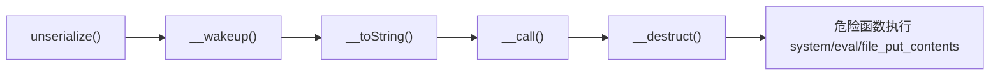
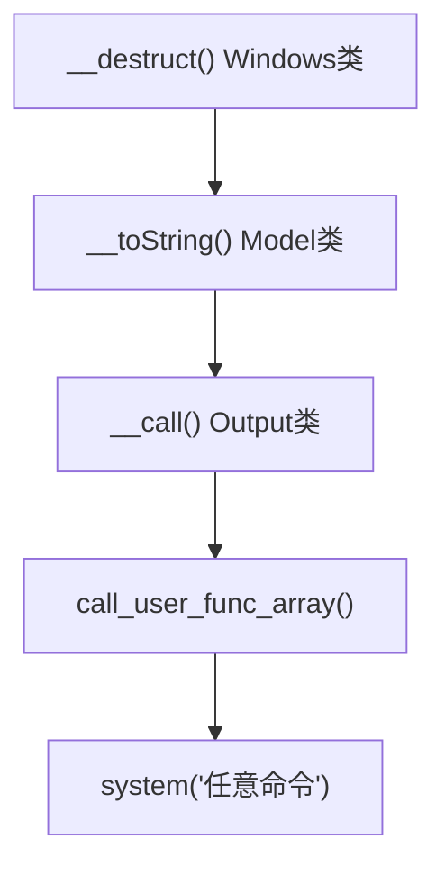

## 前言

PHP反序列化漏洞是Web安全领域的经典议题。从OWASP Top 10中的"Insecure Deserialization"到历年CTF高频考点，再到现实世界中层出不穷的CMS漏洞，反序列化攻击始终占据重要位置。本文从基础概念出发，逐步深入到POP链构造与实际CVE分析。

## 一、序列化与反序列化基本概念

对象存在于内存中。当需要将对象存储到文件、数据库或通过网络传输时，必须转换为字符串格式——这就是**序列化（Serialization）**。反之，将字符串恢复为内存中的对象，就是**反序列化（Unserialization）**。

### serialize() 函数

```php
<?php
echo serialize("hello");          // s:5:"hello";
echo serialize(123);              // i:123;
echo serialize(true);             // b:1;
echo serialize(null);             // N;

$arr = array("apple", "banana");
echo serialize($arr);
// a:2:{i:0;s:5:"apple";i:1;s:6:"banana";}

class User {
    public $name = "admin";
    private $password = "secret123";
    protected $role = "superuser";
}
echo serialize(new User());
// O:4:"User":3:{s:4:"name";s:5:"admin"; ...}
```

### 序列化格式规则

| 类型 | 格式 | 示例 |
|------|------|------|
| 字符串 | `s:长度:"内容";` | `s:5:"hello";` |
| 整数 | `i:值;` | `i:42;` |
| 浮点数 | `d:值;` | `d:3.14;` |
| 布尔值 | `b:0;` 或 `b:1;` | `b:1;` |
| NULL | `N;` | `N;` |
| 数组 | `a:元素数:{键=>值...}` | `a:2:{...}` |
| 对象 | `O:类名长度:"类名":属性数:{...}` | `O:4:"User":3:{...}` |

访问修饰符标记：**public** 原样如 `s:4:"name";`；**protected** 前缀 `\0*\0`；**private** 前缀 `\0类名\0`。

### unserialize() 函数

```php
<?php
$serialized = 'O:4:"User":1:{s:4:"name";s:5:"admin";}';
$obj = unserialize($serialized);
echo $obj->name;  // admin
```

**关键点**：`unserialize()`在还原对象时自动调用该对象的`__wakeup()`魔术方法。这是反序列化漏洞利用的重要入口。

## 二、关键魔术方法（Magic Methods）

魔术方法在特定时机自动被PHP引擎调用，攻击者通过控制序列化数据触发这些方法执行恶意代码。

### __wakeup()

反序列化时**最先**被调用，本意用于重建数据库连接：

```php
<?php
class Exploit {
    public $cmd;
    function __wakeup() {
        system($this->cmd);  // 危险！反序列化时立即执行
    }
}
$payload = 'O:7:"Exploit":1:{s:3:"cmd";s:9:"whoami";}';
unserialize($payload);  // 触发__wakeup()，执行系统命令
```

**CVE-2016-7124**：PHP 5.6.25 / 7.0.10之前，序列化字符串中对象属性数量大于实际数量时可跳过`__wakeup()`。

### __destruct()

析构函数，对象销毁时调用——脚本结束、`unset()`或引用计数归零：

```php
<?php
class FileHandler {
    public $filename;
    function __destruct() {
        if (file_exists($this->filename)) unlink($this->filename);
    }
}
```

即使`__wakeup()`被绕过，对象生命周期结束时`__destruct()`依然会被调用，是POP链中最可靠的"终点"。

### __toString()

对象被当作字符串使用时自动调用（`echo`输出、`.`连接、作为字符串参数传递等）：

```php
<?php
class Logger {
    public $message;
    function __toString() {
        return "Log: " . $this->message;
    }
}
echo new Logger();  // 触发__toString()
```

在POP链中，`__toString()`常被用作"跳板"——从看似无害的字符串操作引出更深层的危险调用。

### __call()

当调用对象上不存在或不可访问的方法时触发：

```php
<?php
class Proxy {
    public $target;
    function __call($name, $arguments) {
        return call_user_func_array($this->target, $arguments);
    }
}
$p = new Proxy(); $p->target = "system"; $p->whatever("id");  // → system("id")
```

### 其他重要魔术方法

| 方法 | 触发时机 | 利用价值 |
|------|----------|----------|
| `__get($name)` | 读取不可访问的属性 | POP链跳板 |
| `__set($name, $value)` | 写入不可访问的属性 | 配合属性赋值利用 |
| `__invoke()` | 将对象作为函数调用 | 高利用价值 |
| `__sleep()` | `serialize()`调用前 | 可能泄露敏感数据 |

## 三、POP链（Property-Oriented Programming）

POP链通过控制对象的**属性（Property）**串联多个类的魔术方法，形成从"触发点"到"危险操作"的调用链。与ROP在二进制层面控制返回地址不同，POP链工作在应用层，利用PHP对象间的自动化方法调度。



### POP链构造实例

```php
<?php
class A {
    public $b;
    function __destruct() {
        echo $this->b;  // 触发B::__toString()
    }
}
class B {
    public $cmd;
    function __toString() {
        return system($this->cmd);
    }
}
$a = new A(); $b = new B();
$b->cmd = "whoami"; $a->b = $b;
$payload = serialize($a);
// O:1:"A":1:{s:1:"b";O:1:"B":1:{s:3:"cmd";s:6:"whoami";}}
// 反序列化 → __destruct() → echo $b → __toString() → system("whoami")
```

### POP链构造方法

1. **确定终点**：在目标代码中寻找危险函数（`system`、`eval`、`assert`、`file_put_contents`、`call_user_func`等）。
2. **确定起点**：寻找可自动触发的魔术方法（`__wakeup`、`__destruct`）。
3. **串联节点**：逐步分析每个方法可触达的其他方法，寻找可控参数路径。
4. **构造payload**：编写PHP脚本生成序列化字符串，注意private/protected属性的NULL字节编码。

## 四、现实世界CVE案例分析

### 写入Webshell的经典模式

当POP链终点是`file_put_contents()`时：

```php
<?php
class FileWriter {
    public $filename; public $content;
    function __destruct() {
        file_put_contents($this->filename, $this->content);
    }
}
// payload: /var/www/html/shell.php + <?php @eval($_REQUEST["cmd"]);
```

### CVE-2016-4010 —— Magento 2 POP链

Magento 2.0.0-2.0.1存在经典POP链漏洞。攻击者注册用户后在Cookie中注入序列化payload，链式调用最终到达`call_user_func_array()`执行任意命令。链跨越了多个不相关的类（`Credis_Client` → `Magento\Sales\Model\Order\...`），静态分析极难发现。

### ThinkPHP 5.x 反序列化POP链



链跨越3个不同类，攻击者只需构造`Windows`对象的序列化字符串，即可通过框架逻辑执行到危险函数。

### Typecho反序列化漏洞

Typecho曾存在前台RCE反序列化漏洞。`Typecho_Db`类的`__toString()`中调用了`install.php`代码执行数据库`INSERT`——攻击者将`INSERT`构造成`SELECT ... INTO OUTFILE`即可写入恶意PHP文件，全程无需登录。

## 五、Phar反序列化：容易被忽略的攻击面

即使代码中没有显式的`unserialize()`调用，使用`phar://`协议时PHP会自动反序列化Phar metadata中的对象。以下函数均可触发：

```php
file_exists('phar://malicious.phar/test.txt');
is_file('phar://malicious.phar/test.txt');
include 'phar://malicious.phar/test.txt';
fopen('phar://malicious.phar/test.txt', 'r');
// 几乎所有接受phar://流的文件系统函数都可能触发
```

Phar反序列化常常绕过仅检查`unserialize()`调用的安全审计。

## 六、常见陷阱与注意事项

### 访问修饰符的NULL字节

private和protected属性在序列化时包含NULL字节，务必用PHP脚本生成并在HTTP传输前URL编码：

```php
class Demo {
    private $secret = "hello";   // 序列化含 \0Demo\0secret
    protected $data = "world";   // 序列化含 \0*\0data
}
echo urlencode(serialize(new Demo()));
```

### PHP版本差异

- **PHP < 5.6.25 / < 7.0.10**：属性数欺骗可绕过`__wakeup()`（CVE-2016-7124）。
- **PHP 7.0+**：支持`allowed_classes`类白名单控制。
- **PHP 7.4+**：序列化格式调整，部分类内部结构变化。

### 不可序列化的内容

- **resource**：文件句柄、数据库连接等资源类型。
- **Closure**：匿名函数（闭包）不能序列化。
- **static属性**：不属于具体对象实例，不会被序列化。

## 七、防御策略

### 根本原则：不要反序列化不可信数据

**永远不要对用户可控的数据调用`unserialize()`**。优先使用JSON——`json_decode()`不创建对象，不会触发魔术方法。

### 代码层面

```php
// 1. allowed_classes 白名单（PHP 7.0+）
$data = unserialize($userInput, ['allowed_classes' => ['SafeClass']]);
$data = unserialize($userInput, ['allowed_classes' => false]); // 完全禁止

// 2. HMAC签名验证
function safe_unserialize($data, $secret_key) {
    $parts = explode('.', $data);
    $payload = base64_decode($parts[0]);
    $expected = hash_hmac('sha256', $payload, $secret_key);
    if (!hash_equals($expected, $parts[1] ?? '')) {
        throw new Exception('签名验证失败');
    }
    return unserialize($payload, ['allowed_classes' => []]);
}
```

### 基础设施层面

- **WAF**：拦截包含`O:数字:`模式的请求。
- **php.ini**：`disable_functions = system,exec,passthru,shell_exec,popen,proc_open,pcntl_exec`。
- **最小权限**：Web服务器以最低权限运行，限制文件系统写权限。
- **依赖管理**：定期更新第三方库，关注安全公告。

### 代码审计要点

1. 搜索`unserialize(`，追溯参数来源（`$_GET`、`$_POST`、`$_COOKIE`）。
2. 分析所有类的魔术方法，识别危险终点。
3. 使用PHPGGC等工具生成已知框架的POP链payload辅助测试。

## 总结

PHP反序列化漏洞的本质：攻击者控制传入`unserialize()`的数据，从而实例化任意存在的类，通过精心构造属性值来"编程"对象行为——让自动化方法一步步调用到危险函数。

核心理解要点：
1. **理解序列化格式**，能够读写PHP序列化字符串。
2. **熟悉魔术方法触发时机**，建立"什么情况下触发什么方法"的映射。
3. **掌握POP链构造思路**，能将看似独立的方法调用串联成危险操作。

防御反序列化漏洞的最有效方法是**永远不要反序列化不可信的输入**。如果必须使用，请始终配合`allowed_classes`白名单和HMAC签名验证。

---

> **免责声明**：本文所述技术仅供安全研究和授权测试使用。未经系统所有者明确书面授权，对任何计算机系统进行安全测试均属违法行为。作者不对因滥用本文内容而产生的任何法律责任或损害承担任何责任。请始终遵守适用的法律法规和道德准则。
