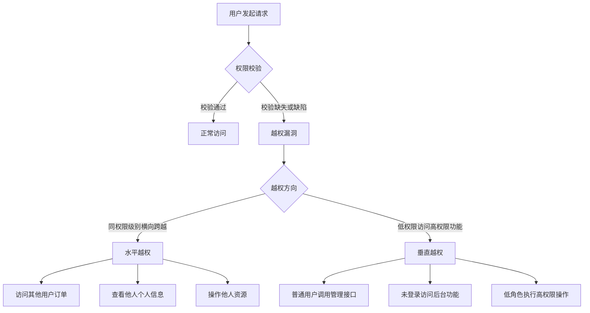
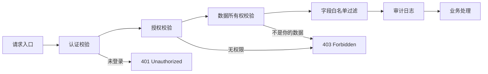

## 一、引言

越权漏洞（Broken Access Control）长期占据 [OWASP Top 10](https://owasp.org/www-project-top-ten/) 榜首。
2021 版从第五位跃升至第一位，2025 版草案中访问控制依然是核心关注点。
它的本质是：**应用程序未能正确验证用户是否有权限对目标资源执行请求的操作**。

与 SQL 注入、XSS 等需要构造精巧 Payload 的漏洞不同，越权常常只需要**修改请求中的一个数字**——这也是它如此普遍却屡禁不止的原因。

本文将系统梳理越权漏洞的分类、利用技术以及实战中常见的绕过手法。

## 二、越权漏洞的两种基本形态



### 2.1 水平越权（Horizontal Privilege Escalation）

水平越权指**同级别用户**之间互相访问对方的数据或执行对方的操作。
攻击者并未提升自身的权限等级，而是跨越了用户之间的隔离边界。

**典型场景**：用户 A 查看用户 B 的订单详情、用户 A 修改用户 B 的个人资料、用户 A 删除用户 B 的文件。

**源码层面根因**：

```java
// 不安全：仅凭传入的 userId 查询，未校验该 userId 是否属于当前 session
@GetMapping("/api/orders")
public List<Order> getOrders(@RequestParam Long userId) {
    return orderRepository.findByUserId(userId);
    // 攻击者将 userId 改为他人 ID 即可越权
}
```

```java
// 安全：从 session 中获取当前用户 ID，忽略客户端传入的 ID
@GetMapping("/api/orders")
public List<Order> getOrders() {
    Long currentUserId = (Long) session.getAttribute("userId");
    return orderRepository.findByUserId(currentUserId);
}
```

### 2.2 垂直越权（Vertical Privilege Escalation）

垂直越权指低权限用户执行了**高权限用户才能执行**的操作。
例如普通用户调用管理员专属接口、未登录用户访问需要认证的功能。

**典型场景**：普通用户通过 `/admin/deleteUser` 删除用户、游客访问后台面板、编辑角色通过 `/api/admin/setConfig` 修改系统配置。

```python
# Flask 不安全示例
@app.route('/api/admin/users/<user_id>', methods=['DELETE'])
def delete_user(user_id):
    # 仅在前端隐藏了按钮，后端未校验角色
    User.query.filter_by(id=user_id).delete()
    db.session.commit()
```

```python
# Flask 安全示例
@app.route('/api/admin/users/<user_id>', methods=['DELETE'])
@require_role('admin')  # 装饰器强制校验管理员角色
def delete_user(user_id):
    User.query.filter_by(id=user_id).delete()
    db.session.commit()
```

## 三、IDOR：不安全的直接对象引用

**IDOR（Insecure Direct Object Reference）** 是造成水平越权的最常见成因。
当应用程序将内部对象标识符（如数据库主键、文件路径）直接暴露给客户端，且未验证用户对该对象的访问权限时，就形成了 IDOR。

### 3.1 可预测的数字 ID

最经典的 IDOR 场景——自增主键。

```
GET /api/invoice/1001 HTTP/1.1
Cookie: session=userA_token

# 攻击者枚举
GET /api/invoice/1000 HTTP/1.1
GET /api/invoice/0999 HTTP/1.1
GET /api/invoice/0998 HTTP/1.1
```

**Burp Suite Intruder 遍历思路**：

1. 抓取目标请求，发送到 Intruder。
2. Payload type 设为 Numbers，从 1 到 10000，步长 1。
3. 按 Response Length / Status Code 排序，剔除自身数据后的异常长度即为越权命中。
4. 建议带上 Grep-Match 匹配关键字（如手机号、身份证、密码），精准定位敏感数据。

**时间戳 ID 也未必安全**：

```
# 订单号 = 时间戳 + 随机后缀（看似安全）
GET /api/order/20260604-0930-a3f2 HTTP/1.1

# 实则时间戳部分可预测，只需爆破后缀
```

### 3.2 UUID 并非银弹

许多开发者认为使用 UUID 就天然免疫 IDOR，这一观点是**错误的**。
UUID 能防止遍历，但无法防止**泄露后利用**。

**UUID 被泄露的常见途径**：
- 浏览器历史记录中的 URL
- Referer 头泄露给第三方统计或 CDN
- 分享链接、截图
- API 响应中嵌套引用的对象 ID
- 前端 JS 源码中硬编码的测试 ID
- 浏览器插件 / 扩展窃取

**实战案例**：某电商 SRC 应用中，用户分享订单链接给客服，链接格式为：

```
https://shop.example.com/order/detail?id=b4e7f2a1-9c3d-4e11-8a56-0b2d7f3e1a98
```

看似安全（UUID v4）。但攻击者发现，任意未登录用户通过该 URL 即可直接查看订单详情，
包括收货地址、电话、商品列表。这是一个**典型的 UUID-IDOR + 未校验登录态**的组合拳。
最终获得高危评级，赏金 **￥8000**。

**正确做法**：UUID 仅隐藏了 ID，真正的防护仍是在服务端校验 `order.owner == current_user`。

```java
// 即使使用 UUID，也必须校验所有权
@GetMapping("/order/detail")
public OrderDetail getOrderDetail(@RequestParam String id) {
    Order order = orderRepository.findByUuid(id);
    if (order == null) throw new NotFoundException();
    // 核心校验
    if (!order.getOwnerId().equals(getCurrentUserId())) {
        throw new ForbiddenException();
    }
    return order;
}
```

## 四、API 端点枚举技术

越权攻击的前提是**找到接口**。现代前后端分离架构下，API 枚举是越权利用的前置步骤。

### 4.1 JS 文件逆向

```
# 从 JS 文件中提取 API 端点
grep -roP '(?<=["\x27])/(?:api|admin|manage|v[0-9])/[a-zA-Z0-9_/-]+(?=["\x27])' main.js | sort -u
```

### 4.2 常见敏感路径字典

```text
# 高频越权接口路径
/api/admin/users
/api/admin/config
/api/internal/
/api/v1/users/{id}/reset-password
/api/export/customer-data
/admin-api/
/actuator/  # Spring Boot
/.env       # Laravel
/debug/
/internal/
/backup/
/api/private/
```

### 4.3 Swagger / OpenAPI 文档泄露

很多项目在生产环境遗忘了 Swagger 文档：

```
https://target.com/swagger-ui.html
https://target.com/swagger-ui/index.html
https://target.com/api-docs
https://target.com/v2/api-docs
https://target.com/v3/api-docs
https://target.com/openapi.json
```

获取 Swagger 文档后，所有接口的路径、参数、认证方式一览无余，可精准定位未受保护的接口。

### 4.4 GraphQL 内省查询

```graphql
# GraphQL 内省可获得全部 Schema
{
  __schema {
    types { name fields { name type { name kind } } }
  }
}
```

许多 GraphQL 端点在生产环境未禁用内省，

可以在发现后通过内省找到隐蔽的管理 Mutations（如 `deleteUser`、`updateOrderStatus`），
然后测试是否在解析层做了权限校验（绝大多数没做）。

## 五、Mass Assignment（批量赋值）攻击

Mass Assignment 在 OWASP 中被称为"批量赋值"，国内常称作"参数污染越权"或"绑定绕过"。
其核心思路是：**在请求中添加本不该由当前用户控制的字段，利用框架的自动绑定绕过业务校验**。

### 5.1 经典案例：用户注册越权

```http
POST /api/register HTTP/1.1
Content-Type: application/json

{
    "username": "attacker",
    "password": "123456",
    "email": "attacker@evil.com",
    "role": "admin",        # 尝试批量赋值管理员角色
    "isActive": true,
    "verified": true,
    "balance": 999999
}
```

若后端使用 `Object.assign(user, request.body)` 或 ORM 的 `create()` 直接将请求体映射到数据库，
攻击者即可注册为管理员，属于**垂直越权 + Mass Assignment 组合病害**。

### 5.2 框架层面的危险写法

**Express (Node.js) 危险写法**：

```javascript
// 危险：直接将 req.body 全量赋值
const user = new User(req.body);
await user.save();
// 攻击者传入 { role: "admin", isActive: true }
```

**Laravel (PHP) 危险写法**：

```php
// 危险：$request->all() 全量赋值
User::create($request->all());
// 应使用 $request->only(['name', 'email', 'password'])
```

**Spring Boot (Java) 危险写法**：

```java
// 危险：未使用 DTO 做字段过滤
@PostMapping("/users")
public User createUser(@RequestBody User user) {
    return userRepository.save(user);
    // 攻击者可通过 JSON 设置 user.role = "ADMIN"
}
```

**Django (Python) 危险写法**：

```python
# 危险：未指定 fields
class UserForm(ModelForm):
    class Meta:
        model = User
        fields = '__all__'  # 允许所有字段被批量赋值
```

### 5.3 修复：字段白名单

无论使用何种框架，核心原则只有一个：**显式声明允许用户修改的字段白名单**。

```java
// Spring Boot DTO 示例
@PostMapping("/users")
public UserResponse createUser(@Valid @RequestBody CreateUserDTO dto) {
    User user = new User();
    user.setUsername(dto.getUsername());
    user.setEmail(dto.getEmail());
    user.setPassword(passwordEncoder.encode(dto.getPassword()));
    // role, isActive 等敏感字段根本不在 DTO 中
    user.setRole(Role.USER);   // 服务端强制设定
    user.setActive(false);     // 默认未激活
    return userService.save(user);
}
```

## 六、302 与 401 状态码绕过技术

部分应用对越权的"防护"仅仅是**前端页面跳转**或**仅返回状态码**，
这种薄弱的防护极易被绕过。

### 6.1 302 重定向绕过

```http
# 请求管理接口
GET /admin/user-list HTTP/1.1
Cookie: session=normal_user

# 服务端响应
HTTP/1.1 302 Found
Location: /login
# 响应体仍然包含完整的用户列表 HTML！
```

一些框架（尤其是遗留 PHP 应用）在 `header('Location: ...')` 后忘记调用 `exit;`，
导致后续代码继续执行，页面内容照常输出。
Burp Suite 默认**不跟随重定向**，可直接看到响应体中的敏感数据。

**利用**：
- Burp Suite：Project Options → Session → 关闭"Follow redirections"
- 或直接在 Repeater 中取消勾选"Follow redirection"

### 6.2 401 / 403 绕过：HTTP Method 切换

一个很经典的 Bypass 技巧，在许多 SRC 报告中都能看到：

```http
# 原始请求被 403
GET /api/admin/users HTTP/1.1
Cookie: session=user

HTTP/1.1 403 Forbidden
```

```http
# 尝试变换 HTTP Method
POST /api/admin/users HTTP/1.1    → 可能绕过
PUT /api/admin/users HTTP/1.1     → 可能绕过
PATCH /api/admin/users HTTP/1.1   → 可能绕过
HEAD /api/admin/users HTTP/1.1    → 可能绕过
OPTIONS /api/admin/users HTTP/1.1 → 可能绕过
```

**根因**：后端路由配置中，权限拦截器只绑定了 GET 请求，而 POST/PUT 等方法被遗漏。
例如 Spring Security 配置了 `.antMatchers(HttpMethod.GET, "/admin/**").hasRole("ADMIN")`，
但未覆盖 POST。

### 6.3 请求头伪造绕过

```http
# 尝试添加这些头来绕过权限检查
GET /api/admin/users HTTP/1.1
X-Forwarded-For: 127.0.0.1
X-Forwarded-Host: 127.0.0.1
X-Original-URL: /api/admin/users
X-Rewrite-URL: /api/admin/users
X-Custom-IP-Authorization: 127.0.0.1
X-Forwarded-Prefix: /api/admin
```

一些反向代理 / 网关的权限控制依赖这类头部，伪造后即可绕过。

### 6.4 URL 编码 / 路径变体绕过

```http
# Nginx / Spring 路径穿越绕过
GET /admin;/users HTTP/1.1              # 矩阵参数绕过
GET /admin/../admin/users HTTP/1.1      # 路径规范化差异
GET /ADMIN/users HTTP/1.1               # 大小写绕过
GET /api//admin///users HTTP/1.1        # 双斜杠绕过
GET /api/users%3Fadmin=true HTTP/1.1    # URL 编码绕过
GET /api/users?admin=true HTTP/1.1      # 查询参数污染
```

## 七、SRC 真实赏金案例

### 7.1 案例一：外卖平台订单遍历（水平越权）

**目标**：某头部外卖平台。

**发现过程**：在订单详情页，URL 为 `/order/detail?orderId=202605283847261`。
攻击者观察到 orderId 格式为"日期 + 流水号"，编写脚本遍历同一天的订单号（跨度为 100000），
成功获取到大量其他用户的订单信息，包括姓名、地址、电话号码和订单金额。

**修复前代码逻辑**：

```php
// 仅校验了登录态，未校验订单归属
if (isset($_SESSION['user_id'])) {
    $order = query("SELECT * FROM orders WHERE id = ?", $_GET['orderId']);
    echo json_encode($order);
}
```

**赏金**：高危，￥12000。

**修复方案**：在 SQL 查询的 JOIN 条件中直接加入 `AND user_id = ?`，或使用行级安全策略（RLS）。

### 7.2 案例二：SaaS 平台 Mass Assignment 提权（垂直越权）

**目标**：某企业级 SaaS CRM 系统。

**发现过程**：在用户资料编辑接口（`PUT /api/v2/user/profile`）的请求体中，
攻击者添加了字段 `"tenantId": "target_company_id"`，成功将自己的账号跨租户迁移到了目标公司的租户下，
从而获得了该租户的全部数据访问权限。

**根因**：

```java
// 用户 Profile 实体中包含了 tenantId 字段
// 且 Controller 使用 @RequestBody 直接映射整个实体对象
@PutMapping("/api/v2/user/profile")
public User updateProfile(@RequestBody User updatedUser) {
    return userRepository.save(updatedUser);
    // tenantId 被无条件写入
}
```

**赏金**：严重（Critical），￥50000。

**修复**：从 Session / JWT 中获取当前用户的 tenantId，不在请求中接受该字段。

### 7.3 案例三：401 绕过 + 管理接口暴露

**目标**：某金融机构移动端 API。

**发现过程**：攻击者发现移动端 H5 页面包含大量管理类 API（`/api/mgmt/*`），
这些请求在前端被隐藏，但通过 JS 文件分析发现了完整端点列表。
直接请求返回 401，但**使用 OPTIONS 方法请求后返回 200 且响应体包含数据**。

**绕过请求**：

```http
OPTIONS /api/mgmt/transaction/all HTTP/1.1
Host: api.target.com
Cookie: session=regular_user_token
```

**响应**：完整返回了全量交易记录，赏金￥20000。

**根因**：Nginx CORS 模块在处理 OPTIONS 预检请求时，未转发鉴权令牌到后端，
而后端 API 网关的 OPTIONS 处理器未做身份校验。

## 八、越权漏洞的纵深防御



| 防御层次 | 措施 | 说明 |
|---------|------|------|
| 架构层 | 零信任架构 | 默认不信任任何请求，显式校验每个操作 |
| 应用层 | 统一鉴权中间件 | 所有请求经过统一的 AuthZ 拦截器 |
| 数据层 | 行级安全（RLS） | PostgreSQL RLS / 数据层自动注入租户条件 |
| 开发层 | 字段白名单 DTO | 永远不要将 Request Body 直接映射到实体 |
| 测试层 | 自动化越权测试 | CI/CD 中集成 AuthZ 专项测试用例 |
| 运维层 | 审计日志 | 记录所有数据访问，便于事后溯源 |

**开发自查清单**：

- [ ] 每个 API 是否在服务端校验了用户身份？
- [ ] 每个数据查询是否加入了 `WHERE owner_id = ?` 条件？
- [ ] 每个 DTO/Form 是否使用了字段白名单而非全量绑定？
- [ ] 所有 HTTP Method（GET/POST/PUT/PATCH/DELETE/OPTIONS）是否都被鉴权覆盖？
- [ ] 是否依赖了 UUID 的不可猜测性作为唯一的安全防护？
- [ ] 生产环境是否关闭了 Swagger/GraphQL 内省等调试接口？

## 九、总结

越权漏洞的技术门槛低、危害大、覆盖面广，是渗透测试中必须优先测试的漏洞类型。
与传统注入类漏洞不同，越权的修复更多依赖于**架构设计和开发规范**，
而非某个具体的输入过滤函数。

在实际渗透测试中，建议按照以下优先级进行测试：

1. **枚举 API**（JS 逆向、Swagger、路径字典）
2. **遍历 ID**（自增 ID > 时间戳 > UUID 泄露搜索）
3. **切换角色**（同权限跨用户 > 低权限访问高权限 > 未登录访问）
4. **尝试绕过**（HTTP Method 切换 > 请求头伪造 > 路径变体 > Mass Assignment）

越权漏洞往往**一挖一个准**，是 SRC 新手入门性价比最高的漏洞类型，
也是对开发者安全意识的试金石。

---

**免责声明**：本文所述技术仅供安全研究与授权测试使用。
未经授权对他人系统进行渗透测试属于违法行为。
文章中的漏洞案例已经过脱敏处理，请勿对号入座。
作者不对任何滥用行为承担责任。
