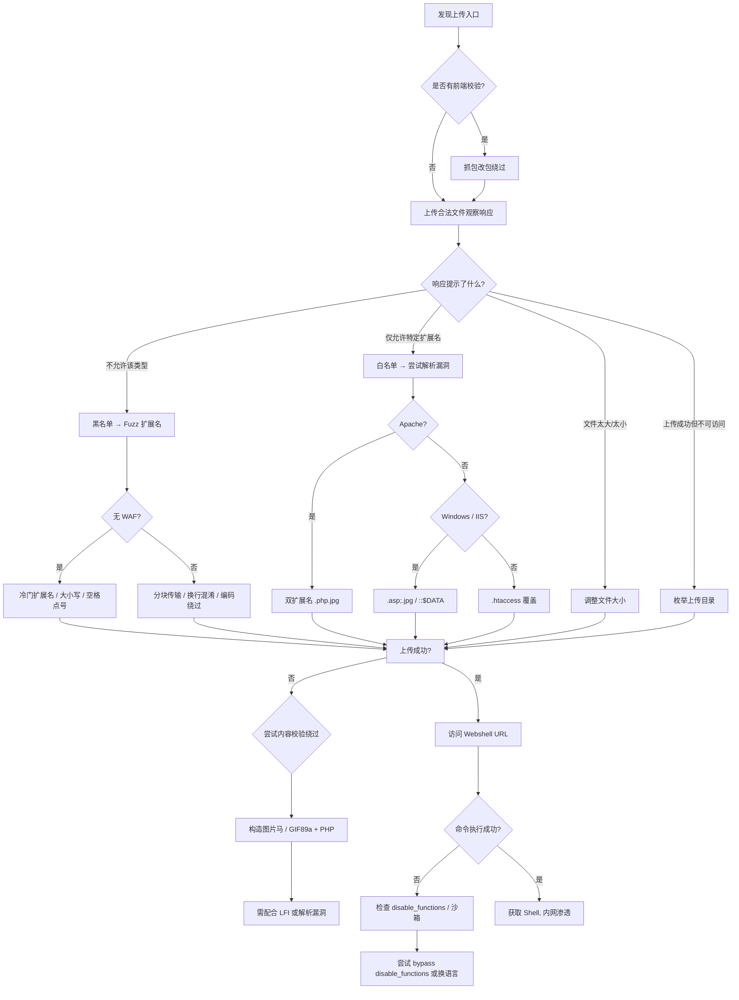

## 0x00 前言

文件上传漏洞是 Web 应用中最常见也最危险的安全问题之一。一个看似无害的头像上传功能，可能成为攻击者获取服务器控制权的入口。本文将梳理一套完整的测试方法论，涵盖从信息收集到绕过再到防御的全流程，旨在为渗透测试人员提供一份可落地的 Checklist，同时为开发者和安全工程师给出可操作的加固建议。

**免责声明：本文所述技术仅用于授权测试与安全研究，未经授权对他人系统进行测试属于违法行为。因滥用本文内容导致的一切后果由使用者自行承担，与作者无关。**

---

## 0x01 完整测试清单

以下清单按攻击面分层，建议按顺序逐一验证。

### 第一阶段：信息收集

| 序号 | 检查项 | 说明 |
|:---:|:---|:---|
| 1 | 识别所有上传入口 | 头像、附件、导入、API、富文本编辑器、WebSocket |
| 2 | 确认后端语言与框架 | PHP / Java / .NET / Python / Node.js / Go —— 决定 Webshell 语言 |
| 3 | 确认上传目录是否可访问 | 直接访问上传后的文件 URL，确认是否解析 |
| 4 | 确认 Web 服务器类型与版本 | Apache / Nginx / IIS / Tomcat，不同服务器有不同解析漏洞 |
| 5 | 检查是否有 WAF / CDN | Cloudflare、Aliyun WAF 等会影响 Payload 构造 |

### 第二阶段：基础探测

| 序号 | 检查项 | 说明 |
|:---:|:---|:---|
| 6 | 正常上传一个合法文件 | 观察完整请求，记录所有参数和响应 |
| 7 | 上传空文件 / 超大文件 | 测试大小限制与错误处理 |
| 8 | 上传合法扩展名但恶意内容 | 图片马 + 包含漏洞 / 解析漏洞组合使用 |
| 9 | 测试 Content-Type 校验 | 修改 `Content-Type` 为 `image/jpeg` 绕过弱校验 |
| 10 | 测试 Magic Bytes 校验 | 文件头添加 `GIF89a` / `‰PNG` / `ÿØÿà` 绕过 |

### 第三阶段：扩展名黑名单绕过

| 序号 | 检查项 | 说明 |
|:---:|:---|:---|
| 11 | 大小写变体 | `.pHp` `.Php` `.PHP` `.pHP` |
| 12 | 双扩展名 | `.php.jpg` `.php.png`（依赖 Apache 解析顺序） |
| 13 | 空字节截断（老版本） | `shell.php%00.jpg` `shell.php\x00.jpg` |
| 14 | 点号 / 空格绕过 | `shell.php.` `shell.php ` `shell.php...` `shell.php::$DATA`（Windows） |
| 15 | 特殊扩展名 | `.phtml` `.pht` `.php5` `.phar` `.shtml` `.asa` `.cer` `.aspx` `.jspx` `.cgi` |
| 16 | 编码绕过 | URL 编码、Unicode 编码、双重编码 |

### 第四阶段：内容校验绕过

| 序号 | 检查项 | 说明 |
|:---:|:---|:---|
| 18 | 图片马（getimagesize 绕过） | 在合法图片末尾附加 PHP 代码，需配合包含漏洞或解析漏洞 |
| 19 | EXIF 注入 | 将 PHP 代码写入图片 EXIF 字段，部分 CMS 会解析 |
| 20 | SVG XSS / XXE | SVG 本质是 XML，可直接嵌入 `<script>` 或 PHP 代码 |
| 21 | 多语言文件（Polyglot） | 同时是合法图片和有效 PHP 代码的文件 |
| 22 | ZIP 解压绕过 | 上传含 Webshell 的 ZIP，触发自动解压 |
| 23 | GIF89a + PHP | `GIF89a<?php system($_GET['cmd']); ?>`—— 最经典的组合 |
| 24 | 文件重命名 / 截断 | 竞争条件：上传→检测→删除 的时间窗口内访问文件 |

### 第五阶段：逻辑与竞争漏洞

| 序号 | 检查项 | 说明 |
|:---:|:---|:---|
| 25 | 条件竞争上传 | 在上传后至校验删除的窗口期执行文件 |
| 26 | ZIP Slip | 上传含路径穿越的压缩包，解压到 Web 目录外 |
| 27 | PUT 方法上传 | WebDAV 开启时直接 PUT Webshell |
| 28 | 断点续传绕过 | 分片上传中在合法分片插入恶意代码 |
| 29 | 重名覆盖 | 上传与已有文件同名的文件，覆盖配置文件 |
| 30 | 路径穿越 | 文件名中嵌入 `../../` 将文件写入其他目录 |

### 第六阶段：组合利用

| 序号 | 检查项 | 说明 |
|:---:|:---|:---|
| 31 | 上传 + 本地文件包含 | 上传图片马，利用 LFI 包含执行 |
| 32 | 上传 + 路径穿越 | 上传 Webshell 到可解析目录 |
| 33 | 上传 + 配置覆盖 | 覆盖 `.htaccess` / `web.config` / `nginx.conf` 使图片被解析为 PHP |
| 34 | 上传 + SSRF | 部分云环境通过 SSRF 访问本地文件 |
| 35 | PDF / Office 文档注入 | 上传含恶意宏或链接的文档，钓鱼或 C2 |

---

## 0x02 绕过技巧速查表

下表按校验类型整理了常用的绕过手法及其适用场景：

| 校验类型 | 绕过手法 | 成功率 | 适用场景 | 关键 Payload / 示例 |
|:---|:---|:---:|:---|:---|
| **前端 JS 校验** | 抓包改包（Burp Repeater） | ★★★★★ | 仅前端限制扩展名 | 直接修改文件名或使用 curl |
| **Content-Type** | 改为 `image/jpeg` 或 `image/gif` | ★★★★☆ | 仅校验 MIME 的服务端 | `Content-Type: image/gif` |
| **扩展名黑名单** | 大小写、双写、冷门扩展名 | ★★★★☆ | 正则不严谨 | `.pht` `.phar` `.php5` `.pHp` |
| **扩展名白名单** | 解析差异 + 配置漏洞 | ★★★☆☆ | Apache/IIS 解析漏洞 | `.php.jpg` → Apache 按序解析 |
| **Magic Bytes** | 文件头伪造 | ★★★★☆ | 仅校验头几个字节 | `GIF89a` + PHP 代码 |
| **getimagesize()** | 完整图片马 | ★★★☆☆ | PHP 图片处理函数 | 构造最小合法图片 + 尾部附加代码 |
| **WAF** | 编码、分块传输、换行混淆 | ★★★☆☆ | 有 WAF 环境 | `Content-Disposition: form-data; name="file"; fi\nlename="shell.php"` |
| **文件内容扫描** | 多语言文件 / 隐写 | ★★☆☆☆ | 高级 WAF / 杀软 | 将 PHP 代码编码后藏在图片元数据中 |
| **文件名过滤** | Unicode / 同形字符 | ★★★☆☆ | 过滤不完全 | `shell．php`（全角点号 U+FF0E） |
| **大小限制** | 最小 Webshell | ★★★★☆ | 限制上传大小 | `<?=`$\_GET\[0\]`?>`（15 字节） |
| **上传目录不可解析** | 路径穿越 / 覆盖配置文件 | ★★★☆☆ | 上传到静态目录 | `../../index.php` |
| **压缩包解压** | ZIP Slip / 软链接 | ★★★☆☆ | 自动解压功能 | 文件名 `../../../var/www/html/shell.php` |
| **云存储 / CDN** | 直接访问源站 | ★★★☆☆ | CDN 缓存规则 | 绕过 CDN 直接访问存储桶 |

---

## 0x03 技巧选择决策树

在实际测试中，按以下优先级选择攻击路径：

1. **先测试白名单还是黑名单？**  
   上传一个正常文件，响应中判断——若返回错误且指明允许的扩展名（如 "仅允许 jpg, png, gif"），通常为白名单；若仅提示 "不允许该类型"，通常为黑名单。黑名单优先尝试冷门扩展名；白名单优先寻找解析漏洞或配置漏洞。

2. **有 WAF 时先做什么？**  
   优先测试 WAF 不拦截的基础绕过（Content-Type、大小写扩展名），再用分块传输、边界混淆等手法对抗 WAF 规则。

3. **上传目录不可解析怎么办？**  
   尝试文件名路径穿越（`../`），或上传 `.htaccess` / `web.config` 强制当前目录解析 PHP。

4. **文件内容被重编码（如压缩、转 Base64）？**  
   此类场景下 Webshell 代码被破坏，转向 SVG 注入（SVG 不被编码）、ZIP 解压陷阱或 EXIF 注入。

5. **云环境特殊考量：**  
   AWS S3 / 阿里云 OSS 等对象存储上传通常无服务端解析，需结合 SSRF、存储桶策略错误配置或 Lambda 触发器等。

6. **条件竞争何时尝试？**  
   当观察到 "先上传→校验→不通过则删除" 的行为模式时，使用 Turbo Intruder 或自定义脚本在删除之前访问文件。

---

## 0x04 常用工具

### Fuzz 扩展名字典

推荐使用 [SecLists](https://github.com/danielmiessler/SecLists) 中的以下字典：

```
SecLists/Discovery/Web-Content/raft-small-extensions-lowercase.txt
SecLists/Discovery/Web-Content/web-extensions.txt
SecLists/Discovery/Web-Content/web-extensions-big.txt
```

自建字典建议包含以下关键扩展名（PHP 场景）：

```
php, php2, php3, php4, php5, php6, php7, pHp, Php, pHP, PHP
pht, phtml, phtm, phar, phps, pgif
shtml, sht, stm
asa, cer, cdx, aspx, ascx, ashx, asmx, asp
jsp, jspx, jspf, jsw, jsv
cgi, pl, py, rb
```

### Burp Suite 插件

| 插件 | 用途 | 安装方式 |
|:---|:---|:---|
| **Turbo Intruder** | 条件竞争上传、高速 Fuzz | BApp Store |
| **Upload Scanner** | 自动化上传漏洞检测 | BApp Store |
| **WAF Detector** | 识别 WAF 类型与规则 | BApp Store |
| **Content Type Converter** | 快速修改 Content-Type | BApp Store |
| **Hackvertor** | 编码 / 解码 Payload | BApp Store |
| **Active Scan++** | 增强主动扫描能力 | BApp Store |
| **Turbo Intruder (race.py)** | 条件竞争专用脚本 | 官方仓库 |

### 其他实用工具

- **curl / wget：** 构造任意 HTTP 请求，测试 PUT 上传。
- **exiftool：** 读写图片 EXIF 数据，用于 EXIF 注入测试。
- **ImageMagick / FFmpeg：** 构造特殊格式的多语言文件。
- **feroxbuster / ffuf：** 枚举上传目录，发现已有上传文件。

---

## 0x05 完整攻击流程



---

## 0x06 服务端防御：白名单最佳实践

### 核心理念

**白名单永远优于黑名单。** 只允许业务真正需要的文件类型，拒绝一切未知类型。

### 防御方案分层实现

#### 第一层：扩展名白名单

```
允许列表（示例）：.jpg  .jpeg  .png  .gif  .webp  .pdf  .docx  .xlsx
拒绝列表：一切不在白名单中的扩展名，直接丢弃。
```

关键实现细节：
- 从文件名字符串中提取扩展名时，取**最后一个** `.` 之后的部分（防止 `file.php.jpg` 被误判为 `jpg`）。
- 统一转为**小写**后再比较，避免大小写绕过。
- 去除首尾空格与换行符后再处理文件名。

#### 第二层：Content-Type 验证（辅助）

仅作为辅助手段，不可单独依赖。服务端应从文件内容检测真实 MIME，而非信任客户端提交的 `Content-Type` 头：

```python
import magic
real_mime = magic.from_buffer(file_content, mime=True)
if real_mime not in ['image/jpeg', 'image/png', 'image/gif']:
    raise Exception("文件类型不符")
```

#### 第三层：文件内容重建（核心）

对于图片类文件，使用图像处理库重新生成（而非仅仅检查），彻底消除嵌入的恶意代码：

```python
from PIL import Image
img = Image.open(uploaded_file)
img.save(save_path, format='JPEG')  # 完全重建像素数据，丢弃 EXIF / 注释
```

#### 第四层：文件名随机化

```python
import uuid, os
new_filename = uuid.uuid4().hex + ".jpg"
save_path = os.path.join(upload_dir, new_filename)
```
绝不保留用户提供的文件名——攻击者无法预测 URL，也无法路径穿越。

#### 第五层：上传目录隔离与权限控制

- 上传目录设置在 Web 根目录之外，通过独立脚本代理访问。
- 上传目录禁止脚本执行（`.htaccess`: `php_flag engine off` / Nginx: `location ~ \.php$ { deny all; }`）。
- 文件以最低权限存储（`chmod 644`），所属用户无执行权限。

#### 第六层：反病毒扫描

- 集成 ClamAV 扫描上传文件（`clamdscan --fdpass uploaded_file`），但对定制化 Payload 效果有限，不能单独依赖。

#### 第七层：速率限制与配额

- 同一 IP / 账号每单位时间内上传次数限制。
- 上传文件总大小与总数量限制。

### 防御方案对照表

| 防御层级 | 方法 | 防御的绕过类型 | 是否充分（单独） |
|:---|:---|:---|:---:|
| 1 | 扩展名白名单 | 大小写、双写、冷门扩展名 | 否 |
| 2 | 文件头 Magic Bytes 校验 | GIF89a 简单伪造 | 否 |
| 3 | 图片像素重建（re-render） | 图片马、恶意元数据 | **是（图片场景）** |
| 4 | 文件名随机化 | 路径穿越、重名覆盖 | 是 |
| 5 | 目录禁止执行 | 任何脚本上传成功也无法执行 | **是（兜底方案）** |
| 6 | 反病毒扫描 | 已知 Webshell 签名 | 否 |
| 7 | 速率限制 | 暴力 Fuzz、条件竞争 | 辅助 |

**推荐组合：扩展名白名单 + 内容重建 + 文件名随机化 + 目录禁止执行。** 这四层构成纵深防御体系，任何单一绕过都无法突破全部防线。

---

## 0x07 客户端签名验证（客户端 → 服务端架构）

在某些需要"客户端直传 OSS / S3"的架构中，服务端不作为代理中转，而是由前端直接上传至对象存储。此时需引入**客户端签名验证**机制：

### 签名流程

1. 用户选择文件后，前端向服务端发起请求，提交文件名、大小、类型等元信息。
2. 服务端校验是否在白名单内，校验通过后生成一个有时效性的上传凭证（STS Token / Pre-signed URL）。
3. 前端使用该凭证直接上传至 OSS / S3。
4. 上传完成后，OSS 回调通知（Callback）服务端，服务端再次校验并记录。

### 关键安全点

- **签名在服务端生成，不可在前端生成。** 前端仅持有临时凭证，无权限策略写入。
- **签名必须有时效性和一次性使用限制。** 防止凭证泄露后被重复利用。
- **前端校验仅用于用户体验（即时反馈），不可作为安全控制。** 所有安全检查必须在服务端和对象存储策略层面执行。
- **Callback 校验不可省略。** 对象存储回调时需携带上传文件的 MD5 / SHA256，服务端二次确认文件哈希与预期一致。
- **OSS Bucket Policy 最小权限原则：** 仅授予 `PutObject` 权限，禁止 `PutObjectAcl`、`DeleteObject` 等额外权限。

### 时序图简示

```
浏览器 --①请求凭证--> 业务服务端 --②校验--> 生成STS Token --③返回凭证--> 浏览器
浏览器 --④直传文件+凭证--> OSS/S3 --⑤Callback通知--> 业务服务端 --⑥校验并入库
```

---

## 0x08 总结

文件上传漏洞的攻防本质上是一场"校验 vs 绕过"的博弈。攻击者的思路永远是寻找校验链中最薄弱的环节，而防御者的任务是构建多层次、不依赖单一控制点的纵深防御体系。

**攻击者视角的三个关键问题：**
1. 文件是否被解析？（上传目录是否可执行脚本？）
2. 文件路径是否可预测？（随机化命名了吗？）
3. 文件内容是否被处理？（重建图片？编码？压缩？）

**防御者视角的四条底线：**
1. 白名单优先，永远不要自己维护黑名单。
2. 假设攻击者能绕过所有逻辑校验——因此必须确保即使恶意文件上传成功也无法被执行。
3. 上传目录不解析脚本是最后一道也是最重要的一道防线。
4. 日志记录与监控告警，异常上传模式（如短时间内大量不同扩展名尝试）应触发告警。

---

*本文持续更新中。如有补充或建议，欢迎留言交流。*
